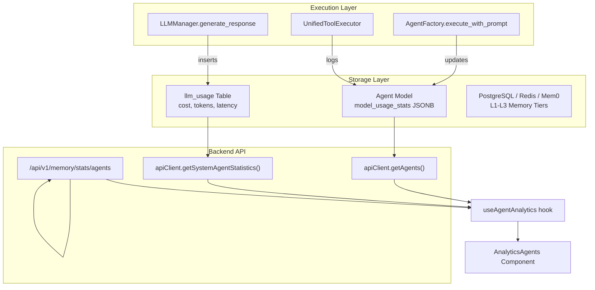
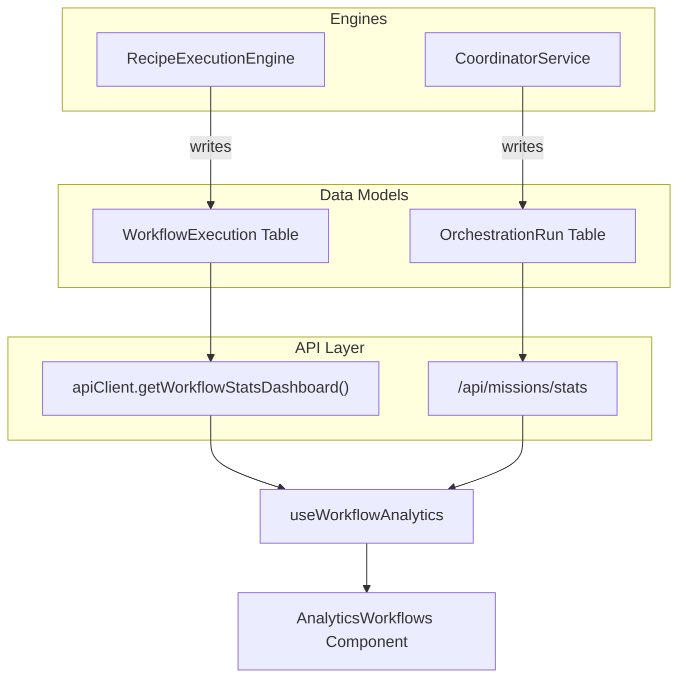
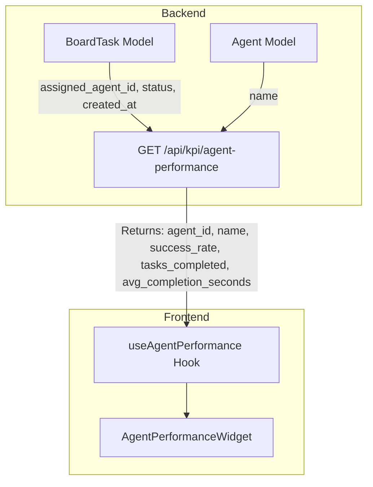
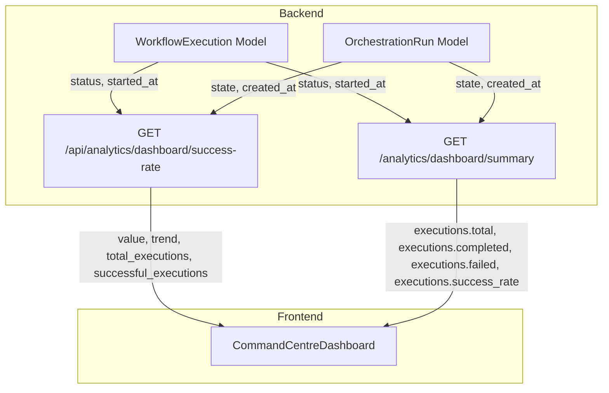
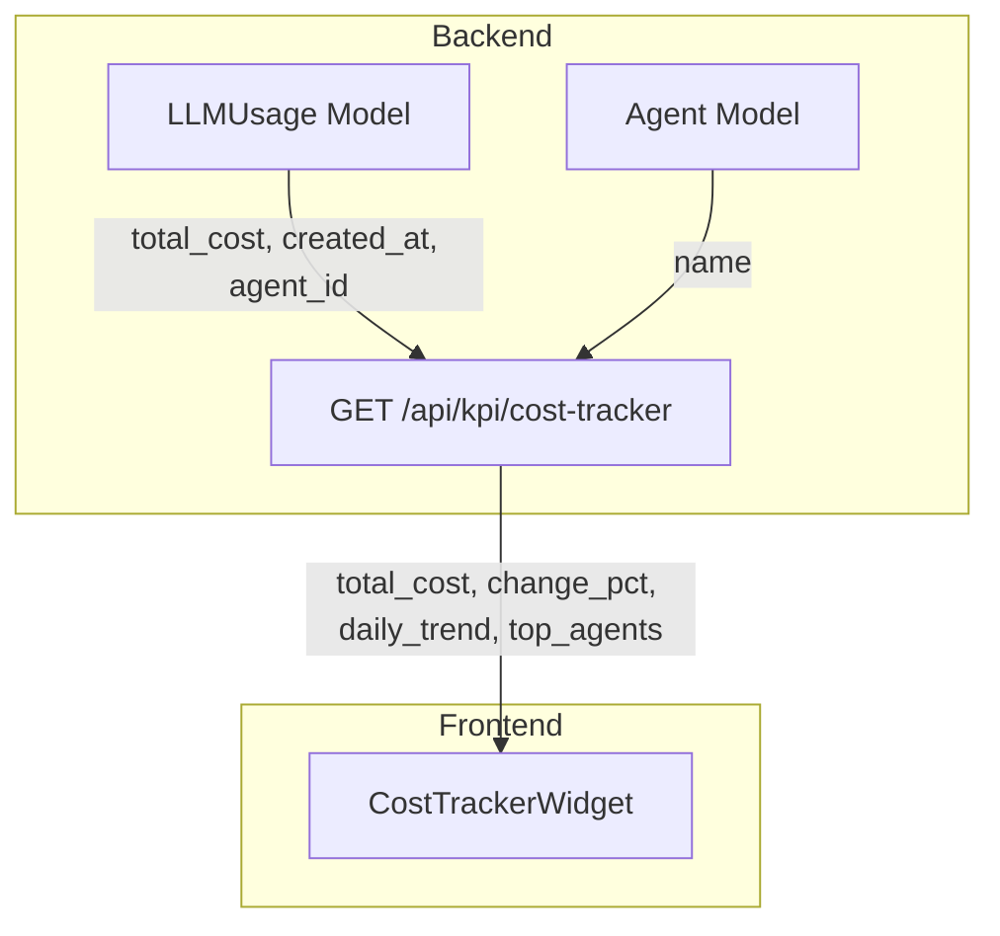

# Agent & Workflow Analytics

Relevant source files

The following files were used as context for generating this wiki page:

- [frontend/app/layout.tsx](frontend/app/layout.tsx)
- [frontend/components/activity/widgets/command-centre-dashboard.tsx](frontend/components/activity/widgets/command-centre-dashboard.tsx)
- [frontend/components/activity/widgets/decisions-needed-widget.tsx](frontend/components/activity/widgets/decisions-needed-widget.tsx)
- [frontend/components/activity/widgets/playbook-metrics-widget.tsx](frontend/components/activity/widgets/playbook-metrics-widget.tsx)
- [frontend/components/activity/widgets/self-learning-health-widget.tsx](frontend/components/activity/widgets/self-learning-health-widget.tsx)
- [frontend/hooks/use-kpi-api.ts](frontend/hooks/use-kpi-api.ts)
- [frontend/hooks/use-learning-api.ts](frontend/hooks/use-learning-api.ts)
- [orchestrator/api/analytics.py](orchestrator/api/analytics.py)
- [orchestrator/api/analytics_api.py](orchestrator/api/analytics_api.py)
- [orchestrator/api/analytics_charts.py](orchestrator/api/analytics_charts.py)
- [orchestrator/api/analytics_real.py](orchestrator/api/analytics_real.py)
- [orchestrator/api/execution_history.py](orchestrator/api/execution_history.py)
- [orchestrator/api/kpi_api.py](orchestrator/api/kpi_api.py)
- [orchestrator/api/workflow_history.py](orchestrator/api/workflow_history.py)
- [orchestrator/core/auth/workspace_admin.py](orchestrator/core/auth/workspace_admin.py)
- [orchestrator/core/services/auto_reporting.py](orchestrator/core/services/auto_reporting.py)
- [orchestrator/core/services/notification_dispatcher.py](orchestrator/core/services/notification_dispatcher.py)
- [orchestrator/modules/memory/tool_outcome_capture.py](orchestrator/modules/memory/tool_outcome_capture.py)
- [orchestrator/modules/tools/discovery/actions_auto_reporting.py](orchestrator/modules/tools/discovery/actions_auto_reporting.py)
- [orchestrator/modules/tools/discovery/handlers_auto_reporting.py](orchestrator/modules/tools/discovery/handlers_auto_reporting.py)
- [orchestrator/tests/test_activation_endpoint.py](orchestrator/tests/test_activation_endpoint.py)
- [orchestrator/tests/test_errors_by_subsystem_endpoint.py](orchestrator/tests/test_errors_by_subsystem_endpoint.py)
- [orchestrator/tests/test_p2w0_cockpit_reach.py](orchestrator/tests/test_p2w0_cockpit_reach.py)
- [orchestrator/tests/test_p2w2_ask_notification.py](orchestrator/tests/test_p2w2_ask_notification.py)
- [orchestrator/tests/test_prd143_obs_routers_batch1.py](orchestrator/tests/test_prd143_obs_routers_batch1.py)
- [orchestrator/tests/test_primitive_health_endpoint.py](orchestrator/tests/test_primitive_health_endpoint.py)
- [orchestrator/tests/test_tool_outcome_capture.py](orchestrator/tests/test_tool_outcome_capture.py)
- [orchestrator/tests/test_widget_engagement_endpoint.py](orchestrator/tests/test_widget_engagement_endpoint.py)

This page documents the analytics subsystem for tracking agent performance, workflow execution metrics, and mission outcomes. It covers how usage statistics, success rates, costs, and quality scores are collected, aggregated, and presented via the Unified Analytics dashboard.

---

## Overview

Agent and workflow analytics provide technical visibility into:
- **Agent Performance**: Success rates, execution times, token usage, and memory tier distribution.
- **Workflow & Mission Execution**: Run counts, success rates, and duration metrics for legacy Recipes and PRD-125 Missions.
- **Resource Utilization**: Per-agent memory counts, importance scores, and LLM cost attribution via the `llm_usage` table.
- **System Health**: Heartbeat activity, error rates by source, and channel-specific message volumes.

The system aggregates data from `Agent`, `Workflow` (Recipe), `WorkflowExecution`, `OrchestrationRun` (Mission), and `LLMUsage` models.

---

## Data Collection Architecture

### Agent & Memory Statistics Data Flow

The system merges core agent metadata with real-time usage statistics and memory tier distributions.

Sources: [frontend/hooks/use-unified-analytics.ts:130-134](), [frontend/components/analytics/analytics-agents.tsx:163-166](), [frontend/hooks/use-unified-analytics.ts:70-73]()

### Workflow & Mission Data Flow

The analytics engine performs aggregation across legacy `WorkflowExecution` and modern `OrchestrationRun` (Missions) to provide a unified success rate and performance view.

Sources: [frontend/hooks/use-unified-analytics.ts:59-66](), [frontend/components/analytics/analytics-workflows.tsx:37-40](), [frontend/hooks/use-unified-analytics.ts:80-92]()

---

## Agent Analytics

### Performance Metrics

The `/api/kpi/agent-performance` endpoint provides per-agent success rates, average completion times, and tasks done [orchestrator/api/kpi_api.py:140-145](). This data is sourced from the `BoardTask` model, specifically filtering by `assigned_agent_id` and `workspace_id` [orchestrator/api/kpi_api.py:171-174]().

The `useAgentPerformance` hook in the frontend consumes this endpoint [frontend/components/activity/widgets/agent-performance-widget.tsx]().

Sources: [orchestrator/api/kpi_api.py:140-197](), [frontend/components/activity/widgets/agent-performance-widget.tsx]()

### Memory Utilization
The system tracks how agents utilize the 5-layer memory architecture via `GET /api/v1/memory/stats/agents` [frontend/hooks/use-unified-analytics.ts:133]():
- **Memory Levels**: Distribution across L1 (Redis), L2 (Postgres), and L3 (Mem0) [frontend/components/analytics/analytics-agents.tsx:85-96]().
- **Memory Types**: Categorization of stored facts (e.g., `user_preference`, `task_result`) [frontend/components/analytics/analytics-agents.tsx:73-84]().
- **Importance**: Average importance score (0-1) assigned to memories [frontend/components/analytics/analytics-agents.tsx:67-72]().

Sources: [frontend/hooks/use-unified-analytics.ts:110-118](), [frontend/components/analytics/analytics-agents.tsx:47-101]()

---

## Workflow & Mission Analytics

### Unified Execution Trends

The `/api/analytics/dashboard/success-rate` endpoint calculates the overall success rate by combining data from `WorkflowExecution` (legacy workflows) and `OrchestrationRun` (missions) [orchestrator/api/analytics_real.py:76-93](). It also provides a 7-day trend for this metric [orchestrator/api/analytics_real.py:99-120]().

The `get_dashboard_summary` endpoint in `orchestrator/api/analytics.py` also provides a combined summary of total, completed, and failed executions for both workflows and missions [orchestrator/api/analytics.py:51-80]().

Sources: [orchestrator/api/analytics_real.py:76-128](), [orchestrator/api/analytics.py:35-160]()

### Recipe Quality Scoring
Recipes are assessed on a 5-dimensional scale within the analytics view [frontend/components/analytics/analytics-workflows.tsx:34-35]():
- **Use Count**: Frequency of recipe invocation.
- **Success Rate**: Error-free execution rate.
- **Quality Score**: A normalized metric (0-100) used for ranking recipes in the workspace [frontend/components/analytics/analytics-workflows.tsx:95-107]().

Sources: [frontend/hooks/use-unified-analytics.ts:59-66](), [frontend/components/analytics/analytics-workflows.tsx:145-180]()

---

## LLM Usage & Cost Analytics

The system implements a dual-source strategy for cost tracking to ensure accuracy even when local database logs are incomplete.

### Usage Tracking
- **`llm_usage` table**: Primary source for granular per-request data including tokens and costs [frontend/hooks/use-unified-analytics.ts:70-71]().
- **OpenRouter Sync**: The `useTriggerOpenRouterSync` hook triggers a backend process to fetch activity from OpenRouter and reconcile it with local `llm_usage` records [frontend/hooks/use-unified-analytics.ts:28-29](), [frontend/components/analytics/analytics-openrouter-credits.tsx:104-112]().

### Cost Visualization
The `AnalyticsCosts` component provides several views for resource management:
- **Daily Cost by Model**: A multi-line chart showing spending trends per model [frontend/components/analytics/analytics-costs.tsx:146]().
- **Model Comparison**: A radar or bar chart comparing efficiency (cost/token) across different LLM providers [frontend/components/analytics/analytics-costs.tsx:151]().
- **Projections**: Estimates future spend based on current period trends [frontend/components/analytics/analytics-costs.tsx:152]().

The `/api/kpi/cost-tracker` endpoint provides total spend, daily trend, and top 3 agents by cost for a given period [orchestrator/api/kpi_api.py:44-130](). This data is derived from the `LLMUsage` table [orchestrator/api/kpi_api.py:56-60]().

Sources: [frontend/hooks/use-unified-analytics.ts:23-41](), [frontend/components/analytics/analytics-costs.tsx:144-153](), [frontend/components/analytics/analytics-openrouter-credits.tsx:89-94](), [orchestrator/api/kpi_api.py:44-130]()

---

## Technical Implementation Details

### Workspace Scoping
To ensure multi-tenant isolation, all analytics query keys are scoped by workspace ID using the `wsScope()` helper [frontend/hooks/use-unified-analytics.ts:12-14](). When an administrator switches the `adminWorkspaceOverride` via the `AdminWorkspaceSwitcher`, the cache is invalidated to prevent data bleeding [frontend/hooks/use-unified-analytics.ts:10-14](), [frontend/components/analytics/analytics-page.tsx:48-50]().

The `ws_router` in `orchestrator/api/analytics_real.py` is specifically designed for workspace-scoped health tiles, gated by `require_workspace_admin` [orchestrator/api/analytics_real.py:47-55](). This ensures that workspace administrators can view their own health metrics without cross-tenant data leakage.

### Safe API Requests
The frontend uses a `safeRequest` wrapper to prevent a single failing analytics endpoint from crashing the dashboard [frontend/hooks/use-unified-analytics.ts:53-57](). It returns fallback values (e.g., `[]` or `null`) if an endpoint times out or returns an error [frontend/hooks/use-unified-analytics.ts:59-66]().

### AI Recommendations Engine
The `AnalyticsRecommendations` component surfaces actionable insights derived from usage patterns [frontend/components/analytics/analytics-recommendations.tsx:19-26]():
- **Cost**: Suggestions to switch models or optimize token usage [frontend/components/analytics/analytics-recommendations.tsx:47-52]().
- **Performance**: Alerts for agents or workflows with high error rates [frontend/components/analytics/analytics-recommendations.tsx:53-58]().
- **Quota**: Warnings when usage approaches plan limits [frontend/components/analytics/analytics-recommendations.tsx:65-70]().

Sources: [frontend/hooks/use-unified-analytics.ts:12-14](), [frontend/hooks/use-unified-analytics.ts:53-73](), [frontend/components/analytics/analytics-recommendations.tsx:73-77]()

---

## Analytics API Reference

| Endpoint | Method | Description |
| :--- | :--- | :--- |
| `/api/analytics/llm/summary` | GET | Dashboard summary including top models and cost trends [frontend/hooks/use-unified-analytics.ts:61]() |
| `/api/missions/stats` | GET | Mission-specific duration and token metrics [frontend/hooks/use-unified-analytics.ts:65]() |
| `/api/v1/memory/stats/agents` | GET | Per-agent memory tier and importance stats [frontend/hooks/use-unified-analytics.ts:133]() |
| `/api/heartbeat/analytics` | GET | Today's heartbeat successes, errors, and token counts [frontend/components/analytics/analytics-overview.tsx:34]() |
| `/api/channels/analytics` | GET | Message volume per platform (Slack, Telegram, etc.) [frontend/components/analytics/analytics-overview.tsx:46]() |
| `/api/analytics/chart/generate` | POST | NL-to-Chart generation using Pandas/AI [frontend/components/analytics/analytics-pandas-chart.tsx:37]() |
| `/api/analytics/dashboard/success-rate` | GET | Get agent success rate percentage with trend (UNION: workflows + missions) [orchestrator/api/analytics_real.py:76]() |
| `/api/analytics/slos` | GET | The three tracked SLOs for this workspace: tool-call success rate, board-dispatch p95 latency, and board-event freshness [orchestrator/api/analytics_real.py:135]() |
| `/api/analytics/substrate-health` | GET | Get the health status of core platform primitives [orchestrator/api/analytics_real.py:160]() |
| `/api/kpi/cost-tracker` | GET | Period spend, daily trend, top 3 agents by cost [orchestrator/api/kpi_api.py:44]() |
| `/api/kpi/agent-performance` | GET | Per-agent success rate, avg completion time, tasks done [orchestrator/api/kpi_api.py:140]() |
| `/api/execution-history/workflow/{workflow_id}/latest` | GET | Get the most recent execution for a workflow with full details [orchestrator/api/execution_history.py:33]() |
| `/api/execution-history/workflow/{workflow_id}/all` | GET | Get all executions for a workflow with pagination [orchestrator/api/execution_history.py:52]() |
| `/api/execution-history/execution/{execution_id}/details` | GET | Get detailed information about a specific execution [orchestrator/api/execution_history.py:84]() |
| `/api/execution-history/execution/{execution_id}/stages` | GET | Get the 9-stage pipeline details for an execution [orchestrator/api/execution_history.py:105]() |

Sources: [frontend/hooks/use-unified-analytics.ts:18-43](), [frontend/components/analytics/analytics-overview.tsx:32-65](), [frontend/components/analytics/analytics-pandas-chart.tsx:15-39](), [orchestrator/api/analytics_real.py:76-165](), [orchestrator/api/kpi_api.py:44-202](), [orchestrator/api/execution_history.py:33-160]()

---