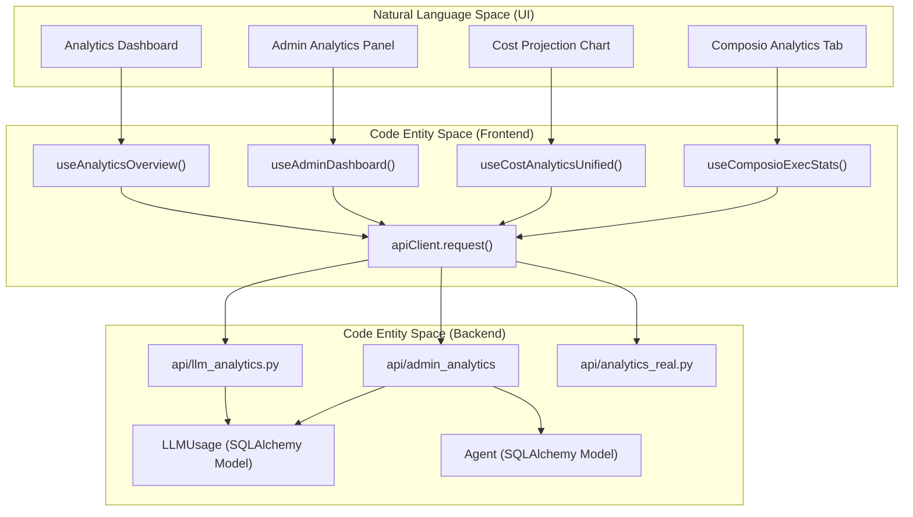
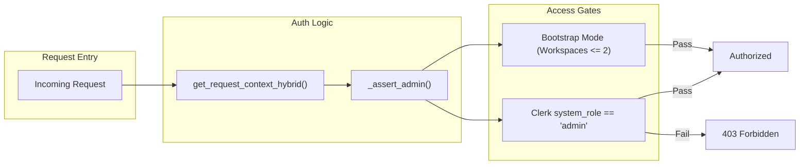

# Analytics API Reference

Relevant source files

The following files were used as context for generating this wiki page:

- [frontend/components/analytics/analytics-composio.tsx](frontend/components/analytics/analytics-composio.tsx)
- [frontend/components/analytics/analytics-openrouter-credits.tsx](frontend/components/analytics/analytics-openrouter-credits.tsx)
- [frontend/components/analytics/analytics-pandas-chart.tsx](frontend/components/analytics/analytics-pandas-chart.tsx)
- [frontend/components/context/context-engineering.tsx](frontend/components/context/context-engineering.tsx)
- [frontend/components/dashboard/widgets/system-health-widget.tsx](frontend/components/dashboard/widgets/system-health-widget.tsx)
- [frontend/components/knowledge/QueryTemplatesGrid.tsx](frontend/components/knowledge/QueryTemplatesGrid.tsx)
- [frontend/components/team/team-management.tsx](frontend/components/team/team-management.tsx)
- [frontend/lib/api-config.ts](frontend/lib/api-config.ts)
- [orchestrator/api/analytics.py](orchestrator/api/analytics.py)
- [orchestrator/api/analytics_real.py](orchestrator/api/analytics_real.py)
- [orchestrator/api/execution_history.py](orchestrator/api/execution_history.py)
- [orchestrator/api/llm_analytics.py](orchestrator/api/llm_analytics.py)
- [orchestrator/api/workflow_history.py](orchestrator/api/workflow_history.py)
- [orchestrator/consumers/workflows/__init__.py](orchestrator/consumers/workflows/__init__.py)
- [orchestrator/core/llm/openrouter_analytics.py](orchestrator/core/llm/openrouter_analytics.py)

This document provides a comprehensive reference for all analytics-related API endpoints and frontend hooks in Automatos AI. It covers LLM usage tracking, cost analytics, workspace metrics, admin analytics, and tool integration performance.

---

## Backend API Endpoints

### LLM Usage & Cost Endpoints

All LLM analytics endpoints are mounted at `/api/analytics/llm` and require workspace context via `RequestContext`. Period parameters accept values: `1h`, `24h`, `7d`, `30d`, `90d` [orchestrator/api/llm_analytics.py:28-82]().

#### GET /api/analytics/llm/usage
Returns token usage grouped by specified dimension.

**Query Parameters:**
| Parameter | Type | Default | Description |
|-----------|------|---------|-------------|
| `period` | string | `7d` | Time window for data aggregation |
| `group_by` | string | `model` | Grouping dimension: `model`, `provider`, `agent`, `tier`, `is_byok`, `request_type` |

**Response Schema:** `UsageGroup` [orchestrator/api/llm_analytics.py:34-41]()

Sources: [orchestrator/api/llm_analytics.py:87-138]()

---

#### GET /api/analytics/llm/costs
Returns cost breakdown by dimension with separate input/output cost tracking.

**Query Parameters:**
| Parameter | Type | Default | Description |
|-----------|------|---------|-------------|
| `period` | string | `7d` | Time window |
| `breakdown` | string | `model` | Grouping: `model`, `provider`, `agent`, `is_byok`, `daily` |

**Response Schema:** `CostBreakdown` [orchestrator/api/llm_analytics.py:43-49]()

Sources: [orchestrator/api/llm_analytics.py:141-191]()

---

#### GET /api/analytics/llm/summary
Dashboard summary with aggregates, top models, and daily cost trend.

**Response Schema:** `UsageSummary` [orchestrator/api/llm_analytics.py:51-59]()

Sources: [orchestrator/api/llm_analytics.py:194-260]()

---

#### GET /api/analytics/llm/recommendations
AI-generated cost optimization suggestions based on usage patterns.

**Response Schema:** `Recommendation` [orchestrator/api/llm_analytics.py:61-67]()

**Logic:**
- Identifies agents using premium models for simple tasks (< 200 output tokens).
- Calculates potential savings using `PREMIUM_TO_BUDGET_SAVINGS_RATIO`.
- Suggests cheaper models from `BUDGET_MODELS`.

Sources: [orchestrator/api/llm_analytics.py:263-320]()

---

#### GET /api/analytics/llm/costs/daily-by-model
Daily cost breakdown per model for multi-line time-series charts. Pivots daily costs into date-keyed objects with model costs as dynamic properties [orchestrator/api/llm_analytics.py:326-374]().

---

#### GET /api/analytics/llm/comparison
Side-by-side comparison of selected models (max 4) with usage stats and pricing metadata from the `LLMModel` registry [orchestrator/api/llm_analytics.py:396-471]().

---

#### GET /api/analytics/llm/projections
Projected monthly costs based on current usage trajectory calculated as `(current_period_cost / days_with_data) * 30` [orchestrator/api/llm_analytics.py:492-603]().

---

### Enhanced Dashboard & Performance Metrics

New endpoints under `/api/analytics` provide unified metrics across legacy workflows and new Mission orchestration [orchestrator/api/analytics_real.py:32]().

#### GET /api/analytics/dashboard/summary
Returns a combined summary of `WorkflowExecution` and `OrchestrationRun` (Missions) statistics. It calculates success rates, active agents, and aggregates costs from workflow metadata and mission token usage [orchestrator/api/analytics.py:29-154]().

#### GET /api/analytics/dashboard/success-rate
Calculates a weighted success rate percentage and 7-day trend by querying both `WorkflowExecution` and `OrchestrationRun` tables [orchestrator/api/analytics_real.py:53-105]().

#### GET /api/analytics/dashboard/task-completion-time
Computes average completion time in minutes by extracting epochs from `started_at` and `completed_at` columns across both execution types [orchestrator/api/analytics_real.py:111-159]().

Sources: [orchestrator/api/analytics.py:29-154](), [orchestrator/api/analytics_real.py:53-159]()

---

### OpenRouter Integration Endpoints

These endpoints integrate with OpenRouter's management API for credit tracking and activity synchronization.

#### POST /api/analytics/llm/openrouter/sync
Triggers synchronization of OpenRouter activity data into the local `llm_usage` table. This only works with workspace BYOK keys to prevent data duplication [orchestrator/api/llm_analytics.py:668-688](). The `OpenRouterAnalyticsService` handles the `upsert` logic, deduping by `workspace_id`, `model_id`, and `created_at` [orchestrator/core/llm/openrouter_analytics.py:44-148]().

#### GET /api/analytics/llm/openrouter/credits
Returns OpenRouter account credits balance and total usage [orchestrator/api/llm_analytics.py:691-713]().

#### GET /api/analytics/llm/openrouter/key-info
Returns OpenRouter key limits and daily/weekly/monthly usage stats [orchestrator/api/llm_analytics.py:716-738]().

Sources: [orchestrator/api/llm_analytics.py:668-738](), [orchestrator/core/llm/openrouter_analytics.py:27-190]()

---

### Admin Analytics Endpoints

Admin-only endpoints mounted at `/api/admin/analytics` [orchestrator/api/llm_analytics.py:29](). These require `system_role=admin` or bootstrap mode (≤2 active workspaces) [orchestrator/api/llm_analytics.py:750-765]().

#### GET /api/admin/analytics/costs
Platform-wide cost analytics across all workspaces. Aggregates all `LLMUsage` records, joins with the `Workspace` table for names/plans, and splits costs by `is_byok` status [orchestrator/api/llm_analytics.py:801-917]().

---

## Frontend React Hooks

All analytics hooks use React Query for caching and loading state management. They are workspace-scoped via the `wsScope()` function to ensure cache isolation [frontend/hooks/use-unified-analytics.ts:12-14]().

### Analytics Data Flow

The following diagram illustrates the relationship between UI components, hooks, and backend services.

**Analytics Entity Mapping**

Sources: [frontend/hooks/use-unified-analytics.ts:18-43](), [orchestrator/api/llm_analytics.py:28-29](), [frontend/components/analytics/analytics-composio.tsx:96-100]()

---

### Core Analytics Hooks

#### useAnalyticsOverview(days: number)
Dashboard overview with agent counts, workflow stats, and document metrics. It uses a `safeRequest` wrapper to prevent partial failures from breaking the entire promise chain [frontend/hooks/use-unified-analytics.ts:46-95]().

#### useAgentAnalytics(days: number)
Per-agent performance metrics merged with memory statistics from `/api/v1/memory/stats/agents` [frontend/hooks/use-unified-analytics.ts:110-168]().

#### useWorkflowAnalytics(days: number)
Workflow and recipe execution analytics, including success rates and average durations [frontend/hooks/use-unified-analytics.ts:172-241]().

#### useCostAnalyticsUnified(days: number)
Implements a dual-source strategy: prefers the `llm_usage` table data but falls back to aggregating agent `model_usage_stats` if the primary table is empty [frontend/hooks/use-unified-analytics.ts:292-399]().

#### useComposioExecStats(days: number)
Tracks tool execution performance, including latency percentiles (p50, p95), success rates, and cache hit rates. Used by the `AnalyticsComposio` component to render the "API Execution Monitor" [frontend/hooks/use-unified-analytics.ts:721-735](), [frontend/components/analytics/analytics-composio.tsx:170-190]().

#### useAnalyticsChart()
A mutation hook that accepts a natural language query and chart type to generate Base64 encoded chart images and summaries via the pandas-based analytics worker [frontend/hooks/use-unified-analytics.ts:585-610](), [frontend/components/analytics/analytics-pandas-chart.tsx:15-37]().

---

## Admin and Multi-Tenancy Logic

### Workspace Scoping Logic
The `wsScope()` function determines the cache key for React Query. If an admin has selected a specific workspace override, that ID is used; otherwise, it defaults to `'own'` [frontend/hooks/use-unified-analytics.ts:12-14]().

### Request Authorization Flow

**Admin Access Resolution**

Sources: [orchestrator/api/llm_analytics.py:750-765](), [frontend/hooks/use-unified-analytics.ts:12-14]()

---

## Caching Strategy

| Hook | Stale Time | Cache Key Category |
|------|------------|--------------------|
| `useAnalyticsOverview` | 60s | `overview` |
| `useAgentAnalytics` | 60s | `agents` |
| `useCostAnalyticsUnified` | 60s | `costs` |
| `useOpenRouterCredits` | 300s | `openrouter` |
| `useComposioRecentExecs` | 30s | `composio` |
| `useContextStats` | 30s | `context-stats` |

Sources: [frontend/hooks/use-unified-analytics.ts:18-43](), [frontend/hooks/use-unified-analytics.ts:94](), [frontend/hooks/use-unified-analytics.ts:167](), [frontend/components/context/context-engineering.tsx:71]()

---