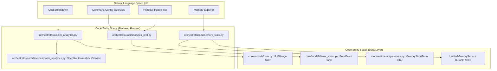
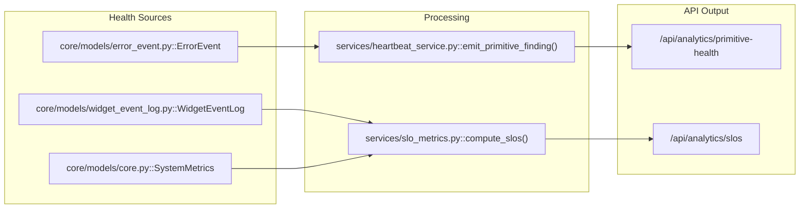

# Analytics API Reference

Relevant source files

The following files were used as context for generating this wiki page:

- [docs/PRDS/PRD-143-OBS-TIER-MANIFEST.md](docs/PRDS/PRD-143-OBS-TIER-MANIFEST.md)
- [frontend/components/activity/memory-card.tsx](frontend/components/activity/memory-card.tsx)
- [frontend/components/activity/memory/health-banner.tsx](frontend/components/activity/memory/health-banner.tsx)
- [frontend/components/activity/memory/index.ts](frontend/components/activity/memory/index.ts)
- [frontend/components/activity/memory/memory-sidebar.tsx](frontend/components/activity/memory/memory-sidebar.tsx)
- [frontend/components/activity/projects/index.ts](frontend/components/activity/projects/index.ts)
- [frontend/hooks/use-memory-explorer-api.ts](frontend/hooks/use-memory-explorer-api.ts)
- [orchestrator/api/analytics.py](orchestrator/api/analytics.py)
- [orchestrator/api/analytics_api.py](orchestrator/api/analytics_api.py)
- [orchestrator/api/analytics_charts.py](orchestrator/api/analytics_charts.py)
- [orchestrator/api/analytics_real.py](orchestrator/api/analytics_real.py)
- [orchestrator/api/composio_analytics.py](orchestrator/api/composio_analytics.py)
- [orchestrator/api/database_analytics.py](orchestrator/api/database_analytics.py)
- [orchestrator/api/execution_history.py](orchestrator/api/execution_history.py)
- [orchestrator/api/llm_analytics.py](orchestrator/api/llm_analytics.py)
- [orchestrator/api/memory_stats.py](orchestrator/api/memory_stats.py)
- [orchestrator/api/workflow_history.py](orchestrator/api/workflow_history.py)
- [orchestrator/core/auth/workspace_admin.py](orchestrator/core/auth/workspace_admin.py)
- [orchestrator/core/llm/openrouter_analytics.py](orchestrator/core/llm/openrouter_analytics.py)
- [orchestrator/tests/test_activation_endpoint.py](orchestrator/tests/test_activation_endpoint.py)
- [orchestrator/tests/test_errors_by_subsystem_endpoint.py](orchestrator/tests/test_errors_by_subsystem_endpoint.py)
- [orchestrator/tests/test_p2w0_cockpit_reach.py](orchestrator/tests/test_p2w0_cockpit_reach.py)
- [orchestrator/tests/test_prd143_obs_routers_batch1.py](orchestrator/tests/test_prd143_obs_routers_batch1.py)
- [orchestrator/tests/test_prd143_obs_routers_batch2.py](orchestrator/tests/test_prd143_obs_routers_batch2.py)
- [orchestrator/tests/test_primitive_health_endpoint.py](orchestrator/tests/test_primitive_health_endpoint.py)
- [orchestrator/tests/test_widget_engagement_endpoint.py](orchestrator/tests/test_widget_engagement_endpoint.py)

This document provides a technical reference for the analytics infrastructure in Automatos AI. It details the backend API endpoints, security tiers, and the data flow between system components for tracking usage, costs, performance, and platform-wide health.

## Backend API Architecture

The analytics system is built on a modular router architecture with a strict security hierarchy. It tracks two primary categories of data: **LLM Usage** (tokens, costs, models) and **Operational Performance** (agent success, mission completion, substrate health).

### 1. LLM Analytics API
The core of the cost tracking system resides in `llm_analytics.py`. It provides endpoints for workspace-level usage summaries and optimization recommendations [orchestrator/api/llm_analytics.py:2-7]().

| Endpoint | Method | Auth Tier | Purpose |
|:---|:---:|:---|:---|
| `/api/analytics/llm/usage` | GET | Workspace Admin | Token usage grouped by model, provider, or agent [orchestrator/api/llm_analytics.py:113-119]() |
| `/api/analytics/llm/costs` | GET | Workspace Admin | Cost breakdown by dimension (daily, model, etc.) [orchestrator/api/llm_analytics.py:167-173]() |
| `/api/analytics/llm/summary` | GET | Workspace Admin | High-level dashboard summary with cost trends [orchestrator/api/llm_analytics.py:220-226]() |
| `/api/analytics/llm/recommendations` | GET | Workspace Admin | AI-generated cost/performance suggestions [orchestrator/api/llm_analytics.py:291-297]() |
| `/api/analytics/llm/openrouter/sync` | POST | Super Admin | Manual trigger for OpenRouter activity sync [orchestrator/api/llm_analytics.py:348-354]() |

Sources: [orchestrator/api/llm_analytics.py:37-55](), [orchestrator/api/llm_analytics.py:113-297]()

### 2. Enhanced Performance Analytics
The `analytics_real.py` module provides high-frequency health metrics and success rates.

*   **Success Rates**: Aggregates legacy `WorkflowExecution` and modern `OrchestrationRun` (Missions) to calculate a unified success percentage [orchestrator/api/analytics_real.py:76-97]().
*   **Substrate Health**: PRD-197 S4 implementation for monitoring retrieval health (documents, memory, field seams) with latency and error tracking [orchestrator/api/analytics_real.py:160-170]().
*   **SLO Monitoring**: Workspace-scoped tracking of tool-call success, board-dispatch latency, and event freshness [orchestrator/api/analytics_real.py:135-150]().

Sources: [orchestrator/api/analytics_real.py:51-55](), [orchestrator/api/analytics_real.py:76-170]()

---

## Data Flow & System Integration

The analytics system bridges low-level database events and external provider APIs to the user-facing dashboard.

### Entity Mapping: UI to Code

The following diagram maps user-facing analytics concepts to their underlying code entities and backend routers.

**Analytics Entity Mapping**

Sources: [orchestrator/api/llm_analytics.py:23-25](), [orchestrator/api/analytics_real.py:16-26](), [orchestrator/api/memory_stats.py:18-21](), [orchestrator/core/llm/openrouter_analytics.py:27]()

---

## Memory & Substrate Analytics

### 1. Unified Memory Statistics
The `memory_stats.py` module implements a "durable-store-first" strategy. It attempts to query the `UnifiedMemoryService` (Mem0) and falls back to the local `MemoryShortTerm` table [orchestrator/api/memory_stats.py:1-6]().

*   **Scope Resolution**: Fetches memories across global, agent, and daily scopes [orchestrator/api/memory_stats.py:85-112]().
*   **Isolation**: Strictly filters by `ctx.workspace_id` so authenticated members see only their own workspace memory [orchestrator/api/memory_stats.py:26-31]().

Sources: [orchestrator/api/memory_stats.py:1-6](), [orchestrator/api/memory_stats.py:85-112](), [orchestrator/api/memory_stats.py:26-31]()

### 2. Primitive Health Monitoring
The Command Center "is-it-working" strip is backed by a specialized endpoint that tracks 8 core primitives: chat, memory, rag, nl2sql, graph, missions, playbooks, and channels [orchestrator/tests/test_primitive_health_endpoint.py:7-14]().

**Health State Resolution**

Sources: [orchestrator/api/analytics_real.py:135-154](), [orchestrator/tests/test_primitive_health_endpoint.py:1-14]()

---

## Admin Analytics & Platform Health

Super Admins have access to the "Observability Tier" for platform-wide monitoring. These routers are locked via `require_super_admin` [orchestrator/api/analytics_real.py:38-45]().

### Key Admin Modules
*   **LLM Admin**: Cross-workspace aggregate usage and cost data [orchestrator/api/llm_analytics.py:42-46]().
*   **Composio Analytics**: Tracks action usage, connection status, and tool execution logs for all integrated apps [orchestrator/api/composio_analytics.py:139-145]().
*   **System Metrics**: Real-time CPU, memory usage (via `psutil`), and system uptime tracking [orchestrator/api/analytics_real.py:28-29]().
*   **KPI & Reports**: Specialized routers for cost tracking and performance reporting [orchestrator/tests/test_prd143_obs_routers_batch2.py:68-70]().

### Security Boundary Table
The following table defines which analytics surfaces are accessible to which roles.

| Router / Path | Role Required | Enforcement Mechanism |
|:---|:---|:---|
| `/api/analytics/llm/usage` | Workspace Admin | `require_workspace_admin` [orchestrator/api/llm_analytics.py:40]() |
| `/api/admin/analytics/*` | Super Admin | `require_super_admin` [orchestrator/api/llm_analytics.py:45]() |
| `/api/analytics/composio/*`| Super Admin | `require_super_admin` [orchestrator/api/composio_analytics.py:32]() |
| `/api/v1/memory/stats/real` | Member | `get_request_context_hybrid` [orchestrator/api/memory_stats.py:141]() |
| `/api/v1/memory/consolidate`| Super Admin | `require_super_admin` [orchestrator/api/memory_stats.py:43]() |
| `/api/analytics/errors/by-subsystem` | Workspace Admin | `require_workspace_admin` [orchestrator/api/analytics_real.py:55]() |
| `/api/analytics/widget-engagement` | Workspace Admin | `require_workspace_admin` [orchestrator/api/analytics_real.py:55]() |
| `/api/analytics/primitive-health` | Workspace Admin | `require_workspace_admin` [orchestrator/api/analytics_real.py:55]() |

Sources: [orchestrator/api/llm_analytics.py:31-55](), [orchestrator/api/memory_stats.py:26-44](), [orchestrator/tests/test_prd143_obs_routers_batch2.py:8-12](), [orchestrator/api/analytics_real.py:28-29](), [orchestrator/api/composio_analytics.py:139-145](), [orchestrator/api/analytics_real.py:55]()

## OpenRouter Sync Implementation

The system maintains local data consistency with OpenRouter via `OpenRouterAnalyticsService`.

1.  **Sync Activity**: Fetches usage from `OPENROUTER_BASE/activity` [orchestrator/core/llm/openrouter_analytics.py:52-58]().
2.  **Deduplication**: Rows are upserted into `llm_usage` using a unique key derived from `workspace_id + model_id + date` [orchestrator/core/llm/openrouter_analytics.py:97-106]().
3.  **Credit Tracking**: Monitors remaining credits to prevent agent failure due to exhaustion [orchestrator/core/llm/openrouter_analytics.py:154-167]().

Sources: [orchestrator/core/llm/openrouter_analytics.py:27-167]()

---