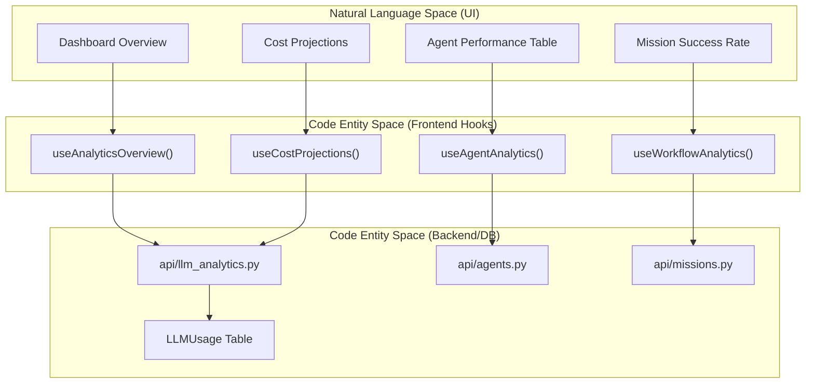
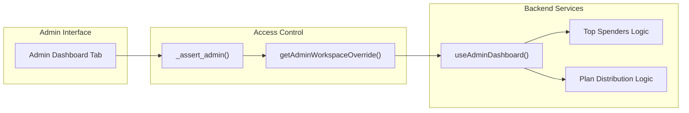

# Analytics API Reference

Relevant source files

The following files were used as context for generating this wiki page:

- [docs/PRDS/52-UNIFIED-ANALYTICS.md](docs/PRDS/52-UNIFIED-ANALYTICS.md)
- [frontend/app/analytics/page.tsx](frontend/app/analytics/page.tsx)
- [frontend/components/analytics/analytics-admin.tsx](frontend/components/analytics/analytics-admin.tsx)
- [frontend/components/analytics/analytics-agents.tsx](frontend/components/analytics/analytics-agents.tsx)
- [frontend/components/analytics/analytics-costs.tsx](frontend/components/analytics/analytics-costs.tsx)
- [frontend/components/analytics/analytics-documents.tsx](frontend/components/analytics/analytics-documents.tsx)
- [frontend/components/analytics/analytics-memory.tsx](frontend/components/analytics/analytics-memory.tsx)
- [frontend/components/analytics/analytics-openrouter-credits.tsx](frontend/components/analytics/analytics-openrouter-credits.tsx)
- [frontend/components/analytics/analytics-overview.tsx](frontend/components/analytics/analytics-overview.tsx)
- [frontend/components/analytics/analytics-page.tsx](frontend/components/analytics/analytics-page.tsx)
- [frontend/components/analytics/analytics-pandas-chart.tsx](frontend/components/analytics/analytics-pandas-chart.tsx)
- [frontend/components/analytics/analytics-plan-usage.tsx](frontend/components/analytics/analytics-plan-usage.tsx)
- [frontend/components/analytics/analytics-recommendations.tsx](frontend/components/analytics/analytics-recommendations.tsx)
- [frontend/components/analytics/analytics-workflows.tsx](frontend/components/analytics/analytics-workflows.tsx)
- [frontend/components/dashboard/widgets/system-health-widget.tsx](frontend/components/dashboard/widgets/system-health-widget.tsx)
- [frontend/components/knowledge/QueryTemplatesGrid.tsx](frontend/components/knowledge/QueryTemplatesGrid.tsx)
- [frontend/components/system/rag-configuration.tsx](frontend/components/system/rag-configuration.tsx)
- [frontend/hooks/use-unified-analytics.ts](frontend/hooks/use-unified-analytics.ts)
- [orchestrator/api/llm_analytics.py](orchestrator/api/llm_analytics.py)
- [orchestrator/core/llm/openrouter_analytics.py](orchestrator/core/llm/openrouter_analytics.py)

This document provides a technical reference for the analytics infrastructure in Automatos AI. It details the backend API endpoints, frontend React Query hooks, and the data flow between system components for tracking usage, costs, performance, and platform-wide health.

## Backend API Architecture

The analytics system is built on a modular router architecture. It tracks two primary categories of data: **LLM Usage** (tokens, costs, models) and **Operational Performance** (agent success, mission completion, document RAG efficiency).

### 1. LLM Analytics API
The core of the cost tracking system resides in `llm_analytics.py`. It provides endpoints for workspace-level usage summaries and optimization recommendations [orchestrator/api/llm_analytics.py:28-29]().

| Endpoint | Method | Purpose | Data Source |
|:---|:---:|:---|:---|
| `/api/analytics/llm/usage` | GET | Token usage grouped by model, provider, or agent [orchestrator/api/llm_analytics.py:87-94]() | `LLMUsage` table |
| `/api/analytics/llm/costs` | GET | Cost breakdown by dimension (daily, model, etc.) [orchestrator/api/llm_analytics.py:141-148]() | `LLMUsage` table |
| `/api/analytics/llm/summary` | GET | High-level dashboard summary with cost trends [orchestrator/api/llm_analytics.py:194-200]() | `LLMUsage` table |
| `/api/analytics/llm/recommendations` | GET | AI-generated cost/performance suggestions [orchestrator/api/llm_analytics.py:265-271]() | Analytics Engine |

Sources: [orchestrator/api/llm_analytics.py:28-271]()

### 2. OpenRouter Integration
For workspaces using OpenRouter, the system synchronizes external usage data into the local `llm_usage` table to provide a single source of truth [orchestrator/core/llm/openrouter_analytics.py:10-11]().

*   **Activity Sync**: Fetches daily breakdown from `/api/v1/activity` and upserts into `LLMUsage` [orchestrator/core/llm/openrouter_analytics.py:44-50]().
*   **Credit Monitoring**: Retrieves account balance via `/api/v1/credits` [orchestrator/core/llm/openrouter_analytics.py:154-159]().
*   **Key Info**: Tracks rate limits and usage stats per API key [orchestrator/core/llm/openrouter_analytics.py:185-190]().

Sources: [orchestrator/core/llm/openrouter_analytics.py:1-190]()

---

## Frontend Integration & Data Flow

The frontend consumes analytics via the `use-unified-analytics` hook library. It implements a workspace-scoping mechanism (`wsScope`) to ensure multi-tenant data isolation and prevent cache bleed when admins switch between workspaces [frontend/hooks/use-unified-analytics.ts:10-14]().

### Entity Mapping: UI to Code

The following diagram maps user-facing analytics concepts to their underlying code entities and API routes.

**Analytics Entity Mapping**

Sources: [frontend/hooks/use-unified-analytics.ts:46-150](), [orchestrator/api/llm_analytics.py:28-29](), [frontend/components/analytics/analytics-costs.tsx:150-152]()

---

## Specialized Analytics Modules

### 1. Agent & Memory Utilization
The `useAgentAnalytics` hook aggregates agent performance with memory depth statistics [frontend/hooks/use-unified-analytics.ts:120-134]().

*   **Memory Depth**: Tracks `memory_count` and `avg_importance` per agent [frontend/components/analytics/analytics-agents.tsx:60-72]().
*   **Access Patterns**: Monitors `total_accesses` to short-term (L1/L2) vs. long-term (L3/L4) memory [frontend/components/analytics/analytics-agents.tsx:127-132]().

### 2. Document & RAG Analytics
Monitors the effectiveness of the knowledge base retrieval system [frontend/components/analytics/analytics-documents.tsx:36-37]().

*   **Cold Data Detection**: Identifies documents that have "Never Been Accessed" by RAG queries [frontend/components/analytics/analytics-documents.tsx:90-94]().
*   **RAG Performance**: Tracks `rag_query` and `document_searched` events to calculate retrieval efficiency [frontend/components/analytics/analytics-documents.tsx:114-136]().

### 3. Mission & Workflow Analytics
The system tracks the success and duration of automated missions [frontend/hooks/use-unified-analytics.ts:86-92]().

*   **Success Rates**: Calculates percentages of completed vs failed mission executions [frontend/hooks/use-unified-analytics.ts:89]().
*   **Token Attribution**: Tracks `avg_tokens_used` per mission to identify high-cost automation patterns [frontend/hooks/use-unified-analytics.ts:91]().

Sources: [frontend/hooks/use-unified-analytics.ts:80-92](), [frontend/components/analytics/analytics-workflows.tsx:145-150]()

### 4. Plan & Quota Tracking
Tracks workspace consumption against plan limits [frontend/hooks/use-unified-analytics.ts:25]().

*   **Quota Enforcement**: Calculates percentage used for agents, storage, and API calls [frontend/components/analytics/analytics-overview.tsx:127]().
*   **AI Recommendations**: Surfaces `cost_optimization` or `quota_warning` types to users [orchestrator/api/llm_analytics.py:61-67]().

---

## Admin Analytics & Platform Health

Super Admins have access to a cross-workspace dashboard for platform-wide monitoring [frontend/components/analytics/analytics-admin.tsx:164]().

### Admin Data Resolution

Sources: [frontend/hooks/use-unified-analytics.ts:12-14](), [frontend/components/analytics/analytics-admin.tsx:168-175](), [orchestrator/api/llm_analytics.py:29]()

### Key Admin Metrics
*   **Top Spenders**: Workspaces sorted by total cost, request count, or agent volume [frontend/components/analytics/analytics-admin.tsx:172-178]().
*   **Plan Distribution**: Aggregated counts of workspaces across `starter`, `pilot`, `pro`, and `enterprise` tiers [frontend/components/analytics/analytics-admin.tsx:199-205]().
*   **Platform-Wide Costs**: Total aggregate burn across all models and providers [frontend/components/analytics/analytics-admin.tsx:196]().

## Caching and Performance

The analytics system uses React Query with specific `staleTime` configurations to balance data freshness with API performance [frontend/hooks/use-unified-analytics.ts:104]().

| Data Type | Cache Key | Stale Time | Refresh Trigger |
|:---|:---|:---|:---|
| Overview | `unified-analytics/overview` | 60s | Manual / 30d Toggle |
| Agent Stats | `unified-analytics/agents` | 60s | Tab Switch |
| LLM Costs | `unified-analytics/costs` | 60s | Period Change |
| Plan Usage | `unified-analytics/plan-usage` | 300s | Page Load |
| Admin Dashboard | `unified-analytics/admin/dashboard` | 60s | Admin Tab Load |

Sources: [frontend/hooks/use-unified-analytics.ts:18-43](), [frontend/hooks/use-unified-analytics.ts:104]()

---