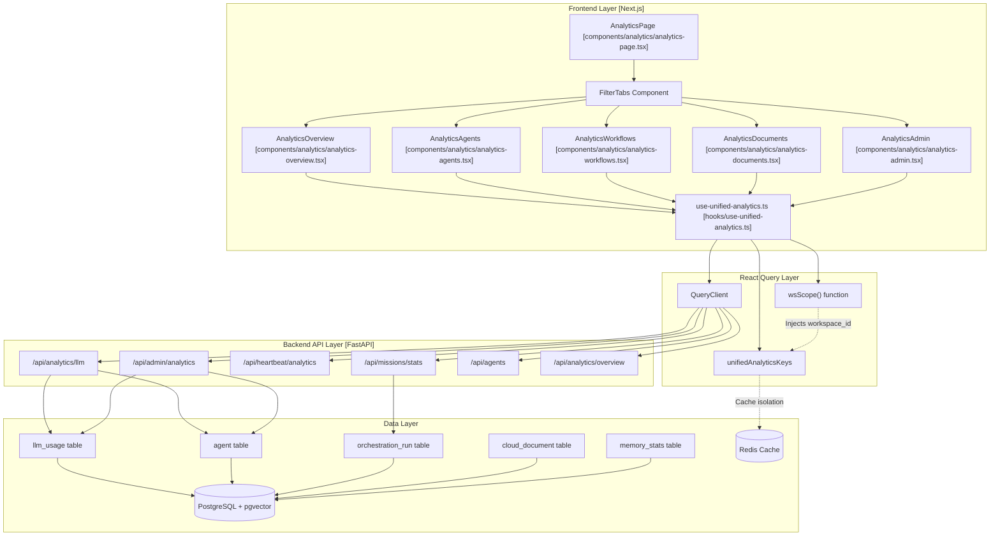
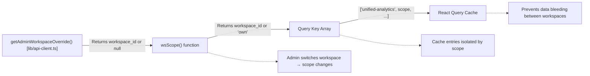
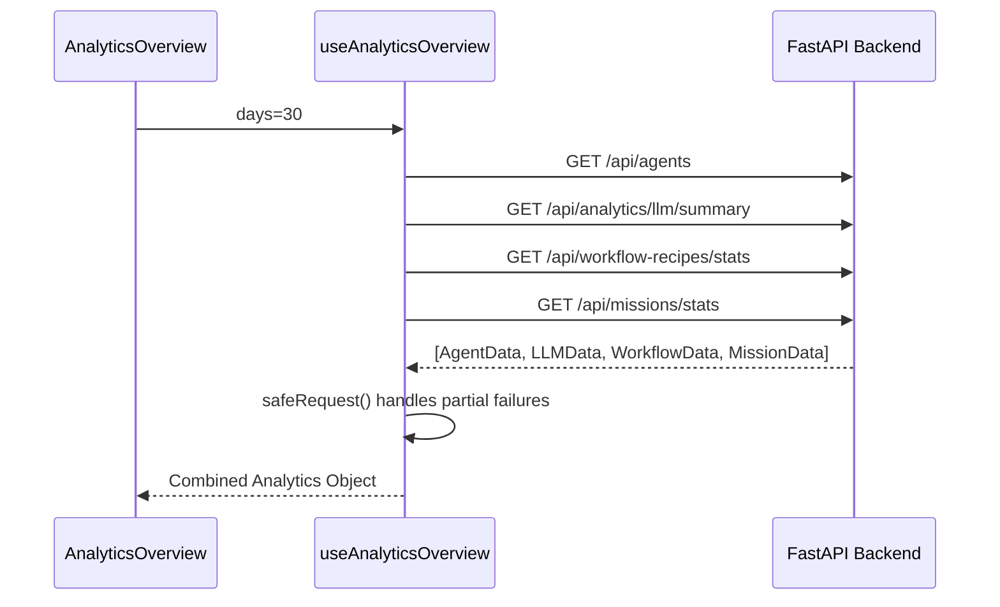

# Analytics Architecture

Relevant source files

The following files were used as context for generating this wiki page:

- [docs/PRDS/52-UNIFIED-ANALYTICS.md](docs/PRDS/52-UNIFIED-ANALYTICS.md)
- [frontend/app/analytics/page.tsx](frontend/app/analytics/page.tsx)
- [frontend/components/analytics/analytics-admin.tsx](frontend/components/analytics/analytics-admin.tsx)
- [frontend/components/analytics/analytics-agents.tsx](frontend/components/analytics/analytics-agents.tsx)
- [frontend/components/analytics/analytics-documents.tsx](frontend/components/analytics/analytics-documents.tsx)
- [frontend/components/analytics/analytics-memory.tsx](frontend/components/analytics/analytics-memory.tsx)
- [frontend/components/analytics/analytics-overview.tsx](frontend/components/analytics/analytics-overview.tsx)
- [frontend/components/analytics/analytics-plan-usage.tsx](frontend/components/analytics/analytics-plan-usage.tsx)
- [frontend/components/analytics/analytics-recommendations.tsx](frontend/components/analytics/analytics-recommendations.tsx)
- [frontend/components/analytics/analytics-workflows.tsx](frontend/components/analytics/analytics-workflows.tsx)
- [frontend/hooks/use-unified-analytics.ts](frontend/hooks/use-unified-analytics.ts)
- [frontend/tsconfig.tsbuildinfo](frontend/tsconfig.tsbuildinfo)

## Purpose and Scope

This document describes the architecture of the unified analytics system in Automatos AI. It covers the frontend-to-backend integration, data aggregation patterns, multi-tenancy implementation via `wsScope`, and the structure of analytics domains. The analytics system provides workspace users with actionable insights about agents, missions, documents, and costs, while giving admins platform-wide visibility across all workspaces.

The core implementation relies on **React Query** for frontend state management, **FastAPI** for data aggregation, and a dual-source strategy that prefers the `llm_usage` table while falling back to agent-specific statistics.

---

## System Overview

The analytics system follows a three-tier architecture with React Query-based frontend hooks, FastAPI backend endpoints, and PostgreSQL/Redis data storage. All queries are workspace-scoped to enforce multi-tenancy.

### High-Level Architecture Diagram

**Sources:**
- [frontend/hooks/use-unified-analytics.ts:1-106]()
- [frontend/components/analytics/analytics-overview.tsx:32-61]()
- [frontend/components/analytics/analytics-page.tsx:35-127]()

---

## Frontend Architecture

### React Query Integration

The frontend uses React Query hooks defined in `use-unified-analytics.ts` [frontend/hooks/use-unified-analytics.ts:1-5]() to fetch data. These hooks handle automatic caching and background refetching.

#### Workspace Scoping Mechanism (`wsScope`)

The `wsScope()` function [frontend/hooks/use-unified-analytics.ts:12-14]() ensures workspace isolation in the cache by checking for an admin override or defaulting to the current user's workspace.

Every query key in `unifiedAnalyticsKeys` [frontend/hooks/use-unified-analytics.ts:18-43]() includes `wsScope()` as a dynamic component. This ensures that when an admin switches workspaces via the `AdminWorkspaceSwitcher`, the cache for the previous workspace is ignored.

**Sources:**
- [frontend/hooks/use-unified-analytics.ts:10-43]()
- [frontend/components/analytics/analytics-page.tsx:47-49]()

### Component Hierarchy

The `AnalyticsPage` manages a tabbed layout. Each tab utilizes specific hooks to aggregate data from multiple backend endpoints.

| Component | Primary Hook | Purpose |
|-----------|--------------|---------|
| `AnalyticsOverview` | `useAnalyticsOverview` | High-level summary of agents, missions, docs, and costs [frontend/hooks/use-unified-analytics.ts:46](). |
| `AnalyticsAgents` | `useAgentAnalytics` | Performance metrics and memory stats per agent [frontend/hooks/use-unified-analytics.ts:120](). |
| `AnalyticsWorkflows` | `useWorkflowAnalytics` | Success rates and execution trends for recipes and missions [frontend/hooks/use-unified-analytics.ts:184](). |
| `AnalyticsDocuments` | `useDocumentAnalyticsUnified` | RAG performance, storage used, and never-accessed alerts [frontend/hooks/use-unified-analytics.ts:246](). |
| `AnalyticsAdmin` | `useAdminDashboard` | Cross-workspace platform metrics for system administrators [frontend/hooks/use-unified-analytics.ts:586](). |

**Sources:**
- [frontend/components/analytics/analytics-overview.tsx:32-37]()
- [frontend/components/analytics/analytics-agents.tsx:162-163]()
- [frontend/components/analytics/analytics-workflows.tsx:36-37]()
- [frontend/hooks/use-unified-analytics.ts:45-600]()

---

## Key Analytics Features

### Multi-Tenancy and Data Isolation
The architecture enforces multi-tenancy by including the `wsScope()` in all React Query keys. This prevents "data bleeding" where an admin viewing Workspace A might accidentally see cached data from Workspace B [frontend/hooks/use-unified-analytics.ts:10-14]().

### Polling and Real-Time Activity
For certain metrics, components implement local polling or immediate effect hooks:
- **Heartbeat & Channel Activity**: `AnalyticsOverview` uses a `useEffect` to fetch `/api/heartbeat/analytics` and `/api/channels/analytics` on mount [frontend/components/analytics/analytics-overview.tsx:43-61]().
- **Long-Running Jobs**: The system supports polling for long-running analytics jobs (e.g., LLM-generated recommendations) through the `useRecommendations` hook [frontend/hooks/use-unified-analytics.ts:380]().

### Data Aggregation Strategy
The `useAnalyticsOverview` hook demonstrates a "Safe Request" pattern [frontend/hooks/use-unified-analytics.ts:53-57](). It wraps multiple `apiClient` calls in `Promise.all` but catches individual failures so that a single failing endpoint (e.g., mission stats) does not break the entire overview dashboard [frontend/hooks/use-unified-analytics.ts:59-66]().

**Sources:**
- [frontend/hooks/use-unified-analytics.ts:46-106]()
- [frontend/components/analytics/analytics-overview.tsx:43-61]()

---

## Analytics Domains

### Agent & Memory Analytics
The `useAgentAnalytics` hook combines standard agent definitions with specific memory statistics fetched from `/api/v1/memory/stats/agents` [frontend/hooks/use-unified-analytics.ts:133](). This allows the `AnalyticsAgents` component to display detailed memory importance and access counts alongside execution costs [frontend/components/analytics/analytics-agents.tsx:47-101]().

### Document & RAG Performance
The `AnalyticsDocuments` component surfaces "Never Accessed" alerts [frontend/components/analytics/analytics-documents.tsx:94-110](). It identifies documents that exist in the knowledge base but have zero RAG retrieval events, helping users optimize their knowledge indexing [frontend/hooks/use-unified-analytics.ts:246-289]().

### Plan & Quota Tracking
The `AnalyticsPlanUsage` component visualizes workspace consumption against platform limits (e.g., agent count, storage MB, API calls) [frontend/components/analytics/analytics-plan-usage.tsx:74-112](). It uses color-coded progress bars (green/yellow/red) based on usage percentage [frontend/components/analytics/analytics-plan-usage.tsx:20-30]().

**Sources:**
- [frontend/hooks/use-unified-analytics.ts:120-182]()
- [frontend/components/analytics/analytics-documents.tsx:86-112]()
- [frontend/components/analytics/analytics-plan-usage.tsx:38-115]()

---