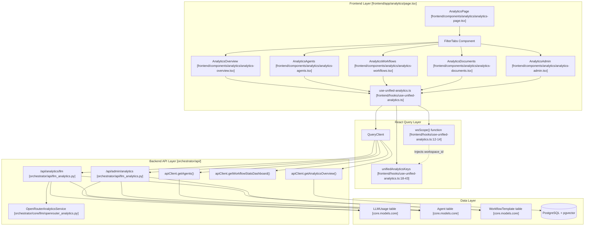
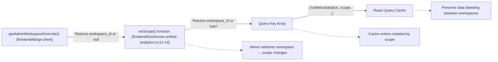

# Analytics Architecture

Relevant source files

The following files were used as context for generating this wiki page:

- [docs/PRDS/52-UNIFIED-ANALYTICS.md](docs/PRDS/52-UNIFIED-ANALYTICS.md)
- [frontend/app/analytics/page.tsx](frontend/app/analytics/page.tsx)
- [frontend/components/analytics/analytics-admin.tsx](frontend/components/analytics/analytics-admin.tsx)
- [frontend/components/analytics/analytics-agents.tsx](frontend/components/analytics/analytics-agents.tsx)
- [frontend/components/analytics/analytics-costs.tsx](frontend/components/analytics/analytics-costs.tsx)
- [frontend/components/analytics/analytics-documents.tsx](frontend/components/analytics/analytics-documents.tsx)
- [frontend/components/analytics/analytics-memory.tsx](frontend/components/analytics/analytics-memory.tsx)
- [frontend/components/analytics/analytics-openrouter-credits.tsx](frontend/components/analytics/analytics-openrouter-credits.tsx)
- [frontend/components/analytics/analytics-overview.tsx](frontend/components/analytics/analytics-overview.tsx)
- [frontend/components/analytics/analytics-page.tsx](frontend/components/analytics/analytics-page.tsx)
- [frontend/components/analytics/analytics-pandas-chart.tsx](frontend/components/analytics/analytics-pandas-chart.tsx)
- [frontend/components/analytics/analytics-plan-usage.tsx](frontend/components/analytics/analytics-plan-usage.tsx)
- [frontend/components/analytics/analytics-recommendations.tsx](frontend/components/analytics/analytics-recommendations.tsx)
- [frontend/components/analytics/analytics-workflows.tsx](frontend/components/analytics/analytics-workflows.tsx)
- [frontend/components/system/rag-configuration.tsx](frontend/components/system/rag-configuration.tsx)
- [frontend/hooks/use-unified-analytics.ts](frontend/hooks/use-unified-analytics.ts)

## Purpose and Scope

This document describes the architecture of the unified analytics system in Automatos AI. It covers the frontend-to-backend integration, data aggregation patterns, multi-tenancy implementation, and the structure of analytics domains. The analytics system provides workspace users with actionable insights about agents, workflows, documents, and costs, while giving admins platform-wide visibility across all workspaces.

The core implementation relies on **React Query** for frontend state management, **FastAPI** for data aggregation, and a dual-source strategy that prefers the `llm_usage` table while falling back to agent-specific statistics.

---

## System Overview

The analytics system follows a three-tier architecture with React Query-based frontend hooks, FastAPI backend endpoints, and PostgreSQL/Redis data storage. All queries are workspace-scoped to enforce multi-tenancy.

### High-Level Architecture Diagram

**Sources:**
- `frontend/hooks/use-unified-analytics.ts:1-43`
- `orchestrator/api/llm_analytics.py:28-29`
- `orchestrator/core/llm/openrouter_analytics.py:27-28`

---

## Frontend Architecture

### React Query Integration

The frontend uses React Query hooks defined in `use-unified-analytics.ts` to fetch data. These hooks handle automatic caching and background refetching.

#### Workspace Scoping Mechanism

The `wsScope()` function [frontend/hooks/use-unified-analytics.ts:12-14]() ensures workspace isolation in the cache by checking for an admin override or defaulting to the current user's workspace via `getAdminWorkspaceOverride()`.

Every query key in `unifiedAnalyticsKeys` [frontend/hooks/use-unified-analytics.ts:18-43]() includes `wsScope()` as a dynamic component. This ensures that when an admin switches workspaces, the cache for the previous workspace is ignored.

**Sources:**
- `frontend/hooks/use-unified-analytics.ts:10-43`
- `frontend/components/analytics/analytics-admin.tsx:168-170`

### Component Hierarchy

The `AnalyticsPage` [frontend/components/analytics/analytics-page.tsx:36]() manages a tabbed layout. Each tab utilizes specialized hooks for data retrieval.

| Component | Primary Hook | Purpose |
|-----------|--------------|---------|
| `AnalyticsOverview` | `useAnalyticsOverview` | Aggregated summary of agents, missions, and costs [frontend/hooks/use-unified-analytics.ts:46](). |
| `AnalyticsAgents` | `useAgentAnalytics` | Performance metrics and memory stats per agent [frontend/hooks/use-unified-analytics.ts:120](). |
| `AnalyticsWorkflows` | `useWorkflowAnalytics` | Success rates and execution trends for recipes [frontend/hooks/use-unified-analytics.ts:184](). |
| `AnalyticsDocuments` | `useDocumentAnalyticsUnified` | RAG performance and never-accessed document alerts [frontend/hooks/use-unified-analytics.ts:246](). |
| `AnalyticsAdmin` | `useAdminDashboard` | Platform-wide metrics for system administrators [frontend/hooks/use-unified-analytics.ts:586](). |
| `AnalyticsPlanUsage` | `usePlanUsage` | Tracks workspace consumption against quotas [frontend/hooks/use-unified-analytics.ts:397](). |

**Sources:**
- `frontend/hooks/use-unified-analytics.ts:45-600`
- `frontend/components/analytics/analytics-workflows.tsx:145-150`
- `frontend/components/analytics/analytics-plan-usage.tsx:38-115`

---

## Analytics Domains

### 1. Overview & Recommendations
The overview surfaces high-level KPIs and AI-powered recommendations. The `useRecommendations` hook [frontend/hooks/use-unified-analytics.ts:384]() fetches optimization suggestions. The `AnalyticsRecommendations` component [frontend/components/analytics/analytics-recommendations.tsx:74]() handles dismissal logic via local state [frontend/components/analytics/analytics-recommendations.tsx:74](). It also fetches Heartbeat activity and Channel routing stats [frontend/components/analytics/analytics-overview.tsx:29-65]().

**Sources:**
- `frontend/hooks/use-unified-analytics.ts:384-395`
- `frontend/components/analytics/analytics-recommendations.tsx:18-37`
- `frontend/components/analytics/analytics-overview.tsx:29-65`

### 2. Agent & Memory Performance
The Agents tab combines agent metadata with memory statistics. The `useAgentAnalytics` hook [frontend/hooks/use-unified-analytics.ts:123-143]() performs a `Promise.all` fetch across `getAgents()`, `getSystemAgentStatistics()`, and `/api/v1/memory/stats/agents`. It builds a lookup map by `agent_id` to merge memory stats into the agent list [frontend/hooks/use-unified-analytics.ts:140-141]().

**Sources:**
- `frontend/hooks/use-unified-analytics.ts:130-134`
- `frontend/components/analytics/analytics-agents.tsx:47-101`

### 3. Workflow & Mission Analytics
Missions (Workflows) are tracked via execution trends and success rates. The `AnalyticsWorkflows` component [frontend/components/analytics/analytics-workflows.tsx:36]() renders an "Execution Trend" bar chart using `recharts` [frontend/components/analytics/analytics-workflows.tsx:164-179](). It also includes detailed recipe performance metrics and quality scores [frontend/components/analytics/analytics-workflows.tsx:95-107]().

**Sources:**
- `frontend/hooks/use-unified-analytics.ts:187-200`
- `frontend/components/analytics/analytics-workflows.tsx:153-180`

### 4. LLM & Cost Analytics
This domain tracks token consumption and financial spend.
- **Dual-Source Strategy**: Prefers `llm_usage` table data, falling back to agent `model_usage_stats` [frontend/hooks/use-unified-analytics.ts:71-73]().
- **OpenRouter Credits**: Tracks balance and usage limits via `useOpenRouterCredits` [frontend/hooks/use-unified-analytics.ts:544]().
- **Model Comparison**: `useModelComparison` allows benchmarking different models over specific periods [frontend/hooks/use-unified-analytics.ts:423]().
- **Daily Trends**: `useDailyCostByModel` provides time-series data for stacked area charts [frontend/hooks/use-unified-analytics.ts:457]().

**Sources:**
- `frontend/hooks/use-unified-analytics.ts:423-488`
- `frontend/components/analytics/analytics-costs.tsx:144-187`
- `frontend/components/analytics/analytics-openrouter-credits.tsx:34-184`

### 5. AI Chart Generation (Pandas Chart)
The system supports natural language chart generation using an isolated worker service. The `AnalyticsPandasChart` component [frontend/components/analytics/analytics-pandas-chart.tsx:15]() uses the `useAnalyticsChart` mutation [frontend/hooks/use-unified-analytics.ts:526]() to convert NL queries into Base64-encoded chart images and summaries.

**Sources:**
- `frontend/hooks/use-unified-analytics.ts:526-542`
- `frontend/components/analytics/analytics-pandas-chart.tsx:1-151`

### 6. Admin & Multi-Tenancy Monitoring
Super admins have access to the `AnalyticsAdmin` component [frontend/components/analytics/analytics-admin.tsx:164](), which provides platform-wide spend and workspace-level reporting. It uses `useAdminDashboard` [frontend/hooks/use-unified-analytics.ts:586]() to aggregate metrics across all workspaces.

**Sources:**
- `frontend/hooks/use-unified-analytics.ts:586-605`
- `frontend/components/analytics/analytics-admin.tsx:183-194`

---

## Performance & Reliability

### Safe Request Pattern
To prevent a single failing API endpoint from breaking the entire dashboard, the analytics hooks utilize a `safeRequest` wrapper [frontend/hooks/use-unified-analytics.ts:53-57](). This pattern resolves to a fallback value (e.g., `null` or `[]`) on failure, allowing the UI to render partial data.

### Data Refreshing & Polling
- **Stale Time**: Overview data is configured with a `staleTime` of 60,000ms [frontend/hooks/use-unified-analytics.ts:104]().
- **Manual Refresh**: The `handleRefresh` function in `AnalyticsPage` [frontend/components/analytics/analytics-page.tsx:43]() invalidates all `unified-analytics` query keys.
- **Polling for Long-Running Jobs**: The `useTriggerOpenRouterSync` mutation [frontend/hooks/use-unified-analytics.ts:566]() allows users to manually trigger background synchronization of usage data.

**Sources:**
- `frontend/hooks/use-unified-analytics.ts:53-66`
- `frontend/hooks/use-unified-analytics.ts:104`
- `frontend/components/analytics/analytics-page.tsx:43-46`

---