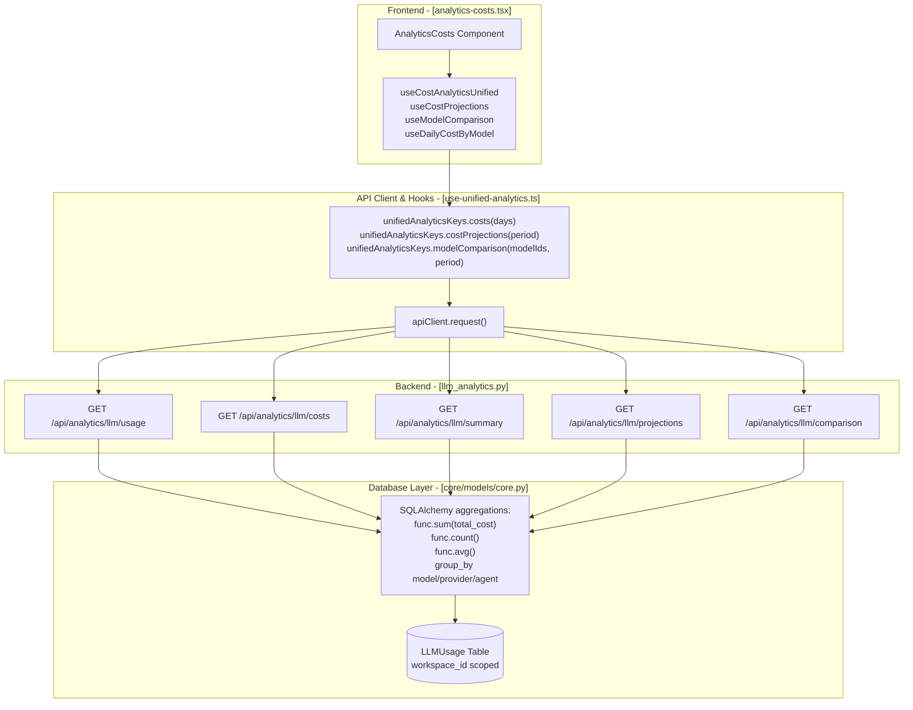
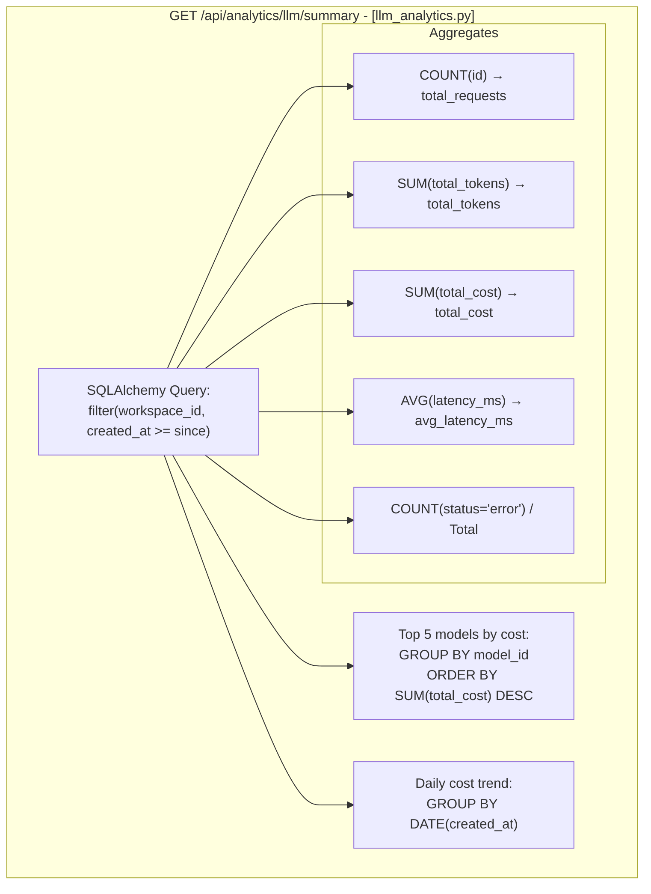
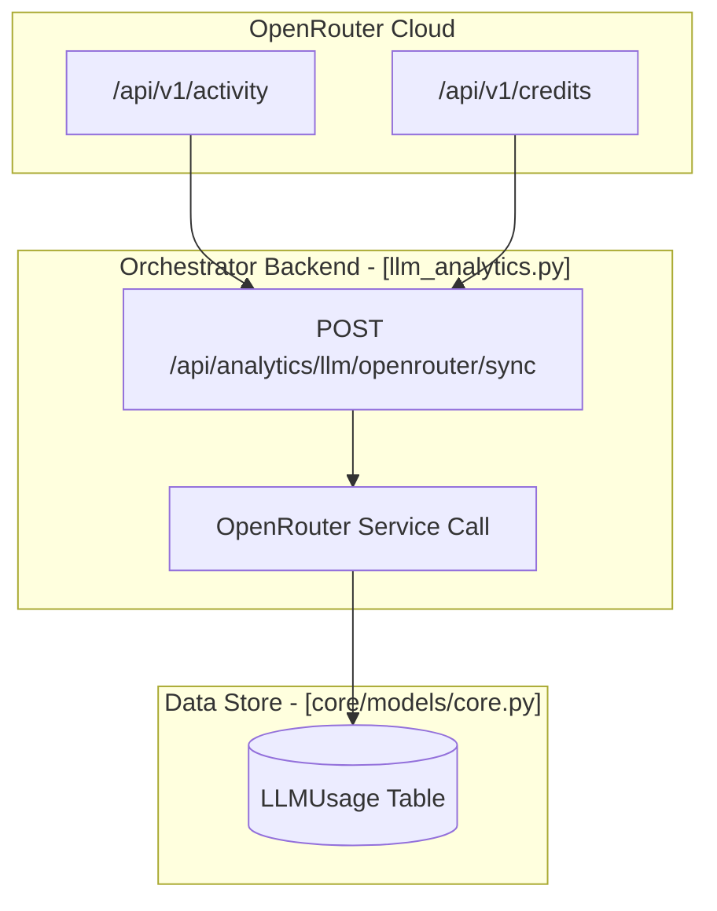

# Cost Analytics

<details>
<summary>Relevant source files</summary>

The following files were used as context for generating this wiki page:

- [docs/PRDS/52-UNIFIED-ANALYTICS.md](docs/PRDS/52-UNIFIED-ANALYTICS.md)
- [frontend/app/analytics/page.tsx](frontend/app/analytics/page.tsx)
- [frontend/components/analytics/analytics-admin.tsx](frontend/components/analytics/analytics-admin.tsx)
- [frontend/components/analytics/analytics-agents.tsx](frontend/components/analytics/analytics-agents.tsx)
- [frontend/components/analytics/analytics-costs.tsx](frontend/components/analytics/analytics-costs.tsx)
- [frontend/components/analytics/analytics-documents.tsx](frontend/components/analytics/analytics-documents.tsx)
- [frontend/components/analytics/analytics-memory.tsx](frontend/components/analytics/analytics-memory.tsx)
- [frontend/components/analytics/analytics-openrouter-credits.tsx](frontend/components/analytics/analytics-openrouter-credits.tsx)
- [frontend/components/analytics/analytics-overview.tsx](frontend/components/analytics/analytics-overview.tsx)
- [frontend/components/analytics/analytics-page.tsx](frontend/components/analytics/analytics-page.tsx)
- [frontend/components/analytics/analytics-pandas-chart.tsx](frontend/components/analytics/analytics-pandas-chart.tsx)
- [frontend/components/analytics/analytics-plan-usage.tsx](frontend/components/analytics/analytics-plan-usage.tsx)
- [frontend/components/analytics/analytics-recommendations.tsx](frontend/components/analytics/analytics-recommendations.tsx)
- [frontend/components/analytics/analytics-workflows.tsx](frontend/components/analytics/analytics-workflows.tsx)
- [frontend/components/system/rag-configuration.tsx](frontend/components/system/rag-configuration.tsx)
- [frontend/hooks/use-unified-analytics.ts](frontend/hooks/use-unified-analytics.ts)

</details>


This document covers the **cost analytics subsystem** that tracks, analyzes, and visualizes LLM API costs across the platform. Cost analytics provides workspace-level cost breakdowns by model, provider, agent, and time period, along with projections, optimization recommendations, and OpenRouter integration for credit tracking.

---

## Cost Tracking Data Model

All LLM API calls are logged to the `LLMUsage` table with cost attribution. Each row captures detailed metadata for granular reporting.

| Field | Type | Description |
|-------|------|-------------|
| `workspace_id` | UUID | Workspace scope for multi-tenancy [orchestrator/api/llm_analytics.py:121-121]() |
| `agent_id` | Integer | Optional agent that initiated the request [orchestrator/api/llm_analytics.py:129-129]() |
| `model_id` | String | Model identifier (e.g., `openai/gpt-4o`) [orchestrator/api/llm_analytics.py:127-127]() |
| `provider` | String | Provider name (`openai`, `anthropic`, `openrouter`) [orchestrator/api/llm_analytics.py:128-128]() |
| `tier` | String | Model tier (`fast`, `smart`, `aggregator`) [orchestrator/api/llm_analytics.py:130-130]() |
| `input_tokens` | Integer | Prompt tokens consumed [orchestrator/api/llm_analytics.py:140-140]() |
| `output_tokens` | Integer | Completion tokens generated [orchestrator/api/llm_analytics.py:141-141]() |
| `total_tokens` | Integer | Sum of input + output [orchestrator/api/llm_analytics.py:142-142]() |
| `input_cost` | Float | Cost for input tokens [orchestrator/api/llm_analytics.py:194-194]() |
| `output_cost` | Float | Cost for output tokens [orchestrator/api/llm_analytics.py:195-195]() |
| `total_cost` | Float | Sum of input + output costs [orchestrator/api/llm_analytics.py:143-143]() |
| `is_byok` | Boolean | True if user provided their own API key [orchestrator/api/llm_analytics.py:131-131]() |
| `created_at` | Timestamp | When the request occurred [orchestrator/api/llm_analytics.py:147-147]() |

Sources: [orchestrator/api/llm_analytics.py:23-23](), [orchestrator/api/llm_analytics.py:113-164]()

---

## Cost Analytics Architecture

### Frontend to Backend Flow

The analytics dashboard utilizes a series of React Query hooks defined in `use-unified-analytics.ts` to fetch aggregated data from the FastAPI backend. All queries are scoped using `wsScope()` to ensure workspace isolation, especially when an admin switches contexts [frontend/hooks/use-unified-analytics.ts:12-14]().

Title: Cost Analytics Data Flow


Sources: [orchestrator/api/llm_analytics.py:37-41](), [orchestrator/api/llm_analytics.py:113-216](), [frontend/components/analytics/analytics-costs.tsx:45-50](), [frontend/hooks/use-unified-analytics.ts:18-43]()

---

## Cost Breakdown Queries

### Usage by Dimension

The `get_usage` endpoint in `llm_analytics.py` aggregates tokens and costs by a specified dimension using SQLAlchemy's `group_by`. Supported dimensions include `model`, `provider`, `agent`, and `tier` [orchestrator/api/llm_analytics.py:116-116]().

```python
# Available grouping dimensions
group_col_map = {
    "model": LLMUsage.model_id,
    "provider": LLMUsage.provider,
    "agent": LLMUsage.agent_id,
    "tier": LLMUsage.tier,
    "is_byok": LLMUsage.is_byok,
    "request_type": LLMUsage.request_type,
}
```

Response schema is defined by the `UsageGroup` Pydantic model, providing a unified structure for charts and tables [orchestrator/api/llm_analytics.py:60-67]().

Sources: [orchestrator/api/llm_analytics.py:60-67](), [orchestrator/api/llm_analytics.py:113-164]()

### Summary Endpoint

The `get_summary` function provides dashboard-level aggregates, including top models and cost trends over a period (e.g., `7d`, `30d`) [orchestrator/api/llm_analytics.py:220-221]().

Title: Summary Aggregation Logic


Sources: [orchestrator/api/llm_analytics.py:219-286]()

---

## OpenRouter Integration

The platform includes deep integration with OpenRouter for credit management and activity synchronization.

### Activity Sync Pipeline
The system includes a dedicated router for OpenRouter synchronization, which is locked to the super-admin role to prevent unauthorized LLM spend [orchestrator/api/llm_analytics.py:51-55](). The synchronization process updates local usage records to reflect reality from the upstream provider.

Title: OpenRouter Sync Architecture


The frontend component `AnalyticsOpenRouterCredits` [frontend/components/analytics/analytics-openrouter-credits.tsx:34-35]() displays the current credit balance, total usage, and remaining balance, along with daily, weekly, and monthly usage breakdowns [frontend/components/analytics/analytics-openrouter-credits.tsx:146-171](). It also provides a button to trigger a manual sync of activity [frontend/components/analytics/analytics-openrouter-credits.tsx:104-112](). If no OpenRouter API key is configured, it prompts the user to set it up in settings [frontend/components/analytics/analytics-openrouter-credits.tsx:42-63]().

Sources: [orchestrator/api/llm_analytics.py:51-55](), [orchestrator/api/llm_analytics.py:668-689](), [frontend/components/analytics/analytics-openrouter-credits.tsx:34-35](), [frontend/components/analytics/analytics-openrouter-credits.tsx:146-171](), [frontend/components/analytics/analytics-openrouter-credits.tsx:104-112](), [frontend/components/analytics/analytics-openrouter-credits.tsx:42-63]()

---

## Plan Usage and Projections

The system monitors workspace resource consumption against defined plan limits.

- **Plan Usage Tracking**: The `AnalyticsPlanUsage` component visualizes consumption for agents, storage, and API calls [frontend/components/analytics/analytics-plan-usage.tsx:73-112](). It uses `usePlanUsage` hook [frontend/hooks/use-unified-analytics.ts:25-25]() to fetch data and displays progress bars for each metric, highlighting usage percentages [frontend/components/analytics/analytics-plan-usage.tsx:93-102]().
- **Projections**: The `useCostProjections` hook [frontend/hooks/use-unified-analytics.ts:40-40]() retrieves forecasted spending based on current consumption rates. This data is then visualized in the `AnalyticsCosts` component [frontend/components/analytics/analytics-costs.tsx:690-719]() to show potential future costs.
- **Model Comparison**: The `useModelComparison` hook [frontend/hooks/use-unified-analytics.ts:39-39]() allows users to compare costs and performance across multiple model IDs over a specific period, visualizing them via `RadarChart` or `LineChart` [frontend/components/analytics/analytics-costs.tsx:151-152](). The `AnalyticsCosts` component [frontend/components/analytics/analytics-costs.tsx:721-860]() provides a UI for selecting models and viewing their comparative metrics.

Sources: [frontend/components/analytics/analytics-plan-usage.tsx:9-115](), [frontend/hooks/use-unified-analytics.ts:38-41](), [frontend/components/analytics/analytics-costs.tsx:143-154](), [frontend/hooks/use-unified-analytics.ts:25-25](), [frontend/components/analytics/analytics-plan-usage.tsx:73-112](), [frontend/components/analytics/analytics-plan-usage.tsx:93-102](), [frontend/components/analytics/analytics-costs.tsx:690-719](), [frontend/components/analytics/analytics-costs.tsx:721-860]()

---

## Admin Analytics

Super admins have access to a platform-wide dashboard via `AnalyticsAdmin`, providing visibility into cross-workspace costs and plan distribution.

- **Cross-Workspace Stats**: Aggregates costs, requests, and agent counts across all workspaces using `useAdminDashboard` [frontend/components/analytics/analytics-admin.tsx:183-194]().
- **Plan Distribution**: Visualizes the breakdown of workspaces across `starter`, `pilot`, `pro`, and `enterprise` tiers using vibrant colors [frontend/components/analytics/analytics-admin.tsx:199-206](), [frontend/components/analytics/analytics-admin.tsx:54-59]().
- **Top Spenders**: A sortable table identifying the highest-cost workspaces by `cost`, `requests`, or `agents` [frontend/components/analytics/analytics-admin.tsx:173-178]().

Sources: [frontend/components/analytics/analytics-admin.tsx:164-210](), [frontend/hooks/use-unified-analytics.ts:42-42]()

---

## Recommendations and Optimization

The `AnalyticsRecommendations` system analyzes usage patterns to suggest cost-saving measures.

- **Recommendation Types**: Includes `cost`, `performance`, `document`, and `quota` optimizations [frontend/components/analytics/analytics-recommendations.tsx:20-20]().
- **Impact Assessment**: Quantifies the potential benefit of an action (e.g., "Switch Agent X to a cheaper LLM") [frontend/components/analytics/analytics-recommendations.tsx:23-23]().
- **Potential Savings**: The backend `Recommendation` model specifically tracks `potential_savings` to prioritize optimizations [orchestrator/api/llm_analytics.py:91-91]().
- **Frontend Display**: The `AnalyticsRecommendations` component [frontend/components/analytics/analytics-recommendations.tsx:73-167]() displays these recommendations with relevant icons, descriptions, and calls to action. It also allows users to dismiss recommendations [frontend/components/analytics/analytics-recommendations.tsx:75-76]().

Sources: [orchestrator/api/llm_analytics.py:87-94](), [frontend/components/analytics/analytics-recommendations.tsx:18-124](), [frontend/components/analytics/analytics-recommendations.tsx:73-167](), [frontend/components/analytics/analytics-recommendations.tsx:75-76]()

---