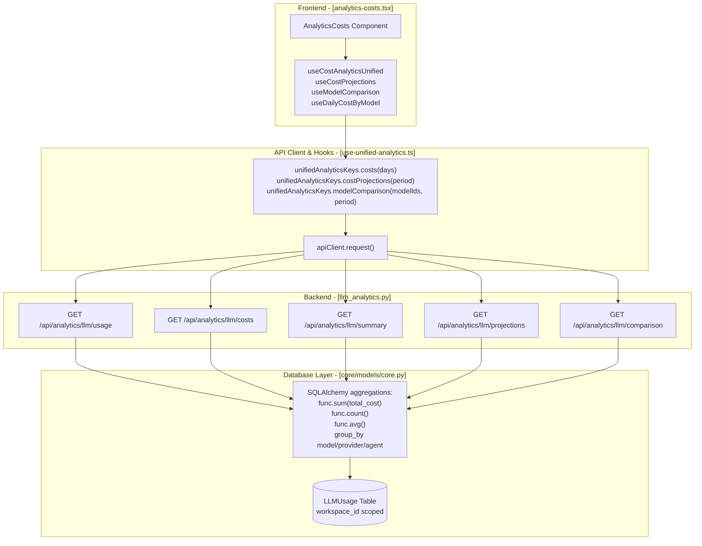
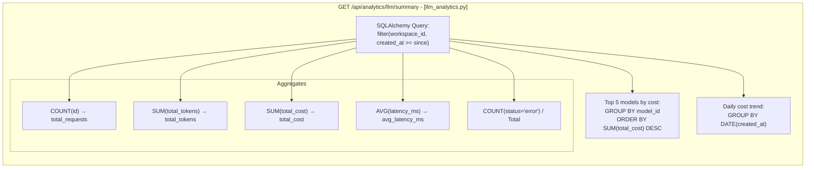
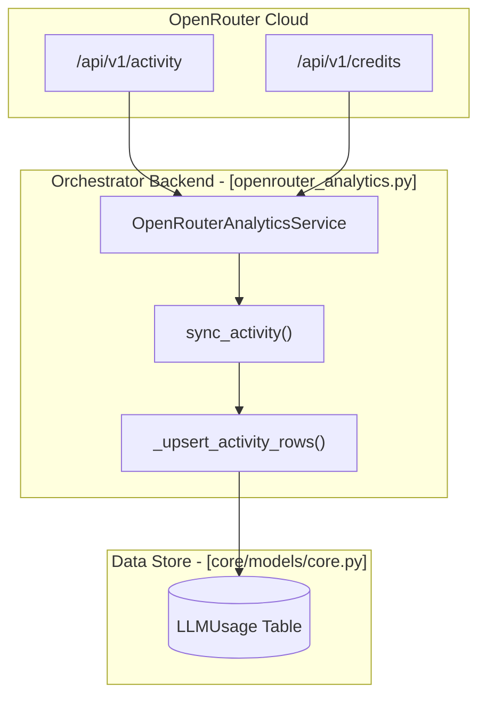

# Cost Analytics

<details>
<summary>Relevant source files</summary>

The following files were used as context for generating this wiki page:

- [docs/PRDS/52-UNIFIED-ANALYTICS.md](docs/PRDS/52-UNIFIED-ANALYTICS.md)
- [frontend/app/analytics/page.tsx](frontend/app/analytics/page.tsx)
- [frontend/components/analytics/analytics-admin.tsx](frontend/components/analytics/analytics-admin.tsx)
- [frontend/components/analytics/analytics-agents.tsx](frontend/components/analytics/analytics-agents.tsx)
- [frontend/components/analytics/analytics-costs.tsx](frontend/components/analytics/analytics-costs.tsx)
- [frontend/components/analytics/analytics-documents.tsx](frontend/components/analytics/analytics-documents.tsx)
- [frontend/components/analytics/analytics-memory.tsx](frontend/components/analytics/analytics-memory.tsx)
- [frontend/components/analytics/analytics-openrouter-credits.tsx](frontend/components/analytics/analytics-openrouter-credits.tsx)
- [frontend/components/analytics/analytics-overview.tsx](frontend/components/analytics/analytics-overview.tsx)
- [frontend/components/analytics/analytics-page.tsx](frontend/components/analytics/analytics-page.tsx)
- [frontend/components/analytics/analytics-pandas-chart.tsx](frontend/components/analytics/analytics-pandas-chart.tsx)
- [frontend/components/analytics/analytics-plan-usage.tsx](frontend/components/analytics/analytics-plan-usage.tsx)
- [frontend/components/analytics/analytics-recommendations.tsx](frontend/components/analytics/analytics-recommendations.tsx)
- [frontend/components/analytics/analytics-workflows.tsx](frontend/components/analytics/analytics-workflows.tsx)
- [frontend/components/dashboard/widgets/system-health-widget.tsx](frontend/components/dashboard/widgets/system-health-widget.tsx)
- [frontend/components/knowledge/QueryTemplatesGrid.tsx](frontend/components/knowledge/QueryTemplatesGrid.tsx)
- [frontend/components/system/rag-configuration.tsx](frontend/components/system/rag-configuration.tsx)
- [frontend/hooks/use-unified-analytics.ts](frontend/hooks/use-unified-analytics.ts)
- [orchestrator/api/llm_analytics.py](orchestrator/api/llm_analytics.py)
- [orchestrator/core/llm/openrouter_analytics.py](orchestrator/core/llm/openrouter_analytics.py)

</details>


This document covers the **cost analytics subsystem** that tracks, analyzes, and visualizes LLM API costs across the platform. Cost analytics provides workspace-level cost breakdowns by model, provider, agent, and time period, along with projections, optimization recommendations, and OpenRouter integration for credit tracking.

---

## Cost Tracking Data Model

All LLM API calls are logged to the `LLMUsage` table with cost attribution. Each row captures detailed metadata for granular reporting.

| Field | Type | Description |
|-------|------|-------------|
| `workspace_id` | UUID | Workspace scope for multi-tenancy [orchestrator/api/llm_analytics.py:95-96]() |
| `agent_id` | Integer | Optional agent that initiated the request [orchestrator/api/llm_analytics.py:103-103]() |
| `model_id` | String | Model identifier (e.g., `openai/gpt-4o`) [orchestrator/api/llm_analytics.py:101-101]() |
| `provider` | String | Provider name (`openai`, `anthropic`, `openrouter`) [orchestrator/api/llm_analytics.py:102-102]() |
| `tier` | String | Model tier (`fast`, `smart`, `aggregator`) [orchestrator/api/llm_analytics.py:104-104]() |
| `input_tokens` | Integer | Prompt tokens consumed [orchestrator/api/llm_analytics.py:114-114]() |
| `output_tokens` | Integer | Completion tokens generated [orchestrator/api/llm_analytics.py:115-115]() |
| `total_tokens` | Integer | Sum of input + output [orchestrator/api/llm_analytics.py:116-116]() |
| `input_cost` | Float | Cost for input tokens [orchestrator/api/llm_analytics.py:168-168]() |
| `output_cost` | Float | Cost for output tokens [orchestrator/api/llm_analytics.py:169-169]() |
| `total_cost` | Float | Sum of input + output costs [orchestrator/api/llm_analytics.py:117-117]() |
| `is_byok` | Boolean | True if user provided their own API key [orchestrator/api/llm_analytics.py:105-105]() |
| `latency_ms` | Float | Request duration [orchestrator/api/llm_analytics.py:215-215]() |
| `status` | String | `success` or `error` [orchestrator/api/llm_analytics.py:219-219]() |
| `created_at` | Timestamp | When the request occurred [orchestrator/api/llm_analytics.py:121-121]() |

Sources: [orchestrator/api/llm_analytics.py:21-21](), [orchestrator/api/llm_analytics.py:100-121]()

---

## Cost Analytics Architecture

### Frontend to Backend Flow

The analytics dashboard utilizes a series of React Query hooks defined in `use-unified-analytics.ts` to fetch aggregated data from the FastAPI backend. All queries are scoped using `wsScope()` to ensure workspace isolation by calling `getAdminWorkspaceOverride()` [frontend/hooks/use-unified-analytics.ts:12-14]().

Title: Cost Analytics Data Flow


Sources: [orchestrator/api/llm_analytics.py:28-30](), [orchestrator/api/llm_analytics.py:87-191](), [frontend/components/analytics/analytics-costs.tsx:44-50](), [frontend/hooks/use-unified-analytics.ts:18-43]()

---

## Cost Breakdown Queries

### Usage by Dimension

The `get_usage` endpoint in `llm_analytics.py` aggregates tokens and costs by a specified dimension using SQLAlchemy's `group_by`. Supported dimensions include `model`, `provider`, `agent`, and `tier` [orchestrator/api/llm_analytics.py:90-90]().

```python
# Available grouping dimensions
group_col_map = {
    "model": LLMUsage.model_id,
    "provider": LLMUsage.provider,
    "agent": LLMUsage.agent_id,
    "tier": LLMUsage.tier,
    "is_byok": LLMUsage.is_byok,
    "request_type": LLMUsage.request_type,
}
```

Response schema is defined by the `UsageGroup` Pydantic model, providing a unified structure for charts and tables [orchestrator/api/llm_analytics.py:34-41]().

Sources: [orchestrator/api/llm_analytics.py:34-41](), [orchestrator/api/llm_analytics.py:87-138]()

---

### Summary Endpoint

The `get_summary` function provides dashboard-level aggregates, including top models and cost trends over a period (e.g., `7d`, `30d`) [orchestrator/api/llm_analytics.py:194-204]().

Title: Summary Aggregation Logic


Sources: [orchestrator/api/llm_analytics.py:194-261]()

---

## OpenRouter Integration

The platform includes deep integration with OpenRouter for credit management and activity synchronization.

### Activity Sync Pipeline
The `OpenRouterAnalyticsService` fetches usage data from OpenRouter's `/activity` endpoint and upserts it into the local `LLMUsage` table. This is deduplicated by `workspace_id`, `model_id`, and `created_at` [orchestrator/core/llm/openrouter_analytics.py:97-106]().

Title: OpenRouter Sync Architecture


Sources: [orchestrator/core/llm/openrouter_analytics.py:27-148](), [orchestrator/api/llm_analytics.py:668-689]()

---

## Plan Usage and Projections

The system monitors workspace resource consumption against defined plan limits.

- **Plan Usage Tracking**: The `AnalyticsPlanUsage` component visualizes consumption for agents, storage, and API calls [frontend/components/analytics/analytics-plan-usage.tsx:73-112]().
- **Projections**: The `useCostProjections` hook retrieves forecasted spending based on current consumption rates [frontend/hooks/use-unified-analytics.ts:40-40]().
- **Model Comparison**: Allows users to compare costs and performance across multiple model IDs over a specific period [frontend/hooks/use-unified-analytics.ts:39-39]().

Sources: [frontend/components/analytics/analytics-plan-usage.tsx:9-116](), [frontend/hooks/use-unified-analytics.ts:38-41]()

---

## Admin Analytics

Super admins have access to a platform-wide dashboard via `AnalyticsAdmin`, providing visibility into cross-workspace costs and plan distribution.

- **Cross-Workspace Stats**: Aggregates costs, requests, and agent counts across all workspaces [frontend/components/analytics/analytics-admin.tsx:183-194]().
- **Plan Distribution**: Visualizes the breakdown of workspaces across `starter`, `pilot`, `pro`, and `enterprise` tiers [frontend/components/analytics/analytics-admin.tsx:199-206]().
- **Top Spenders**: A sortable table identifying the highest-cost workspaces [frontend/components/analytics/analytics-admin.tsx:173-178]().

Sources: [frontend/components/analytics/analytics-admin.tsx:164-210](), [frontend/hooks/use-unified-analytics.ts:42-42]()

---

## Recommendations and Optimization

The `AnalyticsRecommendations` system analyzes usage patterns to suggest cost-saving measures.

- **Recommendation Types**: Includes `cost`, `performance`, `document`, and `quota` optimizations [frontend/components/analytics/analytics-recommendations.tsx:21-21]().
- **Impact Assessment**: Quantifies the potential benefit of an action (e.g., "Switch Agent X to a cheaper LLM") [frontend/components/analytics/analytics-recommendations.tsx:24-24]().
- **Potential Savings**: The backend `Recommendation` model specifically tracks `potential_savings` to prioritize optimizations [orchestrator/api/llm_analytics.py:65-65]().

Sources: [orchestrator/api/llm_analytics.py:61-68](), [frontend/components/analytics/analytics-recommendations.tsx:19-169]()

---