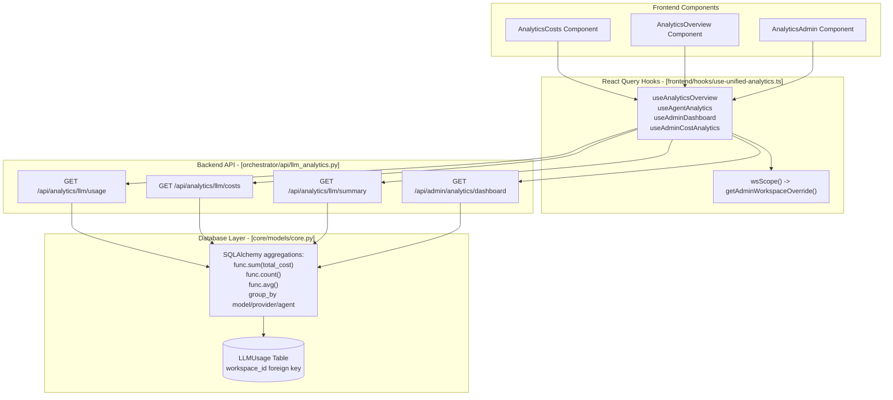
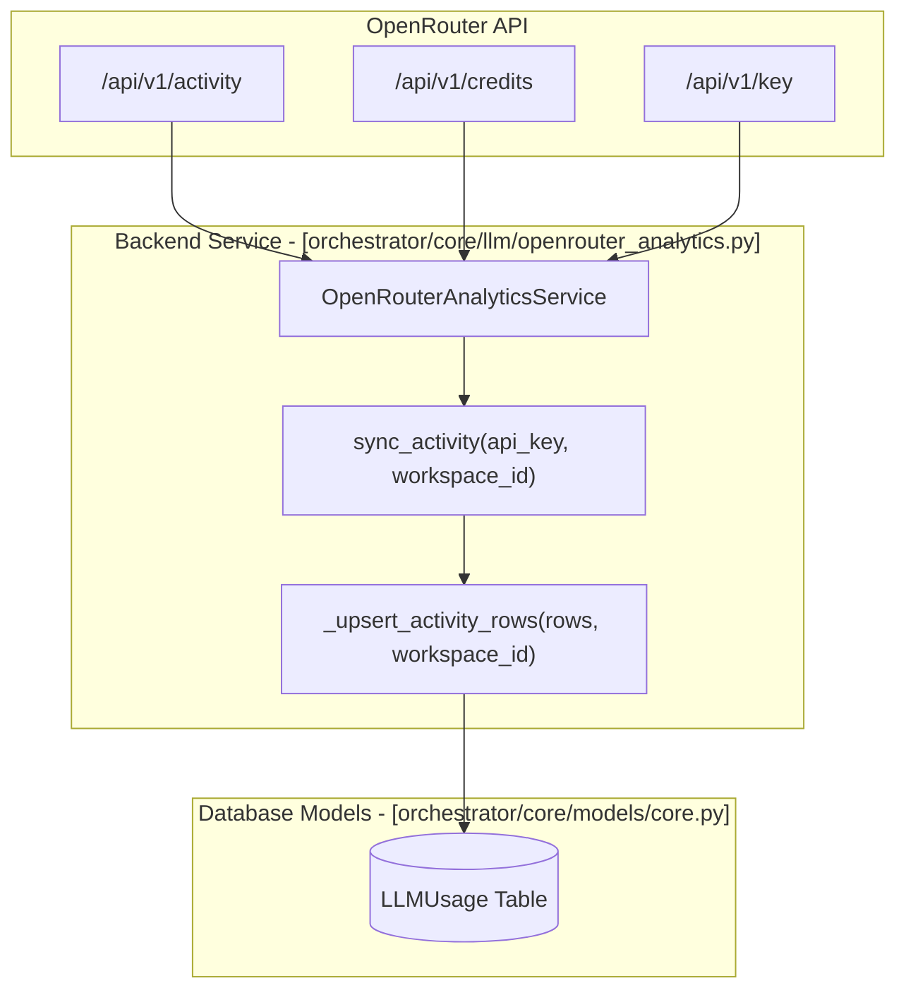

# Cost Analytics

<details>
<summary>Relevant source files</summary>

The following files were used as context for generating this wiki page:

- [docs/PRDS/52-UNIFIED-ANALYTICS.md](docs/PRDS/52-UNIFIED-ANALYTICS.md)
- [frontend/app/analytics/page.tsx](frontend/app/analytics/page.tsx)
- [frontend/components/analytics/analytics-admin.tsx](frontend/components/analytics/analytics-admin.tsx)
- [frontend/components/analytics/analytics-agents.tsx](frontend/components/analytics/analytics-agents.tsx)
- [frontend/components/analytics/analytics-composio.tsx](frontend/components/analytics/analytics-composio.tsx)
- [frontend/components/analytics/analytics-documents.tsx](frontend/components/analytics/analytics-documents.tsx)
- [frontend/components/analytics/analytics-memory.tsx](frontend/components/analytics/analytics-memory.tsx)
- [frontend/components/analytics/analytics-openrouter-credits.tsx](frontend/components/analytics/analytics-openrouter-credits.tsx)
- [frontend/components/analytics/analytics-overview.tsx](frontend/components/analytics/analytics-overview.tsx)
- [frontend/components/analytics/analytics-pandas-chart.tsx](frontend/components/analytics/analytics-pandas-chart.tsx)
- [frontend/components/analytics/analytics-plan-usage.tsx](frontend/components/analytics/analytics-plan-usage.tsx)
- [frontend/components/analytics/analytics-recommendations.tsx](frontend/components/analytics/analytics-recommendations.tsx)
- [frontend/components/analytics/analytics-workflows.tsx](frontend/components/analytics/analytics-workflows.tsx)
- [frontend/components/context/context-engineering.tsx](frontend/components/context/context-engineering.tsx)
- [frontend/components/dashboard/widgets/system-health-widget.tsx](frontend/components/dashboard/widgets/system-health-widget.tsx)
- [frontend/components/knowledge/QueryTemplatesGrid.tsx](frontend/components/knowledge/QueryTemplatesGrid.tsx)
- [frontend/components/team/team-management.tsx](frontend/components/team/team-management.tsx)
- [frontend/hooks/use-unified-analytics.ts](frontend/hooks/use-unified-analytics.ts)
- [frontend/tsconfig.tsbuildinfo](frontend/tsconfig.tsbuildinfo)
- [orchestrator/api/llm_analytics.py](orchestrator/api/llm_analytics.py)
- [orchestrator/core/llm/openrouter_analytics.py](orchestrator/core/llm/openrouter_analytics.py)

</details>


This document covers the **cost analytics subsystem** that tracks, analyzes, and visualizes LLM API costs across the platform. Cost analytics provides workspace-level cost breakdowns by model, provider, agent, and time period, along with projections, optimization recommendations, and OpenRouter integration for credit tracking.

---

## Cost Tracking Data Model

All LLM API calls are logged to the `LLMUsage` table with cost attribution. Each row captures:

| Field | Type | Description |
|-------|------|-------------|
| `workspace_id` | UUID | Workspace scope for multi-tenancy |
| `agent_id` | Integer | Optional agent that initiated the request |
| `model_id` | String | Model identifier (e.g., `openai/gpt-4o`) |
| `provider` | String | Provider name (`openai`, `anthropic`, `openrouter`) |
| `tier` | String | Model tier (`fast`, `smart`, `aggregator`) |
| `input_tokens` | Integer | Prompt tokens consumed |
| `output_tokens` | Integer | Completion tokens generated |
| `total_tokens` | Integer | Sum of input + output |
| `input_cost` | Float | Cost for input tokens |
| `output_cost` | Float | Cost for output tokens |
| `total_cost` | Float | Sum of input + output costs |
| `is_byok` | Boolean | True if user provided their own API key |
| `latency_ms` | Float | Request duration |
| `status` | String | `success` or `error` |
| `created_at` | Timestamp | When the request occurred |

Sources: `[orchestrator/api/llm_analytics.py:21-21]()`, `[orchestrator/api/llm_analytics.py:100-107]()`, `[orchestrator/core/llm/openrouter_analytics.py:118-136]()`

---

## Cost Analytics Architecture

### Frontend to Backend Flow

The analytics dashboard utilizes a series of React Query hooks defined in `use-unified-analytics.ts` to fetch aggregated data from the FastAPI backend. It employs a workspace-scoping function `wsScope()` to ensure data isolation between tenants.

Title: Cost Analytics Data Flow


Sources: `[frontend/hooks/use-unified-analytics.ts:12-43]()`, `[orchestrator/api/llm_analytics.py:28-29]()`, `[frontend/components/analytics/analytics-overview.tsx:33-36]()`, `[frontend/components/analytics/analytics-admin.tsx:168-170]()`

---

## Cost Breakdown Queries

### Usage by Dimension

The `get_usage` endpoint in `llm_analytics.py` aggregates tokens and costs by a specified dimension using SQLAlchemy's `group_by`.

```python
# Available grouping dimensions in orchestrator/api/llm_analytics.py
group_col_map = {
    "model": LLMUsage.model_id,
    "provider": LLMUsage.provider,
    "agent": LLMUsage.agent_id,
    "tier": LLMUsage.tier,
    "is_byok": LLMUsage.is_byok,
    "request_type": LLMUsage.request_type,
}
```

Response schema is defined by the `UsageGroup` Pydantic model:
- `key`: The dimension value (e.g., model name)
- `request_count`: Total API calls
- `total_tokens`: Sum of input + output
- `total_cost`: Total cost in USD

Sources: `[orchestrator/api/llm_analytics.py:34-41]()`, `[orchestrator/api/llm_analytics.py:87-138]()`

---

### Summary Endpoint

The `get_summary` function provides dashboard-level aggregates, including top models and cost trends. It calculates an `error_rate` by filtering for rows where `LLMUsage.status == "error"`.

Title: Summary Aggregation Logic


Sources: `[orchestrator/api/llm_analytics.py:194-261]()`

---

## OpenRouter Integration

The platform includes deep integration with OpenRouter for credit management and activity synchronization.

### Activity Sync Pipeline
The `OpenRouterAnalyticsService` fetches usage data from OpenRouter's `/activity` endpoint and upserts it into the local `LLMUsage` table. This is deduplicated by checking for existing rows with the same `workspace_id`, `model_id`, and `created_at` timestamp.

Title: OpenRouter Sync Architecture


Sources: `[orchestrator/core/llm/openrouter_analytics.py:27-148]()`, `[orchestrator/core/llm/openrouter_analytics.py:154-180]()`, `[orchestrator/core/llm/openrouter_analytics.py:185-191]()`

---

## Frontend Implementation

### Agent-Specific Cost Breakdown
The `AnalyticsAgents` component provides an expanded panel for each agent, displaying total requests, average tokens per request, total tokens, and total cost. This data is derived from the `useAgentAnalytics` hook, which merges data from `apiClient.getAgents()` and `apiClient.getSystemAgentStatistics()`.

Sources: `[frontend/components/analytics/analytics-agents.tsx:103-133]()`, `[frontend/hooks/use-unified-analytics.ts:120-143]()`

### Admin Analytics
For platform administrators, the `AnalyticsAdmin` component provides a cross-workspace view of total platform cost and plan distribution. It utilizes `useAdminDashboard` and `useAdminCostAnalytics` to fetch global data and supports sorting by cost, requests, or agent count.

Sources: `[frontend/components/analytics/analytics-admin.tsx:164-205]()`, `[frontend/hooks/use-unified-analytics.ts:42-42]()`, `[frontend/components/analytics/analytics-admin.tsx:173-178]()`

### Recommendations
The `AnalyticsRecommendations` component displays AI-driven insights such as "cost_optimization" or "quota_warning" based on usage patterns. These recommendations are fetched via the `useRecommendations` hook and can be dismissed by the user.

Sources: `[frontend/components/analytics/analytics-recommendations.tsx:18-37]()`, `[frontend/components/analytics/analytics-recommendations.tsx:74-123]()`, `[orchestrator/api/llm_analytics.py:61-67]()`

### AI Chart Generation (Pandas Chart)
The `AnalyticsPandasChart` component allows for dynamic visualization of analytics data. It uses a query-based system (resolved via `useChartPresets`) and a mutation hook `useAnalyticsChart` to generate chart images (base64) and natural language summaries from the backend.

Sources: `[frontend/components/analytics/analytics-pandas-chart.tsx:15-39]()`, `[frontend/components/analytics/analytics-pandas-chart.tsx:121-140]()`

---