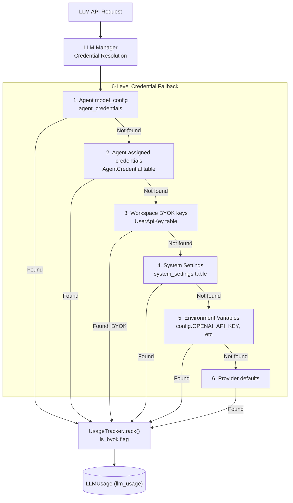
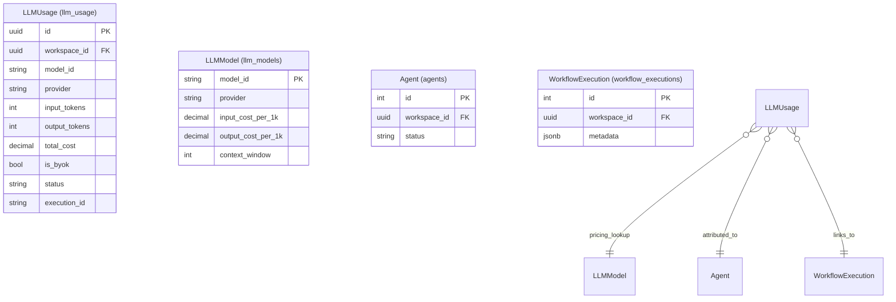

# LLM Usage Tracking

<details>
<summary>Relevant source files</summary>

The following files were used as context for generating this wiki page:

- [frontend/components/analytics/analytics-composio.tsx](frontend/components/analytics/analytics-composio.tsx)
- [frontend/components/analytics/analytics-openrouter-credits.tsx](frontend/components/analytics/analytics-openrouter-credits.tsx)
- [frontend/components/analytics/analytics-pandas-chart.tsx](frontend/components/analytics/analytics-pandas-chart.tsx)
- [frontend/components/context/context-engineering.tsx](frontend/components/context/context-engineering.tsx)
- [frontend/components/dashboard/widgets/system-health-widget.tsx](frontend/components/dashboard/widgets/system-health-widget.tsx)
- [frontend/components/knowledge/QueryTemplatesGrid.tsx](frontend/components/knowledge/QueryTemplatesGrid.tsx)
- [frontend/components/team/team-management.tsx](frontend/components/team/team-management.tsx)
- [frontend/lib/api-config.ts](frontend/lib/api-config.ts)
- [orchestrator/api/analytics.py](orchestrator/api/analytics.py)
- [orchestrator/api/analytics_real.py](orchestrator/api/analytics_real.py)
- [orchestrator/api/execution_history.py](orchestrator/api/execution_history.py)
- [orchestrator/api/llm_analytics.py](orchestrator/api/llm_analytics.py)
- [orchestrator/api/workflow_history.py](orchestrator/api/workflow_history.py)
- [orchestrator/consumers/workflows/__init__.py](orchestrator/consumers/workflows/__init__.py)
- [orchestrator/core/llm/openrouter_analytics.py](orchestrator/core/llm/openrouter_analytics.py)

</details>


## Purpose and Scope

This document describes the LLM usage tracking system that records every LLM API call for cost calculation, analytics, and optimization. The system captures token counts, latency, model information, and calculates costs based on a model pricing registry. Usage data is workspace-scoped and powers the analytics dashboard.

The tracking system integrates with multiple LLM providers (OpenAI, Anthropic, OpenRouter, Google, Azure OpenAI, xAI, Cohere, DeepSeek) and supports both platform-provided keys and user-provided BYOK (Bring Your Own Key) credentials. All tracked usage is attributed to workspaces and optionally to specific agents or workflow executions.

**Key Capabilities:**
- Per-request token and cost tracking for all LLM providers [orchestrator/api/llm_analytics.py:87-138]().
- Workspace-scoped analytics with admin override for platform-wide views [orchestrator/api/llm_analytics.py:739-820]().
- Cost projections and optimization recommendations [orchestrator/api/llm_analytics.py:490-602]().
- BYOK vs platform key usage differentiation [orchestrator/api/llm_analytics.py:105-108]().
- Error rate and latency monitoring [orchestrator/api/llm_analytics.py:210-221]().
- Real-time and cached aggregate statistics [orchestrator/api/analytics_real.py:53-110]().

**Sources:** [orchestrator/api/llm_analytics.py:1-68](), [orchestrator/api/analytics_real.py:1-50]().

---

## LLM Provider Configuration

Before usage can be tracked, LLM providers must be configured with API keys. The system supports multiple credential resolution strategies.

### Configuration Hierarchy



### Provider Resolution Logic

The system determines available providers by checking both BYOK keys and the centralized credential store.

```python
# Logic from orchestrator/api/llm_analytics.py:604-630
# Helper to check if a workspace has specific provider keys
@router.get("/providers/available")
async def get_available_providers(
    ctx: RequestContext = Depends(get_request_context_hybrid),
    db: Session = Depends(get_db)
):
    # Checks UserApiKey table for the current workspace_id
    keys = db.query(UserApiKey).filter(
        UserApiKey.workspace_id == ctx.workspace_id,
        UserApiKey.is_active == True
    ).all()
    return [k.provider for k in keys]
```

**Sources:** [orchestrator/api/llm_analytics.py:604-630](), [orchestrator/api/llm_analytics.py:21-25]().

---

## Database Schema

The usage tracking system uses three primary database constructs.

| Table/Field | Purpose | Key Columns |
|------------|---------|-------------|
| `llm_usage` | Records individual LLM API calls | `workspace_id`, `model_id`, `provider`, `input_tokens`, `output_tokens`, `input_cost`, `output_cost`, `total_cost`, `latency_ms`, `agent_id`, `is_byok`, `status` [orchestrator/api/llm_analytics.py:100-108]() |
| `llm_models` | Model pricing registry | `model_id`, `provider`, `input_cost_per_1k_tokens`, `output_cost_per_1k_tokens`, `context_window`, `tier` [orchestrator/api/llm_analytics.py:21-23]() |
| `AgentStatistics` | Cached per-agent aggregates | `total_tokens_used`, `total_cost`, `execution_count` [orchestrator/api/analytics_real.py:18-20]() |

### Entity Relationship Diagram



**Sources:** [orchestrator/api/llm_analytics.py:21-24](), [orchestrator/api/analytics_real.py:16-23](), [orchestrator/api/execution_history.py:19-21]().

---

## Dual-Source Strategy (llm_usage vs Agent Stats)

The system employs a dual-source strategy to ensure analytics remain accurate even if granular tracking is partially disabled or during migration.

1.  **Primary Source (`llm_usage`)**: Provides the most accurate, time-series data including input/output breakdown and BYOK status [orchestrator/api/llm_analytics.py:87-138]().
2.  **Fallback/Historical Source (`WorkflowExecution.metadata`)**: Legacy workflows store analytics in a JSONB metadata field [orchestrator/api/analytics.py:105-110]().
3.  **Real-time Aggregates (`OrchestrationRun`)**: Modern Mission/Orchestration runs store token usage directly on the run record [orchestrator/api/analytics.py:112-117]().

```python
# Combined cost calculation from orchestrator/api/analytics.py:101-117
total_cost = 0
total_tokens = 0
for exec_row in recent_wf_executions:
    analytics_data = exec_row.metadata.get("analytics", {})
    total_cost += analytics_data.get("total_cost", 0)
    total_tokens += analytics_data.get("total_tokens_used", 0)

# Add mission token usage
m_tokens = db.query(func.sum(OrchestrationRun.tokens_used)).filter(...).scalar() or 0
total_tokens += m_tokens
```

**Sources:** [orchestrator/api/analytics.py:94-118](), [orchestrator/api/analytics_real.py:59-74]().

---

## Cost Breakdown and Analytics

### Analytics API

The `/api/analytics/llm` router provides comprehensive endpoints for cost and usage analysis.

-   **Usage Grouping**: `/usage` allows grouping by `model`, `provider`, `agent`, `tier`, or `is_byok` [orchestrator/api/llm_analytics.py:100-108]().
-   **Cost Breakdown**: `/costs` provides cost distribution by dimension or daily trends [orchestrator/api/llm_analytics.py:154-164]().
-   **Dashboard Summary**: `/summary` returns high-level metrics like total cost, error rates, and top models [orchestrator/api/llm_analytics.py:210-221]().

### Success Rate & Performance

Success rates are calculated by combining legacy workflow statuses and modern Mission/Orchestration run states [orchestrator/api/analytics_real.py:59-74]().

```python
# orchestrator/api/analytics_real.py:72-74
total_executions = wf_total + m_total
successful = wf_success + m_success
success_rate = (successful / total_executions * 100) if total_executions > 0 else 0
```

**Sources:** [orchestrator/api/llm_analytics.py:141-191](), [orchestrator/api/analytics_real.py:53-110]().

---

## OpenRouter Sync Strategy

For OpenRouter, the system can synchronize usage data directly from the provider's API via the `OpenRouterAnalyticsService` [orchestrator/core/llm/openrouter_analytics.py:27](). This is particularly useful for BYOK users to see their external consumption within the Automatos dashboard.

1.  **Activity Sync**: The `sync_activity` function fetches usage rows from OpenRouter's `/api/v1/activity` endpoint and upserts them into the local `llm_usage` table [orchestrator/core/llm/openrouter_analytics.py:44-58]().
2.  **Deduplication**: Rows are deduped by `workspace_id`, `model_id`, and `created_at` date to prevent double-counting [orchestrator/core/llm/openrouter_analytics.py:97-109]().
3.  **Credits & Key Info**: The service also tracks account credit balances and key limits [orchestrator/core/llm/openrouter_analytics.py:154-191]().

```python
# orchestrator/core/llm/openrouter_analytics.py:118-136
usage_row = LLMUsage(
    workspace_id=workspace_id,
    model_id=model_id,
    provider="openrouter",
    request_type="activity_sync",
    input_tokens=prompt_tokens,
    output_tokens=completion_tokens,
    total_tokens=total_tokens,
    total_cost=cost,
    is_byok=is_byok,
    status="success",
    execution_id=f"openrouter_sync_{model_id}_{date_str}",
    created_at=row_date,
)
```

**Sources:** [orchestrator/core/llm/openrouter_analytics.py:1-148](), [orchestrator/api/llm_analytics.py:633-660]().

---

## UI Implementation

The frontend utilizes a suite of specialized components to visualize usage and costs.

-   **AnalyticsOpenRouterCredits**: Displays remaining balance and usage breakdown for OpenRouter keys [frontend/components/analytics/analytics-openrouter-credits.tsx:97-144]().
-   **AnalyticsPandasChart**: Generates dynamic charts from usage data using natural language queries and AI-driven summarization [frontend/components/analytics/analytics-pandas-chart.tsx:112-151]().
-   **ContextEngineering Dashboard**: Monitors retrieval success rates and latency for RAG-based context assembly [frontend/components/context/context-engineering.tsx:86-115]().

### Analytics Hooks

The frontend uses specialized hooks from `use-unified-analytics` to fetch data with automatic workspace scoping [frontend/components/analytics/analytics-composio.tsx:28-36]().

```typescript
// Example usage in frontend/components/analytics/analytics-composio.tsx:96-100
const { data: execStats, isLoading: execStatsLoading } = useComposioExecStats(days)
const { data: perfByAction, isLoading: perfLoading } = useComposioPerformance(days)
const { data: dailyVolume } = useComposioDailyVolume(days)
```

**Sources:** [frontend/components/analytics/analytics-openrouter-credits.tsx:34-185](), [frontend/components/analytics/analytics-pandas-chart.tsx:1-151](), [frontend/components/context/context-engineering.tsx:1-180]().

---