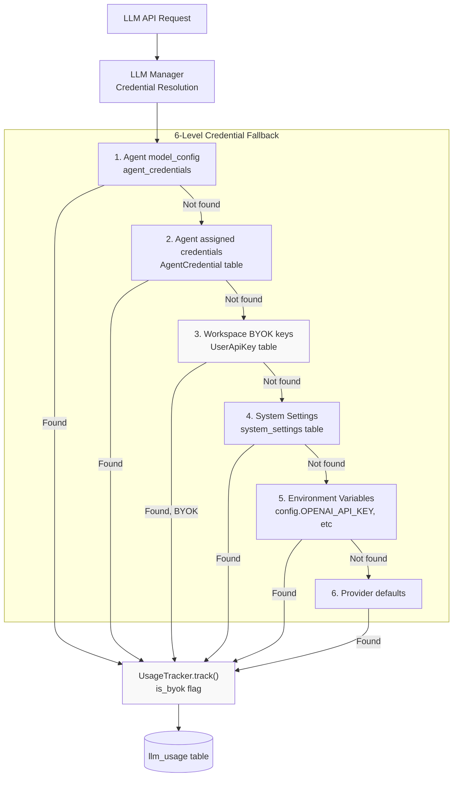
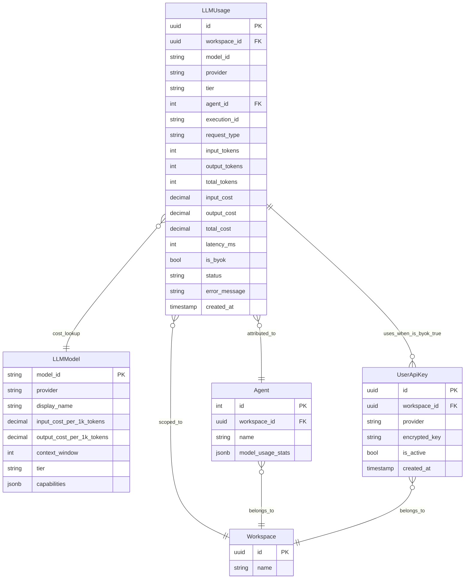
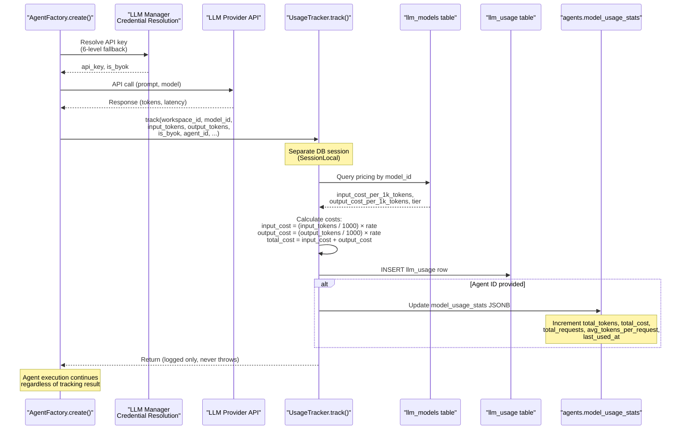
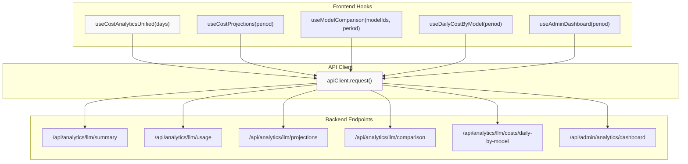
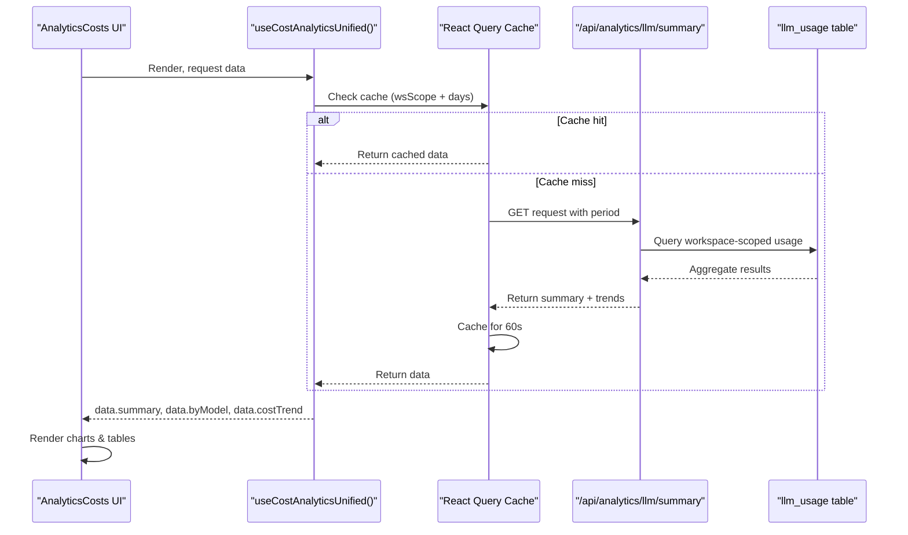

# LLM Usage Tracking

<details>
<summary>Relevant source files</summary>

The following files were used as context for generating this wiki page:

- [frontend/app/admin/plugins/page.tsx](frontend/app/admin/plugins/page.tsx)
- [frontend/lib/api-client.ts](frontend/lib/api-client.ts)
- [orchestrator/.env.example](orchestrator/.env.example)
- [orchestrator/api/agent_plugins.py](orchestrator/api/agent_plugins.py)
- [orchestrator/config.py](orchestrator/config.py)
- [orchestrator/core/database/load_seed_data.py](orchestrator/core/database/load_seed_data.py)
- [orchestrator/core/seeds/seed_personas.py](orchestrator/core/seeds/seed_personas.py)
- [orchestrator/core/seeds/seed_plugin_categories.py](orchestrator/core/seeds/seed_plugin_categories.py)
- [orchestrator/core/services/plugin_cache.py](orchestrator/core/services/plugin_cache.py)
- [orchestrator/main.py](orchestrator/main.py)
- [scripts/ralph/prd.json](scripts/ralph/prd.json)

</details>


## Purpose and Scope

This document describes the LLM usage tracking system that records every LLM API call for cost calculation, analytics, and optimization. The system captures token counts, latency, model information, and calculates costs based on a model pricing registry. Usage data is workspace-scoped and powers the analytics dashboard.

The tracking system integrates with multiple LLM providers (OpenAI, Anthropic, OpenRouter, Google, Azure OpenAI, xAI, Cohere) and supports both platform-provided keys and user-provided BYOK (Bring Your Own Key) credentials. All tracked usage is attributed to workspaces and optionally to specific agents or workflow executions.

**Key Capabilities:**
- Per-request token and cost tracking for all LLM providers
- Workspace-scoped analytics with admin override for platform-wide views
- Cost projections and optimization recommendations
- BYOK vs platform key usage differentiation
- Error rate and latency monitoring
- Real-time and cached aggregate statistics

**Sources:** [orchestrator/core/llm/usage_tracker.py:1-150](), [orchestrator/api/llm_analytics.py:1-50](), [orchestrator/config.py:103-137]()

---

## LLM Provider Configuration

Before usage can be tracked, LLM providers must be configured with API keys. The system supports multiple credential resolution strategies:

### Configuration Hierarchy



### Supported Providers

| Provider | Config Key | Environment Variable | Notes |
|----------|-----------|---------------------|-------|
| OpenAI | `OPENAI_API_KEY` | `OPENAI_API_KEY` | Primary provider, supports GPT models |
| Anthropic | `ANTHROPIC_API_KEY` | `ANTHROPIC_API_KEY` | Claude models |
| OpenRouter | `OPENROUTER_API_KEY` | `OPENROUTER_API_KEY` | Multi-model router |
| Google | `GOOGLE_API_KEY` | `GOOGLE_API_KEY` or `GEMINI_API_KEY` | Gemini models |
| Azure OpenAI | `AZURE_OPENAI_API_KEY` | `AZURE_OPENAI_API_KEY` + `AZURE_OPENAI_ENDPOINT` | Enterprise deployments |
| xAI | `XAI_API_KEY` | `XAI_API_KEY` | Grok models |
| Cohere | `COHERE_API_KEY` | `COHERE_API_KEY` | Reranking and embeddings |

### Configuration Class Structure

The `Config` class provides centralized access to all LLM provider credentials:

```python
# orchestrator/config.py:103-137
class Config:
    # LLM Provider API Keys
    OPENAI_API_KEY: str = os.getenv("OPENAI_API_KEY")
    ANTHROPIC_API_KEY: str = os.getenv("ANTHROPIC_API_KEY")
    OPENROUTER_API_KEY: str = os.getenv("OPENROUTER_API_KEY")
    GOOGLE_API_KEY: str = os.getenv("GOOGLE_API_KEY") or os.getenv("GEMINI_API_KEY")
    AZURE_OPENAI_API_KEY: str = os.getenv("AZURE_OPENAI_API_KEY")
    AZURE_OPENAI_ENDPOINT: str = os.getenv("AZURE_OPENAI_ENDPOINT")
    AZURE_OPENAI_API_VERSION: str = os.getenv("AZURE_OPENAI_API_VERSION", "2024-02-15-preview")
    XAI_API_KEY: str = os.getenv("XAI_API_KEY")
    COHERE_API_KEY: str = os.getenv("COHERE_API_KEY")
    
    # Dynamic LLM settings loaded from database
    @property
    def LLM_PROVIDER(self) -> str:
        from core.llm.manager import get_system_setting
        return get_system_setting("orchestrator_llm", "provider", os.getenv("LLM_PROVIDER"))
    
    @property
    def LLM_MODEL(self) -> str:
        from core.llm.manager import get_system_setting
        return get_system_setting("orchestrator_llm", "model", os.getenv("LLM_MODEL"))
```

**Key Points:**
- Configuration values are loaded from environment variables at startup
- LLM provider and model can be overridden in database `system_settings` table
- No hardcoded defaults for provider/model — must be explicitly configured
- `config` is a singleton instance available throughout the application

**Sources:** [orchestrator/config.py:103-137](), [orchestrator/.env.example:18-26]()

---

## Database Schema

The usage tracking system uses three primary database constructs:

| Table/Field | Purpose | Key Columns |
|------------|---------|-------------|
| `llm_usage` | Records individual LLM API calls | `workspace_id`, `model_id`, `provider`, `input_tokens`, `output_tokens`, `input_cost`, `output_cost`, `total_cost`, `latency_ms`, `agent_id`, `execution_id`, `request_type`, `tier`, `is_byok`, `status`, `created_at` |
| `llm_models` | Model pricing registry | `model_id`, `provider`, `input_cost_per_1k_tokens`, `output_cost_per_1k_tokens`, `context_window`, `tier`, `capabilities` |
| `agents.model_usage_stats` | Cached per-agent aggregates (JSONB) | `total_tokens`, `total_cost`, `total_requests`, `avg_tokens_per_request`, `last_used_at`, `input_tokens`, `output_tokens` |

### LLMUsage Table Structure



**Key Relationships:**
- `LLMUsage.workspace_id → Workspace.id`: Multi-tenant isolation
- `LLMUsage.agent_id → Agent.id`: Attribution to specific agents
- `LLMUsage.model_id → LLMModel.model_id`: Cost lookup in pricing registry
- `LLMUsage.is_byok = true → UserApiKey`: Indicates workspace-provided credentials were used
- `Agent.model_usage_stats`: Cached JSONB aggregate of usage per agent

**Sources:** [orchestrator/core/models/core.py:200-250](), [orchestrator/api/llm_analytics.py:30-60](), [orchestrator/api/agents.py:230-240]()

---

## Usage Tracking Flow

### Recording a Usage Event

Every LLM API call is tracked through the `UsageTracker.track()` static method. The tracker runs in a separate database session to ensure tracking failures never break the parent transaction.



**Critical Design Decisions:**
1. **Separate session**: `UsageTracker` creates its own `SessionLocal()` to isolate tracking from parent transaction
2. **Never throws**: All exceptions are caught and logged; tracking failures never break agent execution
3. **BYOK flag**: Captures whether user-provided (BYOK) or platform credentials were used
4. **Dual aggregation**: Writes granular `llm_usage` row + updates cached `agent.model_usage_stats` JSONB

**Sources:** [orchestrator/core/llm/usage_tracker.py:17-95]()

---

## Cost Calculation

### Pricing Model

Costs are calculated using a per-1000-token pricing model stored in the `llm_models` registry:

```
input_cost = (input_tokens / 1000.0) × model.input_cost_per_1k_tokens
output_cost = (output_tokens / 1000.0) × model.output_cost_per_1k_tokens
total_cost = input_cost + output_cost
```

### UsageTracker.track() Method

The tracking method accepts these parameters:

| Parameter | Type | Purpose |
|-----------|------|---------|
| `workspace_id` | UUID | Multi-tenant scoping |
| `model_id` | str | Model identifier (e.g., "gpt-4o", "claude-3-5-sonnet-20241022") |
| `provider` | str | Provider name ("openai", "anthropic", "openrouter", "google", "azure", "xai", "cohere") |
| `input_tokens` | int | Prompt token count |
| `output_tokens` | int | Completion token count |
| `agent_id` | int? | Optional agent attribution |
| `execution_id` | str? | Optional workflow/recipe execution ID for traceability |
| `request_type` | str | "chat", "completion", "embedding" (default: "chat") |
| `latency_ms` | int? | Response time in milliseconds (for performance monitoring) |
| `status` | str | "success" or "error" (default: "success") |
| `is_byok` | bool | Whether user-provided API key was used (default: False) |
| `tier` | str | Model tier ("premium", "standard", "fast") or routing tier ("direct", "tier1", "tier2") |
| `error_message` | str? | Error details if status="error" |

**Implementation:**

```python
# orchestrator/core/llm/usage_tracker.py:36-95
def track(workspace_id, model_id, provider, input_tokens, output_tokens, 
          agent_id=None, execution_id=None, request_type="chat",
          latency_ms=None, status="success", is_byok=False, 
          tier=None, error_message=None):
    try:
        db = SessionLocal()  # Separate session
        try:
            # 1. Lookup model pricing from registry
            model_row = db.query(LLMModel).filter(
                LLMModel.model_id == model_id,
                LLMModel.provider == provider
            ).first()
            
            if not model_row:
                logger.warning("Model %s not in pricing registry", model_id)
                # Use fallback pricing or skip cost calculation
            
            # 2. Calculate costs
            input_cost = (input_tokens / 1000.0) * model_row.input_cost_per_1k_tokens
            output_cost = (output_tokens / 1000.0) * model_row.output_cost_per_1k_tokens
            total_cost = input_cost + output_cost
            
            # 3. Insert llm_usage row
            usage = LLMUsage(
                workspace_id=workspace_id,
                model_id=model_id,
                provider=provider,
                agent_id=agent_id,
                execution_id=execution_id,
                request_type=request_type,
                input_tokens=input_tokens,
                output_tokens=output_tokens,
                total_tokens=input_tokens + output_tokens,
                input_cost=input_cost,
                output_cost=output_cost,
                total_cost=total_cost,
                latency_ms=latency_ms,
                is_byok=is_byok,
                tier=tier or model_row.tier,
                status=status,
                error_message=error_message
            )
            db.add(usage)
            
            # 4. Update agent cached stats (if agent_id provided)
            if agent_id:
                agent = db.query(Agent).filter(Agent.id == agent_id).first()
                if agent:
                    stats = agent.model_usage_stats or {}
                    stats['total_tokens'] = stats.get('total_tokens', 0) + total_tokens
                    stats['total_cost'] = stats.get('total_cost', 0) + total_cost
                    stats['total_requests'] = stats.get('total_requests', 0) + 1
                    stats['input_tokens'] = stats.get('input_tokens', 0) + input_tokens
                    stats['output_tokens'] = stats.get('output_tokens', 0) + output_tokens
                    stats['last_used_at'] = datetime.utcnow().isoformat()
                    agent.model_usage_stats = stats
            
            db.commit()
            
        except Exception as e:
            db.rollback()
            logger.error("Failed to record usage: %s", e)
        finally:
            db.close()
    except Exception as e:
        # Outer catch ensures we never raise to caller
        logger.error("Usage tracker session creation failed: %s", e)
```

**Sources:** [orchestrator/core/llm/usage_tracker.py:20-95]()

---

## API Endpoints

### Query Endpoints

The `/api/analytics/llm` router provides endpoints for querying usage data:

```mermaid
graph TB
    subgraph "LLM Analytics API"
        Usage["/api/analytics/llm/usage<br/>GET ?period=7d&group_by=model"]
        Costs["/api/analytics/llm/costs<br/>GET ?period=7d&breakdown=model"]
        Summary["/api/analytics/llm/summary<br/>GET ?period=30d"]
        Recs["/api/analytics/llm/recommendations<br/>GET"]
        Comp["/api/analytics/llm/comparison<br/>GET ?model_ids=x,y&period=30d"]
        Proj["/api/analytics/llm/projections<br/>GET ?period=30d"]
        Daily["/api/analytics/llm/costs/daily-by-model<br/>GET ?period=30d"]
    end
    
    subgraph "Data Sources"
        LLMUsageTable[(llm_usage table)]
        LLMModelTable[(llm_models table)]
        AgentTable[(agents.model_usage_stats)]
    end
    
    Usage --> LLMUsageTable
    Costs --> LLMUsageTable
    Summary --> LLMUsageTable
    Recs --> LLMUsageTable
    Recs --> AgentTable
    Comp --> LLMUsageTable
    Comp --> LLMModelTable
    Proj --> LLMUsageTable
    Daily --> LLMUsageTable
    
    subgraph "Response Models"
        UsageGroup["UsageGroup<br/>key, request_count, tokens, cost"]
        CostBreakdown["CostBreakdown<br/>key, input_cost, output_cost, total_cost"]
        UsageSummary["UsageSummary<br/>totals, top_models, cost_trend"]
        Recommendation["Recommendation<br/>type, title, savings, agent_ids"]
        ModelComparisonItem["ModelComparisonItem<br/>model_id, provider, costs, latency, error_rate"]
        CostProjectionResponse["CostProjectionResponse<br/>current, daily_avg, projected_monthly"]
    end
    
    Usage --> UsageGroup
    Costs --> CostBreakdown
    Summary --> UsageSummary
    Recs --> Recommendation
    Comp --> ModelComparisonItem
    Proj --> CostProjectionResponse
```



### Endpoint Details

#### GET /api/analytics/llm/usage

Groups usage data by dimension (model, provider, agent, tier, is_byok).

**Query Parameters:**
- `period`: "1h" | "24h" | "7d" | "30d" | "90d"
- `group_by`: "model" | "provider" | "agent" | "tier" | "is_byok" | "request_type"

**Response:** `List[UsageGroup]`

```json
[
  {
    "key": "gpt-4o",
    "request_count": 1234,
    "input_tokens": 456789,
    "output_tokens": 123456,
    "total_tokens": 580245,
    "total_cost": 12.45
  }
]
```

#### GET /api/analytics/llm/summary

Dashboard summary with totals, top models, and daily cost trend.

**Response:** `UsageSummary`

```json
{
  "total_requests": 5432,
  "total_tokens": 2345678,
  "total_cost": 87.65,
  "avg_latency_ms": 1234.5,
  "error_rate": 0.0023,
  "top_models": [
    {"model_id": "gpt-4o", "total_cost": 45.23, "request_count": 2345}
  ],
  "cost_trend": [
    {"date": "2025-01-15", "cost": 3.45}
  ]
}
```

#### GET /api/analytics/llm/recommendations

AI-generated cost optimization suggestions based on usage patterns.

**Logic:**
- Identifies agents using premium models (gpt-4o, claude-3-opus) for simple tasks (avg output < 200 tokens)
- Suggests switching to cheaper models (gpt-4o-mini, claude-haiku)
- Calculates potential savings (~85% reduction)

**Response:** `List[Recommendation]`

```json
[
  {
    "type": "cost_optimization",
    "title": "Switch Agent 42 to a cheaper model",
    "description": "Agent 42 used gpt-4o for 150 requests with avg 95 output tokens. Consider gpt-4o-mini...",
    "potential_savings": 38.50,
    "affected_agent_ids": [42]
  }
]
```

**Sources:** [orchestrator/api/llm_analytics.py:87-320]()

---

## Workspace Scoping and Admin Override

### Standard Workspace Filtering

All analytics queries are automatically filtered by `workspace_id` from the `RequestContext`:

```python
# orchestrator/api/llm_analytics.py:110-125
base = db.query(LLMUsage).filter(
    LLMUsage.workspace_id == ctx.workspace_id,
    LLMUsage.created_at >= since,
)
```

### Admin Override Mechanism

Admins can view platform-wide analytics using the `__all__` workspace sentinel:

```mermaid
graph LR
    Frontend["Frontend<br/>AdminWorkspaceSwitcher"]
    Header["X-Workspace-ID: __all__"]
    Auth["get_request_context_hybrid()"]
    Context["RequestContext<br/>admin_all_workspaces=True"]
    Endpoint["Admin Endpoint<br/>/api/admin/analytics/dashboard"]
    Query["SQL Query<br/>NO workspace filter"]
    
    Frontend -->|Set header| Header
    Header --> Auth
    Auth -->|Admin check| Context
    Context --> Endpoint
    Endpoint -->|Skip workspace_id filter| Query
    
    style Context fill:#f9f9f9
    style Query fill:#f9f9f9
```



**Frontend Implementation:**

The `AdminWorkspaceSwitcher` component allows admins to switch between workspaces:

```typescript
// frontend/components/analytics/admin-workspace-switcher.tsx:20-35
const handleChange = (value: string) => {
  if (value === '__all__') {
    setAdminWorkspaceOverride('__all__')
    onWorkspaceChange?.('All Workspaces')
  }
  queryClient.invalidateQueries({ queryKey: ['unified-analytics'] })
}
```

**Backend Implementation:**

```python
# orchestrator/core/auth/hybrid.py:334-354
if admin_all_workspaces and is_admin:
    # Resolve admin's own workspace for UserContext
    admin_home_ws = _resolve_workspace_for_clerk_user(...)
    # Return workspace_id but set admin_all_workspaces=True
    return RequestContext(
        workspace_id=admin_home_ws,
        user=user,
        auth_type="clerk",
        admin_all_workspaces=True
    )
```

**Admin Endpoints:**

```python
# orchestrator/api/llm_analytics.py:780-820
@admin_router.get("/dashboard", response_model=AdminDashboardData)
async def admin_dashboard(period: str, ctx: RequestContext, db: Session):
    _assert_admin(ctx, db)
    # Queries omit workspace_id filter when admin_all_workspaces=True
    query = db.query(LLMUsage).filter(
        LLMUsage.created_at >= since
        # NO workspace filter
    )
```

**Sources:** [orchestrator/core/auth/hybrid.py:310-354](), [orchestrator/api/llm_analytics.py:739-820](), [frontend/components/analytics/admin-workspace-switcher.tsx:1-64]()

---

## Frontend Integration

### React Query Hooks

The `use-unified-analytics.ts` hook provides typed access to LLM usage data:



### Cache Key Strategy

Query keys include workspace scope to prevent data leakage when admin switches workspaces:

```typescript
// frontend/hooks/use-unified-analytics.ts:11-38
function wsScope() {
  return getAdminWorkspaceOverride() || 'own'
}

export const unifiedAnalyticsKeys = {
  costs: (days: number) => ['unified-analytics', wsScope(), 'costs', days],
  projections: (period: string) => ['unified-analytics', wsScope(), 'llm', 'projections', period],
  modelComparison: (modelIds: string[], period: string) => 
    ['unified-analytics', wsScope(), 'llm', 'comparison', modelIds, period],
  adminDashboard: (period: string) => ['unified-analytics', wsScope(), 'admin', 'dashboard', period],
}
```

### Cost Analytics UI Component

The `AnalyticsCosts` component displays token usage, costs, and trends:

**Key Features:**
- Hero stats (total cost, tokens, cost per request, top spender)
- Multi-line stacked area chart showing daily cost by model
- Cost projections with monthly estimates
- Model comparison radar chart
- Per-agent cost breakdown table

```typescript
// frontend/components/analytics/analytics-costs.tsx:141-244
export function AnalyticsCosts({ days }: Props) {
  const { data, isLoading } = useCostAnalyticsUnified(days)
  const [chartPeriod, setChartPeriod] = useState('30d')
  const { data: dailyByModel } = useDailyCostByModel(chartPeriod)
  
  // Hero stats from data.summary
  // Multi-line chart from dailyByModel.series
  // Model breakdown table from data.byModel
  // Per-agent table from data.byAgent
}
```

**Data Flow:**



**Sources:** [frontend/hooks/use-unified-analytics.ts:288-396](), [frontend/components/analytics/analytics-costs.tsx:1-700]()

---

## Dual Aggregation Strategy

The system maintains usage data in two locations for different query patterns:

### Real-Time Tracking (Primary)

**Table:** `llm_usage`
- Granular per-request records
- Queryable by date range, model, agent, workspace
- Supports time-series analytics and cost projections
- Ground truth for billing

### Cached Aggregates (Secondary)

**Field:** `agents.model_usage_stats` (JSONB)
- Pre-aggregated per-agent totals
- Updated on every tracked request
- Fast for agent list queries
- Used as fallback when `llm_usage` has no data

**Update Logic:**

```python
# orchestrator/core/llm/usage_tracker.py:67-95
if agent_id:
    agent = db.query(Agent).filter(Agent.id == agent_id).first()
    if agent:
        stats = agent.model_usage_stats or {}
        stats['total_tokens'] = stats.get('total_tokens', 0) + total_tokens
        stats['total_cost'] = stats.get('total_cost', 0) + total_cost
        stats['total_requests'] = stats.get('total_requests', 0) + 1
        stats['last_used_at'] = datetime.utcnow().isoformat()
        agent.model_usage_stats = stats
```

**Frontend Fallback:**

```typescript
// frontend/hooks/use-unified-analytics.ts:300-325
const llmCost = summary?.total_cost || 0
const agentCost = agentList.reduce((sum, a) => 
  sum + (a.model_usage_stats?.total_cost || 0), 0)

// Use llm_usage data when available, fallback to agent stats
const hasLlmData = llmTokens > 0 || llmCost > 0
const totalCost = hasLlmData ? llmCost : agentCost
```

**Sources:** [orchestrator/core/llm/usage_tracker.py:67-95](), [frontend/hooks/use-unified-analytics.ts:288-396](), [orchestrator/api/agents.py:230-240]()

---

## Cost Projection Algorithm

### Projection Calculation

Monthly cost projections account for sparse usage data by counting actual days with activity:

```python
# orchestrator/api/llm_analytics.py:515-525
days_with_data = db.query(
    func.count(func.distinct(func.date(LLMUsage.created_at)))
).filter(
    LLMUsage.workspace_id == ctx.workspace_id,
    LLMUsage.created_at >= since,
).scalar() or 0

daily_avg = current_cost / days_with_data if days_with_data > 0 else 0.0
projected_monthly = daily_avg * 30
```

**Why This Matters:**

Using `days_in_period` instead of `days_with_data` would underestimate costs:
- If a workspace only used LLM on 5 days out of a 30-day period
- `current_cost / 30 × 30 = current_cost` (incorrect)
- `current_cost / 5 × 30 = 6× current_cost` (correct)

### Projection Response

```json
{
  "current_period_cost": 12.45,
  "daily_average": 0.62,
  "projected_monthly": 18.75,
  "change_percent": 23.5,
  "projected_by_model": [
    {
      "key": "gpt-4o",
      "projected_monthly_cost": 15.20,
      "current_period_cost": 10.12
    }
  ],
  "projected_by_provider": [...]
}
```

**Sources:** [orchestrator/api/llm_analytics.py:490-602]()

---

## OpenRouter Integration

### Specialized Endpoints

The system includes dedicated endpoints for OpenRouter analytics:

| Endpoint | Purpose |
|----------|---------|
| `GET /api/analytics/llm/openrouter/credits` | Fetch account credits balance |
| `GET /api/analytics/llm/openrouter/key-info` | Query key limits, daily/weekly/monthly usage |
| `POST /api/analytics/llm/openrouter/sync` | Sync activity data into `llm_usage` table (BYOK only) |

### Key Resolution Strategy

```python
# orchestrator/api/llm_analytics.py:606-640
def _resolve_openrouter_key(workspace_id, db, byok_only=False):
    # Priority 1: Workspace BYOK key (user_api_keys table)
    row = db.query(UserApiKey).filter(
        UserApiKey.workspace_id == workspace_id,
        UserApiKey.provider == "openrouter",
        UserApiKey.is_active == True
    ).first()
    if row:
        return decrypt(row.encrypted_key)
    
    # Priority 2: Platform env key (only if not byok_only)
    if not byok_only:
        env_key = os.getenv("OPENROUTER_API_KEY")
        if env_key:
            return env_key
    
    raise HTTPException(404, "No OpenRouter API key configured")
```

**Sync Activity:**

The sync endpoint prevents cross-workspace data duplication by requiring BYOK keys:

```python
# orchestrator/api/llm_analytics.py:671-686
@router.post("/openrouter/sync")
async def sync_openrouter_activity(ctx: RequestContext, db: Session):
    # Only works with workspace BYOK keys
    api_key = _resolve_openrouter_key(ctx.workspace_id, db, byok_only=True)
    
    svc = OpenRouterAnalyticsService()
    result = await svc.sync_activity(api_key, ctx.workspace_id)
    return OpenRouterSyncResponse(**result)
```

**Sources:** [orchestrator/api/llm_analytics.py:604-737]()

---

## Error Handling and Isolation

### Separate Session Strategy

The `UsageTracker` uses a dedicated database session to ensure tracking failures never break the parent transaction:

```python
# orchestrator/core/llm/usage_tracker.py:42-95
try:
    db = SessionLocal()  # New session, independent of caller
    try:
        # Lookup model pricing
        # Calculate costs
        # Insert llm_usage row
        # Update agent stats
        db.commit()
    except Exception as e:
        db.rollback()
        logger.error("Failed to record usage: %s", e)
    finally:
        db.close()
except Exception as e:
    # Outer catch ensures we never raise to caller
    logger.error("Usage tracker session creation failed: %s", e)
```

### Status Field

The `status` field distinguishes successful vs. failed LLM calls:

- `status='success'`: LLM call completed, tokens counted
- `status='error'`: LLM call failed, tracked for error rate metrics

**Error Rate Calculation:**

```python
# orchestrator/api/llm_analytics.py:219-220
error_count = base.filter(LLMUsage.status == "error").count()
error_rate = error_count / total_requests if total_requests > 0 else 0.0
```

**Sources:** [orchestrator/core/llm/usage_tracker.py:36-95](), [orchestrator/api/llm_analytics.py:210-260]()

---