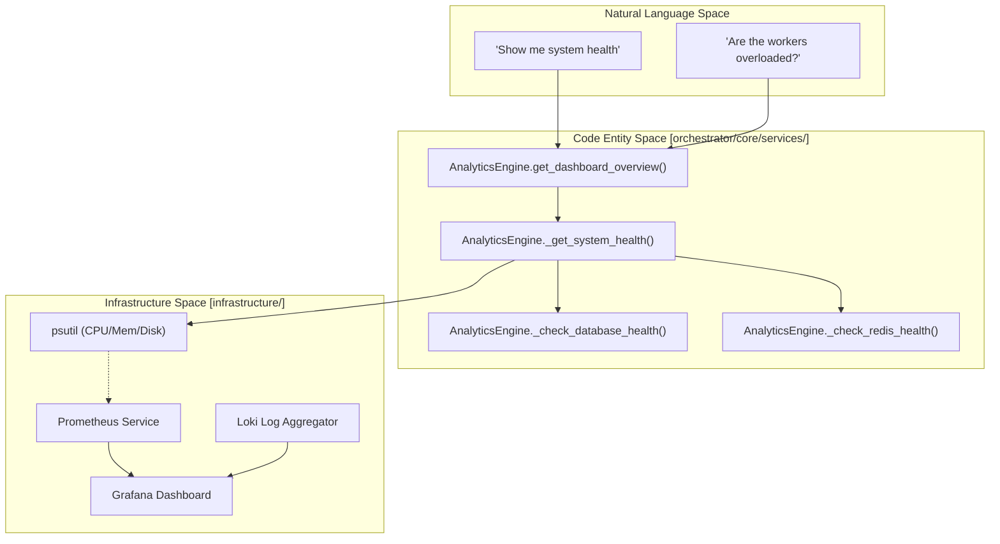
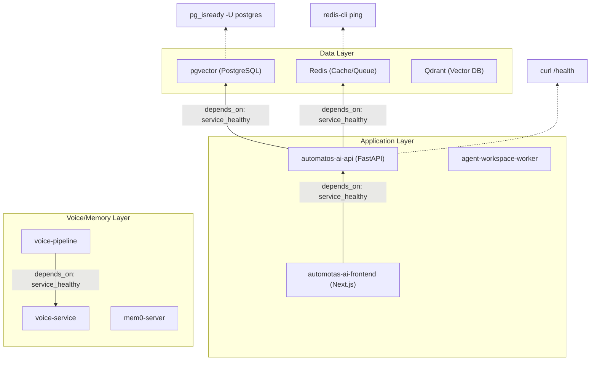

# System Health Monitoring

Relevant source files

The following files were used as context for generating this wiki page:

- [frontend/app/tools/page.tsx](frontend/app/tools/page.tsx)
- [frontend/components/layout/main-layout.tsx](frontend/components/layout/main-layout.tsx)
- [frontend/components/layout/mobile-sidebar.tsx](frontend/components/layout/mobile-sidebar.tsx)
- [frontend/components/layout/sidebar.tsx](frontend/components/layout/sidebar.tsx)
- [frontend/components/marketplace/marketplace-app-details-modal.tsx](frontend/components/marketplace/marketplace-app-details-modal.tsx)
- [frontend/components/tools/my-tools-dashboard.tsx](frontend/components/tools/my-tools-dashboard.tsx)
- [infrastructure/.env.example](infrastructure/.env.example)
- [infrastructure/docker-compose.core.yml](infrastructure/docker-compose.core.yml)
- [infrastructure/docker-compose.data.yml](infrastructure/docker-compose.data.yml)
- [infrastructure/docker-compose.landing.yml](infrastructure/docker-compose.landing.yml)
- [infrastructure/docker-compose.memory.yml](infrastructure/docker-compose.memory.yml)
- [infrastructure/docker-compose.monitoring.yml](infrastructure/docker-compose.monitoring.yml)
- [infrastructure/docker-compose.voice.yml](infrastructure/docker-compose.voice.yml)
- [infrastructure/docker-compose.yml](infrastructure/docker-compose.yml)
- [infrastructure/railway-manifest.json](infrastructure/railway-manifest.json)
- [orchestrator/alembic/versions/board_blocked_sla.py](orchestrator/alembic/versions/board_blocked_sla.py)
- [orchestrator/core/services/analytics_engine.py](orchestrator/core/services/analytics_engine.py)
- [orchestrator/core/services/monitoring_service.py](orchestrator/core/services/monitoring_service.py)

## Purpose and Scope

System Health Monitoring in Automatos AI provides real-time visibility into the operational status of the platform's distributed architecture. This subsystem manages component status tracking, hardware metrics aggregation, and provides the data foundation for the Prometheus/Grafana/Loki observability stack used in production. [orchestrator/core/services/analytics_engine.py:2-4]()

The monitoring infrastructure is integrated into the `AnalyticsEngine`, which calculates metrics for the frontend dashboard and ensures multi-tenant isolation through workspace-scoped queries. [orchestrator/core/services/analytics_engine.py:25-28]()

---

## Production Observability Stack

In production environments, Automatos AI employs a multi-layered observability stack defined in the infrastructure topology. [infrastructure/railway-manifest.json:30-34]()

### Component Topology

| Service | Role | Source/Image |
| :--- | :--- | :--- |
| **Prometheus** | Time-series metrics collection and storage | `prom/prometheus` [infrastructure/docker-compose.monitoring.yml:22-26]() |
| **Grafana** | Visualization, dashboards, and alerting UI | `grafana/grafana` [infrastructure/docker-compose.monitoring.yml:48-52]() |
| **Loki** | Log aggregation and indexing | `grafana/loki` [infrastructure/docker-compose.monitoring.yml:81-85]() |
| **Log-Relay** | Bridge for Railway log drains to Loki | Custom Service [infrastructure/docker-compose.monitoring.yml:106-110]() |
| **Exporters** | Postgres and Redis metric translation | `prometheuscommunity/postgres-exporter` [infrastructure/docker-compose.monitoring.yml:156-158]() |

### Data Flow: Natural Language to Code Entities

The following diagram bridges the user's request for "System Health" to the underlying code entities and infrastructure services.

**Sources:** [orchestrator/core/services/analytics_engine.py:47-53](), [orchestrator/core/services/analytics_engine.py:80-101](), [infrastructure/docker-compose.monitoring.yml:1-14]()

---

## Health Check Implementation

The `AnalyticsEngine` performs real-time validation of core dependencies. These checks are non-blocking and return a status of "healthy" or "unhealthy" based on active connectivity tests. [orchestrator/core/services/analytics_engine.py:89-92]()

### Core Health Functions

1.  **System Resource Monitoring**: Uses `psutil` to capture CPU percentage, virtual memory usage, and disk usage for the root partition. [orchestrator/core/services/analytics_engine.py:84-86]()
2.  **Database Connectivity**: Validates the SQLAlchemy session by attempting a lightweight query against the `Agent` or `SystemMetrics` tables. [orchestrator/core/services/analytics_engine.py:89-90]()
3.  **Redis Readiness**: Pings the centralized Redis client to ensure the task queue and cache layers are responsive. [orchestrator/core/services/analytics_engine.py:92-93]()

### Dashboard Metrics Mapping

The frontend `Dashboard` component maps to the following navigation item, providing administrators with high-level health insights. [frontend/components/layout/sidebar.tsx:109-115]()

| Metric | Code Source | Implementation |
| :--- | :--- | :--- |
| **CPU Usage** | `psutil.cpu_percent` | Captured with 1s interval [orchestrator/core/services/analytics_engine.py:84]() |
| **Memory Usage** | `psutil.virtual_memory().percent` | Real-time RAM utilization [orchestrator/core/services/analytics_engine.py:85]() |
| **Uptime** | `_get_system_uptime()` | Calculated from process start time [orchestrator/core/services/analytics_engine.py:100]() |

**Sources:** [orchestrator/core/services/analytics_engine.py:80-105](), [frontend/components/layout/sidebar.tsx:109-115]()

---

## Service Connectivity and Health Checks

The platform uses Docker Compose health checks to manage service orchestration and dependencies during deployment. [infrastructure/docker-compose.core.yml:118-123]()

### Dependency Graph and Health Validation

**Sources:** [infrastructure/docker-compose.core.yml:113-125](), [infrastructure/docker-compose.data.yml:38-43](), [infrastructure/docker-compose.data.yml:69-74](), [infrastructure/docker-compose.voice.yml:75-83]()

---

## Metrics Aggregation Logic

The `AnalyticsEngine` aggregates data from multiple sources to provide a unified health view. This includes legacy `WorkflowExecution` stats and the newer `OrchestrationRun` (Missions) metrics. [orchestrator/core/services/analytics_engine.py:131-152]()

### Success Rate Calculation
The system calculates a "Combined Success Rate" by merging legacy workflow executions with verified mission tasks:
*   **Total Executions**: `total_executions + total_mission_tasks` [orchestrator/core/services/analytics_engine.py:155]()
*   **Successful Executions**: `successful_executions + verified_mission_tasks` [orchestrator/core/services/analytics_engine.py:156]()
*   **Rate**: `round((combined_success / combined_total * 100), 2)` [orchestrator/core/services/analytics_engine.py:168]()

### Multi-Tenant Isolation
All health and performance metrics are filtered using the `wsScope` pattern in the frontend and `workspace_id` filters in the backend to ensure users only see health data relevant to their authorized environment. [frontend/components/layout/main-layout.tsx:29-42]()

**Sources:** [orchestrator/core/services/analytics_engine.py:128-174](), [frontend/components/layout/main-layout.tsx:29-49]()

---