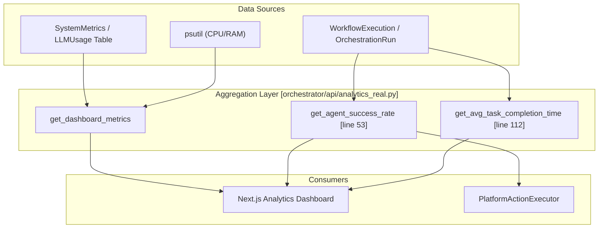
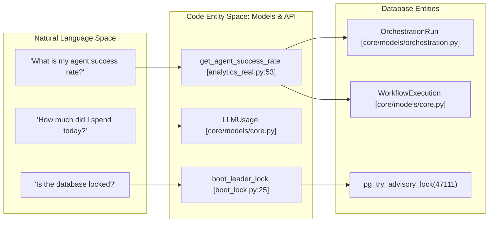

# System Health Monitoring

Relevant source files

The following files were used as context for generating this wiki page:

- [.env.example](.env.example)
- [frontend/components/agents/model-selector.tsx](frontend/components/agents/model-selector.tsx)
- [frontend/hooks/use-model-api.ts](frontend/hooks/use-model-api.ts)
- [orchestrator/api/agent_endpoints.py](orchestrator/api/agent_endpoints.py)
- [orchestrator/api/analytics.py](orchestrator/api/analytics.py)
- [orchestrator/api/analytics_real.py](orchestrator/api/analytics_real.py)
- [orchestrator/api/execution_history.py](orchestrator/api/execution_history.py)
- [orchestrator/api/workflow_history.py](orchestrator/api/workflow_history.py)
- [orchestrator/core/database/boot_lock.py](orchestrator/core/database/boot_lock.py)
- [railway.json](railway.json)

## Purpose and Scope

System Health Monitoring in Automatos AI provides real-time visibility into the operational status of all platform components, including agents, workflows, and infrastructure. The system tracks metrics ranging from hardware utilization to high-level agent success rates and LLM token costs. Monitoring is integrated into the core API via the `analytics` and `system` routers, supporting both automated dashboards and agent-initiated introspection. [orchestrator/api/analytics_real.py:32](), [orchestrator/api/analytics.py:25]()

---

## Health Monitoring Architecture

The monitoring architecture bridges internal state tracking with external observability providers. It is designed to provide visibility into three distinct layers:
1. **Component Health**: Status of PostgreSQL, Redis, and background workers. [orchestrator/core/database/boot_lock.py:11-21]()
2. **System Metrics**: Real-time hardware stats (CPU, Memory) and system load trends via `psutil`. [orchestrator/api/analytics_real.py:24-25](), [orchestrator/api/analytics_real.py:38]()
3. **Execution Performance**: Tracking success rates, completion times, and costs for both legacy Workflows and modern Missions. [orchestrator/api/analytics_real.py:53-75](), [orchestrator/api/analytics.py:77-123]()

### Monitoring Data Flow

The diagram below illustrates how health and performance data are aggregated from the database and system resources to serve the frontend and monitoring handlers.

**Sources:** [orchestrator/api/analytics_real.py:53-160](), [orchestrator/api/analytics.py:29-154](), [orchestrator/api/analytics_real.py:24-42]()

---

## Key Metrics and Performance Tracking

### Execution Success Rates
The system calculates success rates by performing a `UNION` query across legacy `WorkflowExecution` and modern `OrchestrationRun` (Missions) tables. [orchestrator/api/analytics_real.py:55-75](). It compares current performance against a 7-day trend to detect regressions. [orchestrator/api/analytics_real.py:77-97]()

### LLM Usage and Cost Monitoring
The platform tracks token consumption and financial costs per workspace. This data is aggregated from:
* **Workflow Metadata**: Analytics stored within the `metadata` JSONB field of `WorkflowExecution`. [orchestrator/api/analytics.py:105-109]()
* **Mission Usage**: The `tokens_used` field in the `OrchestrationRun` model. [orchestrator/api/analytics.py:112-117]()
* **LLMUsage Table**: Centralized tracking for all LLM provider calls. [orchestrator/api/analytics_real.py:20]()

### Resource Utilization
Hardware monitoring is performed via `psutil` to track system load trends and resource utilization efficiency. [orchestrator/api/analytics_real.py:38-41](). This data is exposed through the `DashboardMetrics` Pydantic model. [orchestrator/api/analytics_real.py:35-41]()

**Sources:** [orchestrator/api/analytics_real.py:53-110](), [orchestrator/api/analytics.py:77-123](), [orchestrator/api/analytics_real.py:35-41]()

---

## Health Check and Monitoring Endpoints

The API provides several endpoints for the frontend and external tools to verify system integrity.

| Endpoint | Function | Data Source |
|----------|----------|-------------|
| `/api/analytics/dashboard/success-rate` | Combined success % for workflows and missions. | `WorkflowExecution`, `OrchestrationRun` |
| `/api/analytics/dashboard/task-completion-time` | Average duration of completed tasks. | `extract('epoch', completed_at - started_at)` |
| `/api/analytics/dashboard/summary` | High-level overview of active agents, workflows, and costs. | Multi-table aggregation |
| `/api/execution-history/execution/{id}/stages` | 9-stage pipeline health for a specific run. | `WorkflowExecution.input_data` |

**Sources:** [orchestrator/api/analytics_real.py:53-112](), [orchestrator/api/analytics.py:29-35](), [orchestrator/api/execution_history.py:98-101]()

---

## Infrastructure Monitoring (Railway & Docker)

The system is designed for deployment on Railway, utilizing its native monitoring stack. [railway.json:1-12]().

### Service Health and Lifecycle
* **Bootstrap Guard**: To prevent race conditions during multi-worker startup, the system uses `pg_try_advisory_lock` (ID `47111`) to ensure only one worker runs database seeds. [orchestrator/core/database/boot_lock.py:21-40]()
* **Restart Policy**: The `railway.json` configuration defines an `ON_FAILURE` restart policy with a maximum of 10 retries to ensure service availability. [railway.json:8-11]()

### Natural Language to Code Entity Mapping

This diagram maps how user-facing analytics terms translate to specific backend models and functions.

**Sources:** [orchestrator/api/analytics_real.py:53-75](), [orchestrator/core/database/boot_lock.py:21-40](), [orchestrator/api/analytics.py:101-117]()

---

## Agent-Level Monitoring

Individual agents track their own performance metrics, which are surfaced via the factory API. [orchestrator/api/agent_endpoints.py:188-194]().
* **Learning State**: Agents can enter a `LEARNING` state during feedback processing, which is reflected in their lifecycle status. [orchestrator/api/agent_endpoints.py:161-169]()
* **Performance Metrics**: Real-time retrieval of agent-specific performance from the `agents.performance_metrics` database table. [orchestrator/api/agent_endpoints.py:201-205]()

**Sources:** [orchestrator/api/agent_endpoints.py:161-176](), [orchestrator/api/agent_endpoints.py:188-211]()

---