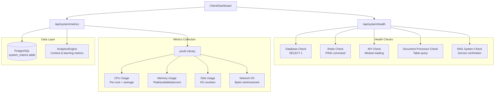
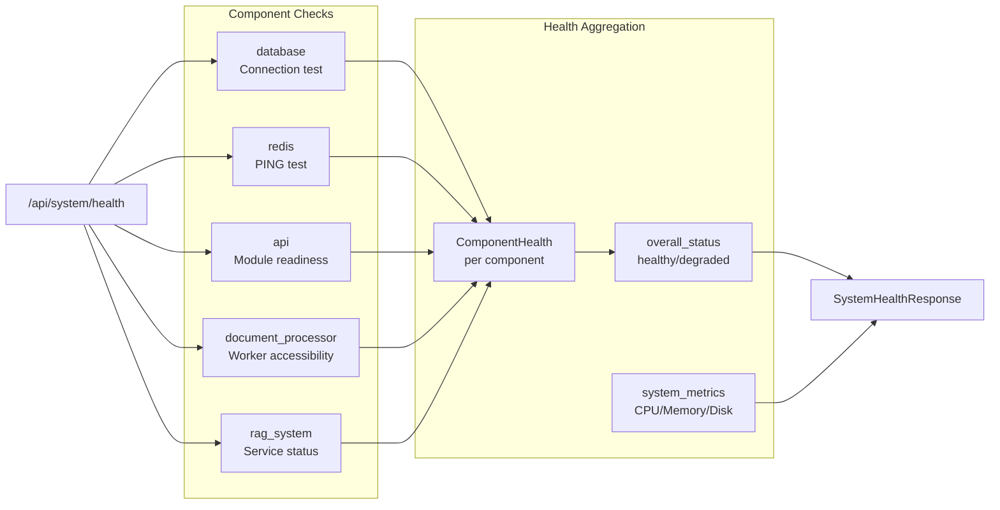
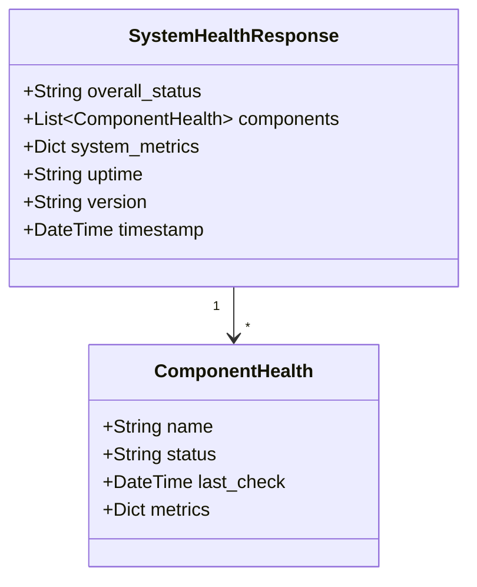
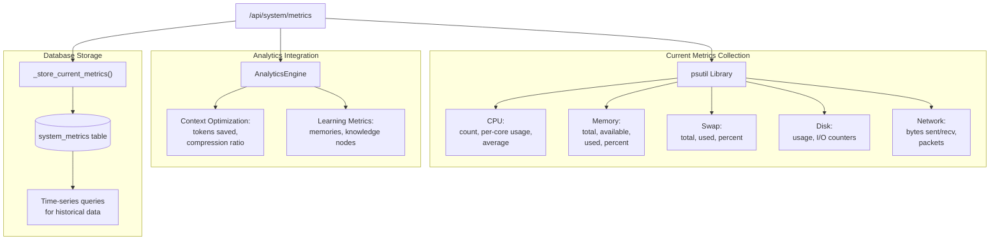
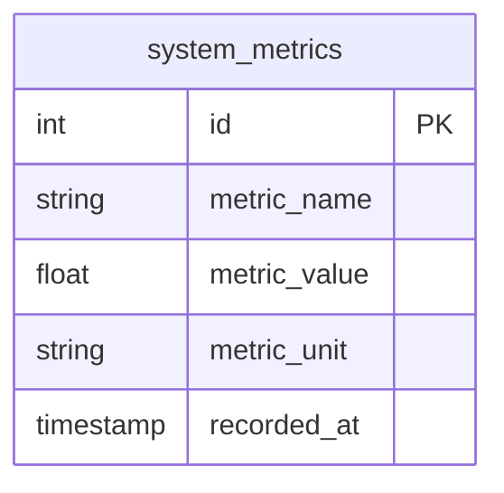
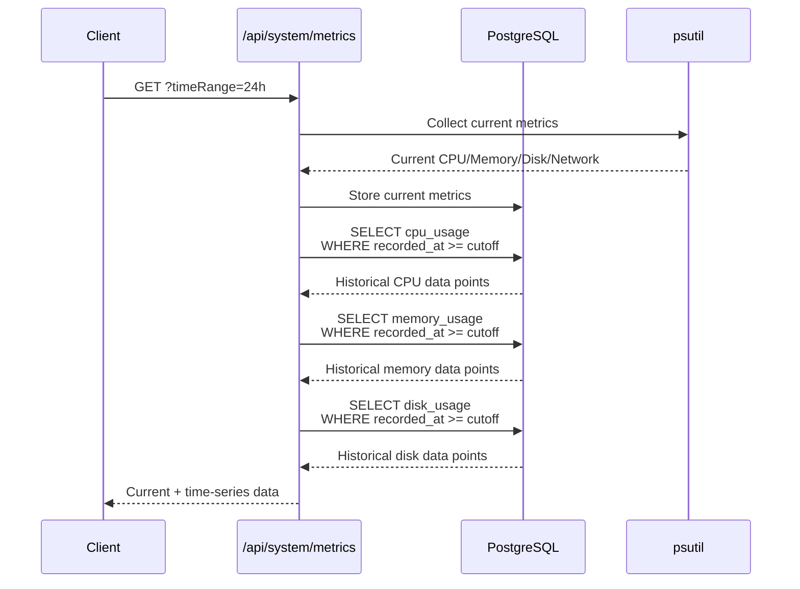
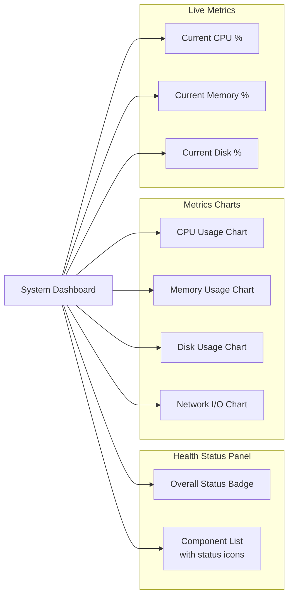
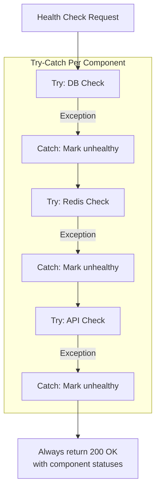
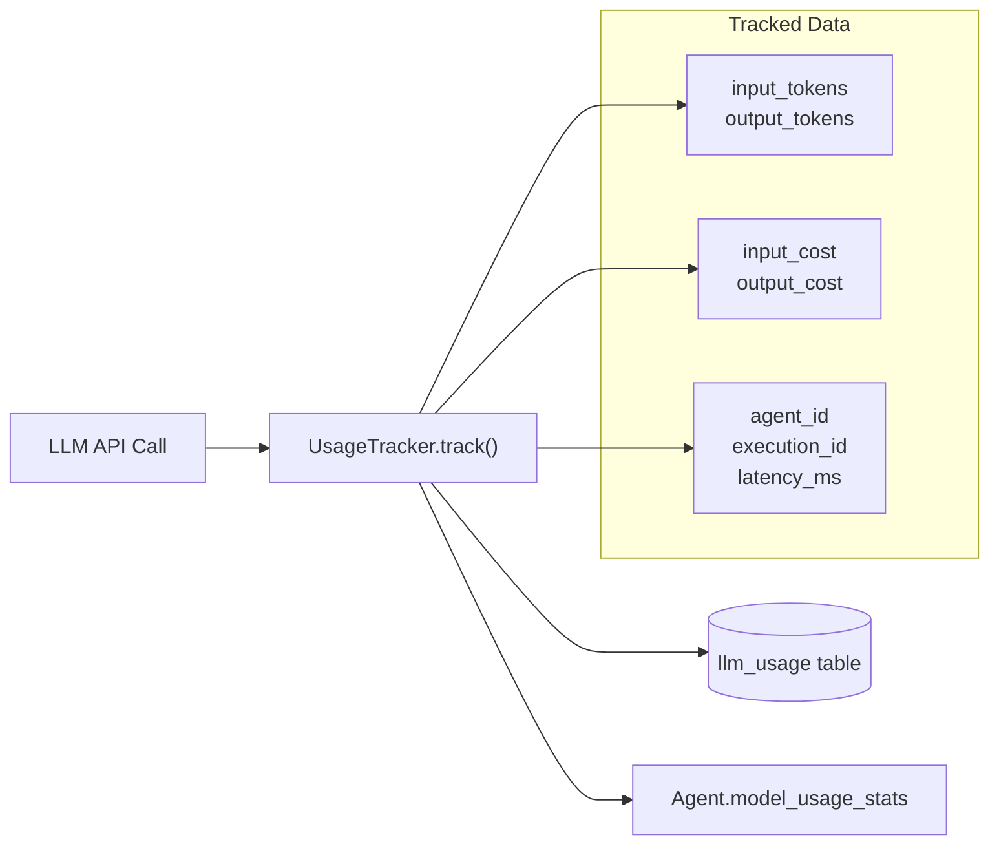

# System Health Monitoring

<details>
<summary>Relevant source files</summary>

The following files were used as context for generating this wiki page:

- [docker-compose.yml](docker-compose.yml)
- [frontend/.dockerignore](frontend/.dockerignore)
- [frontend/Dockerfile](frontend/Dockerfile)
- [orchestrator/Dockerfile](orchestrator/Dockerfile)
- [orchestrator/core/redis/client.py](orchestrator/core/redis/client.py)
- [orchestrator/requirements.txt](orchestrator/requirements.txt)

</details>


## Purpose and Scope

This document describes the system health monitoring infrastructure in Automatos AI, which provides real-time visibility into the operational status of all platform components. The system implements comprehensive health checks, system metrics collection, and time-series monitoring to ensure platform reliability and performance.

For information about analytics and usage tracking, see [Analytics & Monitoring](#10). For cost tracking and LLM usage analytics specifically, see [LLM Usage Tracking](#10.1).

---

## Health Monitoring Architecture

The health monitoring system performs two primary functions:
1. **Component Health Checks** - Verifies connectivity and operational status of critical services
2. **System Metrics Collection** - Collects and stores CPU, memory, disk, and network metrics

### High-Level Health Check Flow



**Sources:** [orchestrator/api/system.py:328-534]()

---

## Health Check Endpoint

### GET /api/system/health

Returns comprehensive health status for all platform components with individual component metrics.

**Response Model:** `SystemHealthResponse`



**Sources:** [orchestrator/api/system.py:328-534](), [orchestrator/core/models/enhanced.py:248-300]()

---

## Component Health Checks

Each component health check follows a consistent pattern with latency measurement and error capture.

### Database Health Check

Tests PostgreSQL connectivity with a simple query.

| Metric | Description |
|--------|-------------|
| **Status** | `healthy` if query succeeds, `unhealthy` on failure |
| **Check** | `SELECT 1` execution |
| **Metrics** | `connection: active` or `connection: failed` |

**Implementation:** [orchestrator/api/system.py:337-345]()

### Redis Health Check

Verifies Redis connectivity and measures ping latency.

| Metric | Description |
|--------|-------------|
| **Status** | `healthy` if PING returns true, `unhealthy` otherwise |
| **Check** | `redis_client.ping()` |
| **Metrics** | `ping: success/failed`, `latency_ms`, `connection: active/failed` |

```python
# Uses get_redis_client() from core.database.redis_client
# Measures round-trip time in milliseconds
```

**Implementation:** [orchestrator/api/system.py:347-371]()

### API Health Check

Verifies internal API readiness by loading core modules.

| Metric | Description |
|--------|-------------|
| **Status** | `healthy` if modules load, `unhealthy` on import failure |
| **Check** | Import `LLMManager` and `RAGService` |
| **Metrics** | `readiness: ready/not_ready`, `latency_ms`, `core_modules: loaded/failed` |

**Implementation:** [orchestrator/api/system.py:373-402]()

### Document Processor Health Check

Verifies document processing worker accessibility and database connectivity.

| Metric | Description |
|--------|-------------|
| **Status** | `healthy` if worker accessible, `unhealthy` on error |
| **Check** | Import `process_document`, access RAG service, query `Document` table |
| **Metrics** | `status: operational/error`, `documents_in_db`, `worker: accessible/unavailable` |

**Implementation:** [orchestrator/api/system.py:404-437]()

### RAG System Health Check

Verifies RAG system operational status and database connectivity.

| Metric | Description |
|--------|-------------|
| **Status** | `healthy` if service accessible, `unhealthy` on error |
| **Check** | Access RAG service, query `RAGConfiguration` and `document_chunks` tables |
| **Metrics** | `rag_configs`, `document_chunks`, `service: accessible/unavailable` |

**Implementation:** [orchestrator/api/system.py:439-475]()

---

## Component Health Model

The `ComponentHealth` model standardizes health information across all components.

### ComponentHealth Schema



| Field | Type | Description |
|-------|------|-------------|
| `name` | String | Component identifier (database, redis, api, etc.) |
| `status` | String | Health status: `healthy`, `degraded`, or `unhealthy` |
| `last_check` | DateTime | Timestamp of last health check |
| `metrics` | Dict | Component-specific metrics and diagnostic info |

**Sources:** [orchestrator/core/models/enhanced.py:248-268](), [orchestrator/api/system.py:478-510]()

---

## System Metrics Collection

The `/api/system/metrics` endpoint provides detailed system performance metrics with optional time-series history.

### GET /api/system/metrics

Returns current system metrics and optionally historical time-series data from the database.

**Query Parameters:**
- `timeRange` (optional): `1h`, `24h`, `7d`, or `30d` - Returns historical data from database

### Metrics Collection Architecture



**Sources:** [orchestrator/api/system.py:577-775]()

---

## Metrics Storage

The system stores metrics to the `system_metrics` table for historical analysis and trending.

### Storage Schema



### Stored Metrics

| Metric Name | Unit | Description |
|-------------|------|-------------|
| `cpu_usage` | percent | Average CPU usage across all cores |
| `memory_usage` | percent | Memory utilization percentage |
| `memory_available` | bytes | Available memory in bytes |
| `disk_usage` | percent | Disk usage percentage |
| `disk_read_bytes` | bytes | Cumulative bytes read from disk |
| `disk_write_bytes` | bytes | Cumulative bytes written to disk |
| `network_sent` | bytes | Cumulative bytes sent over network |
| `network_recv` | bytes | Cumulative bytes received over network |

### Storage Implementation

The `_store_current_metrics()` function collects and stores metrics asynchronously without blocking the response:

```python
# Executed on every metrics request
_store_current_metrics(db)

# Stores 8 different metrics per call
# Uses INSERT INTO system_metrics (metric_name, metric_value, metric_unit, recorded_at)
```

**Implementation:** [orchestrator/api/system.py:536-574]()

---

## Time-Series Data Retrieval

When the `timeRange` parameter is provided, the endpoint queries historical metrics from the database.

### Time-Series Query Flow



### Time Range Mapping

| Parameter | Hours | Description |
|-----------|-------|-------------|
| `1h` | 1 | Last hour of data |
| `24h` | 24 | Last 24 hours |
| `7d` | 168 | Last 7 days |
| `30d` | 720 | Last 30 days |

### Time-Series Response Format

```json
{
  "timestamp": "2024-08-09T10:00:00Z",
  "cpu": {
    "count": 8,
    "usage_percent": [12.5, 8.3, ...],
    "average_usage": 10.4
  },
  "cpu_usage": [
    {"time": "2024-08-09T09:00:00Z", "value": 8.2},
    {"time": "2024-08-09T09:30:00Z", "value": 12.5},
    ...
  ],
  "aggregated": {
    "cpu_average": 10.7,
    "memory_average": 62.3,
    "disk_average": 45.8
  }
}
```

**Implementation:** [orchestrator/api/system.py:675-769]()

---

## Analytics Integration

The metrics endpoint integrates with `AnalyticsEngine` to provide context optimization and learning metrics.

### Context Optimization Metrics

Tracks token savings from the RecipeScratchpad system:

| Metric | Description |
|--------|-------------|
| `tokens_saved` | Total tokens saved through context compression |
| `compression_ratio` | Average compression ratio (typically 0.1-0.2 for 80-90% savings) |
| `total_optimizations` | Number of optimization operations performed |
| `efficiency` | Overall efficiency score |

**Source:** [orchestrator/api/system.py:610-620]()

### Learning Metrics

Tracks memory and knowledge accumulation:

| Metric | Description |
|--------|-------------|
| `total_memories` | Total Mem0 memory items stored |
| `recent_memories` | Recent memory items (last 24h) |
| `knowledge_nodes` | Knowledge graph nodes |
| `active_collaborations` | Active agent collaborations |
| `memory_consolidations` | Memory consolidation operations |
| `avg_improvement` | Average improvement from learning |

**Source:** [orchestrator/api/system.py:622-642]()

---

## Frontend Integration

The health monitoring system is consumed by the frontend dashboard for real-time status visualization.

### React Query Integration

Frontend uses the `use-unified-analytics.ts` hook pattern for data fetching:

```typescript
// Health check endpoint
GET /api/system/health

// Metrics with time-series
GET /api/system/metrics?timeRange=24h
```

### Dashboard Visualization



**Sources:** Diagram 5 from high-level architecture

---

## Agent Status Monitoring

Individual agent health is tracked separately through agent-specific endpoints.

### GET /api/agents/{agent_id}/status

Returns operational status for a specific agent:

```json
{
  "agent_id": 123,
  "name": "Code Architect",
  "status": "active",
  "agent_type": "code_architect",
  "priority_level": "high",
  "max_concurrent_tasks": 5,
  "configuration": {...}
}
```

**Implementation:** [orchestrator/api/agents.py:481-505]()

### GET /api/agents/stats

Returns aggregated statistics across all agents in the workspace:

```json
{
  "total_agents": 15,
  "active_agents": 12,
  "inactive_agents": 3,
  "agents_by_type": {
    "code_architect": 3,
    "security_expert": 2,
    "data_analyst": 5
  }
}
```

**Implementation:** [orchestrator/api/agents.py:269-297]()

---

## Error Handling and Resilience

The health monitoring system is designed to never fail the application, following a defensive programming pattern.

### Fault Isolation



### Degraded State Detection

The overall system status is calculated based on component health:

| Condition | Overall Status |
|-----------|----------------|
| All components `healthy` | `healthy` |
| Any component `degraded` or `unhealthy` | `degraded` |
| Critical components failing | `unhealthy` (depends on component criticality) |

**Implementation:** [orchestrator/api/system.py:513]()

---

## Usage Tracking Integration

While not part of health monitoring directly, the `UsageTracker` provides complementary monitoring for LLM operations.

### LLM Call Tracking

Every LLM call is tracked for analytics:



**Note:** Usage tracking runs in a separate database session and never fails the parent transaction.

**Sources:** [orchestrator/core/llm/usage_tracker.py:17-116]()

---

## Best Practices

### For Platform Operators

1. **Monitor `/api/system/health` regularly** - Set up automated alerts when `overall_status` is not `healthy`
2. **Check component-specific metrics** - Each component provides diagnostic information in its `metrics` field
3. **Track time-series trends** - Use the `timeRange` parameter to identify gradual degradation
4. **Review error messages** - Component metrics include `error` field with failure details

### For Developers

1. **Add new components to health checks** - Follow the pattern in [orchestrator/api/system.py:328-534]()
2. **Use try-catch for isolation** - Each component check should catch exceptions independently
3. **Include diagnostic metrics** - Return actionable information in the `metrics` dict
4. **Measure latency** - Track check duration for performance monitoring

### For Frontend Developers

1. **Poll `/api/system/health` periodically** - Recommended: every 30-60 seconds
2. **Use `/api/system/metrics?timeRange=24h`** - For dashboard charts
3. **Cache metric queries** - Use React Query with appropriate stale times
4. **Handle degraded states gracefully** - Show warnings without blocking user actions

---

## Related Systems

- **Analytics Engine** - See [Analytics & Monitoring](#10) for overall analytics architecture
- **LLM Usage Tracking** - See [LLM Usage Tracking](#10.1) for detailed cost tracking
- **Agent Status** - See [Agent Lifecycle & Status](#3.6) for agent-specific health monitoring

**Sources:** [orchestrator/api/system.py:1-842](), [orchestrator/api/agents.py:269-297, 481-505](), [orchestrator/core/models/enhanced.py:248-300](), [orchestrator/core/llm/usage_tracker.py:1-116]()