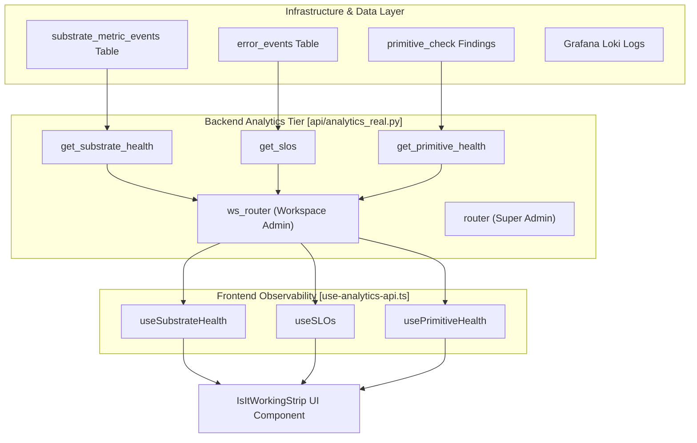
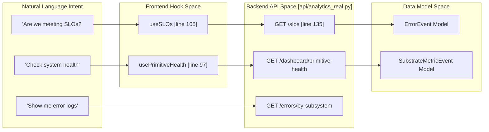
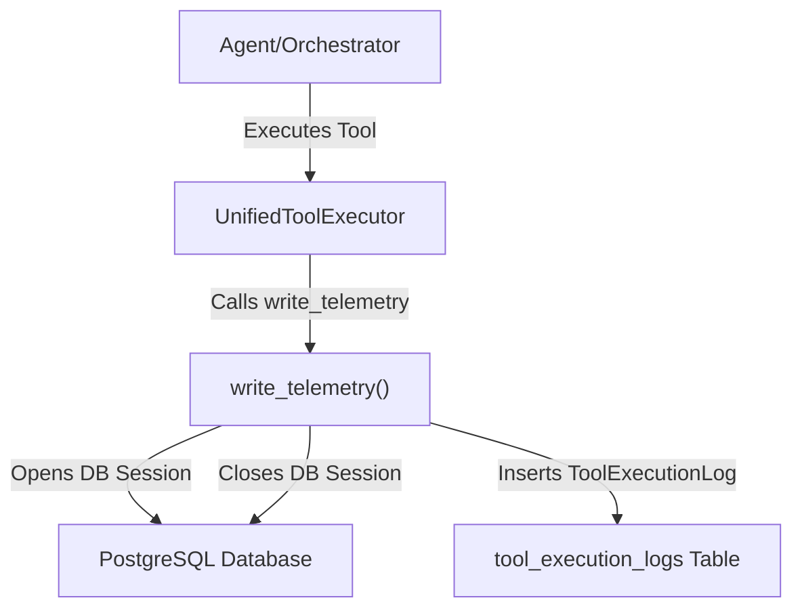

# System Health & Telemetry

Relevant source files

The following files were used as context for generating this wiki page:

- [frontend/components/__tests__/prd197-substrate-tile.test.tsx](frontend/components/__tests__/prd197-substrate-tile.test.tsx)
- [frontend/components/command-center/is-it-working-strip.tsx](frontend/components/command-center/is-it-working-strip.tsx)
- [frontend/hooks/use-analytics-api.ts](frontend/hooks/use-analytics-api.ts)
- [frontend/lib/api-client.ts](frontend/lib/api-client.ts)
- [orchestrator/alembic/versions/prd185_s1b_toollog_user_nullable.py](orchestrator/alembic/versions/prd185_s1b_toollog_user_nullable.py)
- [orchestrator/alembic/versions/prd200_s2_drop_checkpoint_count.py](orchestrator/alembic/versions/prd200_s2_drop_checkpoint_count.py)
- [orchestrator/alembic/versions/prd201_s1_message_context_trace.py](orchestrator/alembic/versions/prd201_s1_message_context_trace.py)
- [orchestrator/api/workflows.py](orchestrator/api/workflows.py)
- [orchestrator/config.py](orchestrator/config.py)
- [orchestrator/core/context_guard.py](orchestrator/core/context_guard.py)
- [orchestrator/core/llm/prompt_cache.py](orchestrator/core/llm/prompt_cache.py)
- [orchestrator/core/llm/request_scope.py](orchestrator/core/llm/request_scope.py)
- [orchestrator/core/models/substrate_metrics.py](orchestrator/core/models/substrate_metrics.py)
- [orchestrator/core/observability/substrate_metrics.py](orchestrator/core/observability/substrate_metrics.py)
- [orchestrator/core/observability/tracer.py](orchestrator/core/observability/tracer.py)
- [orchestrator/main.py](orchestrator/main.py)
- [orchestrator/modules/context/result.py](orchestrator/modules/context/result.py)
- [orchestrator/modules/context/sections/base.py](orchestrator/modules/context/sections/base.py)
- [orchestrator/modules/tools/execution/telemetry.py](orchestrator/modules/tools/execution/telemetry.py)
- [orchestrator/reports/route-manifest.json](orchestrator/reports/route-manifest.json)
- [orchestrator/router_manifest.py](orchestrator/router_manifest.py)
- [orchestrator/services/orchestration_state.py](orchestrator/services/orchestration_state.py)
- [orchestrator/tests/authz_sweep_probe.py](orchestrator/tests/authz_sweep_probe.py)
- [orchestrator/tests/test_context_guard.py](orchestrator/tests/test_context_guard.py)
- [orchestrator/tests/test_p2w0_telemetry_user_id.py](orchestrator/tests/test_p2w0_telemetry_user_id.py)
- [orchestrator/tests/test_p2w2_authz_boundary_sweep.py](orchestrator/tests/test_p2w2_authz_boundary_sweep.py)
- [orchestrator/tests/test_p2w3_checkpoints_deleted.py](orchestrator/tests/test_p2w3_checkpoints_deleted.py)
- [orchestrator/tests/test_prd139_telemetry.py](orchestrator/tests/test_prd139_telemetry.py)
- [orchestrator/tests/test_prd143_boundary_sweep.py](orchestrator/tests/test_prd143_boundary_sweep.py)
- [orchestrator/tests/test_prd143_concierge_journey.py](orchestrator/tests/test_prd143_concierge_journey.py)
- [orchestrator/tests/test_prd143_full_surface_positive.py](orchestrator/tests/test_prd143_full_surface_positive.py)
- [orchestrator/tests/test_prd143_selection_metric.py](orchestrator/tests/test_prd143_selection_metric.py)
- [orchestrator/tests/test_prd154_s5_missions.py](orchestrator/tests/test_prd154_s5_missions.py)
- [orchestrator/tests/test_prd177_composio_telemetry.py](orchestrator/tests/test_prd177_composio_telemetry.py)
- [orchestrator/tests/test_prd222_w2s1_plan_tiers.py](orchestrator/tests/test_prd222_w2s1_plan_tiers.py)
- [orchestrator/tests/test_telemetry_session_ownership.py](orchestrator/tests/test_telemetry_session_ownership.py)

## Purpose and Scope

System Health Monitoring in Automatos AI provides real-time visibility into the operational status of all platform components, from core infrastructure primitives to agent-level performance metrics. The system implements a multi-tiered observability stack that includes internal health checks, external infrastructure integration (Railway, Loki, Prometheus), and per-workspace Service Level Objectives (SLOs).

Monitoring data is surfaced through two primary channels:
1.  **Command Center Dashboard**: A real-time frontend visualization of system primitives and workspace health.
2.  **Platform Actions**: Agent-initiated introspection via `PlatformActionExecutor` for autonomous troubleshooting.

---

## Health Monitoring Architecture

The monitoring architecture bridges internal state tracking with external observability providers. It provides visibility into four distinct domains:

1.  **Primitive Health**: The status of the 8 canonical primitives: `chat`, `memory`, `rag`, `nl2sql`, `graph`, `missions`, `playbooks`, and `channels`. [orchestrator/tests/test_prd143_boundary_sweep.py:52-56]()
2.  **Retrieval Substrate Health**: Per-seam monitoring of the retrieval engine across `documents`, `memory`, and `field` seams. [orchestrator/core/models/substrate_metrics.py:32-34]()
3.  **Infrastructure Observability**: Integration with Railway service logs, Grafana Loki, and Prometheus metrics. [orchestrator/api/analytics_real.py:68-73]()
4.  **Workspace SLOs**: Workspace-specific Service Level Indicators (SLIs) including tool-call success rates and board-event freshness. [orchestrator/api/analytics_real.py:141-148]()

### System Monitoring Data Flow

The following diagram illustrates how health signals are aggregated from the database and infrastructure providers into the Command Center.

**Sources:** [orchestrator/api/analytics_real.py:41-55](), [orchestrator/core/models/substrate_metrics.py:1-14](), [frontend/hooks/use-analytics-api.ts:97-118](), [frontend/components/command-center/is-it-working-strip.tsx:51-112]()

---

## Retrieval Substrate Health

The system tracks "Substrate Health" to monitor the integrity of the RAG and memory retrieval layers. This is implemented via the `SubstrateMetricEvent` model, which records every search attempt. [orchestrator/core/models/substrate_metrics.py:22-30]()

### Metrics Tracked per Seam
*   **Status**: `hit`, `empty`, or `error`. [orchestrator/core/models/substrate_metrics.py:40-41]()
*   **Latency**: Recorded in milliseconds for P95 analysis. [orchestrator/core/models/substrate_metrics.py:44]()
*   **Candidates**: Number of vector matches returned. [orchestrator/core/models/substrate_metrics.py:43]()

The `DurableMemoryStore` (L3 memory) contributes to these metrics by providing a "loud" failure signal if the underlying Qdrant instance becomes unreachable, replacing silent skips with logged errors. [orchestrator/modules/memory/durable_store.py:7-10]()

**Sources:** [orchestrator/core/models/substrate_metrics.py:1-48](), [orchestrator/modules/memory/durable_store.py:1-20]()

---

## Service Level Objectives (SLOs)

Workspace-level health is monitored via three primary SLOs, accessible to workspace admins via the `/api/analytics/slos` endpoint. [orchestrator/api/analytics_real.py:135-149]()

| SLI Name | Description | Source |
| :--- | :--- | :--- |
| **Tool Success Rate** | Percentage of tool executions that do not result in system errors. | `error_events` |
| **Board Dispatch Latency** | P95 latency for task assignment and dispatch. | `orchestration_tasks` |
| **Event Freshness** | Time since the last successful board activity. | `orchestration_events` |

**Sources:** [orchestrator/api/analytics_real.py:141-157](), [frontend/lib/api-client.ts:94-110]()

---

## Natural Language to Code Entity Mapping

This diagram maps user monitoring intents to the specific code entities that handle them.

**Sources:** [frontend/hooks/use-analytics-api.ts:97-118](), [orchestrator/api/analytics_real.py:76-157](), [orchestrator/core/models/substrate_metrics.py:22-30]()

---

## Health Check Implementation

### Primitive Health Checks
The `primitive-health` endpoint ensures that all 8 canonical primitives are always returned, even if no data exists. A primitive with no recorded findings renders as `unknown` with a `null` timestamp, preventing "fake green" status reports. [orchestrator/tests/test_prd143_boundary_sweep.py:52-56](), [orchestrator/tests/test_prd143_full_surface_positive.py:136-140]()

### Workspace Isolation
All health monitoring endpoints are strictly workspace-scoped. The `get_request_context_hybrid` dependency ensures that a user in Workspace A cannot view primitive findings or substrate metrics for Workspace B. [orchestrator/tests/test_prd143_boundary_sweep.py:126-127](), [orchestrator/api/analytics_real.py:77-80]()

**Sources:** [orchestrator/tests/test_prd143_boundary_sweep.py:1-21](), [orchestrator/api/analytics_real.py:47-55]()

---

## Errors by Subsystem

The system provides an endpoint to retrieve error rates broken down by subsystem. This is crucial for identifying problematic areas within the platform.

The `ErrorsBySubsystemMetric` interface [frontend/lib/api-client.ts:53-57]() defines the structure of the data returned, including the time window for the aggregation, the total number of errors, and a breakdown of errors by subsystem with their respective counts and rates.

The `useErrorsBySubsystem` hook [frontend/hooks/use-analytics-api.ts:83-88]() in the frontend consumes this data, allowing the UI to display error trends and pinpoint areas requiring attention.

**Sources:**
* [frontend/lib/api-client.ts:53-57]()
* [frontend/hooks/use-analytics-api.ts:83-88]()

---

## Tool Execution Telemetry

Every tool execution within the Automatos AI platform is logged for telemetry purposes, providing a comprehensive audit trail and data for performance analysis and routing graph learning. This is handled by the `write_telemetry` function [orchestrator/modules/tools/execution/telemetry.py:89-99]().

### Data Flow for Tool Telemetry

**Key Aspects:**
*   **Non-blocking**: `write_telemetry` is designed to be fired-and-forgotten via `asyncio.create_task` [orchestrator/modules/tools/execution/telemetry.py:101-104](), ensuring that telemetry logging failures do not impact tool execution.
*   **Session Ownership**: The `write_telemetry` function owns its database session, preventing issues where a failed telemetry write could poison the caller's transaction [orchestrator/modules/tools/execution/telemetry.py:106-114]().
*   **Action Name Resolution**: For Composio tools, the actual action name (e.g., `SLACK_SEND_MESSAGE`) is resolved from the parameters, rather than logging the generic `composio_execute` [orchestrator/modules/tools/execution/telemetry.py:20-45](). This is critical for accurate routing graph learning.
*   **User ID Coercion**: It handles the coercion of `clerk_user_id` (string) to `users.id` (integer) for the `ToolExecutionLog.user_id` column, with caching to optimize performance [orchestrator/modules/tools/execution/telemetry.py:53-87]().
*   **Caller Context**: The `caller_context` dictionary provides additional information about the execution, such as `user_query`, `router_decision`, and `intent_cluster_id` [orchestrator/modules/tools/execution/telemetry.py:160-166]().

**Sources:**
* [orchestrator/modules/tools/execution/telemetry.py:1-383]()
* [orchestrator/tests/test_prd139_telemetry.py]()
* [orchestrator/tests/test_prd177_composio_telemetry.py]()
* [orchestrator/tests/test_telemetry_session_ownership.py]()
* [orchestrator/alembic/versions/prd185_s1b_toollog_user_nullable.py]()

---

## Tracer and Observability

The system incorporates tracing and observability features to provide deeper insights into execution flows, especially for complex operations like context assembly.

### Context Tracing
The `ContextService` includes a `trace_id` and `parent_span_id` in its `ContextResult` [orchestrator/modules/context/result.py:19-20](). This allows for linking context assembly operations to broader execution traces.

### Token Budget Estimation
The `ContextGuard` provides `estimate_turn_budget` [orchestrator/core/context_guard.py:119-145]() which estimates the token budget for a given turn, including input and output tokens. This is used for cost attribution and policy enforcement.

### Workflow Stage Tracking
The `WorkflowStageTracker` [orchestrator/api/workflows.py:38-70]() emits Server-Sent Events (SSE) for workflow phases and stages, providing real-time updates on the progress of a workflow. This includes both legacy 9-stage and dynamic PRD-59 phases.

**Sources:**
* [orchestrator/core/context_guard.py:119-145]()
* [orchestrator/modules/context/result.py:19-20]()
* [orchestrator/api/workflows.py:38-70]()
* [orchestrator/alembic/versions/prd201_s1_message_context_trace.py]()

---