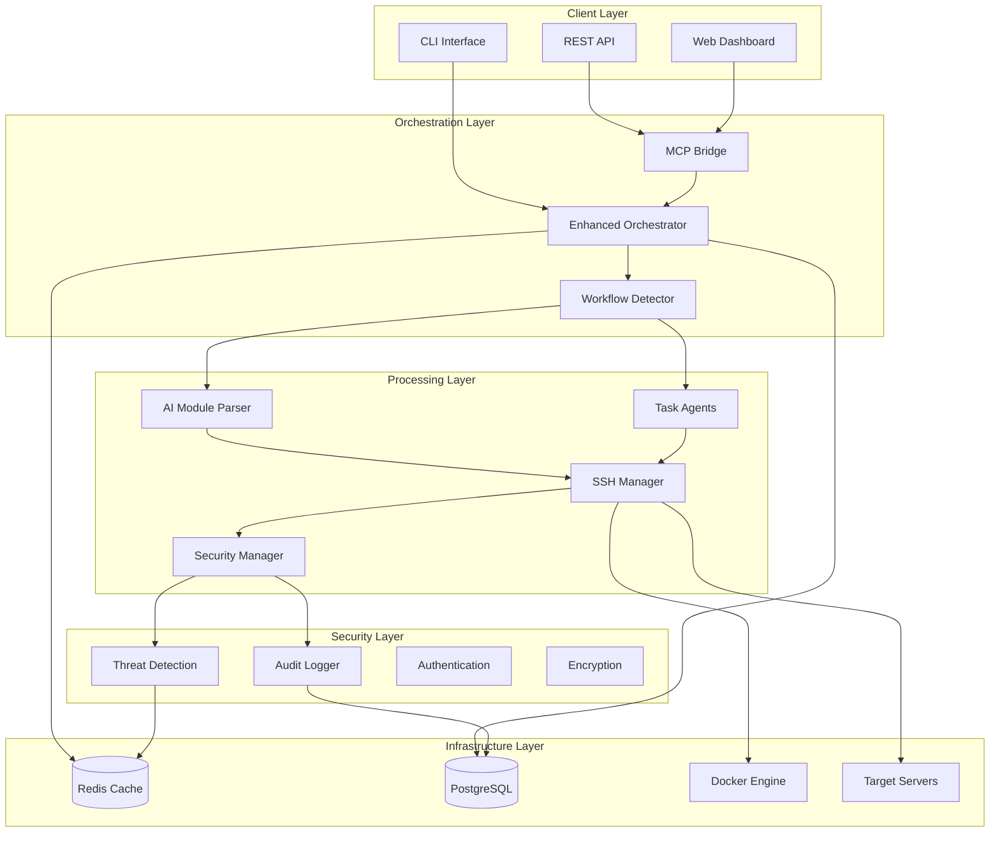
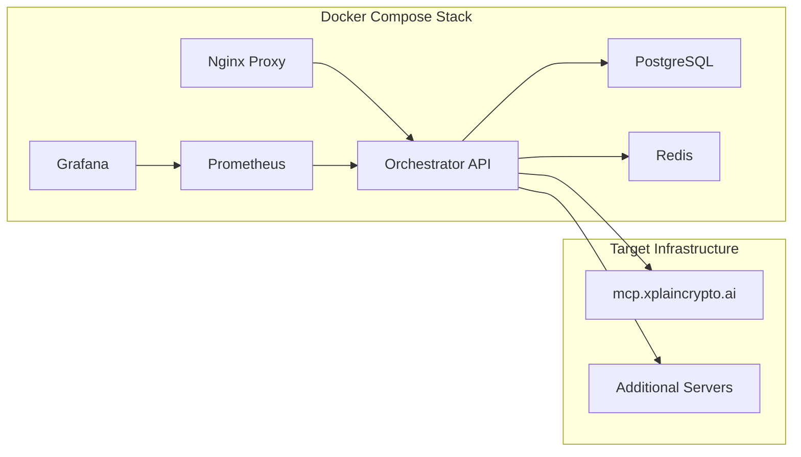

# Automatos AI - System Architecture

## Executive Summary

Automatos AI represents a paradigm shift in DevOps orchestration, delivering enterprise-grade intelligent automation through advanced context engineering and multi-agent collaboration. This document outlines the comprehensive system architecture designed for scalability, security, and intelligent decision-making.

## Overview

The Enhanced Two-Tiered Multi-Agent Orchestration System is designed to handle two distinct types of deployment workflows:

1. **Tier 1: AI Module Workflows** - Self-contained repositories with `ai-module.yaml` configuration files
2. **Tier 2: Task Prompt Workflows** - Traditional repositories that use natural language task prompts

## System Architecture



## Component Details

### 1. Enhanced Orchestrator (`orchestrator.py`)

The main orchestration engine that:
- Auto-detects workflow types
- Manages workflow state and lifecycle
- Coordinates between different processing components
- Handles rollback and recovery operations

**Key Features:**
- Unified workflow processing
- State management
- Error recovery
- Performance monitoring

### 2. MCP Bridge (`mcp_bridge.py`)

RESTful API service that provides:
- HTTP endpoints for workflow management
- Rate limiting and security
- Integration with external systems
- Health monitoring

**Endpoints:**
- `POST /workflow` - Start new workflow
- `GET /workflows` - List active workflows
- `GET /workflows/{id}` - Get workflow status
- `DELETE /workflows/{id}` - Stop workflow
- `POST /execute` - Execute SSH commands
- `GET /health` - Health check

### 3. SSH Manager (`ssh_manager.py`)

Secure SSH command execution with:
- Banking-grade security validation
- Connection pooling and reuse
- Comprehensive audit logging
- Command injection prevention

**Security Features:**
- Command whitelist/blacklist
- Path restriction enforcement
- Rate limiting per connection
- Encrypted key management

### 4. AI Module Parser (`ai_module_parser.py`)

YAML configuration parser for AI modules:
- Schema validation
- Type checking
- Template generation
- Auto-detection of module types

**Supported Module Types:**
- Web Applications
- APIs and Microservices
- ML Models
- Data Pipelines
- Infrastructure Components

### 5. Security & Audit System (`security/`)

Comprehensive security monitoring:
- Real-time threat detection
- Audit logging with structured data
- Security event correlation
- Automated response capabilities

## Workflow Types

### Tier 1: AI Module Workflows

Self-contained repositories with `ai-module.yaml` configuration:

```yaml
name: "my-application"
version: "1.0.0"
description: "Application description"
module_type: "web_app"
build_command: "npm install && npm run build"
start_command: "npm start"
port: 3000
# ... additional configuration
```

**Processing Flow:**
1. Repository cloned
2. `ai-module.yaml` detected and parsed
3. Dependencies installed based on configuration
4. Application built using specified commands
5. Tests executed (if configured)
6. Application deployed to target environment
7. Health monitoring established

### Tier 2: Task Prompt Workflows

Traditional repositories with natural language prompts:

**Example Prompt:**
"Deploy a Python Flask web server that serves cryptocurrency data with basic authentication and logging."

**Processing Flow:**
1. Repository cloned
2. Structure analyzed (package.json, requirements.txt, etc.)
3. AI agents generate deployment strategy
4. Technology stack detected automatically
5. Deployment commands generated and executed
6. Basic monitoring established

## Security Architecture

### Multi-Layer Security

1. **Network Layer**
   - TLS encryption for all communications
   - IP-based access controls
   - Rate limiting and DDoS protection

2. **Authentication Layer**
   - API key authentication
   - SSH key-based authentication
   - Multi-factor authentication support

3. **Authorization Layer**
   - Role-based access control
   - Command-level permissions
   - Resource-based restrictions

4. **Audit Layer**
   - Comprehensive logging
   - Real-time monitoring
   - Threat detection and response

### SSH Security

- **Command Validation**: All commands validated against security policies
- **Path Restrictions**: Access limited to approved directories
- **Connection Pooling**: Secure connection reuse with timeout management
- **Audit Logging**: Every command execution logged with full context

## Deployment Architecture

### Docker-Based Deployment



### High Availability

- **Database Replication**: PostgreSQL with read replicas
- **Redis Clustering**: Distributed caching and session storage
- **Load Balancing**: Multiple orchestrator instances
- **Health Monitoring**: Automated failover and recovery

## Monitoring and Observability

### Metrics Collection

- **System Metrics**: CPU, memory, disk, network usage
- **Application Metrics**: Request rates, response times, error rates
- **Security Metrics**: Failed authentication attempts, suspicious activities
- **Business Metrics**: Deployment success rates, workflow completion times

### Alerting

- **Critical Alerts**: System failures, security breaches
- **Warning Alerts**: Performance degradation, resource constraints
- **Info Alerts**: Deployment completions, maintenance events

### Dashboards

- **Operational Dashboard**: Real-time system status
- **Security Dashboard**: Threat detection and response
- **Business Dashboard**: Deployment metrics and trends

## Scalability Considerations

### Horizontal Scaling

- **Orchestrator Instances**: Multiple workers for parallel processing
- **Database Sharding**: Distributed data storage
- **Cache Distribution**: Redis cluster for session management

### Vertical Scaling

- **Resource Optimization**: Efficient memory and CPU usage
- **Connection Pooling**: Optimized database and SSH connections
- **Async Processing**: Non-blocking I/O operations

## Integration Points

### External Systems

- **Git Repositories**: GitHub, GitLab, Bitbucket
- **Container Registries**: Docker Hub, AWS ECR, Google GCR
- **Cloud Providers**: AWS, GCP, Azure
- **Monitoring Systems**: Datadog, New Relic, Splunk

### APIs and Webhooks

- **Webhook Support**: Git repository events
- **REST APIs**: External system integration
- **GraphQL**: Advanced querying capabilities
- **WebSocket**: Real-time updates

## Future Enhancements

### Planned Features

1. **Multi-Cloud Support**: Deploy to multiple cloud providers
2. **GitOps Integration**: Automated deployment from Git events
3. **ML-Powered Optimization**: Intelligent resource allocation
4. **Advanced Security**: Zero-trust architecture implementation
5. **Visual Workflow Builder**: Drag-and-drop workflow creation

### Roadmap

- **Q1 2024**: Multi-cloud deployment support
- **Q2 2024**: Advanced ML integration
- **Q3 2024**: Visual workflow builder
- **Q4 2024**: Zero-trust security implementation
