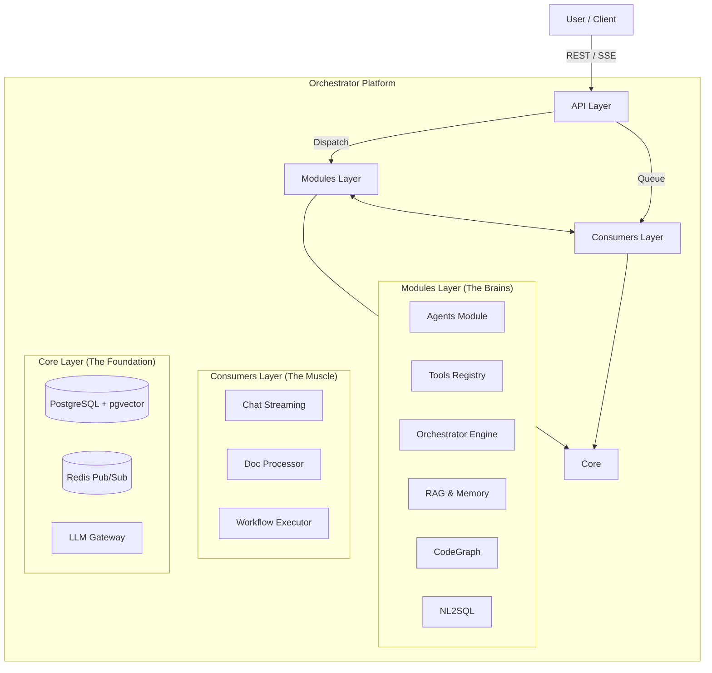
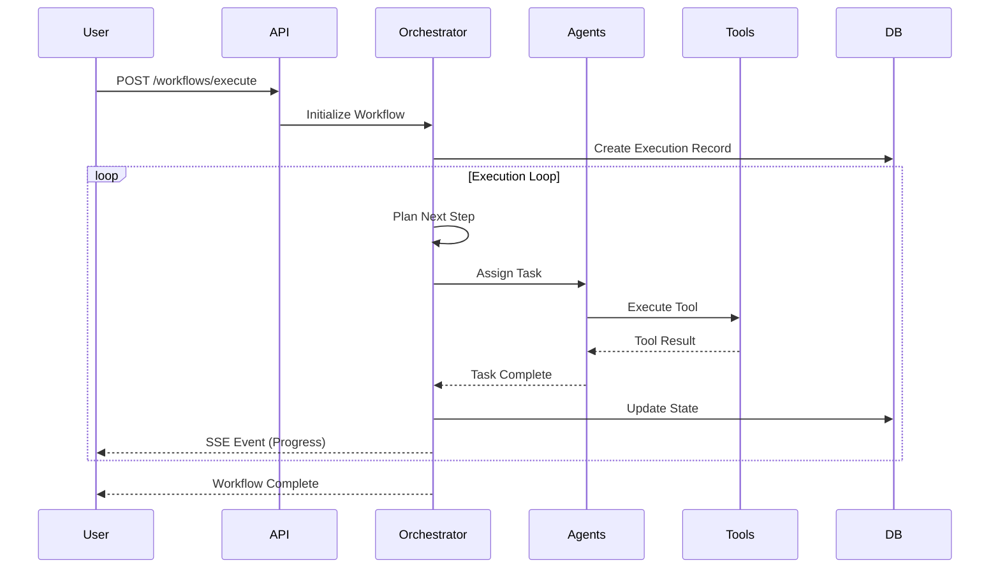

# 🏗️ System Architecture

> **"Progressive complexity from atoms to organisms - the architectural foundation of intelligent automation."**

---

## 📖 Table of Contents

1. [High-Level Architecture](#high-level-architecture)
2. [The 4-Layer Model](#the-4-layer-model)
3. [Progressive Complexity](#progressive-complexity)
4. [Core Components](#core-components)
5. [Data Flow](#data-flow)
6. [Technology Stack](#technology-stack)

---

## 🏛️ High-Level Architecture

Automatos AI is built on a **Modular Domain-Driven Design**. It is not a monolith; it is a collection of specialized intelligent systems working in concert.

### System Overview

```mermaid
graph TD
    User[User / Client] -->|REST / SSE| API[API Layer]
    
    subgraph "Orchestrator Platform"
        API -->|Dispatch| Modules[Modules Layer]
        API -->|Queue| Consumers[Consumers Layer]
        
        subgraph "Modules Layer (The Brains)"
            Agents[Agents Module]
            Tools[Tools Registry]
            Orch[Orchestrator Engine]
            RAG[RAG & Memory]
            Code[CodeGraph]
            NL2SQL[NL2SQL]
        end
        
        subgraph "Consumers Layer (The Muscle)"
            Stream[Chat Streaming]
            DocProc[Doc Processor]
            WorkExec[Workflow Executor]
        end
        
        subgraph "Core Layer (The Foundation)"
            DB[(PostgreSQL + pgvector)]
            Redis[(Redis Pub/Sub)]
            LLM[LLM Gateway]
        end
        
        Modules --> Core
        Consumers --> Core
        Modules <--> Consumers
    end
```

---

## 🧱 The 4-Layer Model

We organize code into four distinct layers of responsibility:

### 1. 🔵 API Layer (`orchestrator/api/`)
**The Interface.**
- **52+ Endpoints**: RESTful interface for every feature.
- **SSE Streaming**: Real-time updates (Server-Sent Events) replacing WebSockets.
- **Authentication**: API Key security and role management.

### 2. 🟡 Modules Layer (`orchestrator/modules/`)
**The Business Logic.**
- **Agents**: Collaborative reasoning and skill management.
- **Tools**: Unified registry for 400+ integrations.
- **Orchestrator**: State machine for workflow execution.
- **CodeGraph**: Semantic code understanding engine.
- **NL2SQL**: Natural language database interface.

### 3. 🔴 Consumers Layer (`orchestrator/consumers/`)
**The Background Workers.**
- **Async Processing**: Handling heavy tasks (PDF parsing, embeddings).
- **Workflow Execution**: Running long-lived agent tasks.
- **Chat Streaming**: Managing real-time LLM conversations.

### 4. 🟢 Core Layer (`orchestrator/core/`)
**The Infrastructure.**
- **Database**: SQLAlchemy ORM & Alembic migrations.
- **LLM Gateway**: Unified interface for OpenAI, Anthropic, etc.
- **Redis**: Caching, Pub/Sub, and Rate Limiting.

---

## 🧬 Progressive Complexity

Automatos follows a bio-inspired model of intelligence:

| Level | Concept | Description | Example |
|-------|---------|-------------|---------|
| **1. Atoms** | **Prompts** | Single instructions | "Summarize this text" |
| **2. Molecules** | **Chains** | Linear sequences | "Search → Summarize → Email" |
| **3. Cells** | **Agents** | Memory + Tools + Identity | "Research Agent" |
| **4. Organs** | **Teams** | Multi-agent collaboration | "Dev Team (Product + Dev + QA)" |
| **5. Organisms** | **Platform** | Self-improving ecosystem | Automatos AI |

---

## 🧠 Core Components

### 1. Agent Factory (`modules/agents`)
Creates agents that can reason, debate, and collaborate.
- **Consensus Mechanisms**: Agents vote on decisions.
- **Skill System**: Dynamic capability assignment.
- **See**: [Agent System Guide](AGENT_SYSTEM_GUIDE.md)

### 2. Workflow Orchestrator (`modules/orchestrator`)
The state machine that drives execution.
- **Smart Decomposition**: Breaks goals into tasks.
- **Resumable State**: Pauses and resumes anytime.
- **See**: [Workflow System Guide](WORKFLOW_SYSTEM_GUIDE.md)

### 3. Tool Registry (`modules/tools`)
One registry to rule them all.
- **Define Once**: Use in API, Agents, and Workflows.
- **Auto-Discovery**: Tools are automatically registered.
- **See**: [Tools Integration Guide](TOOLS_INTEGRATION_GUIDE.md)

### 4. CodeGraph (`modules/codegraph`)
Semantic understanding of codebases.
- **Symbol Extraction**: Classes, functions, imports.
- **Call Graphs**: Who calls whom?
- **See**: [CodeGraph Guide](CODEGRAPH_GUIDE.md)

---

## 🔄 Data Flow

### Workflow Execution Flow

```mermaid
sequenceDiagram
    participant User
    participant API
    participant Orchestrator
    participant Agents
    participant Tools
    participant DB
    
    User->>API: POST /workflows/execute
    API->>Orchestrator: Initialize Workflow
    Orchestrator->>DB: Create Execution Record
    
    loop Execution Loop
        Orchestrator->>Orchestrator: Plan Next Step
        Orchestrator->>Agents: Assign Task
        Agents->>Tools: Execute Tool
        Tools-->>Agents: Tool Result
        Agents-->>Orchestrator: Task Complete
        Orchestrator->>DB: Update State
        Orchestrator-->>User: SSE Event (Progress)
    end
    
    Orchestrator-->>User: Workflow Complete
```

---

## 🛠️ Technology Stack

| Component | Technology | Purpose |
|-----------|------------|---------|
| **Backend** | Python 3.11+, FastAPI | High-performance async API |
| **Database** | PostgreSQL 16+ | Primary data store |
| **Vector DB** | pgvector | Semantic search & memory |
| **Caching** | Redis 7+ | Pub/Sub, Rate Limiting |
| **Streaming** | Server-Sent Events (SSE) | Real-time updates |
| **Frontend** | Next.js 14, TypeScript | React framework |
| **ORM** | SQLAlchemy 2.0 | Database abstraction |

---

## 🔐 Security Architecture

1.  **Network**: Nginx reverse proxy, Rate limiting.
2.  **App**: API Key auth, Pydantic validation.
3.  **Data**: Fernet encryption for credentials, TLS everywhere.
4.  **Access**: Role-based tool permissions.

---

**Built with ❤️ for the builders.**
