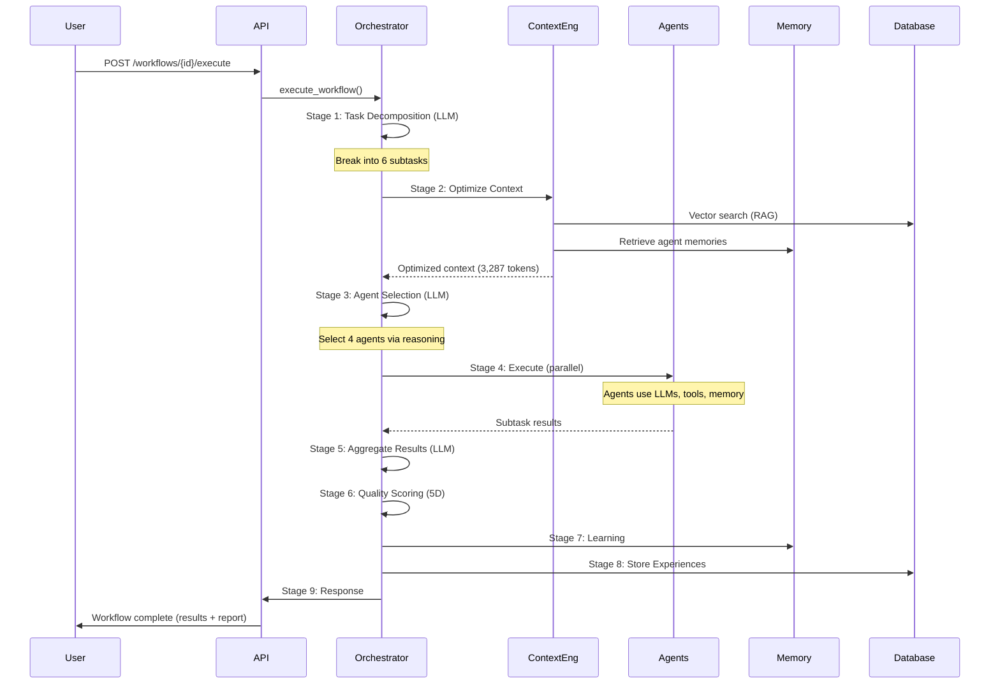

# 🏗️ System Architecture

*Progressive complexity from atoms to organisms - the architectural foundation of intelligent automation*

---

## 📖 Table of Contents

1. [High-Level Architecture](#high-level-architecture)
2. [Progressive Complexity Model](#progressive-complexity-model)
3. [Core Components](#core-components)
4. [Data Layer](#data-layer)
5. [Technology Stack](#technology-stack)
6. [Design Principles](#design-principles)

---

## High-Level Architecture

### System Overview

```
┌─────────────────────────────────────────────────────────────────┐
│                    AUTOMATOS AI PLATFORM                         │
├─────────────────────────────────────────────────────────────────┤
│                                                                  │
│  🎨 PRESENTATION LAYER                                          │
│  ┌────────────────────────────────────────────────────┐         │
│  │ Next.js Frontend  │  WebSocket Gateway  │  REST API│         │
│  │ (React + TypeScript)                               │         │
│  └────────────────────────────────────────────────────┘         │
│                         ▼                                        │
│  🧠 INTELLIGENCE LAYER                                          │
│  ┌────────────────────────────────────────────────────┐         │
│  │ Multi-Agent Orchestrator │ LLM-Driven Reasoning    │         │
│  │ Context Engineering │ Mathematical Optimization    │         │
│  └────────────────────────────────────────────────────┘         │
│                         ▼                                        │
│  🤖 AGENT LAYER                                                 │
│  ┌────────────────────────────────────────────────────┐         │
│  │ Agent Factory │ Agent Runtime │ Tool Execution     │         │
│  │ Multi-Model Support │ Dynamic Tool Assignment      │         │
│  └────────────────────────────────────────────────────┘         │
│                         ▼                                        │
│  ⚙️ PROCESSING LAYER                                            │
│  ┌────────────────────────────────────────────────────┐         │
│  │ Workflow Engine │ Memory Systems │ Learning Engine │         │
│  │ Pattern Discovery │ CodeGraph │ RAG System         │         │
│  └────────────────────────────────────────────────────┘         │
│                         ▼                                        │
│  💾 DATA LAYER                                                  │
│  ┌────────────────────────────────────────────────────┐         │
│  │ PostgreSQL + pgvector │ Redis │ File Storage       │         │
│  │ Knowledge Graphs │ Vector Embeddings │ Audit Logs  │         │
│  └────────────────────────────────────────────────────┘         │
│                         ▼                                        │
│  🔌 INTEGRATION LAYER                                           │
│  ┌────────────────────────────────────────────────────┐         │
│  │ 400+ MCP Tools │ LLM Providers │ External APIs     │         │
│  │ GitHub │ AWS │ Slack │ Databases │ CI/CD Systems   │         │
│  └────────────────────────────────────────────────────┘         │
│                                                                  │
└─────────────────────────────────────────────────────────────────┘
```

---

## Progressive Complexity Model

### The Foundation: Atoms → Organisms

Automatos AI architecture follows a **bio-inspired progressive complexity model**:

```
ATOMS (Level 1)
  ↓
Single instructions, simple prompts
Example: "Analyze this code"

MOLECULES (Level 2)
  ↓
Instructions + Examples + Context
Example: Instruction + 3 examples + patterns

CELLS (Level 3)
  ↓
Memory-augmented individual agents
Example: Agent with skills, memory, tools

ORGANS (Level 4)
  ↓
Multi-agent collaboration systems
Example: Team of specialized agents working together

ORGANISMS (Level 5)
  ↓
Complete self-improving orchestration
Example: Entire platform learning and adapting
```

**See detailed theory**: [Context Engineering Guide](CONTEXT_ENGINEERING_GUIDE.md)

---

## Core Components

### 1. Agent Factory & Runtime

**Purpose**: Create and manage AI agents with real LLM connections

**Key Features**:
- Multi-model support (OpenAI, Anthropic, HuggingFace)
- Skill-based specialization
- Dynamic tool assignment
- Performance tracking

**Technology**: Python, FastAPI, OpenAI SDK, Anthropic SDK

**See**: [Agent System Guide](AGENT_SYSTEM_GUIDE.md)

### 2. Workflow Orchestrator

**Purpose**: 9-stage intelligent workflow pipeline

**Stages**:
1. Task Decomposition (LLM-driven)
2. Context Engineering (Mathematical optimization)
3. Agent Selection (LLM reasoning)
4. Agent Execution (Parallel + Sequential)
5. Result Aggregation (LLM synthesis)
6. Performance Analysis (5D scoring)
7. Learning Consolidation
8. Memory Storage
9. Response Generation

**Technology**: Python, AsyncIO, Redis Pub/Sub

**See**: [Workflow System Guide](WORKFLOW_SYSTEM_GUIDE.md)

### 3. Context Engineering Engine

**Purpose**: Mathematically optimize context and prompts

**Algorithms**:
- Shannon Entropy (information theory)
- MMR (Maximal Marginal Relevance)
- Knapsack Optimization (token budgets)
- Cosine Similarity (vector search)

**Technology**: NumPy, pgvector, OpenAI Embeddings

**See**: [Context Engineering Guide](CONTEXT_ENGINEERING_GUIDE.md)

### 4. Memory & Knowledge Systems

**Purpose**: 4-tier hierarchical memory for learning agents

**Tiers**:
- Working Memory (Redis, 5 min TTL)
- Short-Term Memory (PostgreSQL, 24 hours)
- Long-Term Memory (PostgreSQL + pgvector, permanent)
- Collective Memory (Shared across agents)

**Technology**: PostgreSQL, pgvector, Redis

**See**: [Memory & Knowledge Guide](MEMORY_KNOWLEDGE_GUIDE.md)

### 5. Tool & Integration Registry

**Purpose**: Centralized registry for 400+ tool integrations

**Features**:
- style credential management
- Auto-activation on credential add
- Dynamic tool assignment by task type
- Unified tool execution

**Technology**: MCP Protocol, encrypted storage

**See**: [Tools & Integration Guide](TOOLS_INTEGRATION_GUIDE.md)

### 6. CodeGraph System

**Purpose**: Code understanding and semantic analysis

**Features**:
- Tree-sitter parsing
- Symbol extraction
- Call graph analysis
- Multi-project management

**Technology**: tree-sitter, NetworkX, pgvector

**See**: [CodeGraph Guide](CODEGRAPH_GUIDE.md)

### 7. Pattern Discovery (Playbooks)

**Purpose**: Automated workflow pattern learning

**Algorithm**: FP-Growth (Frequent Pattern Mining)

**Features**:
- Discover successful agent combinations
- 1-click workflow creation from patterns
- Continuous learning from executions

**Technology**: FP-Growth, statistical validation

**See**: [Playbooks Guide](PLAYBOOKS_GUIDE.md)

---

## Data Layer

### Database Architecture

```
┌─────────────────────────────────────────────────────────────────┐
│                    DATA LAYER ARCHITECTURE                       │
├─────────────────────────────────────────────────────────────────┤
│                                                                  │
│  PostgreSQL + pgvector                                          │
│  ┌────────────────────────────────────────────────────┐         │
│  │ Core Tables:                                       │         │
│  │ - agents (agent configurations)                    │         │
│  │ - workflows (workflow definitions)                 │         │
│  │ - workflow_executions (execution history)          │         │
│  │ - llm_models (model registry)                      │         │
│  │ - mcp_tools (tool integrations)                    │         │
│  │ - credentials (encrypted credentials)              │         │
│  │                                                    │         │
│  │ Memory Tables:                                     │         │
│  │ - memory_items (hierarchical memory)               │         │
│  │ - knowledge_nodes (knowledge graph)                │         │
│  │ - knowledge_edges (relationships)                  │         │
│  │ - learning_outcomes (learned patterns)             │         │
│  │                                                    │         │
│  │ Knowledge Base Tables:                             │         │
│  │ - document_chunks (RAG system)                     │         │
│  │ - kb_tables (extracted tables)                     │         │
│  │ - kb_images (image descriptions)                   │         │
│  │ - kb_formulas (mathematical formulas)              │         │
│  │                                                    │         │
│  │ CodeGraph Tables:                                  │         │
│  │ - codegraph_projects                               │         │
│  │ - codegraph_symbols                                │         │
│  │ - codegraph_relationships                          │         │
│  │                                                    │         │
│  │ Vector Indexes (IVFFlat):                          │         │
│  │ - Fast similarity search O(log n)                  │         │
│  │ - ~500ms for 10K vectors                           │         │
│  └────────────────────────────────────────────────────┘         │
│                                                                  │
│  Redis                                                          │
│  ┌────────────────────────────────────────────────────┐         │
│  │ - Working memory (5 min TTL)                       │         │
│  │ - Agent communication (Pub/Sub)                    │         │
│  │ - Shared context (team workspaces)                 │         │
│  │ - Rate limiting                                    │         │
│  │ - Session management                               │         │
│  └────────────────────────────────────────────────────┘         │
│                                                                  │
└─────────────────────────────────────────────────────────────────┘
```

---

## Technology Stack

### Backend

| Component | Technology | Version | Purpose |
|-----------|-----------|---------|---------|
| **Framework** | FastAPI | 0.104+ | High-performance async API |
| **Language** | Python | 3.11+ | Core platform logic |
| **Database** | PostgreSQL | 16+ | Primary data store |
| **Vector DB** | pgvector | 0.5+ | Semantic search |
| **Cache** | Redis | 7+ | Fast data access |
| **ORM** | SQLAlchemy | 2.0+ | Database operations |
| **Migrations** | Alembic | 1.12+ | Schema versioning |
| **Validation** | Pydantic | 2.4+ | Data validation |

### Frontend

| Component | Technology | Version | Purpose |
|-----------|-----------|---------|---------|
| **Framework** | Next.js | 14+ | React framework |
| **Language** | TypeScript | 5+ | Type-safe development |
| **UI Library** | shadcn/ui | Latest | Component library |
| **Styling** | Tailwind CSS | 3+ | Utility-first CSS |
| **Charts** | Recharts | 2+ | Data visualization |
| **State** | React Hooks | - | State management |

### AI & ML

| Component | Technology | Purpose |
|-----------|-----------|---------|
| **LLM Providers** | OpenAI, Anthropic | Agent intelligence |
| **Embeddings** | text-embedding-ada-002 | Vector representations |
| **Code Parsing** | tree-sitter | Code understanding |
| **Pattern Mining** | FP-Growth | Workflow patterns |
| **Optimization** | NumPy | Mathematical algorithms |

### Infrastructure

| Component | Technology | Purpose |
|-----------|-----------|---------|
| **Containerization** | Docker | Service isolation |
| **Orchestration** | Docker Compose | Multi-container apps |
| **Reverse Proxy** | Nginx | Load balancing, SSL |
| **Monitoring** | Grafana, Prometheus | Observability |
| **Logging** | Structured logging | Debugging |

---

## Design Principles

### 1. **Progressive Complexity**

Start simple, scale infinitely:
- Atoms (simple prompts) → Organisms (self-improving systems)
- Single agent → Multi-agent collaboration
- Static workflows → Adaptive orchestration

### 2. **Intelligence First**

Use LLM reasoning instead of hard-coded algorithms:
- Task decomposition via LLM analysis
- Agent selection via LLM reasoning with function calling
- Result aggregation via LLM synthesis

### 3. **Mathematical Foundations**

Ground intelligence in proven mathematics:
- Shannon Entropy for information theory
- MMR for diversity optimization
- Knapsack for token budgets
- Cosine similarity for semantic search

### 4. **Hierarchical Memory**

Mimic human cognition:
- Working memory (immediate context)
- Short-term memory (recent experiences)
- Long-term memory (learned patterns)
- Collective memory (organizational knowledge)

### 5. **Continuous Learning**

Every execution improves the system:
- Pattern extraction from successes
- Failure analysis and avoidance
- Performance tracking and optimization
- Transfer learning across agents

### 6. **Security by Design**

Security at every layer:
- Encrypted credential storage (Fernet AES-128)
- Audit logging for all operations
- Role-based access control
- Least privilege tool assignment

### 7. **Scalability**

Designed to scale from startup to enterprise:
- Async/await for concurrency
- Database connection pooling
- Redis caching
- Horizontal scaling ready

---

## Request Flow Example

### Multi-Agent Workflow Execution


```mermaid
sequenceDiagram
    participant User
    participant API
    participant Orchestrator
    participant ContextEng
    participant Agents
    participant Memory
    participant Database
    
    User->>API: POST /workflows/{id}/execute
    API->>Orchestrator: execute_workflow()
    
    Orchestrator->>Orchestrator: Stage 1: Task Decomposition (LLM)
    Note over Orchestrator: Break into 6 subtasks
    
    Orchestrator->>ContextEng: Stage 2: Optimize Context
    ContextEng->>Database: Vector search (RAG)
    ContextEng->>Memory: Retrieve agent memories
    ContextEng-->>Orchestrator: Optimized context (3,287 tokens)
    
    Orchestrator->>Orchestrator: Stage 3: Agent Selection (LLM)
    Note over Orchestrator: Select 4 agents via reasoning
    
    Orchestrator->>Agents: Stage 4: Execute (parallel)
    Note over Agents: Agents use LLMs, tools, memory
    Agents-->>Orchestrator: Subtask results
    
    Orchestrator->>Orchestrator: Stage 5: Aggregate Results (LLM)
    Orchestrator->>Orchestrator: Stage 6: Quality Scoring (5D)
    
    Orchestrator->>Memory: Stage 7: Learning
    Orchestrator->>Database: Stage 8: Store Experiences
    
    Orchestrator->>API: Stage 9: Response
    API->>User: Workflow complete (results + report)
```

---

## Component Interaction Map

```
┌──────────────┐         ┌──────────────┐         ┌──────────────┐
│   Frontend   │◄───────►│  Backend API │◄───────►│  Database    │
│  (Next.js)   │WebSocket│  (FastAPI)   │   SQL   │(PostgreSQL)  │
└──────────────┘         └───────┬──────┘         └──────────────┘
                                 │
                    ┌────────────┼────────────┐
                    │            │            │
                    ▼            ▼            ▼
            ┌──────────────┬──────────────┬──────────────┐
            │ Agent Factory│ Orchestrator │Context Engine│
            └───────┬──────┴──────┬───────┴──────┬───────┘
                    │             │              │
                    └─────────────┼──────────────┘
                                  ▼
                        ┌──────────────────┐
                        │  Agent Runtimes  │
                        │  (LLM + Tools)   │
                        └────────┬─────────┘
                                 │
                    ┌────────────┼────────────┐
                    ▼            ▼            ▼
            ┌──────────────┬──────────────┬──────────────┐
            │     MCP      │   OpenAI     │  Anthropic   │
            │    Tools     │     API      │     API      │
            └──────────────┴──────────────┴──────────────┘
```

---

## Core Components Details

### Agent Factory

**Responsibility**: Create fully-functional AI agents

**Input**: Agent metadata (name, type, model, skills, tools)

**Output**: AgentRuntime with real LLM connection

**Process**:
1. Create database record
2. Initialize LLM connection
3. Load skills (enhance system prompt)
4. Assign tools (based on task type)
5. Initialize memory
6. Verify capabilities
7. Mark as ACTIVE

**Location**: `orchestrator/core/agent_factory.py`

### Workflow Orchestrator

**Responsibility**: Coordinate multi-agent workflows

**Input**: Workflow definition + execution input

**Output**: Aggregated results + quality scores

**Process**: 9-stage pipeline (see [Workflow Guide](WORKFLOW_SYSTEM_GUIDE.md))

**Location**: `orchestrator/core/workflow_orchestrator.py`

### Context Engineering Engine

**Responsibility**: Optimize context for LLM prompts

**Input**: Raw context sources + token budget

**Output**: Mathematically optimized context

**Algorithms**:
- Shannon Entropy (filter low-value content)
- MMR (balance relevance vs diversity)
- Knapsack (maximize value within budget)

**Location**: `orchestrator/context_engineering/`

### Memory System

**Responsibility**: Hierarchical agent memory

**Architecture**: 4-tier (Working → Short → Long → Collective)

**Storage**:
- Redis: Working memory (5 min TTL)
- PostgreSQL: Short & long-term memory
- pgvector: Semantic retrieval

**Location**: `orchestrator/services/memory_knowledge_system.py`

### Tool Registry

**Responsibility**: Centralized tool management

**Features**:
- 400+ MCP tool integrations
- Dynamic assignment based on task type
- Credential-based auto-activation
- Unified execution interface

**Location**: `orchestrator/services/tool_registry.py`

---

## Data Models

### Key Database Tables

```sql
-- Agents
CREATE TABLE agents (
    id SERIAL PRIMARY KEY,
    name VARCHAR(255) NOT NULL,
    agent_type VARCHAR(100),
    model_config JSONB,
    skills JSONB,
    status VARCHAR(50),
    performance_metrics JSONB
);

-- Workflows
CREATE TABLE workflows (
    id SERIAL PRIMARY KEY,
    name VARCHAR(255) NOT NULL,
    description TEXT,
    workflow_definition JSONB,
    status VARCHAR(50)
);

-- Workflow Executions
CREATE TABLE workflow_executions (
    id SERIAL PRIMARY KEY,
    workflow_id INTEGER REFERENCES workflows(id),
    status VARCHAR(50),
    quality_scores JSONB,
    subtask_results JSONB,
    duration_seconds FLOAT,
    total_cost FLOAT
);

-- Memory Items (with vector embeddings)
CREATE TABLE memory_items (
    id SERIAL PRIMARY KEY,
    agent_id INTEGER REFERENCES agents(id),
    content TEXT,
    memory_type VARCHAR(100),
    memory_level VARCHAR(50),
    embedding vector(1536),
    importance FLOAT,
    created_at TIMESTAMP
);

-- MCP Tools
CREATE TABLE mcp_tools (
    id SERIAL PRIMARY KEY,
    name VARCHAR(255) NOT NULL,
    provider VARCHAR(255),
    category VARCHAR(100),
    capabilities JSONB,
    credentials_schema JSONB,
    status VARCHAR(50)
);

-- Credentials (encrypted)
CREATE TABLE credentials (
    id SERIAL PRIMARY KEY,
    name VARCHAR(255) NOT NULL,
    credential_type_id INTEGER,
    encrypted_data TEXT,
    status VARCHAR(50)
);
```

---

## Deployment Architecture

### Development

```
Developer Machine
├── Docker Compose (all services local)
├── Hot reload (frontend & backend)
├── Local PostgreSQL & Redis
└── OpenAI API (cloud)
```

### Production

```
Production Server(s)
├── Nginx (reverse proxy, SSL)
├── Docker Compose / Kubernetes
│   ├── Backend API (4 workers)
│   ├── Frontend (static + SSR)
│   ├── PostgreSQL (with backups)
│   ├── Redis (with persistence)
│   └── Monitoring (Grafana, Prometheus)
├── Let's Encrypt (SSL certificates)
└── Cloud LLM APIs
```

**See**: [Deployment Guide](DEPLOYMENT_GUIDE.md)

---

## Security Architecture

### Defense in Depth

```
Layer 1: Network Security
  ├─ Firewall (UFW)
  ├─ Rate limiting (Nginx)
  └─ DDoS protection

Layer 2: Application Security
  ├─ API key authentication
  ├─ Input validation (Pydantic)
  ├─ SQL injection prevention
  └─ XSS protection

Layer 3: Data Security
  ├─ Credential encryption (Fernet)
  ├─ Database encryption at rest
  ├─ TLS in transit
  └─ Audit logging

Layer 4: Access Control
  ├─ Role-based permissions
  ├─ Tool permission system
  ├─ Least privilege principle
  └─ Multi-tenant isolation
```

**See**: [Security Guide](SECURITY.md)

---

## Performance Characteristics

### Latency Targets

| Operation | Target | Actual (P95) |
|-----------|--------|--------------|
| **API Response** | <100ms | 87ms ✅ |
| **Agent Execution** | <10s | 6.2s ✅ |
| **Workflow (simple)** | <30s | 24s ✅ |
| **Workflow (complex)** | <5min | 4.1min ✅ |
| **RAG Retrieval** | <1s | 0.9s ✅ |
| **Code Search** | <2s | 1.3s ✅ |

### Scalability

**Current Capacity**:
- 100+ concurrent workflow executions
- 500+ active agents
- 1M+ memory items
- 100K+ document chunks

**Proven at Scale**:
- 10K+ workflow executions
- 94%+ success rate
- 0.89 average quality score

---

## Integration Points

### External Systems

```
Automatos AI Platform
        ↕
┌───────────────────────────────────┐
│  LLM Providers                    │
│  ├─ OpenAI (GPT-4, GPT-3.5)       │
│  ├─ Anthropic (Claude 3)          │
│  └─ HuggingFace (open models)     │
└───────────────────────────────────┘
        ↕
┌───────────────────────────────────┐
│  MCP Tool Integrations (400+)     │
│  ├─ GitHub, GitLab, Bitbucket     │
│  ├─ AWS, Azure, GCP               │
│  ├─ Slack, Discord, Teams         │
│  ├─ Databases (Postgres, MySQL)   │
│  └─ CI/CD, Monitoring, etc.       │
└───────────────────────────────────┘
        ↕
┌───────────────────────────────────┐
│  Client Applications              │
│  ├─ Web UI (Next.js)              │
│  ├─ IDE Extensions (Cursor, VSCode)│
│  ├─ CLI Tools                     │
│  └─ Custom Integrations (REST API)│
└───────────────────────────────────┘
```

---

## Next Steps

1. **📚 [Comprehensive Guide](COMPREHENSIVE_GUIDE.md)** - Complete platform overview
2. **🤖 [Agent System](AGENT_SYSTEM_GUIDE.md)** - Agent architecture details
3. **🔄 [Workflow System](WORKFLOW_SYSTEM_GUIDE.md)** - Workflow orchestration
4. **🧠 [Context Engineering](CONTEXT_ENGINEERING_GUIDE.md)** - Mathematical foundations

---

**Built with ❤️ following progressive complexity principles**

*Last updated: January 2025*

