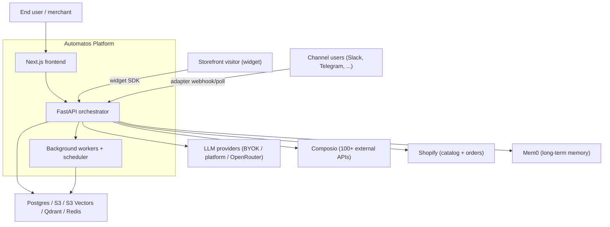
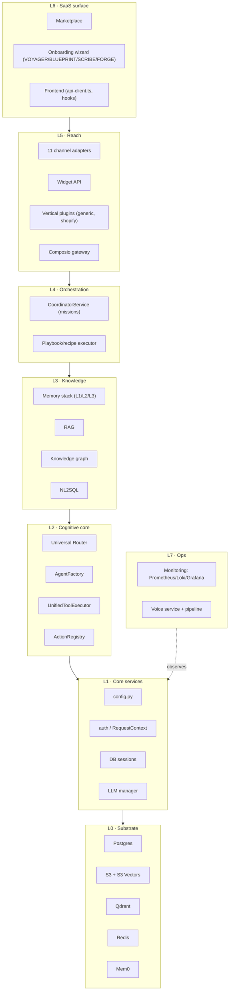
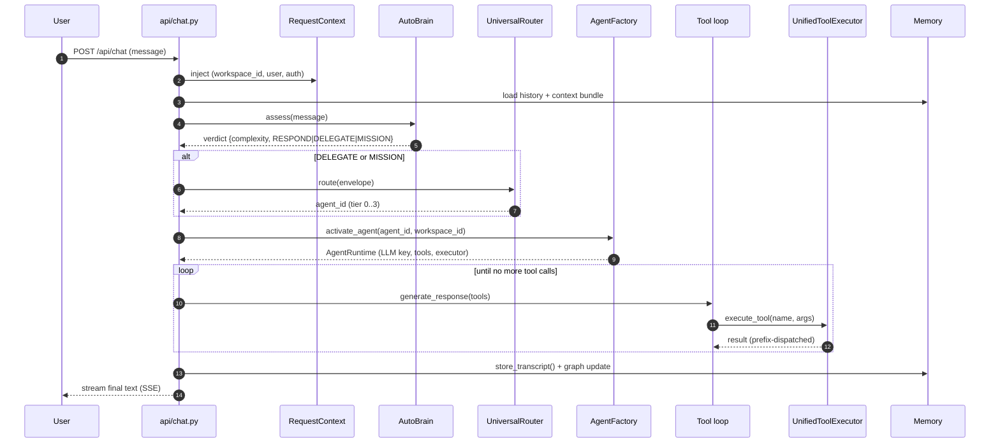
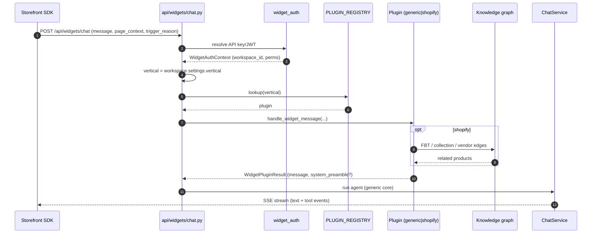
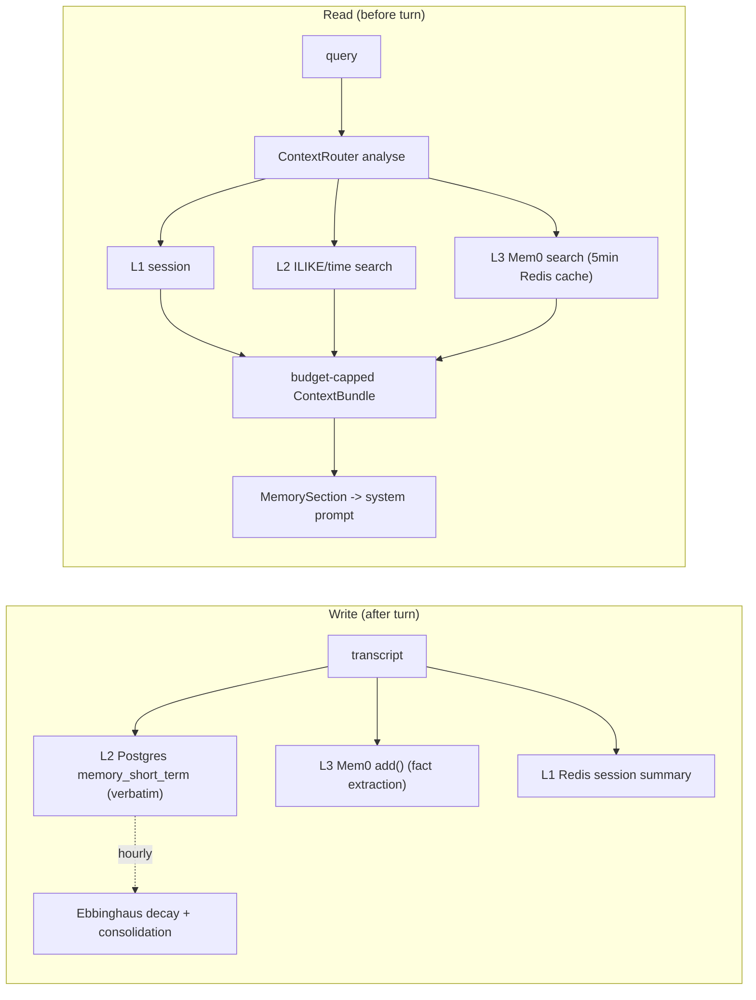
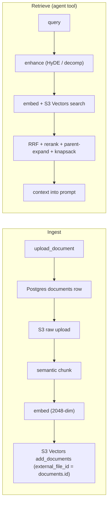
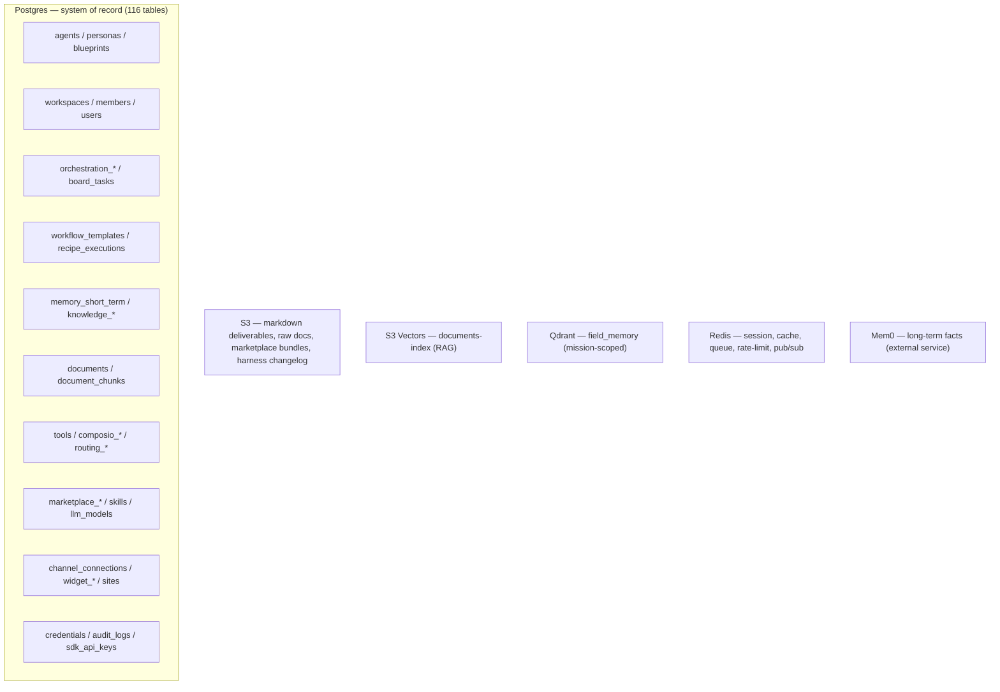
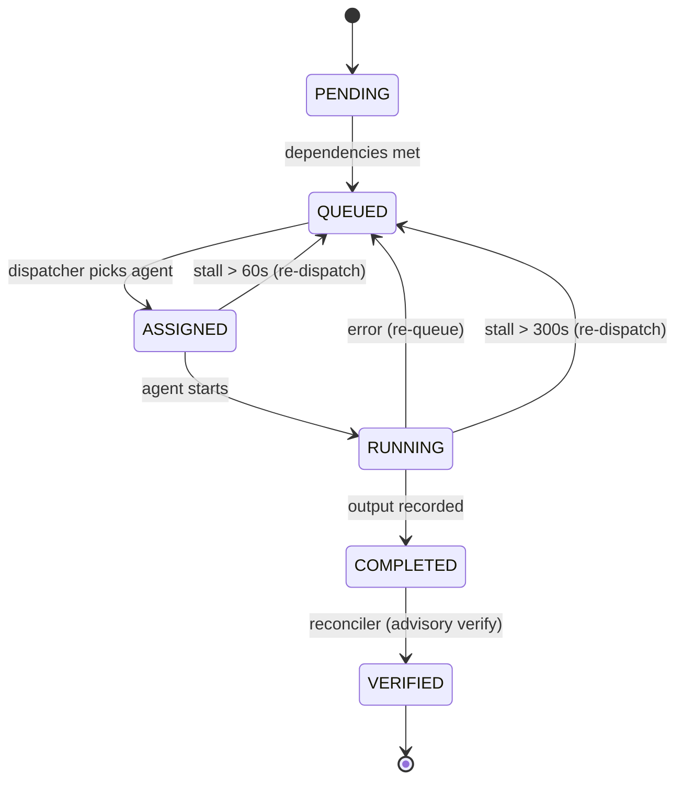

# Automatos — Architecture Diagrams

> Mermaid diagrams for the brain. Companion to `BRAIN-BLUEPRINT.md` (section refs below
> point there). Render in any Mermaid-aware viewer (GitHub, VS Code, Obsidian).
> **Status:** baseline — 2026-05-29, verified against branch `feat/widget-page-context-on-regular-chat`.

---

## 1. System context (who talks to Automatos)



---

## 2. Layered container view (dependency direction is downward)



---

## 3. Sequence — one chat turn (the Arc, BRAIN §1)



---

## 4. Sequence — mission lifecycle (BRAIN §3.6; DB-authoritative, restart-durable)

```mermaid
sequenceDiagram
    autonumber
    participant Caller as chat/api
    participant Co as CoordinatorService (5s tick)
    participant Pl as MissionPlanner
    participant Di as MissionDispatcher
    participant AF as AgentFactory
    participant Re as MissionReconciler
    participant DB as Postgres
    Caller->>Co: create_mission(goal)
    Co->>DB: OrchestrationRun = PENDING
    Co->>Pl: decompose(goal)
    Pl->>DB: tasks + dependency rows + BoardTasks
    Co->>DB: run = AWAITING_APPROVAL
    Caller->>Co: approve_plan()
    Co->>DB: run = RUNNING; ready tasks = QUEUED
    loop every 5s while RUNNING (re-read from DB)
        Co->>Di: dispatch_ready()
        Di->>AF: execute_with_prompt(task)
        AF-->>Di: output
        Di->>DB: record_task_completion (or re-queue)
        Co->>Re: reconcile()
        Re->>DB: COMPLETED -> VERIFIED; re-dispatch stalls
    end
    Co->>DB: run = VERIFYING -> AWAITING_HUMAN
    Caller->>Co: review_mission(accept)
    Co->>DB: run = COMPLETED; deliverable saved (.md -> S3)
```

---

## 5. Sequence — widget message with vertical plugin dispatch (BRAIN §4.7, §7)



Note: generic core (`chat.py`) holds **zero** Shopify identifiers — CI gate
`check-no-shopify-in-generic.sh` enforces it.

---

## 6. Flow — memory write & read (BRAIN §4.2)



---

## 7. Flow — RAG ingest & retrieve (BRAIN §3.3)



---

## 8. Data substrate map (BRAIN §5)



---

## 9. State machine — OrchestrationTask (BRAIN §3.6)



> Gap (BRAIN §8, G5/G10): re-queue on error stores only `failure_detail` — verifier
> critique is **not** fed back into the retry. Verification is advisory-only (PRD-103);
> the reconciler docstring still claims a verdict path — doc/code drift to fix.
