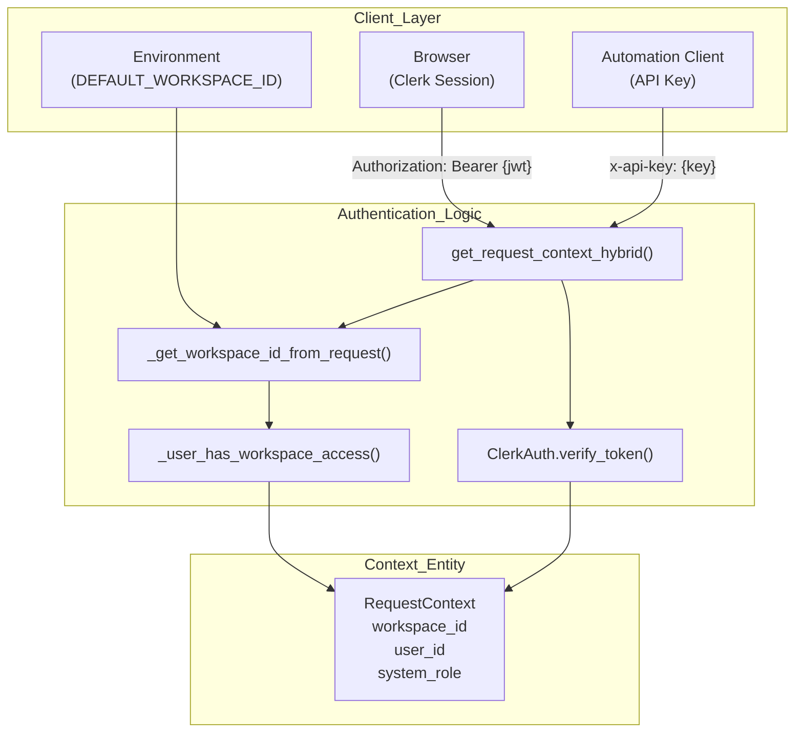
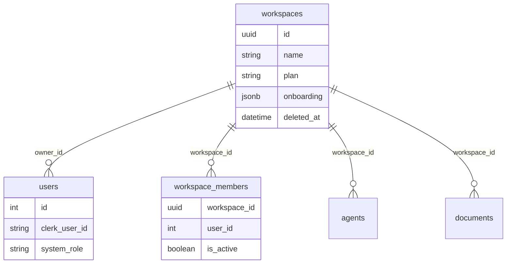

# Authentication & Multi-Tenancy

Relevant source files

The following files were used as context for generating this wiki page:

- [frontend/components/landing/landing-page.tsx](frontend/components/landing/landing-page.tsx)
- [frontend/components/settings/WebhooksSettingsTab.tsx](frontend/components/settings/WebhooksSettingsTab.tsx)
- [frontend/components/workspace-provider.tsx](frontend/components/workspace-provider.tsx)
- [orchestrator/alembic/versions/prd_workspace_models_backfill.py](orchestrator/alembic/versions/prd_workspace_models_backfill.py)
- [orchestrator/core/auth/hybrid.py](orchestrator/core/auth/hybrid.py)
- [orchestrator/core/models/workspaces.py](orchestrator/core/models/workspaces.py)
- [orchestrator/services/trial_ledger.py](orchestrator/services/trial_ledger.py)
- [orchestrator/services/workspace_model_seeding.py](orchestrator/services/workspace_model_seeding.py)
- [orchestrator/tests/test_invitation_routing.py](orchestrator/tests/test_invitation_routing.py)
- [orchestrator/tests/test_prd222_trial_enforcement.py](orchestrator/tests/test_prd222_trial_enforcement.py)
- [orchestrator/tests/test_prd222_trial_ledger.py](orchestrator/tests/test_prd222_trial_ledger.py)
- [orchestrator/tests/test_prd230_chat_trial_metering.py](orchestrator/tests/test_prd230_chat_trial_metering.py)
- [orchestrator/tests/test_workspace_model_seeding.py](orchestrator/tests/test_workspace_model_seeding.py)

This document covers the authentication and authorization mechanisms in Automatos AI, including hybrid authentication (Clerk JWT + API keys), workspace-based multi-tenancy, data isolation patterns, and admin access control.

For information about user management and team collaboration, see [Teams, Members & Invitations](#17.6). For credential storage (API keys for external services), see [Credentials Management](#17.5).

---

## Overview

Automatos AI implements a **hybrid authentication system** supporting both Clerk JWT tokens (for user sessions) and API keys (for automation/headless clients). Multi-tenancy is achieved via **workspace-scoped isolation** at all data layers: database foreign keys, Redis cache namespaces, and memory namespaces.

**Key components:**

| Component | Purpose | Location |
|-----------|---------|----------|
| `get_request_context_hybrid` | Validates Clerk JWT or API key, returns `RequestContext` | [orchestrator/core/auth/hybrid.py:246-300]() |
| `RequestContext` | Contains `workspace_id`, `user_id`, `system_role` | [orchestrator/core/auth/dependencies.py:56-67]() |
| `_provision_new_user_workspace` | Auto-provisions personal workspace and seeds notification defaults | [orchestrator/core/auth/hybrid.py:200-244]() |
| `require_workspace_permission` | Dependency for RBAC (viewer/editor/admin) within a workspace | [orchestrator/tests/test_p2w2_family_gates.py:41-44]() |

**Sources:** [orchestrator/core/auth/hybrid.py:246-300](), [orchestrator/core/auth/dependencies.py:56-67](), [orchestrator/core/auth/hybrid.py:200-244]()

---

## Authentication Flow

### Hybrid Auth: Clerk JWT + API Keys

Automatos AI supports multiple authentication methods that resolve to a `RequestContext`. The `get_request_context_hybrid` function acts as the primary entry point for resolving identity from headers or session tokens [orchestrator/core/auth/hybrid.py:246-300](). 

The `ClerkAuth` class handles JWT verification using JWKS (JSON Web Key Set) [orchestrator/core/auth/clerk.py:20-26](). It normalizes user claims, including the `system_role` which is extracted from Clerk session token metadata [orchestrator/core/auth/clerk.py:122-135]().

Title: Hybrid Authentication & Context Resolution

**Sources:** [orchestrator/core/auth/hybrid.py:49-88](), [orchestrator/core/auth/hybrid.py:146-165](), [orchestrator/core/auth/clerk.py:63-97]()

---

### Workspace Provisioning & Invitations

When a new user signs up, the system auto-provisions a personal workspace unless a pending invitation exists [orchestrator/core/auth/hybrid.py:168-174](). This prevents the "invitee race condition" where a user joined to a team accidentally lands in a private personal silo [orchestrator/tests/test_invitation_routing.py:3-12]().

- **Default Preferences:** Provisions seed defaults for the `NotificationDispatcher` (e.g., `heartbeat_complete` -> `in_app`) [orchestrator/core/auth/hybrid.py:200-210]().
- **Invitation Logic:** `_get_pending_invitation_token` searches for unexpired tokens matching the user's email [orchestrator/core/auth/hybrid.py:177-198]().

For details, see [Authentication Flow](#17.1).

**Sources:** [orchestrator/core/auth/hybrid.py:168-198](), [orchestrator/tests/test_invitation_routing.py:87-104]()

---

## Workspace Management

### Workspace Resolution Priority

The system resolves the active `workspace_id` from the request using a strict priority order [orchestrator/core/auth/hybrid.py:49-59]():
1. Header: `x-workspace-id` or `x-workspace`
2. Query Parameter: `workspace_id`
3. Environment Variables: `WORKSPACE_ID` or `DEFAULT_WORKSPACE_ID`

### Role-Based Access Control (RBAC)
Within a workspace, users are assigned roles (`owner`, `admin`, `editor`, `viewer`) [frontend/components/workspace-provider.tsx:45-50](). Mutating routes are protected by `require_workspace_permission`, ensuring a `viewer` cannot perform actions like `agents:create` or `missions:delete` [orchestrator/tests/test_p2w2_family_gates.py:49-78]().

### Workspace Model Seeding
New workspaces are seeded with a set of default LLM models to ensure immediate usability. The `seed_workspace_models` function selects active, OpenRouter-served models (defaults first, then featured by popularity) and adds them to the `workspace_models` table. It also sets the primary model in `workspaces.settings.orchestrator` if not already present [orchestrator/services/workspace_model_seeding.py:72-123](). This process is idempotent and designed to degrade gracefully without raising errors if no models are available [orchestrator/services/workspace_model_seeding.py:121-123](). An Alembic migration `prd_workspace_models_backfill` ensures existing zero-model workspaces are also brought up to this baseline [orchestrator/alembic/versions/prd_workspace_models_backfill.py:28-66]().

For details, see [Workspace Management](#17.2).

**Sources:** [orchestrator/core/auth/hybrid.py:49-88](), [frontend/components/workspace-provider.tsx:72-79](), [orchestrator/tests/test_p2w2_family_gates.py:118-130](), [orchestrator/services/workspace_model_seeding.py:72-123](), [orchestrator/alembic/versions/prd_workspace_models_backfill.py:28-66]()

---

## Data Isolation

### Database Multi-Tenancy

The `Workspace` model serves as the root for all multi-tenant data [orchestrator/core/models/workspaces.py:21-25](). Hard-deletion of a workspace is managed by the `Workspace Hard-Delete (Purge) Service`, which wipes S3 objects and cascades deletes across all tables containing a `workspace_id` column [orchestrator/services/workspace_purge.py:7-15]().

Title: Code Entity Space - Multi-Tenancy Schema

For details, see [Data Isolation](#17.3).

**Sources:** [orchestrator/core/models/workspaces.py:21-56](), [orchestrator/services/workspace_purge.py:51-70]()

---

## Admin & Access Control

### System Roles
The `UserContext` maintains a `system_role` (`super_admin`, `admin`, `user`) [orchestrator/core/auth/dependencies.py:8-33](). On the frontend, `RoleProvider` enforces defense-in-depth by requiring an `@automatos.app` email domain for admin elevation [frontend/contexts/role-context.tsx:48-53]().

### Admin Console
The Admin Workspaces API allows platform administrators to list, pause, resume, and soft-delete workspaces platform-wide [orchestrator/api/admin_workspaces.py:5-15]().

For details, see [Admin Access Control](#17.4).

**Sources:** [orchestrator/core/auth/dependencies.py:30-40](), [frontend/contexts/role-context.tsx:33-68](), [orchestrator/api/admin_workspaces.py:95-108]()

---

## Trials, Plan Tiers & Session Modes

The platform implements a trial system, managed by the `trial_ledger` service, which tracks granted and spent USD for each workspace's trial [orchestrator/services/trial_ledger.py:1-26](). The trial state (`active`, `warned`, `exhausted`, `converted`) is stored within the `workspaces.onboarding.trial` JSONB field [orchestrator/services/trial_ledger.py:44-47]().

The `resolve_trial_routing` function acts as a choke point for LLM key resolution, determining if a request should be metered against the trial, blocked, or passed through [orchestrator/services/trial_ledger.py:209-219](). BYOK (Bring Your Own Key) requests bypass trial metering [orchestrator/tests/test_prd222_trial_enforcement.py:56-59](). The system also enforces a global daily cap on trial spend [orchestrator/services/trial_ledger.py:124-125]().

For details, see [Trials, Plan Tiers & Session Modes](#17.7).

**Sources:** [orchestrator/services/trial_ledger.py:1-26](), [orchestrator/services/trial_ledger.py:44-47](), [orchestrator/services/trial_ledger.py:209-219](), [orchestrator/tests/test_prd222_trial_enforcement.py:56-59](), [orchestrator/services/trial_ledger.py:124-125]()

---

## Child Pages
- [Authentication Flow](#17.1) — Clerk JWT vs API key, get_request_context_hybrid, AUTH_EDITION saas vs local, sign-in/sign-up pages, Edge proxy security
- [Workspace Management](#17.2) — Workspace model, workspace_id context injection, workspace switching, model seeding, workspace purge, provisioning
- [Data Isolation](#17.3) — Database foreign keys, tenancy matrix tests, query key scoping, memory namespacing, cache isolation, team access
- [Admin Access Control](#17.4) — system_role field, admin gates, workspace_admin/workspace_permission dependencies, bootstrap mode, authz boundary sweeps
- [Credentials Management](#17.5) — User API keys, BYOK overrides, credential store and types seed, integration bridges, encryption service, SDK API keys
- [Teams, Members & Invitations](#17.6) — Teams table and team-scoped documents, workspace members, invitations, invite modal, workspace audit log
- [Trials, Plan Tiers & Session Modes](#17.7) — trial_ledger metering and enforcement, plan_tiers, subscription/session mode runtime, CLI host service and services/cli-host allowlist

---