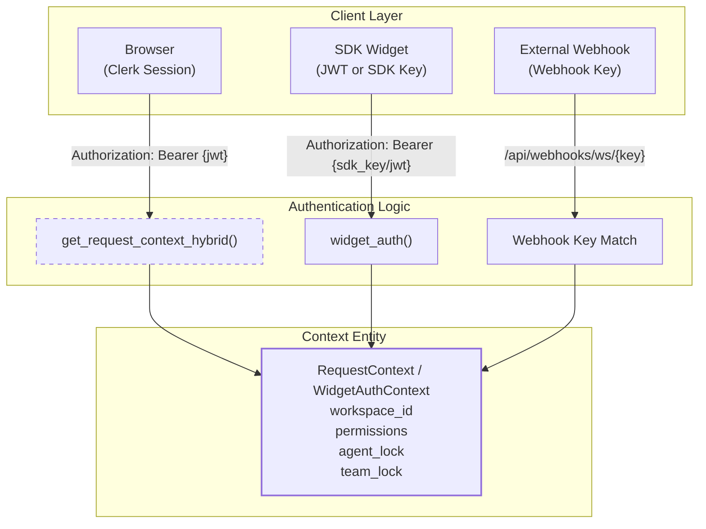
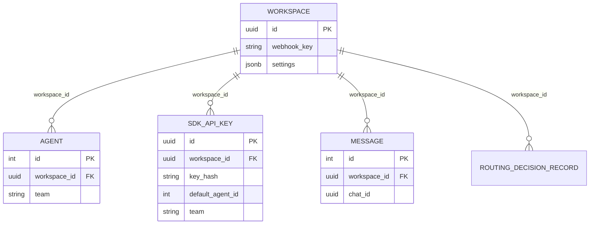

# Authentication & Multi-Tenancy

Relevant source files

The following files were used as context for generating this wiki page:

- [docs/PRDS/53-WEBHOOK-TRIGGER-SYSTEM-PRD.md](docs/PRDS/53-WEBHOOK-TRIGGER-SYSTEM-PRD.md)
- [frontend/components/settings/SettingsPanel.tsx](frontend/components/settings/SettingsPanel.tsx)
- [frontend/components/settings/SystemLLMSettingsTab.tsx](frontend/components/settings/SystemLLMSettingsTab.tsx)
- [frontend/components/settings/SystemSettingsTab.tsx](frontend/components/settings/SystemSettingsTab.tsx)
- [frontend/components/settings/WebhooksSettingsTab.tsx](frontend/components/settings/WebhooksSettingsTab.tsx)
- [frontend/components/workspace-provider.tsx](frontend/components/workspace-provider.tsx)
- [orchestrator/alembic/versions/20260213_add_workspace_webhook_key.py](orchestrator/alembic/versions/20260213_add_workspace_webhook_key.py)
- [orchestrator/api/api_keys.py](orchestrator/api/api_keys.py)
- [orchestrator/api/webhooks.py](orchestrator/api/webhooks.py)
- [orchestrator/api/widgets/__init__.py](orchestrator/api/widgets/__init__.py)
- [orchestrator/api/widgets/auth.py](orchestrator/api/widgets/auth.py)
- [orchestrator/api/widgets/chat.py](orchestrator/api/widgets/chat.py)
- [orchestrator/api/widgets/data.py](orchestrator/api/widgets/data.py)
- [orchestrator/api/widgets/documents.py](orchestrator/api/widgets/documents.py)
- [orchestrator/api/widgets/router.py](orchestrator/api/widgets/router.py)
- [orchestrator/api/widgets/session.py](orchestrator/api/widgets/session.py)
- [orchestrator/api/workspaces.py](orchestrator/api/workspaces.py)
- [orchestrator/core/database/migrations/043_team_based_document_scoping.sql](orchestrator/core/database/migrations/043_team_based_document_scoping.sql)
- [orchestrator/core/models/routing.py](orchestrator/core/models/routing.py)
- [orchestrator/core/models/sdk_api_keys.py](orchestrator/core/models/sdk_api_keys.py)
- [orchestrator/core/routing/ingestors/webhook.py](orchestrator/core/routing/ingestors/webhook.py)
- [orchestrator/core/services/api_key_service.py](orchestrator/core/services/api_key_service.py)
- [orchestrator/modules/tools/discovery/actions_harness.py](orchestrator/modules/tools/discovery/actions_harness.py)
- [orchestrator/modules/tools/discovery/handlers_harness.py](orchestrator/modules/tools/discovery/handlers_harness.py)
- [orchestrator/modules/tools/discovery/handlers_missions.py](orchestrator/modules/tools/discovery/handlers_missions.py)
- [orchestrator/scripts/seed_blog_playbook.py](orchestrator/scripts/seed_blog_playbook.py)
- [orchestrator/services/harness_service.py](orchestrator/services/harness_service.py)

This document covers the authentication and authorization mechanisms in Automatos AI, including hybrid authentication (Clerk JWT + SDK API keys), workspace-based multi-tenancy, data isolation patterns, and admin access control.

For information about user management and team collaboration, see [Workspace Management](#17.2). For credential storage (API keys for external services), see [Credentials Management](#17.5).

---

## Overview

Automatos AI implements a **hybrid authentication system** supporting Clerk JWT tokens (for user sessions), SDK API keys (for widgets and headless clients), and Webhook keys (for external platform integrations). Multi-tenancy is achieved via **workspace-scoped isolation** at all data layers: database foreign keys, Redis cache namespaces, and memory namespaces.

**Key components:**

| Component | Purpose | Location |
|-----------|---------|----------|
| `get_request_context_hybrid` | Validates Clerk JWT or API key, returns `RequestContext` | [orchestrator/core/auth/hybrid.py]() |
| `widget_auth` | Dependency for SDK/Widget endpoints using JWT or raw keys | [orchestrator/api/widgets/auth.py:112-129]() |
| `ApiKeyService` | Manages SHA-256 hashed SDK keys with domain/IP filtering | [orchestrator/core/services/api_key_service.py:28-214]() |
| `Workspace` model | Workspace entity with settings and `webhook_key` | [orchestrator/core/models/workspaces.py:19]() |
| `SdkApiKey` model | Stores hashed keys, permissions, and agent/team locks | [orchestrator/core/models/sdk_api_keys.py:29-73]() |

**Sources:** [orchestrator/api/workspaces.py:41-53](), [orchestrator/api/widgets/auth.py:112-129](), [orchestrator/core/services/api_key_service.py:28-214]()

---

## Authentication Flow

### Hybrid Auth: Clerk JWT + SDK API Keys

Automatos AI supports multiple authentication methods that resolve to a `RequestContext` containing `workspace_id`, `user_id`, and `system_role`. For SDK widgets, a specialized `WidgetAuthContext` is used.

**Diagram: Authentication & Context Resolution**

**Sources:** [orchestrator/api/webhooks.py:6-9](), [orchestrator/api/widgets/auth.py:112-129](), [orchestrator/core/auth/hybrid.py]()

---

### SDK & Widget Authentication

Automatos provides a robust SDK authentication system designed for embedding AI capabilities into external sites.

1.  **SDK API Keys:** Workspaces can generate `public` or `server` type keys [orchestrator/api/api_keys.py:44](). Public keys require `allowed_domains` for CORS safety [orchestrator/api/api_keys.py:122-127]().
2.  **Session Token Exchange:** Backend servers can exchange a `server` API key for a short-lived JWT session token via `POST /widgets/auth` [orchestrator/api/widgets/session.py:74-79](). This prevents exposing secret keys to the browser.
3.  **Agent & Team Locking:** Keys can be "locked" to a specific `default_agent_id` or `team`, ensuring the widget only interacts with specific resources [orchestrator/core/models/sdk_api_keys.py:54-58]().

**Sources:** [orchestrator/api/widgets/session.py:74-156](), [orchestrator/api/widgets/auth.py:131-171](), [orchestrator/core/services/api_key_service.py:35-91]()

---

### Webhook Authentication

For external integrations, Automatos uses a **URL-as-secret** pattern. Each workspace has a unique `webhook_key` [orchestrator/api/workspaces.py:63-64]().

-   **Path:** `POST /api/webhooks/ws/{workspace_key}` [orchestrator/api/webhooks.py:6-9]().
-   **Verification:** HMAC-SHA256 signature verification (GitHub, Slack, Composio) is performed via `_verify_webhook_signature` [orchestrator/api/webhooks.py:44-86]().
-   **Platform Ingestion:** Requests are routed via `WebhookIngestor` to the `UniversalRouter` [orchestrator/api/webhooks.py:28-29]().

**Sources:** [orchestrator/api/webhooks.py:6-9](), [orchestrator/api/webhooks.py:44-86](), [orchestrator/api/webhooks.py:255-265]()

---

## Workspace Management

### Workspace Model & Settings

The `Workspace` model holds critical configuration in a `settings` JSONB field. This includes `integrations` (Telegram, Slack tokens) and `byok_overrides` [orchestrator/api/workspaces.py:29-37]().

**Workspace Features:**
-   **Orchestrator Soul:** Workspaces define their own personality, communication style, and proactive levels (Silent to Fully Autonomous) [frontend/components/settings/SystemLLMSettingsTab.tsx:69-87]().
-   **Heartbeat Config:** Per-workspace schedules for proactive checks, including active hours and timezones [frontend/components/settings/SystemLLMSettingsTab.tsx:52-57]().
-   **HARNESS:** The "Self-Optimizing Organization Loop" can be toggled per-workspace to auto-improve agent configurations [frontend/components/settings/SystemLLMSettingsTab.tsx:62-66]().

**Sources:** [orchestrator/api/workspaces.py:71-93](), [frontend/components/settings/SystemLLMSettingsTab.tsx:46-67](), [orchestrator/services/harness_service.py:104-114]()

---

## Data Isolation

### Database Multi-Tenancy

All system entities are strictly partitioned by `workspace_id`.

**Diagram: Multi-Tenancy Code Entity Relationships**

**Sources:** [orchestrator/core/models/sdk_api_keys.py:38-42](), [orchestrator/api/widgets/chat.py:130-142](), [orchestrator/api/workspaces.py:60]()

---

### Memory & Team Isolation

-   **Team Scoping:** PRD-124 introduced `team` based document scoping. Agents and SDK keys can be locked to a team, filtering the RAG context and memory to only that team's data [orchestrator/api/widgets/chat.py:173-181]().
-   **Widget Mode:** Conversations initiated via widgets are marked as `widget_mode=True` and scoped to the authenticated workspace [orchestrator/api/widgets/chat.py:114]().
-   **HARNESS Sweep:** The optimization service iterates through workspaces sequentially to avoid "thundering herd" resource spikes [orchestrator/services/harness_service.py:81-96]().

**Sources:** [orchestrator/api/widgets/chat.py:173-181](), [orchestrator/core/models/sdk_api_keys.py:57-58](), [orchestrator/services/harness_service.py:81-96]()

---

## Credentials Management

### BYOK Overrides
Workspaces can provide their own API keys for LLM providers (OpenAI, Anthropic, etc.) via the `byok_overrides` setting [orchestrator/api/workspaces.py:161-164]().

### Integration Security
Sensitive tokens for Telegram, Slack, and WhatsApp are masked in the UI/API, showing only the first and last 4 characters (e.g., `1234...abcd`) [orchestrator/api/workspaces.py:71-80]().

**Sources:** [orchestrator/api/workspaces.py:71-80](), [orchestrator/api/workspaces.py:161-205](), [frontend/components/settings/SettingsPanel.tsx:76-84]()

---

## Child Pages
- [Authentication Flow](#17.1) — Details on Clerk JWT vs SDK API key and session token exchange.
- [Workspace Management](#17.2) — Model details, Orchestrator Soul configuration, and onboarding.
- [Data Isolation](#17.3) — Database scoping, team-based document filtering, and HARNESS isolation.
- [Admin Access Control](#17.4) — System roles and platform-wide settings management.
- [Credentials Management](#17.5) — BYOK overrides, integration credential storage, and masking.

---