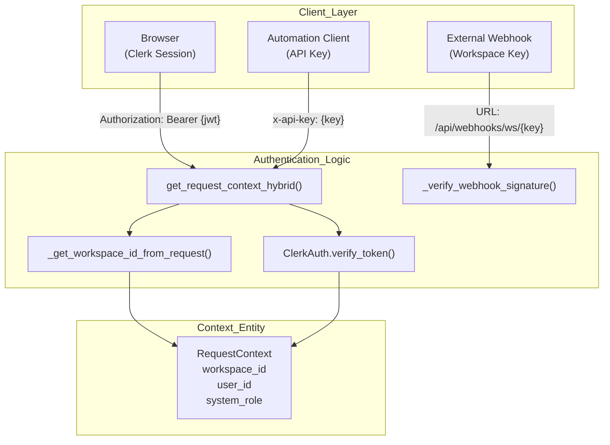
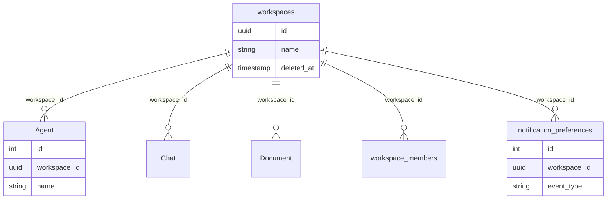

# Authentication & Multi-Tenancy

Relevant source files

The following files were used as context for generating this wiki page:

- [docs/PRDS/53-WEBHOOK-TRIGGER-SYSTEM-PRD.md](docs/PRDS/53-WEBHOOK-TRIGGER-SYSTEM-PRD.md)
- [docs/notes/andy-fuck-it-mode.md](docs/notes/andy-fuck-it-mode.md)
- [frontend/app/admin/workspaces/page.tsx](frontend/app/admin/workspaces/page.tsx)
- [frontend/app/globals.css](frontend/app/globals.css)
- [frontend/app/layout.tsx](frontend/app/layout.tsx)
- [frontend/components/providers.tsx](frontend/components/providers.tsx)
- [frontend/components/settings/WebhooksSettingsTab.tsx](frontend/components/settings/WebhooksSettingsTab.tsx)
- [frontend/components/ui/theme-toggle.tsx](frontend/components/ui/theme-toggle.tsx)
- [frontend/components/workspace-provider.tsx](frontend/components/workspace-provider.tsx)
- [frontend/contexts/role-context.tsx](frontend/contexts/role-context.tsx)
- [orchestrator/alembic/versions/20260213_add_workspace_webhook_key.py](orchestrator/alembic/versions/20260213_add_workspace_webhook_key.py)
- [orchestrator/alembic/versions/prd140_permission_bypass_log.py](orchestrator/alembic/versions/prd140_permission_bypass_log.py)
- [orchestrator/api/admin_workspaces.py](orchestrator/api/admin_workspaces.py)
- [orchestrator/api/webhooks.py](orchestrator/api/webhooks.py)
- [orchestrator/core/auth/clerk.py](orchestrator/core/auth/clerk.py)
- [orchestrator/core/auth/hybrid.py](orchestrator/core/auth/hybrid.py)
- [orchestrator/core/routing/ingestors/webhook.py](orchestrator/core/routing/ingestors/webhook.py)
- [orchestrator/core/security/__init__.py](orchestrator/core/security/__init__.py)
- [orchestrator/core/security/bypass_audit.py](orchestrator/core/security/bypass_audit.py)
- [orchestrator/core/security/hierarchy_permissions.py](orchestrator/core/security/hierarchy_permissions.py)
- [orchestrator/core/security/url_validator.py](orchestrator/core/security/url_validator.py)
- [orchestrator/services/workspace_purge.py](orchestrator/services/workspace_purge.py)
- [orchestrator/tests/test_invitation_routing.py](orchestrator/tests/test_invitation_routing.py)

This document covers the authentication and authorization mechanisms in Automatos AI, including hybrid authentication (Clerk JWT + API keys), workspace-based multi-tenancy, data isolation patterns, and admin access control.

For information about user management and team collaboration, see [Workspace Management](#17.2). For credential storage (API keys for external services), see [Credentials Management](#17.5).

---

## Overview

Automatos AI implements a **hybrid authentication system** supporting both Clerk JWT tokens (for user sessions) and API keys (for automation/headless clients). Multi-tenancy is achieved via **workspace-scoped isolation** at all data layers: database foreign keys, Redis cache namespaces, and memory namespaces.

**Key components:**

| Component | Purpose | Location |
|-----------|---------|----------|
| `get_request_context_hybrid` | Validates Clerk JWT or API key, returns `RequestContext` | [orchestrator/core/auth/hybrid.py:246-300]() |
| `RequestContext` | Contains `workspace_id`, `user_id`, `system_role` | [orchestrator/core/auth/dependencies.py:22-29]() |
| `_provision_new_user_workspace` | Auto-provisions personal workspace and seeds notification defaults | [orchestrator/core/auth/hybrid.py:202-244]() |
| `can_actor_modify` | Enforces hierarchy-based permissions between agents/actors | [orchestrator/core/security/hierarchy_permissions.py:90-122]() |

**Sources:** [orchestrator/core/auth/hybrid.py:246-300](), [orchestrator/core/auth/dependencies.py:22-29](), [orchestrator/core/security/hierarchy_permissions.py:90-122]()

---

## Authentication Flow

### Hybrid Auth: Clerk JWT + API Keys

Automatos AI supports multiple authentication methods that resolve to a `RequestContext` containing `workspace_id`, `user_id`, and `system_role`. The `get_request_context_hybrid` function acts as the primary entry point for resolving identity from headers or session tokens [orchestrator/core/auth/hybrid.py:246-300](). 

The system also supports **Webhook Authentication** where a `workspace_key` in the URL acts as the credential, often verified via HMAC signatures [orchestrator/api/webhooks.py:6-9](), [orchestrator/api/webhooks.py:44-59]().

Title: Hybrid Authentication & Context Resolution

**Sources:** [orchestrator/core/auth/hybrid.py:47-86](), [orchestrator/core/auth/clerk.py:63-75](), [orchestrator/api/webhooks.py:44-85]()

---

### Workspace Provisioning & Notifications

When a new user is identified via Clerk, the system automatically provisions a personal workspace. This process includes seeding default notification preferences for the core event types (e.g., `heartbeat_complete`, `task_complete`) [orchestrator/core/auth/hybrid.py:201-210]().

- **Idempotency:** The `_seed_default_notification_preferences` function ensures defaults are only set once [orchestrator/core/auth/hybrid.py:173-182]().
- **Atomic Setup:** The `_provision_new_user_workspace` function creates the user record, the workspace, and the owner membership in a single transaction [orchestrator/core/auth/hybrid.py:212-244]().

**Sources:** [orchestrator/core/auth/hybrid.py:173-182](), [orchestrator/core/auth/hybrid.py:201-244]()

---

## Workspace Management

### Workspace Resolution Priority

The system resolves the active `workspace_id` from the request using a strict priority order [orchestrator/core/auth/hybrid.py:47-57]():
1. Header: `x-workspace-id` or `x-workspace`
2. Query Parameter: `workspace_id`
3. Environment Variables: `WORKSPACE_ID` or `DEFAULT_WORKSPACE_ID`

### Membership & Access Control
Access is verified via `_user_has_workspace_access`, which checks if a user is either the explicit `owner_id` of the workspace or an active member in the `workspace_members` table [orchestrator/core/auth/hybrid.py:144-163](). On the frontend, the `WorkspaceProvider` manages this context and handles the `last_active_workspace` persistence [frontend/components/workspace-provider.tsx:121-123]().

**Sources:** [orchestrator/core/auth/hybrid.py:47-86](), [orchestrator/core/auth/hybrid.py:144-163](), [frontend/components/workspace-provider.tsx:52-132]()

---

## Data Isolation

### Database Multi-Tenancy

Isolation is enforced through `workspace_id` foreign keys. The `WorkspacePurgeService` provides a mechanism for hard-deleting all data associated with a workspace by discovering all tables with a `workspace_id` column [orchestrator/services/workspace_purge.py:51-70]().

Title: Multi-Tenancy Schema Isolation

**Sources:** [orchestrator/core/auth/hybrid.py:97-104](), [orchestrator/services/workspace_purge.py:51-70](), [orchestrator/api/admin_workspaces.py:138-163]()

---

## Admin & Access Control

### System Roles
User permissions are gated by `system_role`. The `ClerkAuth` service extracts this from JWT public metadata [orchestrator/core/auth/clerk.py:122-137](). Admin endpoints use `_assert_admin` to restrict access to users where `system_role == "admin"` [orchestrator/api/admin_workspaces.py:51-54]().

### Hierarchy Permissions
For agent-to-agent or agent-to-resource interactions, the `can_actor_modify` function enforces a hierarchy. It allows specific system actors (e.g., "Auto", "HARNESS") to bypass standard checks while ensuring all mutations remain within the same `workspace_id` boundary [orchestrator/core/security/hierarchy_permissions.py:152-162](), [orchestrator/core/security/hierarchy_permissions.py:181-190]().

**Sources:** [orchestrator/core/auth/clerk.py:122-137](), [orchestrator/api/admin_workspaces.py:51-54](), [orchestrator/core/security/hierarchy_permissions.py:152-190]()

---

## Child Pages
- [Authentication Flow](#17.1) — Details on Clerk JWT vs API key, Edge proxy security, and `get_request_context_hybrid`.
- [Workspace Management](#17.2) — Workspace model, context injection, and `last_active_workspace` logic.
- [Data Isolation](#17.3) — Database foreign keys, query scoping, and the `WorkspacePurgeService`.
- [Admin Access Control](#17.4) — `system_role` field, `_assert_admin` checks, and workspace pausing/resuming.
- [Credentials Management](#17.5) — User API keys, BYOK overrides, and the encryption service.

---