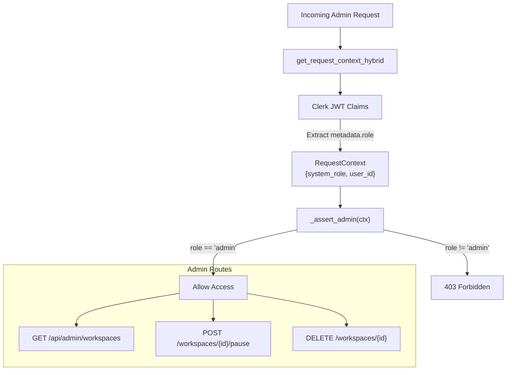
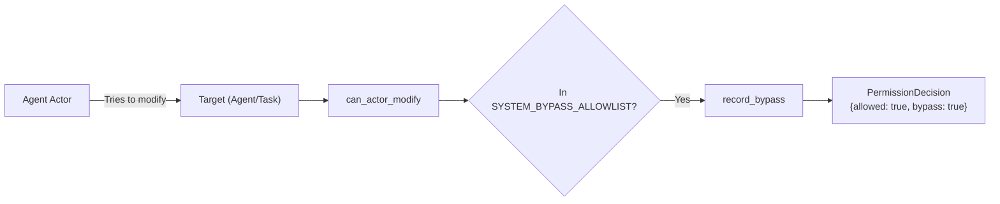

# Admin Access Control

Relevant source files

The following files were used as context for generating this wiki page:

- [docs/notes/andy-fuck-it-mode.md](docs/notes/andy-fuck-it-mode.md)
- [frontend/app/admin/workspaces/page.tsx](frontend/app/admin/workspaces/page.tsx)
- [frontend/contexts/role-context.tsx](frontend/contexts/role-context.tsx)
- [orchestrator/alembic/versions/prd140_permission_bypass_log.py](orchestrator/alembic/versions/prd140_permission_bypass_log.py)
- [orchestrator/api/admin_workspaces.py](orchestrator/api/admin_workspaces.py)
- [orchestrator/core/auth/clerk.py](orchestrator/core/auth/clerk.py)
- [orchestrator/core/security/__init__.py](orchestrator/core/security/__init__.py)
- [orchestrator/core/security/bypass_audit.py](orchestrator/core/security/bypass_audit.py)
- [orchestrator/core/security/hierarchy_permissions.py](orchestrator/core/security/hierarchy_permissions.py)
- [orchestrator/core/security/url_validator.py](orchestrator/core/security/url_validator.py)
- [orchestrator/services/workspace_purge.py](orchestrator/services/workspace_purge.py)

## Purpose and Scope

This page documents the administrative access control system in Automatos AI. Admin access control determines which users can perform platform-wide operations such as managing system settings, performing hard-deletes of workspaces, accessing cross-tenant analytics, and configuring orchestrator-level autonomous behaviors.

The system utilizes a combination of `system_role` metadata (via Clerk), explicit permission bypasses for system agents, and specialized admin services for data lifecycle management.

---

## Overview

Admin access control in Automatos AI operates on three primary levels:

1.  **System Role Authorization**: Users with `system_role = "admin"` can access admin-specific endpoints (e.g., `/api/admin/workspaces`) and UI features [orchestrator/api/admin_workspaces.py:45-53]().
2.  **Hierarchy Permission Bypass**: Specific system actors (e.g., `Auto`, `platform-admin`) are granted bypasses to modify resources across the organization hierarchy, with every bypass recorded in an audit trail [orchestrator/core/security/hierarchy_permissions.py:53-60]().
3.  **Data Purge Control**: High-privilege services like `WorkspacePurgeService` allow admins to perform irreversible hard-deletes of workspace data, including S3 objects and Clerk users [orchestrator/services/workspace_purge.py:7-15]().

---

## System Role and Authorization

### Role Resolution (Frontend & Backend)

Administrative status is resolved from the user's `publicMetadata` in Clerk. The session token is configured to include a `metadata` key containing the user's role [orchestrator/core/auth/clerk.py:122-129]().

*   **Frontend**: The `RoleProvider` extracts the role and applies a defense-in-depth check: even if a user has an "admin" role in metadata, they must possess an `@automatos.app` email domain to be granted effective admin status in the UI [frontend/contexts/role-context.tsx:49-52]().
*   **Backend**: The `_is_admin` helper verifies that `ctx.user.system_role == "admin"` before allowing access to sensitive management routes [orchestrator/api/admin_workspaces.py:45-48]().

### Authorization Flow

The following diagram illustrates how the system determines administrative privileges for platform management.

**Diagram: Admin Authorization Logic**

**Sources:** [orchestrator/core/auth/clerk.py:122-134](), [orchestrator/api/admin_workspaces.py:45-54](), [frontend/contexts/role-context.tsx:49-53]()

---

## Hierarchy Permissions and Bypasses

Automatos AI implements a hierarchical permission system (`can_actor_modify`) to control how agents interact with each other. However, certain "Platform Admin" tasks require bypassing these restrictions.

### System Bypass Allowlist
Only specific named system actors are permitted to bypass standard hierarchy checks. This is a "narrowed" bypass—the `is_system_agent` flag alone is insufficient [orchestrator/core/security/hierarchy_permissions.py:177-184]().

| Actor Name | Role |
| :--- | :--- |
| `Auto` | Workspace Orchestrator |
| `platform-admin` | Explicit admin agent for platform tasks |
| `HARNESS` | Self-optimization service actor |
| `platform-system` | Internal service actor |

**Sources:** [orchestrator/core/security/hierarchy_permissions.py:53-60](), [orchestrator/core/security/hierarchy_permissions.py:181-192]()

### Bypass Audit Trail
Every time a permission check results in a bypass, the system records the event in the `permission_bypass_log` table [orchestrator/core/security/bypass_audit.py:3-5](). This ensures accountability for administrative actions performed by system agents.

**Diagram: Permission Bypass Logic**

**Sources:** [orchestrator/core/security/hierarchy_permissions.py:53-60](), [orchestrator/core/security/bypass_audit.py:26-38](), [orchestrator/alembic/versions/prd140_permission_bypass_log.py:23-36]()

---

## Administrative Workspace Management

The `AdminWorkspacesAPI` provides the interface for platform operators to manage the lifecycle of multi-tenant workspaces.

### Lifecycle Actions
*   **Listing**: Admins can view all workspaces, including metadata such as `storage_bytes`, `agents_count`, and `owner_email` [orchestrator/api/admin_workspaces.py:172-192]().
*   **Pausing**: Admins can disable a workspace for abuse review or non-payment, which sets `paused_at` and `paused_reason` [orchestrator/api/admin_workspaces.py:255-265]().
*   **Purging**: A two-stage deletion process. A workspace is first soft-deleted, then an admin can trigger a "Hard-Delete" which invokes the `WorkspacePurgeService` [orchestrator/services/workspace_purge.py:7-15]().

### Workspace Purge Sequence
The `purge_workspace_sync` function performs a comprehensive cleanup to ensure GDPR compliance and resource reclamation:
1.  **S3 Cleanup**: Deletes all objects under `s3://{bucket}/workspaces/{id}/` [orchestrator/services/workspace_purge.py:9]().
2.  **Clerk Deletion**: Deletes the owning user from Clerk [orchestrator/services/workspace_purge.py:10-11]().
3.  **Relational Purge**: Dynamically discovers every table in the database with a `workspace_id` column and deletes the associated rows [orchestrator/services/workspace_purge.py:51-70]().

| Admin Action | Backend Function | Security Check |
| :--- | :--- | :--- |
| **List Workspaces** | `list_workspaces` | `_assert_admin(ctx)` |
| **Pause Workspace** | `pause_workspace` | `_assert_admin(ctx)` |
| **Hard Delete** | `purge_workspace_sync` | Admin-triggered Background Task |

**Sources:** [orchestrator/api/admin_workspaces.py:93-107](), [orchestrator/services/workspace_purge.py:51-70](), [orchestrator/services/workspace_purge.py:121-144]()

---

## Admin UI Components

The admin experience is centralized in the `/admin/workspaces` route.

*   **AdminWorkspacesPage**: A specialized dashboard that displays platform-wide stats (total storage, total agents) and provides controls for pausing or restoring workspaces [frontend/app/admin/workspaces/page.tsx:239-246]().
*   **Role Context**: The `useSystemRole` hook is used throughout the frontend to conditionally render admin-only navigation items and buttons [frontend/contexts/role-context.tsx:23-29]().

**Sources:** [frontend/app/admin/workspaces/page.tsx:111-136](), [frontend/contexts/role-context.tsx:15-19]()

---