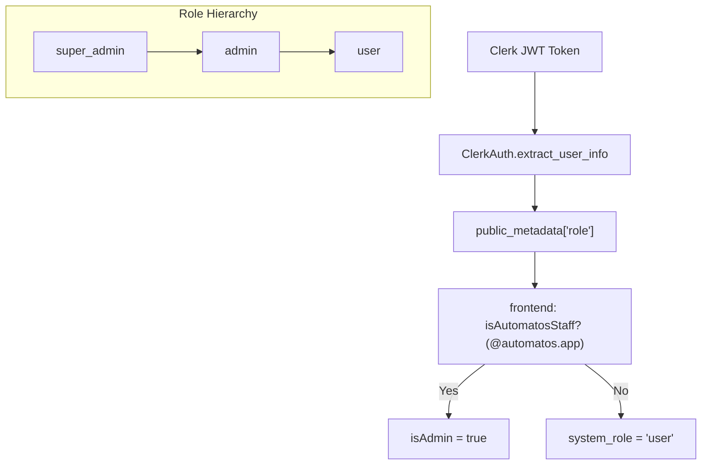
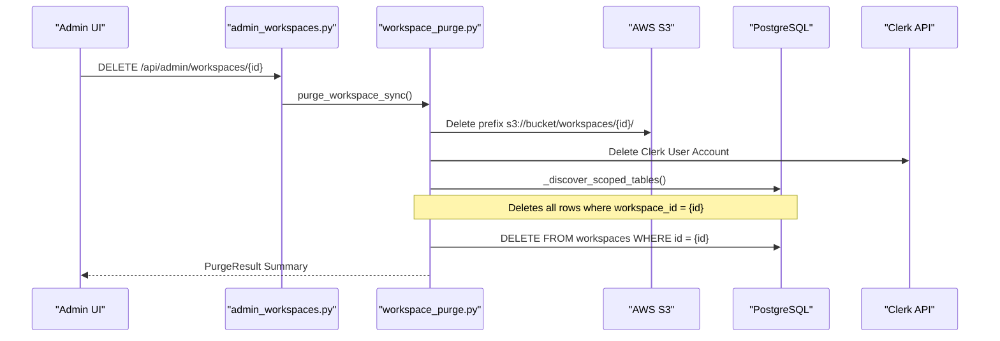
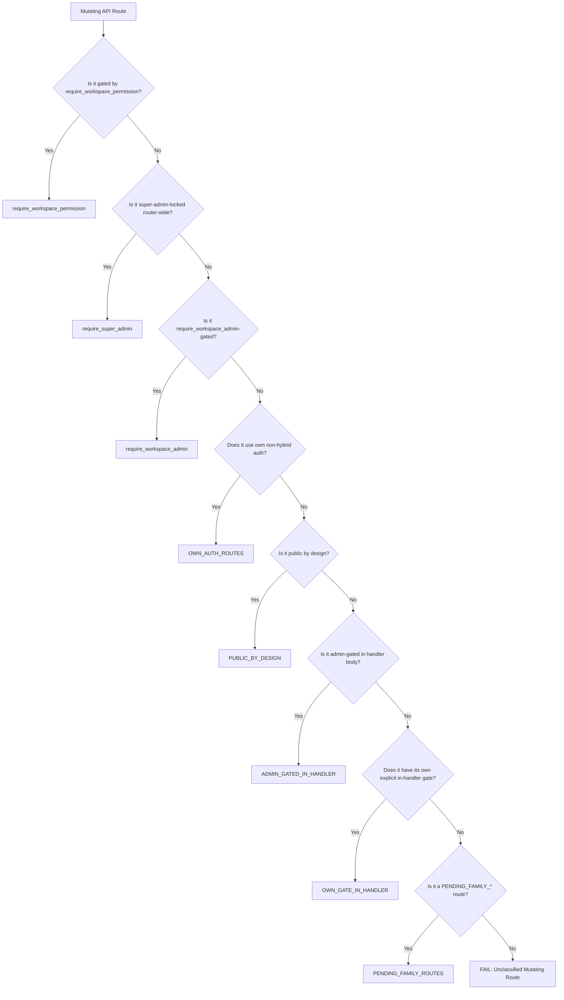

# Admin Access Control

Relevant source files

The following files were used as context for generating this wiki page:

- [docs/notes/andy-fuck-it-mode.md](docs/notes/andy-fuck-it-mode.md)
- [frontend/app/admin/workspaces/page.tsx](frontend/app/admin/workspaces/page.tsx)
- [frontend/components/__tests__/prd197-substrate-tile.test.tsx](frontend/components/__tests__/prd197-substrate-tile.test.tsx)
- [frontend/components/command-center/is-it-working-strip.tsx](frontend/components/command-center/is-it-working-strip.tsx)
- [frontend/contexts/role-context.tsx](frontend/contexts/role-context.tsx)
- [frontend/hooks/use-analytics-api.ts](frontend/hooks/use-analytics-api.ts)
- [frontend/lib/api-client.ts](frontend/lib/api-client.ts)
- [orchestrator/api/admin_workspaces.py](orchestrator/api/admin_workspaces.py)
- [orchestrator/api/workflows.py](orchestrator/api/workflows.py)
- [orchestrator/config.py](orchestrator/config.py)
- [orchestrator/core/auth/clerk.py](orchestrator/core/auth/clerk.py)
- [orchestrator/core/auth/dependencies.py](orchestrator/core/auth/dependencies.py)
- [orchestrator/core/models/substrate_metrics.py](orchestrator/core/models/substrate_metrics.py)
- [orchestrator/core/observability/substrate_metrics.py](orchestrator/core/observability/substrate_metrics.py)
- [orchestrator/core/workspaces/__init__.py](orchestrator/core/workspaces/__init__.py)
- [orchestrator/main.py](orchestrator/main.py)
- [orchestrator/reports/route-manifest.json](orchestrator/reports/route-manifest.json)
- [orchestrator/router_manifest.py](orchestrator/router_manifest.py)
- [orchestrator/services/workspace_purge.py](orchestrator/services/workspace_purge.py)
- [orchestrator/tests/authz_sweep_probe.py](orchestrator/tests/authz_sweep_probe.py)
- [orchestrator/tests/test_p2w2_authz_boundary_sweep.py](orchestrator/tests/test_p2w2_authz_boundary_sweep.py)
- [orchestrator/tests/test_p2w2_family_gates.py](orchestrator/tests/test_p2w2_family_gates.py)
- [orchestrator/tests/test_playbook_launch_parity.py](orchestrator/tests/test_playbook_launch_parity.py)
- [orchestrator/tests/test_prd154_s5_missions.py](orchestrator/tests/test_prd154_s5_missions.py)
- [orchestrator/tests/test_prd222_w2s1_plan_tiers.py](orchestrator/tests/test_prd222_w2s1_plan_tiers.py)

## Purpose and Scope

This page documents the administrative access control system in Automatos AI. Admin access control determines which users can perform platform-wide operations such as managing workspace lifecycles, performing hard purges of tenant data, and accessing global analytics. The system differentiates between **System Roles** (platform-wide) and **Workspace Roles** (tenant-specific).

For workspace-scoped permissions (Viewer/Editor/Admin), see [17.3 Data Isolation]().

---

## Overview

Admin access control in Automatos AI is governed by the `system_role` field. Unlike workspace roles which are stored in membership tables, the `system_role` is a global attribute of the user principal [orchestrator/core/auth/dependencies.py:13-19]().

The system supports three primary system roles:
*   `super_admin`: Full platform control, including destructive operations across all workspaces.
*   `admin`: Platform management capabilities.
*   `user`: Standard tenant user with no access to `/api/admin/*` endpoints.

Administrative status is enforced through `_assert_admin` checks in the backend [orchestrator/api/admin_workspaces.py:53-56]() and role-based component wrapping in the frontend [frontend/components/auth/require-role.tsx:59-69]().

---

## System Role Architecture

### Role Resolution (Clerk)
In SaaS deployments using Clerk, roles are extracted from the JWT `public_metadata`. The `ClerkAuth` client normalizes these claims, looking for a `role` key within the metadata [orchestrator/core/auth/clerk.py:122-135]().

### Frontend Defense-in-Depth
The frontend `RoleProvider` implements a secondary check for Automatos staff. Even if a Clerk metadata claim suggests an `admin` role, the system requires the user's email to end with `@automatos.app` to grant elevated privileges [frontend/contexts/role-context.tsx:48-56]().

**Diagram: System Role Resolution Flow**

**Sources:** [orchestrator/core/auth/clerk.py:122-135](), [frontend/contexts/role-context.tsx:48-56](), [orchestrator/core/auth/dependencies.py:13-28]()

---

## Admin Workspace Management

The primary surface for administrative control is the `AdminWorkspacesAPI`. This module allows platform operators to monitor and manage the lifecycle of all workspaces in the system [orchestrator/api/admin_workspaces.py:5-15]().

### Administrative Operations
| Operation | Logic | Impact |
| :--- | :--- | :--- |
| **List Workspaces** | Batched count queries for agents/docs/storage | Global visibility [orchestrator/api/admin_workspaces.py:139-165]() |
| **Pause Workspace** | Sets `paused_at` and `paused_reason` | Disables agent execution for tenant [orchestrator/api/admin_workspaces.py:76-77]() |
| **Soft Delete** | Sets `deleted_at` timestamp | Hides from standard UI [orchestrator/api/admin_workspaces.py:12-14]() |
| **Hard Purge** | Triggers `WorkspacePurgeService` | Permanent deletion of DB and S3 data [orchestrator/services/workspace_purge.py:7-15]() |

### The Purge Sequence
Hard-deleting a workspace is an idempotent background process that handles both database records and external assets [orchestrator/services/workspace_purge.py:17-19]().

**Diagram: Workspace Purge Execution**

**Sources:** [orchestrator/services/workspace_purge.py:7-15](), [orchestrator/api/admin_workspaces.py:108-109]()

---

## Security Enforcement Mechanisms

### Backend Assertion
Endpoints requiring admin access utilize the `_assert_admin` helper. This helper calls `caller_is_admin` to verify that the `UserContext` contains a role that satisfies the admin requirement [orchestrator/api/admin_workspaces.py:45-56]().

### Frontend Component Gating
The `RequireAdmin` component is used to wrap UI elements. It uses the `useSystemRole` hook to check the `isAdmin` boolean, redirecting unauthorized users to `/chat` by default [frontend/components/auth/require-role.tsx:59-69]().

### Data Purge Safety
The `_discover_scoped_tables` function dynamically identifies all tables containing a `workspace_id` column to ensure that new features are automatically included in the purge logic without manual updates to the admin service [orchestrator/services/workspace_purge.py:51-70]().

### Authz Boundary Sweeps
The codebase includes a rigorous authorization boundary sweep (`test_p2w2_authz_boundary_sweep.py`) to ensure that every mutating API route (POST, PUT, PATCH, DELETE) is explicitly classified and gated. This test verifies that routes either:
*   Carry `require_workspace_permission`.
*   Are super-admin-locked router-wide.
*   Are `require_workspace_admin`-gated.
*   Use their own non-hybrid authentication (e.g., widget plane key auth, HMAC webhooks).
*   Are public by design (e.g., `accept-invitation`).
*   Are admin-gated within the handler body using `caller_is_admin` helpers.
*   Have their own explicit in-handler gate.
*   Are temporarily marked as `PENDING_FAMILY_*` for ongoing work.

This mechanism prevents new routes from being added without proper authorization checks, ensuring a fail-closed security posture [orchestrator/tests/test_p2w2_authz_boundary_sweep.py:1-30](). The `authz_sweep_probe.py` script is used to inspect the live FastAPI application's dependency tree and endpoint source code to extract these authorization facts [orchestrator/tests/authz_sweep_probe.py:1-16]().

**Diagram: Authz Boundary Sweep Classification**

**Sources:** [orchestrator/api/admin_workspaces.py:45-56](), [frontend/components/auth/require-role.tsx:59-69](), [orchestrator/services/workspace_purge.py:51-70](), [orchestrator/tests/test_p2w2_authz_boundary_sweep.py:1-30](), [orchestrator/tests/authz_sweep_probe.py:1-16]()

---

## Bootstrap Mode and Admin Analytics

In a fresh installation or "bootstrap mode," certain administrative functionalities might be accessible to the first user or through specific configurations. This allows initial setup and configuration of the platform.

Admin analytics endpoints, such as those found in `api/admin_workspaces.py` and `api/llm_analytics.py`, provide platform-wide insights. These are typically restricted to `super_admin` or `admin` roles. For example, the `/api/admin/analytics/costs` endpoint provides cost analytics across all workspaces [orchestrator/reports/route-manifest.json:50-51](). Similarly, the `/api/admin/workspaces` endpoint allows listing and managing all workspaces [orchestrator/reports/route-manifest.json:138-139]().

Frontend components like `IsItWorkingStrip` in the Command Center display system-wide health metrics. While some metrics are accessible to workspace admins (e.g., `useSLOs`, `useWorkspaceActivation`), others like overall platform activation or cross-workspace error rates are typically reserved for platform administrators [frontend/components/command-center/is-it-working-strip.tsx:1-28](), [frontend/hooks/use-analytics-api.ts:69-140]().

**Sources:** [orchestrator/reports/route-manifest.json:50-51](), [orchestrator/reports/route-manifest.json:138-139](), [frontend/components/command-center/is-it-working-strip.tsx:1-28](), [frontend/hooks/use-analytics-api.ts:69-140]()

---