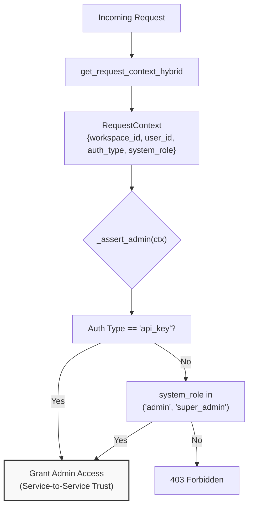
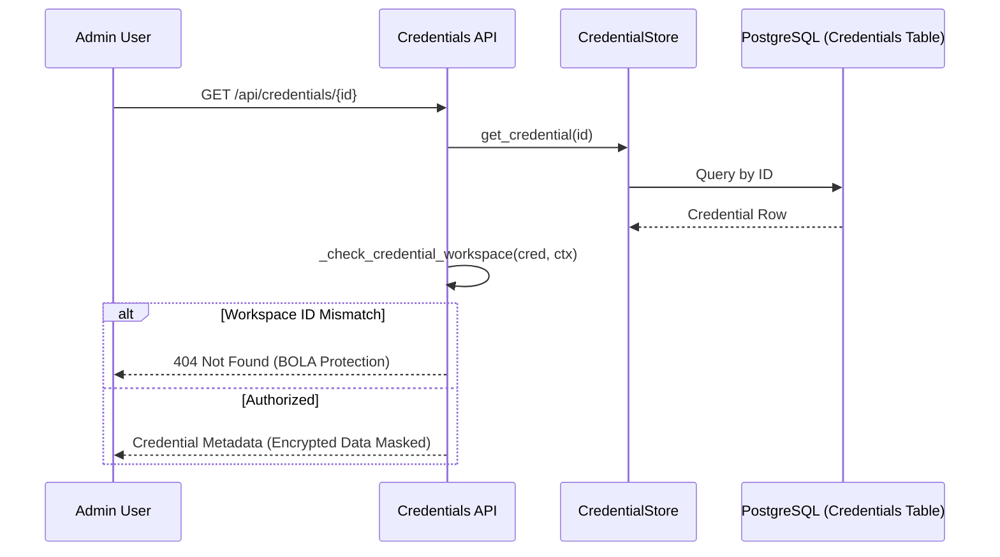

# Admin Access Control

Relevant source files

The following files were used as context for generating this wiki page:

- [orchestrator/api/admin_prompts.py](orchestrator/api/admin_prompts.py)
- [orchestrator/api/credentials.py](orchestrator/api/credentials.py)
- [orchestrator/api/database_knowledge.py](orchestrator/api/database_knowledge.py)
- [orchestrator/api/document_generation.py](orchestrator/api/document_generation.py)
- [orchestrator/api/generated_images.py](orchestrator/api/generated_images.py)
- [orchestrator/api/system_settings.py](orchestrator/api/system_settings.py)
- [orchestrator/core/database/database.py](orchestrator/core/database/database.py)
- [orchestrator/core/models/system_prompts.py](orchestrator/core/models/system_prompts.py)
- [orchestrator/core/seeds/seed_system_prompts.py](orchestrator/core/seeds/seed_system_prompts.py)
- [orchestrator/core/services/audit_service.py](orchestrator/core/services/audit_service.py)
- [orchestrator/core/services/prompt_registry.py](orchestrator/core/services/prompt_registry.py)
- [orchestrator/modules/documents/generation_service.py](orchestrator/modules/documents/generation_service.py)
- [orchestrator/modules/nl2sql/service.py](orchestrator/modules/nl2sql/service.py)

## Purpose and Scope

This page documents the administrative access control system in Automatos AI. Admin access control determines which users can perform platform-wide operations such as managing system settings, modifying global system prompts, accessing cross-tenant analytics, and configuring orchestrator-level autonomous behaviors.

For general authentication and workspace-scoped access, see [17.1 Authentication Flow](). For workspace isolation and data scoping, see [17.3 Data Isolation]().

---

## Overview

Admin access control in Automatos AI operates on two levels:

1.  **Role-Based Access**: Users with `system_role` set to `"admin"` or `"super_admin"` can access admin-specific endpoints and UI features [orchestrator/api/admin_prompts.py:53-54]().
2.  **Service-to-Service Trust**: Requests authenticated via an `api_key` (typically internal service calls) are granted administrative privileges by default to allow automated system maintenance [orchestrator/api/admin_prompts.py:51-52]().

This approach ensures that:
*   Multi-tenant SaaS deployments maintain strict role separation via Clerk JWT or API key metadata.
*   Internal services (like `agent-opt-worker`) can perform sensitive operations like updating prompt versions without a user session [orchestrator/api/admin_prompts.py:171-180]().
*   Platform operators can manage global assets like **System Prompts** and **System Settings** [orchestrator/api/system_settings.py:166-167]().

---

## System Role and Authorization

### Role Resolution

Admin status is resolved during request authentication via the hybrid auth system. The `RequestContext` object, populated by `get_request_context_hybrid`, carries the user's role information extracted from the authentication provider (e.g., Clerk metadata) [orchestrator/api/admin_prompts.py:26-27]().

### Authorization Enforcement (`_assert_admin`)

The backend enforces administrative security using a standardized internal check function, typically named `_assert_admin` or `_require_admin`. This function is called at the start of sensitive route handlers [orchestrator/api/admin_prompts.py:49-55](), [orchestrator/api/system_settings.py:38-44]().

**Diagram: Authorization Logic for Admin Privileges**

**Sources:** [orchestrator/api/admin_prompts.py:49-55](), [orchestrator/api/system_settings.py:38-44]()

---

## Admin-Managed Entities

### System Prompt Management (PRD-58)

Administrators have exclusive control over the `SystemPrompt` registry. This registry contains the core instructions for the `routing-classifier`, `task-decomposer`, and `nl2sql-generator` [orchestrator/core/seeds/seed_system_prompts.py:85-192]().

Key admin capabilities include:
*   **Version Control**: Creating new drafts of system prompts and activating them globally [orchestrator/api/admin_prompts.py:171-208]().
*   **FutureAGI Evaluation**: Triggering automated assessments, safety checks, and optimizations on prompt content [orchestrator/api/admin_prompts.py:10-11]().
*   **Interpolation Variables**: Defining required variables (e.g., `{agent_name}`, `{tools_list}`) that the platform must provide when using the prompt [orchestrator/core/models/system_prompts.py:50]().

### System Settings (Database-Backed Configuration)

The platform utilizes `SystemSetting` models to manage environment-level configurations without requiring container restarts or `.env` file modifications [orchestrator/api/system_settings.py:5-6]().

| Feature | Implementation |
| :--- | :--- |
| **Bulk Updates** | Admins can update multiple settings in a single transaction [orchestrator/api/system_settings.py:29-32](). |
| **Sensitivity** | Settings marked `is_sensitive` are masked in logs and certain UI views [orchestrator/api/system_settings.py:180-181](). |
| **Categorization** | Settings are grouped (e.g., `llm`, `storage`, `auth`) for easier management [orchestrator/api/system_settings.py:78-80](). |

**Sources:** [orchestrator/api/system_settings.py:158-187](), [orchestrator/core/models/system_settings.py:22-26]()

---

## Security Implementation Detail

### Credential Scoping and BOLA Protection

While admins manage global settings, workspace-specific credentials (like OpenAI keys or Database connection strings) are protected via Broken Object Level Authorization (BOLA) checks [orchestrator/api/credentials.py:65-68]().

The `_check_credential_workspace` helper ensures that even if a user is an admin, they cannot access credentials belonging to a different `workspace_id` unless explicitly permitted by platform-level roles [orchestrator/api/credentials.py:65-68]().

**Diagram: Credential Access and Introspection**

**Sources:** [orchestrator/api/credentials.py:65-68](), [orchestrator/api/credentials.py:184-189]()

### Bootstrap Mode and Database Initialization

On initial deployment, the system must be bootstrapped. The `PromptRegistry` includes a hardcoded fallback mechanism in `_HARDCODED_DEFAULTS` that allows the system to function (e.g., route messages) before the database is even initialized or the `seed_system_prompts` script is run [orchestrator/core/services/prompt_registry.py:149-199]().

Once the database is ready, the `PromptRegistry` transitions to a DB-first strategy:
1.  **In-memory Cache**: 60-second TTL lookup [orchestrator/core/services/prompt_registry.py:96-98]().
2.  **Database**: Fetches the `active` version of the `SystemPrompt` [orchestrator/core/services/prompt_registry.py:101-105]().
3.  **Hardcoded Fallback**: Last resort if both above fail [orchestrator/core/services/prompt_registry.py:110-113]().

**Sources:** [orchestrator/core/services/prompt_registry.py:93-115](), [orchestrator/core/seeds/seed_system_prompts.py:1-7]()

---