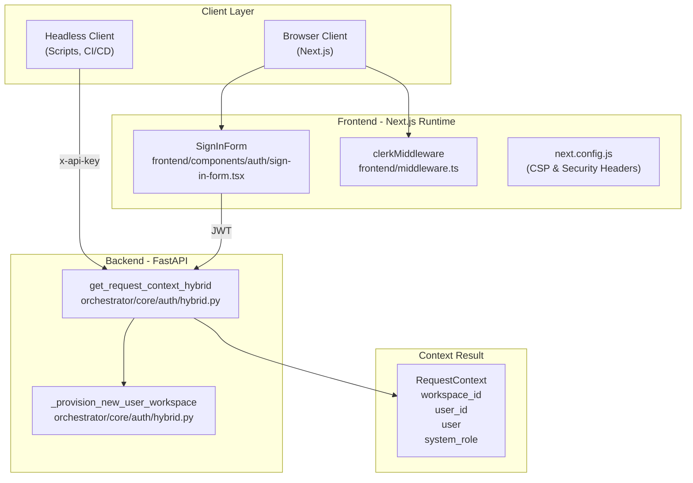
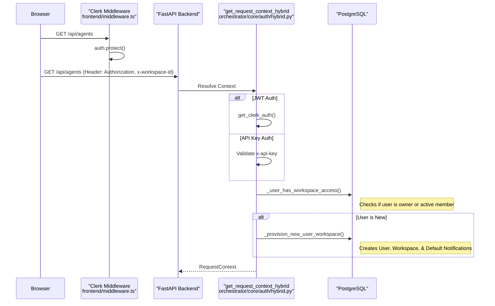

# Authentication Flow

Relevant source files

The following files were used as context for generating this wiki page:

- [docs/PRDS/53-WEBHOOK-TRIGGER-SYSTEM-PRD.md](docs/PRDS/53-WEBHOOK-TRIGGER-SYSTEM-PRD.md)
- [frontend/app/globals.css](frontend/app/globals.css)
- [frontend/app/layout.tsx](frontend/app/layout.tsx)
- [frontend/app/reset-password/page.tsx](frontend/app/reset-password/page.tsx)
- [frontend/app/sso-callback/page.tsx](frontend/app/sso-callback/page.tsx)
- [frontend/components/auth/sign-in-form.tsx](frontend/components/auth/sign-in-form.tsx)
- [frontend/components/providers.tsx](frontend/components/providers.tsx)
- [frontend/components/settings/WebhooksSettingsTab.tsx](frontend/components/settings/WebhooksSettingsTab.tsx)
- [frontend/components/ui/theme-toggle.tsx](frontend/components/ui/theme-toggle.tsx)
- [frontend/components/workspace-provider.tsx](frontend/components/workspace-provider.tsx)
- [frontend/middleware.ts](frontend/middleware.ts)
- [frontend/next.config.js](frontend/next.config.js)
- [orchestrator/alembic/versions/20260213_add_workspace_webhook_key.py](orchestrator/alembic/versions/20260213_add_workspace_webhook_key.py)
- [orchestrator/api/webhooks.py](orchestrator/api/webhooks.py)
- [orchestrator/core/auth/hybrid.py](orchestrator/core/auth/hybrid.py)
- [orchestrator/core/routing/ingestors/webhook.py](orchestrator/core/routing/ingestors/webhook.py)
- [orchestrator/tests/test_invitation_routing.py](orchestrator/tests/test_invitation_routing.py)

This page documents the hybrid authentication system in Automatos AI, which supports both interactive user sessions (via Clerk JWT) and programmatic API access (via API keys). The system enforces workspace-level multi-tenancy and provides a unified `RequestContext` object to all API endpoints.

---

## Authentication Architecture Overview

Automatos AI implements a dual-mode authentication system that accepts both **Clerk JWT tokens** (for browser-based users) and **API keys** (for headless clients, automation scripts, and external integrations).

### Code Entity Space: Authentication Components
The following diagram maps high-level concepts to specific code entities within the authentication pipeline.

**Sources:** [frontend/middleware.ts:1-16](), [orchestrator/core/auth/hybrid.py:210-230](), [frontend/components/auth/sign-in-form.tsx:41-81](), [frontend/next.config.js:35-94]()

---

## Dual Authentication Modes

### Clerk JWT (Interactive Users)

Browser-based users authenticate via Clerk. The `SignInForm` component handles email/password and OAuth strategies (Google, GitHub) [frontend/components/auth/sign-in-form.tsx:30-38](). Upon successful login, Clerk sets a session [frontend/components/auth/sign-in-form.tsx:61]().

The frontend Next.js middleware protects all routes except specific public ones [frontend/middleware.ts:3-14]().

**Public Routes:**
- `/sign-in(.*)` [frontend/middleware.ts:4]()
- `/sign-up(.*)` [frontend/middleware.ts:5]()
- `/reset-password(.*)` [frontend/middleware.ts:6]()
- `/sso-callback(.*)` [frontend/middleware.ts:7]()
- `/accept-invitation(.*)` [frontend/middleware.ts:8]()
- `/api/webhooks(.*)` [frontend/middleware.ts:9]()

### API Key (Headless & External)

Programmatic access is supported via the `get_request_context_hybrid` dependency. It checks for an `x-api-key` header and validates it against the configured system `API_KEY`.

### Workspace Identification & Multi-Tenancy

The backend resolves the `workspace_id` from the request using a prioritized resolution strategy in `_get_workspace_id_from_request` [orchestrator/core/auth/hybrid.py:47-86]():
1. Header: `x-workspace-id` [orchestrator/core/auth/hybrid.py:66]()
2. Header: `x-workspace` [orchestrator/core/auth/hybrid.py:67]()
3. Query Parameter: `workspace_id` [orchestrator/core/auth/hybrid.py:74]()
4. Environment Variable: `WORKSPACE_ID` or `DEFAULT_WORKSPACE_ID` [orchestrator/core/auth/hybrid.py:78-82]()

**Sources:** [orchestrator/core/auth/hybrid.py:47-86](), [frontend/middleware.ts:1-20](), [frontend/components/auth/sign-in-form.tsx:17-81]()

---

## Request Flow: Frontend to Backend

When a request hits the backend, `get_request_context_hybrid` performs authentication and then ensures the user has access to the specific workspace.

**Sources:** [orchestrator/core/auth/hybrid.py:144-163](), [orchestrator/core/auth/hybrid.py:210-230](), [frontend/middleware.ts:12-16]()

---

## Automatic Provisioning & Defaults

For new users signing in via Clerk, the system automatically provisions a personal workspace.

### Workspace Provisioning
The `_provision_new_user_workspace` function performs an atomic upsert of the user record and creates a default workspace [orchestrator/core/auth/hybrid.py:210-230](). It ensures the user is assigned the `owner` role in the `workspace_members` table [orchestrator/core/auth/hybrid.py:255-264]().

### Default Notification Seeding
Upon workspace creation, the system seeds default notification preferences via `_seed_default_notification_preferences` [orchestrator/core/auth/hybrid.py:154-192](). This is idempotent and uses `WHERE NOT EXISTS` to avoid duplicates [orchestrator/core/auth/hybrid.py:176-182]().

**Default Preferences (PRD-128):**
| Event Type | Default Destination |
| :--- | :--- |
| `heartbeat_complete` | `in_app` [orchestrator/core/auth/hybrid.py:202]() |
| `task_complete` | `in_app` [orchestrator/core/auth/hybrid.py:203]() |
| `mission_complete` | `in_app` [orchestrator/core/auth/hybrid.py:205]() |
| `playbook_complete` | `in_app` [orchestrator/core/auth/hybrid.py:207]() |

**Sources:** [orchestrator/core/auth/hybrid.py:154-208](), [orchestrator/core/auth/hybrid.py:210-230](), [orchestrator/tests/test_invitation_routing.py:3-12]()

---

## Edge Proxy & Frontend Security

Security is enforced at the Next.js layer via strict headers and Content Security Policy (CSP) in `next.config.js`.

### Content Security Policy (CSP)
The system enforces a strict CSP to prevent XSS and unauthorized data exfiltration [frontend/next.config.js:75-90]().

- `connect-src`: Restricted to `self`, `*.automatos.app`, Clerk auth endpoints, and WebSocket connections [frontend/next.config.js:82]().
- `script-src`: Restricts execution to trusted domains (Clerk, Cloudflare, jsdelivr) and allows `unsafe-eval` only for Next.js development mode [frontend/next.config.js:78]().
- `img-src`: Allows Clerk avatars, Google user content, and Composio logos [frontend/next.config.js:80]().

### Security Headers
Additional headers are applied to all routes [frontend/next.config.js:36-94]():
- `X-Frame-Options: DENY`: Prevents clickjacking [frontend/next.config.js:42-44]().
- `X-Content-Type-Options: nosniff`: Prevents MIME type sniffing [frontend/next.config.js:46-48]().
- `Strict-Transport-Security`: Enforces HTTPS for one year [frontend/next.config.js:58-60]().
- `X-Powered-By`: Disabled to hide technology stack details [frontend/next.config.js:8]().

**Sources:** [frontend/next.config.js:4-95](), [frontend/middleware.ts:1-20]()

---