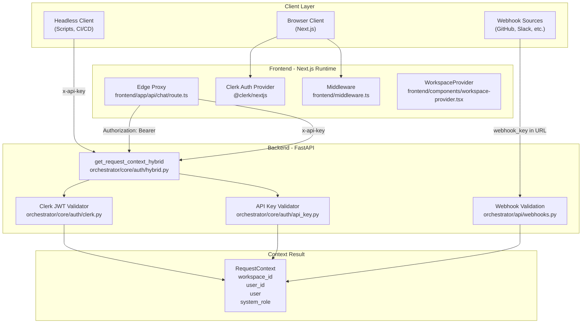
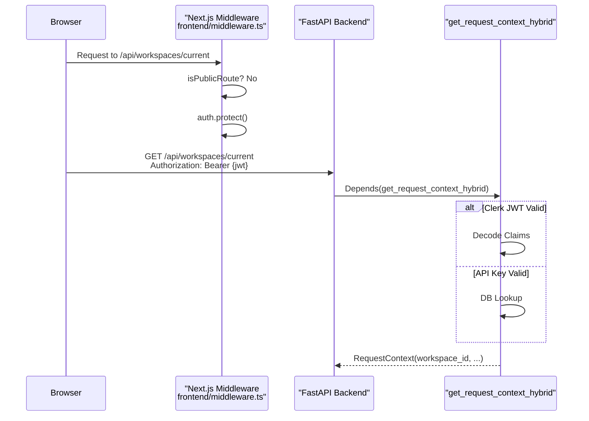

# Authentication Flow

<details>
<summary>Relevant source files</summary>

The following files were used as context for generating this wiki page:

- [docs/PRDS/53-WEBHOOK-TRIGGER-SYSTEM-PRD.md](docs/PRDS/53-WEBHOOK-TRIGGER-SYSTEM-PRD.md)
- [frontend/app/auth/signin/[[...rest]]/page.tsx](frontend/app/auth/signin/[[...rest]]/page.tsx)
- [frontend/app/auth/signup/[[...rest]]/page.tsx](frontend/app/auth/signup/[[...rest]]/page.tsx)
- [frontend/app/chat/[id]/page.tsx](frontend/app/chat/[id]/page.tsx)
- [frontend/app/sso-callback/page.tsx](frontend/app/sso-callback/page.tsx)
- [frontend/components/onboarding/first-login-guard.tsx](frontend/components/onboarding/first-login-guard.tsx)
- [frontend/components/onboarding/welcome-modal.tsx](frontend/components/onboarding/welcome-modal.tsx)
- [frontend/components/settings/SettingsPanel.tsx](frontend/components/settings/SettingsPanel.tsx)
- [frontend/components/settings/SystemLLMSettingsTab.tsx](frontend/components/settings/SystemLLMSettingsTab.tsx)
- [frontend/components/settings/SystemSettingsTab.tsx](frontend/components/settings/SystemSettingsTab.tsx)
- [frontend/components/settings/WebhooksSettingsTab.tsx](frontend/components/settings/WebhooksSettingsTab.tsx)
- [frontend/components/workspace-provider.tsx](frontend/components/workspace-provider.tsx)
- [frontend/hooks/use-tour-tab-bridge.ts](frontend/hooks/use-tour-tab-bridge.ts)
- [frontend/lib/shepherd/tour-bridge.ts](frontend/lib/shepherd/tour-bridge.ts)
- [frontend/lib/shepherd/tour-storage.ts](frontend/lib/shepherd/tour-storage.ts)
- [frontend/middleware.ts](frontend/middleware.ts)
- [frontend/next.config.js](frontend/next.config.js)
- [frontend/styles/shepherd-custom.css](frontend/styles/shepherd-custom.css)
- [orchestrator/alembic/versions/20260213_add_workspace_webhook_key.py](orchestrator/alembic/versions/20260213_add_workspace_webhook_key.py)
- [orchestrator/api/webhooks.py](orchestrator/api/webhooks.py)
- [orchestrator/api/workspaces.py](orchestrator/api/workspaces.py)
- [orchestrator/core/models/routing.py](orchestrator/core/models/routing.py)
- [orchestrator/core/routing/ingestors/webhook.py](orchestrator/core/routing/ingestors/webhook.py)
- [orchestrator/modules/tools/discovery/actions_harness.py](orchestrator/modules/tools/discovery/actions_harness.py)
- [orchestrator/modules/tools/discovery/handlers_harness.py](orchestrator/modules/tools/discovery/handlers_harness.py)
- [orchestrator/modules/tools/discovery/handlers_missions.py](orchestrator/modules/tools/discovery/handlers_missions.py)
- [orchestrator/scripts/seed_blog_playbook.py](orchestrator/scripts/seed_blog_playbook.py)
- [orchestrator/services/harness_service.py](orchestrator/services/harness_service.py)

</details>


This page documents the hybrid authentication system in Automatos AI, which supports both interactive user sessions (via Clerk JWT) and programmatic API access (via API keys). The system enforces workspace-level multi-tenancy and provides a unified `RequestContext` object to all API endpoints.

---

## Authentication Architecture Overview

Automatos AI implements a dual-mode authentication system that accepts both **Clerk JWT tokens** (for browser-based users) and **API keys** (for headless clients, automation scripts, and external integrations).

### Code Entity Space: Authentication Components
The following diagram maps high-level concepts to specific code entities within the authentication pipeline.



**Sources:** [frontend/middleware.ts:1-18](), [orchestrator/api/workspaces.py:21-22](), [orchestrator/api/webhooks.py:44-85](), [frontend/components/workspace-provider.tsx:49-122]()

---

## Dual Authentication Modes

### Clerk JWT (Interactive Users)

Browser-based users authenticate via Clerk. The frontend Next.js middleware protects all routes except specific public ones like sign-in and webhooks [frontend/middleware.ts:3-14]().

**Public Routes:**
- `/sign-in(.*)`
- `/sign-up(.*)`
- `/sso-callback(.*)`
- `/api/webhooks(.*)`

The backend validates the Clerk JWT token to extract user identity and system roles. This is primarily handled via the `get_request_context_hybrid` dependency [orchestrator/api/workspaces.py:40-44]().

### API Key (Headless & External)

API keys are used for programmatic access. The system supports three tiers of API key resolution:
1. **BYOK (Bring Your Own Key):** Managed via workspace settings [orchestrator/api/workspaces.py:164-183]().
2. **Platform Credentials:** Stored in the encrypted credential store.
3. **Environment Variables:** Fallback for system-level operations.

### Webhook Authentication (URL-as-Secret)

Webhooks use a "URL-as-secret" pattern. General workspace webhooks are authenticated via a `workspace_key` (a unique UUID) embedded in the URL path: `/api/webhooks/ws/{workspace_key}` [orchestrator/api/webhooks.py:6-8]().

For higher security, the system supports HMAC-SHA256 signature verification for platforms like GitHub, Slack, and Composio [orchestrator/api/webhooks.py:44-85]().

**Sources:** [orchestrator/api/webhooks.py:6-12](), [orchestrator/api/workspaces.py:62-69](), [orchestrator/api/workspaces.py:164-203]()

---

## Request Flow: Frontend to Backend

The authentication flow follows a sequence from the browser through the Next.js middleware to the FastAPI backend.



**Sources:** [frontend/middleware.ts:10-14](), [orchestrator/api/workspaces.py:40-44](), [frontend/components/workspace-provider.tsx:65-75]()

---

## Backend Authentication Pipeline

The `get_request_context_hybrid` function is the central gateway. It is used across various API modules including workspaces, agents, and chat.

### Endpoint Integration Pattern

```python
# Example from orchestrator/api/workspaces.py:40-43
@router.get("/current")
async def get_current_workspace(
    ctx: RequestContext = Depends(get_request_context_hybrid),
    db: Session = Depends(get_db),
):
    # ctx.workspace_id is used to fetch the active workspace
    workspace = db.query(Workspace).get(ctx.workspace_id)
```

### Workspace Context Resolution

The `RequestContext` provides the following critical fields:
- `workspace_id`: The UUID of the active workspace [orchestrator/api/workspaces.py:42]().
- `user`: The authenticated user object (contains `role`) [orchestrator/api/workspaces.py:87]().
- `system_role`: Extracted from the user profile for RBAC.

**Sources:** [orchestrator/api/workspaces.py:40-54](), [frontend/components/workspace-provider.tsx:11-30]()

---

## Workspace Context Injection

The workspace ID flows through the entire request lifecycle to enforce multi-tenant isolation.

### Frontend Workspace Management
The `WorkspaceProvider` [frontend/components/workspace-provider.tsx:49-122]() manages the active workspace state. The frontend identifies the "current" workspace via `GET /api/workspaces/current` [orchestrator/api/workspaces.py:40-44](). Upon successful fetch, the `workspace_id` is persisted in `localStorage` as `last_active_workspace` [frontend/components/workspace-provider.tsx:96-98]().

### Backend Isolation
Every database query is filtered by the `workspace_id` provided in the `RequestContext`.

| Component | Usage of RequestContext | File Reference |
|-----------|-------------------------|----------------|
| **Workspaces** | Filters settings and integration tokens | [orchestrator/api/workspaces.py:54-61]() |
| **Routing** | Scopes routing rules and decisions | [orchestrator/core/models/routing.py:95]() |
| **Harness** | Filters active workspaces for optimization | [orchestrator/services/harness_service.py:104-108]() |

**Sources:** [orchestrator/api/workspaces.py:54-61](), [orchestrator/core/models/routing.py:113](), [orchestrator/services/harness_service.py:104-108]()

---

## Edge Proxy Security

Security is enforced at the Next.js layer via strict headers and CSP.

### Content Security Policy (CSP)
The system enforces a strict CSP via `next.config.js` to prevent XSS and unauthorized data exfiltration [frontend/next.config.js:62-77]().

- `connect-src`: Restricted to self, `*.automatos.app`, Clerk auth endpoints, and `cdn.jsdelivr.net` [frontend/next.config.js:69]().
- `frame-ancestors`: Set to `none` to prevent clickjacking [frontend/next.config.js:75]().
- `script-src`: Restricts execution to trusted domains (Clerk, Cloudflare) and prevents inline scripts except where necessary for Next.js [frontend/next.config.js:65]().

### Security Headers
Additional headers are applied to all routes [frontend/next.config.js:23-51]():
- `X-Frame-Options: DENY` [frontend/next.config.js:29-31]()
- `X-Content-Type-Options: nosniff` [frontend/next.config.js:33-35]()
- `Strict-Transport-Security`: Enforces HTTPS for one year (`max-age=31536000`) [frontend/next.config.js:45-47]().
- `Referrer-Policy`: Set to `strict-origin-when-cross-origin` [frontend/next.config.js:37-39]().

**Sources:** [frontend/next.config.js:22-81]()

---

## Management UI

Users manage their authentication and security settings through various settings tabs in the `SettingsPanel` [frontend/components/settings/SettingsPanel.tsx:14-103]().

### Security Tabs
- **BYOK Preferences:** Manage per-provider API key overrides (OpenAI, Anthropic, etc.) via `ApiKeysSettingsTab` [frontend/components/settings/SettingsPanel.tsx:77-79]() and backend preferences [orchestrator/api/workspaces.py:164-203]().
- **Webhooks:** View the workspace-specific webhook URL and key in `WebhooksSettingsTab` [frontend/components/settings/WebhooksSettingsTab.tsx:24-40]().
- **Integrations:** Save platform-specific credentials like `telegram_bot_token` or `slack_bot_token` [orchestrator/api/workspaces.py:118-156]().
- **Credentials:** General credential management via `CredentialsTab` [frontend/components/settings/SettingsPanel.tsx:82-84]().

**Sources:** [frontend/components/settings/SettingsPanel.tsx:14-103](), [frontend/components/settings/WebhooksSettingsTab.tsx:24-38](), [orchestrator/api/workspaces.py:30-37](), [orchestrator/api/workspaces.py:118-156]()

---