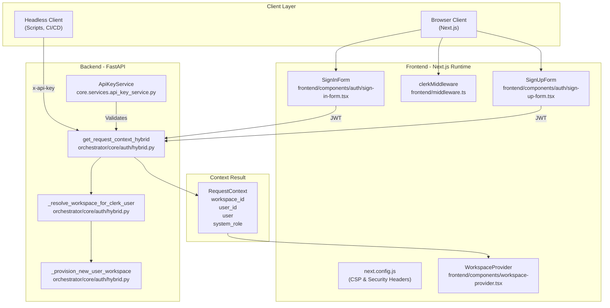
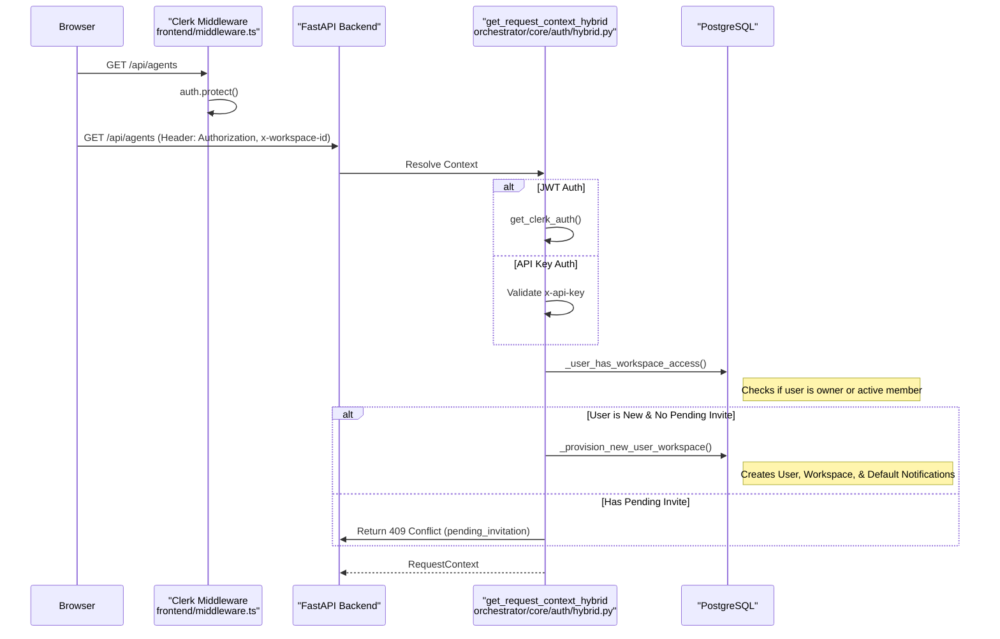

# Authentication Flow

Relevant source files

The following files were used as context for generating this wiki page:

- [frontend/app/accept-invitation/page.tsx](frontend/app/accept-invitation/page.tsx)
- [frontend/app/reset-password/page.tsx](frontend/app/reset-password/page.tsx)
- [frontend/app/sign-in/[[...rest]]/page.tsx](frontend/app/sign-in/[[...rest]]/page.tsx)
- [frontend/app/sign-up/[[...rest]]/page.tsx](frontend/app/sign-up/[[...rest]]/page.tsx)
- [frontend/app/sso-callback/page.tsx](frontend/app/sso-callback/page.tsx)
- [frontend/app/tools/callback/page.tsx](frontend/app/tools/callback/page.tsx)
- [frontend/components/__tests__/prd175-auth-edition.test.tsx](frontend/components/__tests__/prd175-auth-edition.test.tsx)
- [frontend/components/auth/sign-in-form.tsx](frontend/components/auth/sign-in-form.tsx)
- [frontend/components/auth/sign-up-form.tsx](frontend/components/auth/sign-up-form.tsx)
- [frontend/components/landing/landing-page.tsx](frontend/components/landing/landing-page.tsx)
- [frontend/components/local-auth-provider.tsx](frontend/components/local-auth-provider.tsx)
- [frontend/components/settings/WebhooksSettingsTab.tsx](frontend/components/settings/WebhooksSettingsTab.tsx)
- [frontend/components/workflows/json-schema-editor.tsx](frontend/components/workflows/json-schema-editor.tsx)
- [frontend/components/workflows/playbook-step-progress.tsx](frontend/components/workflows/playbook-step-progress.tsx)
- [frontend/components/workflows/theater/theater-step-execution.tsx](frontend/components/workflows/theater/theater-step-execution.tsx)
- [frontend/components/workspace-provider.tsx](frontend/components/workspace-provider.tsx)
- [frontend/lib/auth-edition.ts](frontend/lib/auth-edition.ts)
- [frontend/middleware.ts](frontend/middleware.ts)
- [frontend/next.config.js](frontend/next.config.js)
- [frontend/package-lock.json](frontend/package-lock.json)
- [frontend/package.json](frontend/package.json)
- [orchestrator/alembic/versions/add_clerk_invitation_id.py](orchestrator/alembic/versions/add_clerk_invitation_id.py)
- [orchestrator/alembic/versions/prd_workspace_models_backfill.py](orchestrator/alembic/versions/prd_workspace_models_backfill.py)
- [orchestrator/api/heartbeat.py](orchestrator/api/heartbeat.py)
- [orchestrator/channels/discord_adapter.py](orchestrator/channels/discord_adapter.py)
- [orchestrator/channels/slack_adapter.py](orchestrator/channels/slack_adapter.py)
- [orchestrator/core/auth/hybrid.py](orchestrator/core/auth/hybrid.py)
- [orchestrator/core/composio/entity_manager.py](orchestrator/core/composio/entity_manager.py)
- [orchestrator/core/models/workspaces.py](orchestrator/core/models/workspaces.py)
- [orchestrator/services/trial_ledger.py](orchestrator/services/trial_ledger.py)
- [orchestrator/services/workspace_model_seeding.py](orchestrator/services/workspace_model_seeding.py)
- [orchestrator/tests/test_invitation_routing.py](orchestrator/tests/test_invitation_routing.py)
- [orchestrator/tests/test_prd175_auth_edition.py](orchestrator/tests/test_prd175_auth_edition.py)
- [orchestrator/tests/test_prd222_trial_enforcement.py](orchestrator/tests/test_prd222_trial_enforcement.py)
- [orchestrator/tests/test_prd222_trial_ledger.py](orchestrator/tests/test_prd222_trial_ledger.py)
- [orchestrator/tests/test_prd230_chat_trial_metering.py](orchestrator/tests/test_prd230_chat_trial_metering.py)
- [orchestrator/tests/test_workspace_model_seeding.py](orchestrator/tests/test_workspace_model_seeding.py)

This page documents the hybrid authentication system in Automatos AI, which supports both interactive user sessions (via Clerk JWT) and programmatic API access (via API keys). The system enforces workspace-level multi-tenancy and provides a unified `RequestContext` object to all API endpoints.

---

## Authentication Architecture Overview

Automatos AI implements a dual-mode authentication system that accepts both **Clerk JWT tokens** (for browser-based users) and **API keys** (for headless clients, automation scripts, and external integrations).

### Code Entity Space: Authentication Components
The following diagram maps high-level concepts to specific code entities within the authentication pipeline.

**Sources:** [frontend/middleware.ts:1-33](), [orchestrator/core/auth/hybrid.py:200-230](), [frontend/components/auth/sign-in-form.tsx:41-81](), [frontend/next.config.js:4-112](), [frontend/components/workspace-provider.tsx:91-204](), [frontend/components/auth/sign-up-form.tsx:17-81]()

---

## Dual Authentication Modes

### Clerk JWT (Interactive Users)

Browser-based users authenticate via Clerk. The `SignInForm` component handles email/password and OAuth strategies (Google, GitHub) [frontend/components/auth/sign-in-form.tsx:30-38](). Upon successful login, Clerk sets a session [frontend/components/auth/sign-in-form.tsx:61](). The `SignUpForm` component handles new user registration [frontend/components/auth/sign-up-form.tsx:17-81]().

The frontend Next.js middleware protects all routes except specific public ones [frontend/middleware.ts:11-24](). It supports two editions: `saas` (Clerk-protected) and `local` (fully public/no auth) [frontend/middleware.ts:5-29]().

**Public Routes:**
- `/sign-in(.*)` [frontend/app/sign-in/[[...rest]]/page.tsx:1-28]()
- `/sign-up(.*)` [frontend/app/sign-up/[[...rest]]/page.tsx:1-28]()
- `/reset-password(.*)` [frontend/app/reset-password/page.tsx:15-20]()
- `/sso-callback(.*)` [frontend/app/sso-callback/page.tsx:5-13]()
- `/accept-invitation(.*)` [frontend/app/accept-invitation/page.tsx:27-30]()
- `/api/webhooks(.*)`

### API Key (Headless & External)

Programmatic access is supported via the `get_request_context_hybrid` dependency. It checks for an `x-api-key` header and validates it against the configured system `API_KEY` or `ApiKeyService` [orchestrator/core/auth/hybrid.py:18-19]().

### Workspace Identification & Multi-Tenancy

The backend resolves the `workspace_id` from the request using a prioritized resolution strategy in `_get_workspace_id_from_request` [orchestrator/core/auth/hybrid.py:49-88]():
1. Header: `x-workspace-id` [orchestrator/core/auth/hybrid.py:68]()
2. Header: `x-workspace` [orchestrator/core/auth/hybrid.py:69]()
3. Query Parameter: `workspace_id` [orchestrator/core/auth/hybrid.py:76]()
4. Environment Variable: `WORKSPACE_ID` or `DEFAULT_WORKSPACE_ID` [orchestrator/core/auth/hybrid.py:80-84]()

**Sources:** [orchestrator/core/auth/hybrid.py:49-88](), [frontend/middleware.ts:1-33](), [frontend/components/auth/sign-in-form.tsx:17-81](), [frontend/components/auth/sign-up-form.tsx:17-81](), [frontend/app/sign-in/[[...rest]]/page.tsx:1-28](), [frontend/app/sign-up/[[...rest]]/page.tsx:1-28]()

---

## Request Flow: Frontend to Backend

When a request hits the backend, `get_request_context_hybrid` performs authentication and then ensures the user has access to the specific workspace.

**Sources:** [orchestrator/core/auth/hybrid.py:128-166](), [orchestrator/core/auth/hybrid.py:168-198](), [frontend/middleware.ts:20-24](), [orchestrator/tests/test_invitation_routing.py:123-142]()

---

## Automatic Provisioning & Invitation Handling

For new users signing in via Clerk, the system automatically provisions a personal workspace unless a pending invitation is detected.

### Invitation Gating (PRD-128)
To prevent new users from accidentally auto-provisioning a personal workspace when they were intended for a team, `_resolve_workspace_for_clerk_user` checks for pending invitations via `_has_pending_invitations` [orchestrator/core/auth/hybrid.py:168-175](). If a pending invitation exists, auto-provisioning is skipped, and the frontend redirects to `/accept-invitation` [frontend/components/workspace-provider.tsx:122-140]().

### Workspace Provisioning
The `_provision_new_user_workspace` function performs an atomic upsert of the user record and creates a default workspace. It seeds 9 default notification preferences via `DEFAULT_NOTIFICATION_PREFERENCES` [orchestrator/core/auth/hybrid.py:203-207]().

**Default Preferences (PRD-128):**
| Event Type | Default Destination |
| :--- | :--- |
| `heartbeat_complete` | `in_app` |
| `task_complete` | `in_app` |
| `mission_complete` | `in_app` |
| `mission_step_complete` | `silent` |

**Sources:** [orchestrator/core/auth/hybrid.py:168-198](), [orchestrator/core/auth/hybrid.py:203-207](), [frontend/components/workspace-provider.tsx:122-140](), [orchestrator/tests/test_invitation_routing.py:1-12]()

---

## Edge Proxy & Frontend Security

Security is enforced at the Next.js layer via strict headers and Content Security Policy (CSP) in `next.config.js`.

### Content Security Policy (CSP)
The system enforces a strict CSP to prevent XSS and unauthorized data exfiltration [frontend/next.config.js:90-105]().

- `connect-src`: Restricted to `self`, `*.automatos.app`, `*.clerk.accounts.dev`, and `api.clerk.com` [frontend/next.config.js:97](). The `apiOrigin` variable dynamically includes the `NEXT_PUBLIC_API_URL` origin for local development [frontend/next.config.js:5-11]().
- `script-src`: Restricts execution to trusted domains (Clerk, Cloudflare, jsdelivr) and allows `unsafe-eval` for Next.js dev mode [frontend/next.config.js:93]().
- `img-src`: Specifically allows Clerk avatars, Google user content, and Composio logos [frontend/next.config.js:95]().

### Security Headers
Additional headers are applied to all routes [frontend/next.config.js:51-108]():
- `X-Frame-Options: DENY`: Prevents clickjacking [frontend/next.config.js:57-59]().
- `X-Content-Type-Options: nosniff`: Prevents MIME type sniffing [frontend/next.config.js:61-63]().
- `Strict-Transport-Security`: Enforces HTTPS for one year [frontend/next.config.js:73-75]().
- `X-Powered-By`: Disabled to hide technology stack details [frontend/next.config.js:8]().

**Sources:** [frontend/next.config.js:4-112](), [frontend/middleware.ts:31-33]()

---