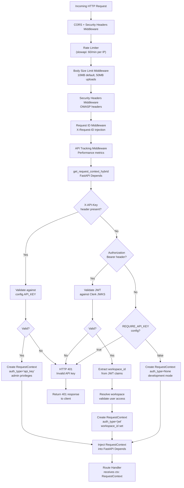
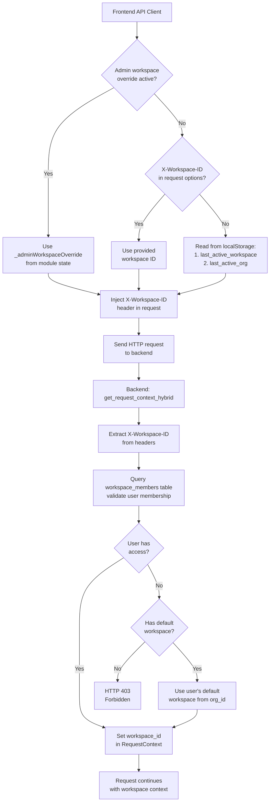
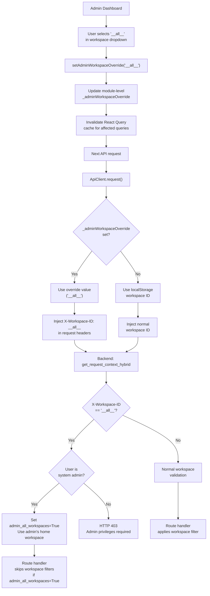
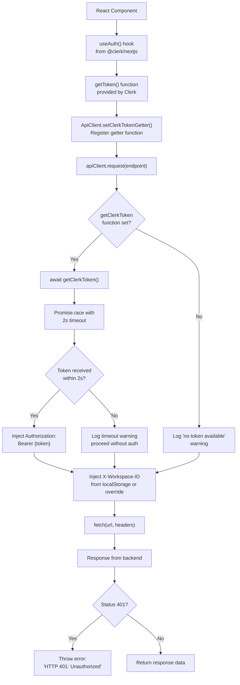
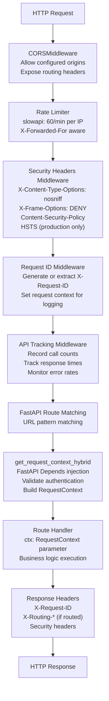

# Authentication Flow

<details>
<summary>Relevant source files</summary>

The following files were used as context for generating this wiki page:

- [frontend/app/admin/plugins/page.tsx](frontend/app/admin/plugins/page.tsx)
- [frontend/lib/api-client.ts](frontend/lib/api-client.ts)
- [orchestrator/.env.example](orchestrator/.env.example)
- [orchestrator/api/agent_plugins.py](orchestrator/api/agent_plugins.py)
- [orchestrator/config.py](orchestrator/config.py)
- [orchestrator/core/database/load_seed_data.py](orchestrator/core/database/load_seed_data.py)
- [orchestrator/core/seeds/seed_personas.py](orchestrator/core/seeds/seed_personas.py)
- [orchestrator/core/seeds/seed_plugin_categories.py](orchestrator/core/seeds/seed_plugin_categories.py)
- [orchestrator/core/services/plugin_cache.py](orchestrator/core/services/plugin_cache.py)
- [orchestrator/main.py](orchestrator/main.py)
- [scripts/ralph/prd.json](scripts/ralph/prd.json)

</details>


## Purpose and Scope

This document describes the authentication and authorization mechanisms in the Automatos AI platform, covering how incoming HTTP requests are validated, how user identity and workspace context are established, and how this information flows through the system. For information about workspace isolation and multi-tenancy data filtering, see [Data Isolation](#12.3). For credential management and storage, see [Credentials Management](#12.4).

---

## Authentication Architecture Overview

The Automatos AI platform implements a **hybrid authentication system** that supports two authentication methods:

1. **Clerk JWT tokens** - For user sessions via the web frontend
2. **API keys** - For programmatic access and service-to-service communication

All authenticated endpoints receive a `RequestContext` object containing the validated user identity, workspace ID, and authorization metadata. This context flows through the entire request lifecycle, ensuring workspace isolation and proper access control.

**Sources:** [orchestrator/main.py:1-50](), [Diagram 7: Multi-Tenancy and Security Architecture]()

---

## Authentication Methods

### Clerk JWT Authentication

The primary authentication method for web users is Clerk JWT validation. The backend validates JWT tokens against Clerk's JWKS endpoint to verify authenticity.

**Key characteristics:**
- Tokens provided in `Authorization: Bearer <token>` header
- Validated against Clerk JWKS (JSON Web Key Set)
- Workspace ID extracted from JWT claims or resolved via org_id
- Session-based authentication for interactive users

**Configuration:**
- Backend requires `CLERK_SECRET_KEY` and optionally `CLERK_JWKS_URL` for JWT validation
- Frontend requires `NEXT_PUBLIC_CLERK_PUBLISHABLE_KEY` for Clerk SDK initialization
- Optional `CLERK_AUDIENCE` for JWT audience validation
- JWT validation happens on every request via `get_request_context_hybrid` dependency

**Sources:** [orchestrator/config.py:169-175]()

### API Key Authentication

For programmatic access (scripts, integrations, automation), the platform supports API key authentication:

**Key characteristics:**
- Provided in `X-API-Key` header
- Matched against `ORCHESTRATOR_API_KEY` (with fallbacks to `AUTOMATOS_API_KEY` or `API_KEY`)
- Grants admin-level access across all workspaces
- Bypasses Clerk JWT validation entirely

**Configuration:**
```bash
ORCHESTRATOR_API_KEY=your_secure_api_key_here
REQUIRE_API_KEY=true  # Enable/disable API key requirement
REQUIRE_AUTH=true     # Master auth switch (default: true)
AUTH_DEBUG=false      # Enable auth debug logging
```

The configuration uses a fallback chain: `ORCHESTRATOR_API_KEY` → `AUTOMATOS_API_KEY` → `API_KEY`, allowing flexibility in naming conventions.

**Sources:** [orchestrator/config.py:84-88]()

---

## Hybrid Authentication System

### Request Authentication Flow



**Sources:** [orchestrator/main.py:560-688](), [Diagram 2: Request Processing Pipeline]()

---

## RequestContext Structure

The `RequestContext` object is the central data structure for authentication and authorization throughout the platform:

```python
@dataclass
class RequestContext:
    workspace_id: UUID          # Active workspace for request
    user: User                  # Authenticated user object (or None for API key)
    auth_type: str              # 'jwt' | 'api_key' | None
    admin_all_workspaces: bool  # True if admin override enabled
```

**Key properties:**

| Field | Type | Description |
|-------|------|-------------|
| `workspace_id` | `UUID` | The workspace context for the request. All database queries are filtered by this ID. |
| `user` | `User \| None` | The authenticated user object from the database. None for API key auth. |
| `auth_type` | `str \| None` | Authentication method used: `'jwt'`, `'api_key'`, or `None` (dev mode). |
| `admin_all_workspaces` | `bool` | If True, enables cross-workspace admin queries (see Admin Override Pattern). |

**Sources:** [orchestrator/main.py:17](), [orchestrator/core/auth/hybrid.py]() (imported but not provided in context)

---

## Workspace Resolution

### Workspace ID Injection

The workspace context is established through a two-step process:

1. **Frontend injection**: The `X-Workspace-ID` header is injected by the frontend
2. **Backend validation**: The backend validates the user has access to the workspace



**Special case: Bootstrap mode**

For new installations with ≤2 active workspaces, the first user is automatically promoted to admin with cross-workspace access. This enables initial setup without manual admin assignment.

**Single-Tenant Mode:**

The platform supports a single-tenant deployment mode with a default tenant UUID:
```python
DEFAULT_TENANT_ID = UUID("00000000-0000-0000-0000-000000000000")
```

This simplifies deployment for organizations that don't require multi-tenancy.

**Sources:** [frontend/lib/api-client.ts:854-862](), [orchestrator/config.py:19-22](), [Diagram 8: Multi-Tenancy & Security Model]()

---

## Admin Workspace Override

Administrators can view platform-wide analytics and data across all workspaces using a special **`__all__` sentinel value** in the `X-Workspace-ID` header.

### Override Mechanism



**Implementation details:**

- **Frontend**: `_adminWorkspaceOverride` module-level variable in `api-client.ts` [frontend/lib/api-client.ts:83-91]()
- **Backend**: Checks `admin_all_workspaces` flag in `RequestContext` to skip workspace filters
- **Security**: Only users with `system_role='admin'` or bootstrap bypass can use this feature
- **Cache invalidation**: React Query cache is invalidated when override changes to prevent stale data

**Sources:** [frontend/lib/api-client.ts:83-91, 854-862](), [Diagram 7: Multi-Tenancy and Security Architecture]()

---

## Frontend Authentication Integration

### API Client Configuration

The frontend `ApiClient` class in `api-client.ts` handles authentication injection for all API requests.

**Clerk Token Injection Flow:**



**Key implementation details:**

- **Token getter**: Set via `setClerkTokenGetter()` from a component with `useAuth()` access [frontend/lib/api-client.ts:160-163]()
- **Timeout protection**: 2-second timeout prevents hanging if Clerk is slow [frontend/lib/api-client.ts:832-835]()
- **Workspace injection**: Always includes `X-Workspace-ID` header for multi-tenancy [frontend/lib/api-client.ts:854-862]()
- **Error handling**: 401 responses throw descriptive errors prompting sign-in [frontend/lib/api-client.ts:896-902]()

**Sources:** [frontend/lib/api-client.ts:93-154, 819-909]()

---

## Middleware Stack

The authentication flow is part of a larger middleware stack that processes every request:



**Middleware responsibilities:**

| Middleware | Purpose | Configuration |
|------------|---------|---------------|
| **CORS** | Allow cross-origin requests from configured domains | `CORS_ALLOW_ORIGINS` env var (comma-separated list) |
| **Widget CORS** | Special CORS handling for embeddable widgets | Optional `WidgetCORSMiddleware` if widget API available |
| **Widget Rate Limit** | Separate rate limiting for widget SDK requests | Optional `WidgetRateLimitMiddleware` |
| **Rate Limiter** | Prevent abuse with per-IP rate limiting (60/min default) | `slowapi` with `_get_real_client_ip` respecting `X-Forwarded-For` |
| **Body Size Limit** | Enforce request size limits | 10MB default, 50MB for upload endpoints |
| **Security Headers** | OWASP-recommended security headers | `X-Content-Type-Options`, `X-Frame-Options`, `Referrer-Policy`, `Permissions-Policy`, CSP, HSTS (production only) |
| **Request ID** | Unique ID for tracing and log correlation | Auto-generated UUID or from `X-Request-ID` header, exposed in response |
| **API Tracking** | Performance metrics and endpoint health monitoring | In-memory deque (last 100 calls/endpoint), max 500 endpoints tracked |

**Implementation details:**

- **CORS origins parsing**: Splits comma-separated origins and strips whitespace [orchestrator/main.py:557-558]()
- **Real IP extraction**: Uses `X-Forwarded-For` header when behind reverse proxy [orchestrator/main.py:587-592]()
- **Request ID context**: Uses contextvars for thread-safe request ID tracking [orchestrator/main.py:632-641]()
- **Stats capping**: Limits stats dictionary growth to prevent memory exhaustion [orchestrator/main.py:670-673]()

**Sources:** [orchestrator/main.py:560-688](), [orchestrator/config.py:98-99](), [Diagram 2: Request Processing Pipeline]()

---

## Configuration Reference

### Environment Variables

Authentication behavior is controlled by these configuration settings:

| Variable | Type | Default | Description |
|----------|------|---------|-------------|
| `ORCHESTRATOR_API_KEY` | string | None | Primary secret key for API key authentication (fallback chain: `AUTOMATOS_API_KEY` → `API_KEY`) |
| `REQUIRE_API_KEY` | boolean | `true` | Enforce API key requirement |
| `REQUIRE_AUTH` | boolean | `true` | Master authentication switch |
| `AUTH_DEBUG` | boolean | `false` | Enable detailed auth logging |
| `CORS_ALLOW_ORIGINS` | string | `http://localhost:3000` | Comma-separated list of allowed origins |
| `CLERK_SECRET_KEY` | string | None | Clerk backend API key for JWT validation |
| `CLERK_JWKS_URL` | string | None | Clerk JWKS endpoint URL (optional) |
| `CLERK_AUDIENCE` | string | Empty | JWT audience claim validation (optional) |
| `DEFAULT_WORKSPACE_ID` | string | None | Default workspace for single-tenant mode |

**Development mode:**

For local development without Clerk setup, set `REQUIRE_AUTH=false` to bypass authentication:

```bash
# .env
REQUIRE_AUTH=false
```

This creates anonymous `RequestContext` objects with `auth_type=None`. **Never use in production.**

**Production security:**

The configuration enforces SSL for database connections in production (non-local hosts):

```python
def get_database_url() -> str:
    """Return DATABASE_URL with sslmode=require enforced for non-local hosts."""
    url = Config.DATABASE_URL
    if not url:
        return url
    _local_hosts = ("localhost", "127.0.0.1", "postgres", "db")
    if any(h in url for h in _local_hosts):
        return url
    if "sslmode" not in url:
        url += "?sslmode=require" if "?" not in url else "&sslmode=require"
    return url
```

This ensures secure connections to remote databases (PRD-70 FIX-05).

**Sources:** [orchestrator/config.py:84-88, 169-175, 47-58](), [orchestrator/.env.example:33-35]()

---

## Security Considerations

### Authentication Security

1. **JWT Validation**: All Clerk JWTs are validated against public JWKS on every request - no local storage of tokens
2. **API Key Security**: API keys grant full admin access - rotate regularly and store securely
3. **Rate Limiting**: 60 requests/minute per IP prevents brute force attacks
4. **Security Headers**: OWASP-recommended headers protect against XSS, clickjacking, and MIME sniffing

### Workspace Isolation

1. **Workspace ID filtering**: All database queries include `WHERE workspace_id = :workspace_id` clause
2. **Access validation**: Backend validates user membership in requested workspace
3. **Admin override logging**: All admin cross-workspace queries are logged in `routing_decisions` table
4. **Bootstrap bypass**: Limited to deployments with ≤2 workspaces (pilot mode)

**Sources:** [Diagram 7: Multi-Tenancy and Security Architecture](), [orchestrator/main.py:464-474]()

---

## Error Handling

### Authentication Failures

| Error Code | Condition | Response |
|------------|-----------|----------|
| **401 Unauthorized** | Missing or invalid JWT token | `{"detail": "HTTP 401: Unauthorized (missing/invalid Clerk token)"}` |
| **401 Unauthorized** | Invalid API key | `{"detail": "Invalid API key"}` |
| **403 Forbidden** | User lacks access to requested workspace | `{"detail": "Access denied: workspace mismatch"}` |
| **403 Forbidden** | Non-admin attempts to use `__all__` override | `{"detail": "Admin privileges required"}` |
| **429 Too Many Requests** | Rate limit exceeded (>60/min) | Standard slowapi rate limit response |

**Frontend error handling:**

The `ApiClient` class throws errors with descriptive messages for authentication failures:

```typescript
if (response.status === 401) {
  throw new Error(
    'HTTP 401: Unauthorized (missing/invalid Clerk token). ' +
    'Make sure you are signed in and the API client is configured with Clerk.'
  )
}
```

**Sources:** [frontend/lib/api-client.ts:896-902](), [orchestrator/main.py:449-461]()

---

## Code Entity Reference

### Key Functions and Classes

| Entity | Location | Purpose |
|--------|----------|---------|
| `get_request_context_hybrid` | `orchestrator/core/auth/hybrid.py` | FastAPI dependency that validates auth and builds `RequestContext` |
| `RequestContext` | `orchestrator/core/auth/dependencies.py` | Dataclass containing authenticated user, workspace, and auth metadata |
| `ApiClient` | `frontend/lib/api-client.ts` | Frontend HTTP client with Clerk integration and workspace injection |
| `setAdminWorkspaceOverride` | `frontend/lib/api-client.ts:85-87` | Module-level function to set admin workspace override |
| `Config.API_KEY` | `orchestrator/config.py:67` | API key configuration property |
| `Config.REQUIRE_API_KEY` | `orchestrator/config.py:68` | Toggle for authentication requirement |
| `Config.CORS_ALLOW_ORIGINS` | `orchestrator/config.py:73-79` | CORS origin configuration |

**Sources:** [orchestrator/main.py:18](), [orchestrator/config.py:66-79](), [frontend/lib/api-client.ts:83-163, 819-909]()

---