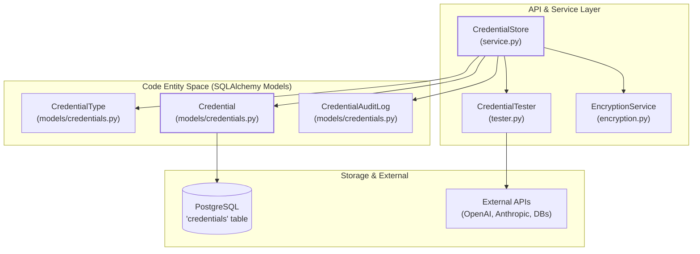
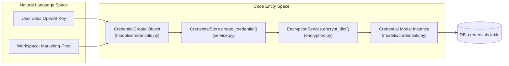

# Credentials Management

Relevant source files

The following files were used as context for generating this wiki page:

- [.gitignore](.gitignore)
- [docs/PRDS/126-BUSINESS-KNOWLEDGE-GRAPH.md](docs/PRDS/126-BUSINESS-KNOWLEDGE-GRAPH.md)
- [graphify-out/snapshots/bucket-1-pre-drop.sql](graphify-out/snapshots/bucket-1-pre-drop.sql)
- [orchestrator/.env.example](orchestrator/.env.example)
- [orchestrator/alembic/versions/prd135_drop_bucket_1.py](orchestrator/alembic/versions/prd135_drop_bucket_1.py)
- [orchestrator/api/composio.py](orchestrator/api/composio.py)
- [orchestrator/api/tools.py](orchestrator/api/tools.py)
- [orchestrator/core/composio/client.py](orchestrator/core/composio/client.py)
- [orchestrator/core/composio/linkedin_image_workaround.py](orchestrator/core/composio/linkedin_image_workaround.py)
- [orchestrator/core/composio/tool_executor.py](orchestrator/core/composio/tool_executor.py)
- [orchestrator/core/credentials/service.py](orchestrator/core/credentials/service.py)
- [orchestrator/core/credentials/tester.py](orchestrator/core/credentials/tester.py)
- [orchestrator/core/credentials/types.py](orchestrator/core/credentials/types.py)
- [orchestrator/core/database/credential_types_seed.json](orchestrator/core/database/credential_types_seed.json)
- [orchestrator/core/models/credentials.py](orchestrator/core/models/credentials.py)
- [orchestrator/core/services/plugin_cache.py](orchestrator/core/services/plugin_cache.py)
- [orchestrator/services/metadata_sync_service.py](orchestrator/services/metadata_sync_service.py)

## Purpose and Scope

This document describes the credential management system in Automatos AI, which provides secure storage, retrieval, and lifecycle management for sensitive credentials (LLM API keys, database passwords, OAuth tokens, etc.). The system is inspired by n8n's credential architecture and provides encryption, testing, audit logging, and multi-tenant isolation via workspace scoping. It enables both system-wide keys and "Bring Your Own Key" (BYOK) overrides for specific users or agents.

**Sources:** [orchestrator/core/credentials/service.py:1-15](), [orchestrator/core/models/credentials.py:1-20]()

---

## System Architecture

The credentials management system consists of four primary components that bridge the gap between user-provided secrets and secure agent execution.

### Credential Entity Relationship Diagram

**Component Responsibilities:**

| Component | Purpose | Key Classes |
|-----------|---------|-------------|
| **CredentialStore** | CRUD operations, lifecycle management, and workspace isolation. | [orchestrator/core/credentials/service.py:42-105]() |
| **CredentialType** | Schema definitions for credential categories (AI, DB, etc.). | [orchestrator/core/models/credentials.py:25-58]() |
| **Credential** | Encrypted credential storage with workspace mapping. | [orchestrator/core/models/credentials.py:60-103]() |
| **EncryptionService** | AES-256 encryption via Fernet. | [orchestrator/core/credentials/encryption.py:1-26]() |
| **CredentialTester** | Async validation via actual provider test calls. | [orchestrator/core/credentials/tester.py:55-126]() |
| **CredentialAuditLog** | Security audit trail for all access and modifications. | [orchestrator/core/models/credentials.py:105-131]() |

**Sources:** [orchestrator/core/credentials/service.py:42-56](), [orchestrator/core/models/credentials.py:25-131]()

---

## Credential Types

Credential types define schemas for different categories of credentials. Each type specifies required fields, UI presentation (icons/logos), and test logic. The system supports a wide range of types via a seeding mechanism.

### Type Schema Structure

The system seeds several system-defined types including `openai_api`, `anthropic_api`, and `postgres_credentials`.

**Credential Type Attributes:**

| Attribute | Description | Code Reference |
|-----------|-------------|----------------|
| `name` | Unique string ID (e.g., `openai_api`) | [orchestrator/core/models/credentials.py:34-34]() |
| `schema_definition` | JSON array of field definitions | [orchestrator/core/models/credentials.py:43-43]() |
| `test_endpoint` | Configuration for connection testing | [orchestrator/core/models/credentials.py:47-47]() |
| `category` | Classification (ai, database, infrastructure) | [orchestrator/core/models/credentials.py:36-36]() |

**Sources:** [orchestrator/core/models/credentials.py:25-58](), [orchestrator/core/database/credential_types_seed.json:1-131]()

---

## Credential Storage & Multi-Tenancy

Credentials are workspace-scoped. Every `Credential` record must have a `workspace_id` to ensure data isolation and protection against Broken Object Level Authorization (BOLA).

### Credential Data Flow

**Database Schema Constraints:**
- **Workspace Isolation:** `workspace_id` is a required UUID foreign key to the `workspaces` table [orchestrator/core/models/credentials.py:69-69]().
- **Encryption:** Values are stored in the `encrypted_data` text column after encryption [orchestrator/core/models/credentials.py:74-74]().
- **Environment:** Supports `production`, `staging`, or `dev` tags for environment-specific keys [orchestrator/core/models/credentials.py:76-76]().

**Sources:** [orchestrator/core/models/credentials.py:60-103](), [orchestrator/core/credentials/service.py:101-185]()

---

## Encryption System

The system uses the `cryptography` library's Fernet implementation for AES-256-CBC encryption to protect sensitive data at rest.

### Key Management
The encryption key is typically loaded from environment variables or a local `.credential_key` file. The system ignores these keys in version control to prevent leaks.

**Encryption Implementation:**
- `encrypt_dict`: Serializes a dictionary to JSON and then encrypts the string using the `encryption_service` [orchestrator/core/credentials/service.py:147-147]().
- `decrypt_dict`: Decrypts the ciphertext and deserializes the JSON back into a Python dictionary [orchestrator/core/credentials/service.py:433-433]().

**Sources:** [orchestrator/core/credentials/encryption.py:1-26](), [orchestrator/core/credentials/service.py:145-150](), [.gitignore:110-114]()

---

## Credential Resolution (BYOK Overrides)

The system determines which credentials to use for a given operation through a prioritized resolution logic. This is critical for services like `LLMManager` and platform integrations.

### Resolution Priority
1. **Agent/Workspace Override:** Specific credentials assigned to an agent or workspace in the database.
2. **Credential Store:** Resolving by `credential_id` stored in service configurations.
3. **Environment Variables:** System-level fallbacks defined in `.env`.

**Special Handling: LinkedIn Image Workaround**
Due to limitations in the Composio SDK for LinkedIn image uploads, the platform uses a direct bypass that resolves credentials from the `CredentialStore`. It specifically looks for a credential of type `linkedInCommunityManagementOAuth2Api` [orchestrator/core/composio/linkedin_image_workaround.py:61-110]().

**Sources:** [orchestrator/core/composio/linkedin_image_workaround.py:43-110](), [orchestrator/core/credentials/service.py:191-205]()

---

## Credential Testing

The `CredentialTester` class allows users to verify their configurations (e.g., database connections) before saving.

### Supported Providers & Methods
The `test_credential` method routes requests based on the `credential_type` to specific test methods [orchestrator/core/credentials/tester.py:69-126]().

| Type | Test Logic |
|------|------------|
| `openai_api` | Calls OpenAI `/models` endpoint to verify key validity [orchestrator/core/credentials/tester.py:129-161](). |
| `anthropic_api` | Calls Anthropic `/v1/messages` endpoint [orchestrator/core/credentials/tester.py:163-173](). |
| `postgres` | Attempts an `asyncpg` connection [orchestrator/core/credentials/tester.py:75-77](). |
| `linkedin` | Tests LinkedIn Community Management API [orchestrator/core/credentials/tester.py:109-109](). |

### Security: SSRF Protection
The tester includes validation to prevent Server-Side Request Forgery (SSRF) by blocking access to private/reserved IP ranges during connection tests [orchestrator/core/credentials/tester.py:27-53]().

**Sources:** [orchestrator/core/credentials/tester.py:27-173]()

---

## Audit Logging

Every lifecycle event (creation, update, deletion, access, and testing) generates a `CredentialAuditLog` entry.

**Audit Data Points:**
- **Action:** Tracks operation type: `created`, `updated`, `deleted`, `accessed`, `tested` [orchestrator/core/models/credentials.py:115-115]().
- **Actor:** Records the `user_id` and `ip_address` [orchestrator/core/models/credentials.py:116-117]().
- **Context:** Stores metadata about the operation (success/failure) [orchestrator/core/models/credentials.py:121-121]().

**Sources:** [orchestrator/core/models/credentials.py:105-131](), [orchestrator/core/credentials/service.py:172-179]()

---

## Configuration Reference

### Environment Variables
Credential management relies on the following variables in the `.env` file for default settings:

| Variable | Purpose |
|----------|---------|
| `OPENAI_API_KEY` | Default system-wide OpenAI key [orchestrator/.env.example:19-19](). |
| `ANTHROPIC_API_KEY` | Default system-wide Anthropic key [orchestrator/.env.example:20-20](). |
| `POSTGRES_PASSWORD` | Default DB password if not using credential store [orchestrator/.env.example:6-6](). |
| `REDIS_PASSWORD` | Default Redis password [orchestrator/.env.example:11-11](). |
| `API_KEY` | System-level API authentication [orchestrator/.env.example:16-16](). |

**Sources:** [orchestrator/.env.example:1-21]()

---