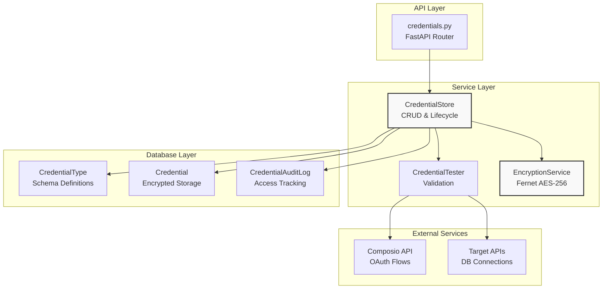
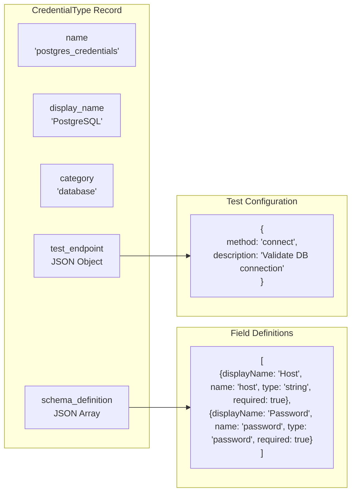
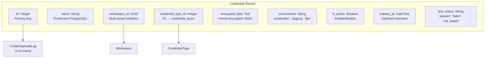
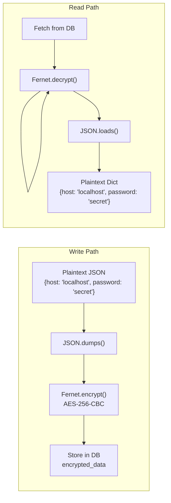
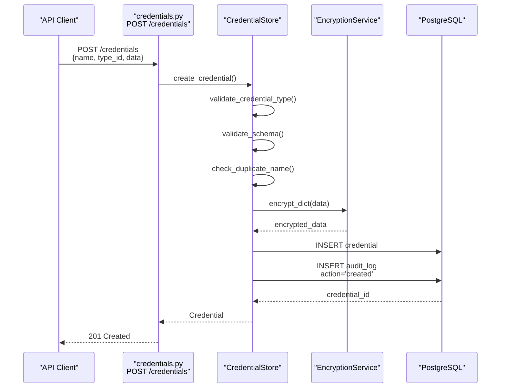
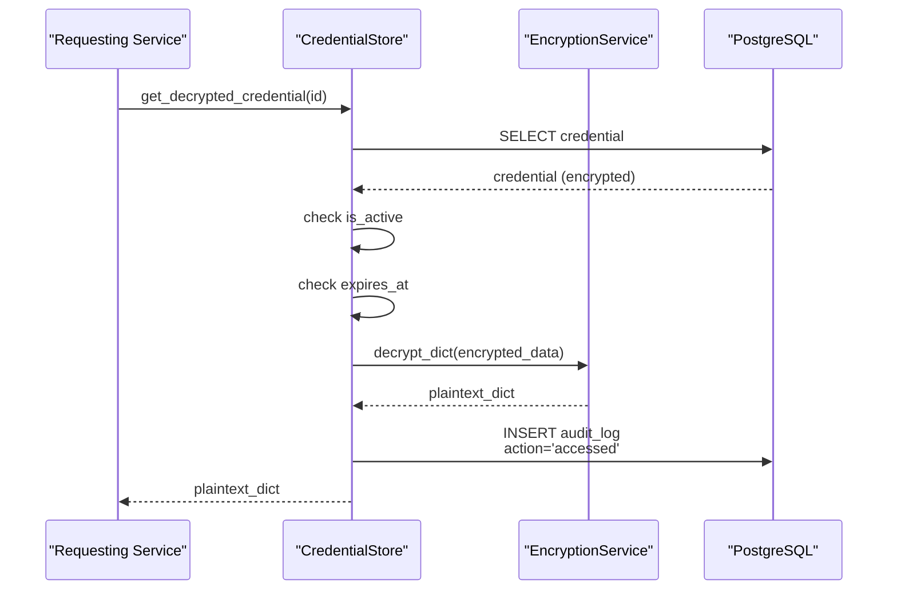
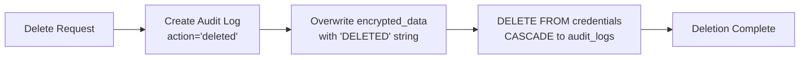
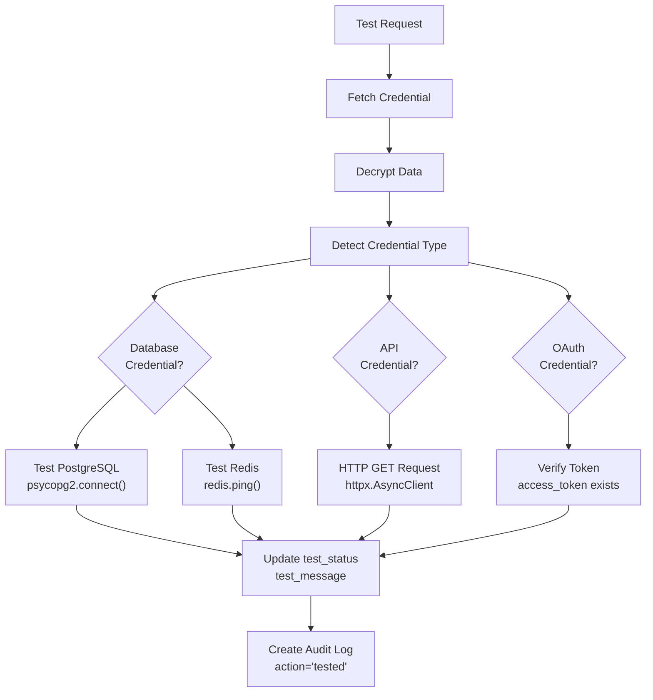
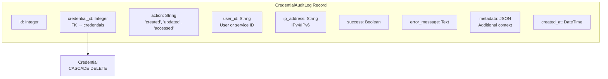
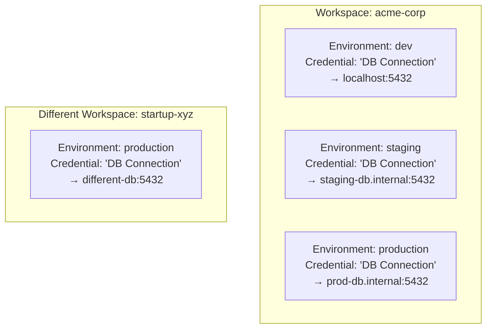

# Credentials Management

<details>
<summary>Relevant source files</summary>

The following files were used as context for generating this wiki page:

- [frontend/app/admin/plugins/page.tsx](frontend/app/admin/plugins/page.tsx)
- [frontend/lib/api-client.ts](frontend/lib/api-client.ts)
- [orchestrator/.env.example](orchestrator/.env.example)
- [orchestrator/api/agent_plugins.py](orchestrator/api/agent_plugins.py)
- [orchestrator/config.py](orchestrator/config.py)
- [orchestrator/core/database/load_seed_data.py](orchestrator/core/database/load_seed_data.py)
- [orchestrator/core/seeds/seed_personas.py](orchestrator/core/seeds/seed_personas.py)
- [orchestrator/core/seeds/seed_plugin_categories.py](orchestrator/core/seeds/seed_plugin_categories.py)
- [orchestrator/core/services/plugin_cache.py](orchestrator/core/services/plugin_cache.py)
- [orchestrator/main.py](orchestrator/main.py)
- [scripts/ralph/prd.json](scripts/ralph/prd.json)

</details>


## Purpose and Scope

This document describes the credential management system in Automatos AI, which provides secure storage, retrieval, and lifecycle management for sensitive credentials (API keys, database passwords, OAuth tokens, etc.). The system is inspired by n8n's credential architecture and provides encryption, testing, audit logging, and multi-environment support.

For information about authentication and workspace management, see [Authentication Flow](#9.1). For multi-tenancy and data isolation, see [Data Isolation](#9.3).

**Sources:** [orchestrator/core/credentials/service.py:1-15](), [orchestrator/core/models/credentials.py:1-20]()

---

## System Architecture

The credentials management system consists of four primary components:



**Component Responsibilities:**

| Component | Purpose | Key Classes |
|-----------|---------|-------------|
| **CredentialStore** | CRUD operations, lifecycle management | [orchestrator/core/credentials/service.py:42-891]() |
| **CredentialType** | Schema definitions for credential categories | [orchestrator/core/models/credentials.py:25-58]() |
| **Credential** | Encrypted credential storage | [orchestrator/core/models/credentials.py:60-103]() |
| **EncryptionService** | AES-256 encryption via Fernet | [orchestrator/core/credentials/encryption.py]() |
| **CredentialTester** | Validation via test connections | [orchestrator/core/credentials/tester.py]() |
| **CredentialAuditLog** | Security audit trail | [orchestrator/core/models/credentials.py:105-131]() |

**Sources:** [orchestrator/core/credentials/service.py:42-56](), [orchestrator/core/models/credentials.py:25-131]()

---

## Credential Types

Credential types define schemas for different categories of credentials (databases, APIs, OAuth providers). Each type specifies required fields, validation rules, and test endpoints.

### Type Schema Structure



**Credential Type Database Model:**

| Column | Type | Description |
|--------|------|-------------|
| `id` | `Integer` | Primary key |
| `name` | `String(255)` | Unique identifier (e.g., `postgres_credentials`) |
| `display_name` | `String(255)` | UI label (e.g., `PostgreSQL`) |
| `category` | `String(100)` | Category: `database`, `ai`, `api`, `infrastructure` |
| `icon` | `String(50)` | Icon name for UI |
| `logo` | `String(255)` | Logo file path |
| `description` | `Text` | Help text |
| `schema_definition` | `JSON` | Array of field definitions |
| `test_endpoint` | `JSON` | Test configuration |
| `is_system` | `Boolean` | System-defined vs user-created |
| `is_active` | `Boolean` | Enable/disable type |

**Sources:** [orchestrator/core/models/credentials.py:25-58]()

### Field Type Definitions

Credential schemas support multiple field types with validation:

| Field Type | Description | Example |
|------------|-------------|---------|
| `string` | Plain text input | Host, username, database name |
| `password` | Masked input (encrypted) | Passwords, API keys |
| `number` | Numeric input | Port numbers, timeout values |
| `boolean` | True/false toggle | SSL enabled, verify certificates |
| `options` | Dropdown selection | Authentication method, region |
| `hidden` | Auto-populated (not shown) | Internal identifiers |

**Sources:** [orchestrator/core/models/credentials.py:137-145]()

### Example: PostgreSQL Credential Type

```json
{
  "name": "postgres_credentials",
  "display_name": "PostgreSQL",
  "category": "database",
  "icon": "database",
  "schema_definition": [
    {
      "displayName": "Host",
      "name": "host",
      "type": "string",
      "required": true,
      "default": "localhost",
      "description": "Database host"
    },
    {
      "displayName": "Port",
      "name": "port",
      "type": "number",
      "required": false,
      "default": 5432
    },
    {
      "displayName": "Database",
      "name": "database",
      "type": "string",
      "required": true
    },
    {
      "displayName": "User",
      "name": "user",
      "type": "string",
      "required": true
    },
    {
      "displayName": "Password",
      "name": "password",
      "type": "password",
      "required": true
    }
  ],
  "test_endpoint": {
    "method": "connect",
    "description": "Test PostgreSQL connection"
  }
}
```

**Sources:** [orchestrator/core/credentials/service.py:598-623](), [orchestrator/core/models/credentials.py:146-167]()

---

## Credential Storage

Credentials are stored in the `credentials` table with AES-256 encryption via Fernet. Each credential is workspace-scoped for multi-tenancy isolation.

### Credential Data Model



**Database Schema:**

| Column | Type | Constraints | Description |
|--------|------|-------------|-------------|
| `id` | `Integer` | Primary Key | Unique identifier |
| `name` | `String(255)` | Not Null | User-friendly name |
| `workspace_id` | `UUID` | FK, Not Null, Cascade Delete | Workspace isolation |
| `credential_type_id` | `Integer` | FK, Not Null, Cascade Delete | Type definition |
| `encrypted_data` | `Text` | Not Null | Fernet-encrypted JSON blob |
| `environment` | `String(50)` | Default: `production` | Target environment |
| `description` | `Text` | Nullable | User notes |
| `tags` | `JSON` | Default: `[]` | Organization tags |
| `is_active` | `Boolean` | Default: `True` | Active status |
| `expires_at` | `DateTime` | Nullable | Expiration timestamp |
| `last_tested` | `DateTime` | Nullable | Last test timestamp |
| `test_status` | `String(50)` | Nullable | Test result status |
| `test_message` | `Text` | Nullable | Test error message |
| `created_by` | `String(255)` | Nullable | Creator user ID |
| `created_at` | `DateTime` | Default: `now()` | Creation timestamp |
| `updated_at` | `DateTime` | Default: `now()`, Auto-update | Last update timestamp |

**Sources:** [orchestrator/core/models/credentials.py:60-103]()

---

## Encryption System

The system uses Fernet (symmetric AES-256 encryption) via the `cryptography` library. All credential data is encrypted at rest.

### Encryption Flow



### EncryptionService Interface

**Key Methods:**

| Method | Signature | Purpose |
|--------|-----------|---------|
| `encrypt(plaintext: str) → str` | Encrypt string | Returns base64-encoded ciphertext |
| `decrypt(ciphertext: str) → str` | Decrypt string | Returns plaintext |
| `encrypt_dict(data: dict) → str` | Encrypt JSON dict | Serializes then encrypts |
| `decrypt_dict(ciphertext: str) → dict` | Decrypt to dict | Decrypts then deserializes |

**Key Management:**

The encryption key is loaded from environment variable `ENCRYPTION_KEY`. If not set, the system generates a new key on first use (development mode only).

```python
# Key generation (if missing)
from cryptography.fernet import Fernet
key = Fernet.generate_key()  # 32-byte key
```

**⚠️ Production Deployment:** The `ENCRYPTION_KEY` must be set in production. If the key is lost, encrypted credentials cannot be recovered.

**Sources:** [orchestrator/core/credentials/encryption.py](), [orchestrator/core/credentials/service.py:143-148]()

---

## Credential Operations

The `CredentialStore` class provides comprehensive CRUD operations with encryption, validation, and audit logging.

### Create Credential Flow



**Implementation Reference:**

```python
def create_credential(
    self,
    credential_data: CredentialCreate,
    user_id: Optional[str] = None,
    ip_address: Optional[str] = None
) -> Credential:
    """
    Create a new credential with encryption.
    
    Steps:
    1. Validate credential type exists
    2. Validate data against schema
    3. Check for duplicate name in environment
    4. Encrypt credential data
    5. Create database record
    6. Create audit log
    """
```

**Key Validation Steps:**

1. **Type Validation:** Ensure `credential_type_id` exists
2. **Schema Validation:** Check required fields against type schema
3. **Duplicate Check:** Prevent duplicate names in same environment
4. **Field Type Validation:** Validate number/boolean types
5. **Encryption:** Encrypt entire credential data dict

**Sources:** [orchestrator/core/credentials/service.py:99-182]()

### Get Decrypted Credential

Accessing decrypted credentials requires explicit security checks and audit logging:



**Security Checks:**

| Check | Failure Action |
|-------|----------------|
| Credential not found | Raise `CredentialNotFoundError` |
| `is_active == False` | Create audit log, raise error |
| `expires_at < now()` | Create audit log, raise error |
| Decryption fails | Create audit log, raise `EncryptionKeyError` |

**Audit Context:** All access is logged with `user_id`, `ip_address`, `service_name`, and `fields_accessed`.

**Sources:** [orchestrator/core/credentials/service.py:378-464]()

### Update Credential

Updates support partial modification with automatic re-encryption:

```python
def update_credential(
    self,
    credential_id: int,
    update_data: CredentialUpdate,
    user_id: Optional[str] = None,
    ip_address: Optional[str] = None
) -> Credential:
    """
    Update an existing credential.
    
    Features:
    - Partial updates (only modified fields)
    - Automatic re-encryption if credential_data changed
    - Reset test_status to 'not_tested' on data change
    - Track all changes in audit log
    """
```

**Tracked Changes:**

- `name` change: Old vs new name
- `credential_data` change: Marked as 'updated' (no plaintext logged)
- `description`, `tags`, `is_active`, `expires_at`: Old vs new values

**Sources:** [orchestrator/core/credentials/service.py:238-314]()

### Delete Credential

Deletion follows a secure erase pattern:



**Secure Deletion Steps:**

1. Create audit log **before** deletion (preserved in database)
2. Overwrite `encrypted_data` with encrypted "DELETED" string
3. Flush to database
4. Execute `DELETE` using raw SQL to avoid SQLAlchemy relationship loading
5. Database CASCADE automatically deletes associated audit logs

**Sources:** [orchestrator/core/credentials/service.py:316-372]()

---

## Credential Testing

The `CredentialTester` validates credentials by performing actual connections or API calls.

### Testing Flow



### Test Implementation: PostgreSQL

```python
async def _test_database_connection(
    self,
    cred_type_name: str,
    data: Dict[str, Any]
) -> CredentialTestResponse:
    """Test database connection"""
    if cred_type_name == 'postgres_credentials':
        import psycopg2
        conn = psycopg2.connect(
            host=data.get('host'),
            port=data.get('port', 5432),
            database=data.get('database'),
            user=data.get('user'),
            password=data.get('password'),
            connect_timeout=5
        )
        conn.close()
        return CredentialTestResponse(
            success=True,
            message="PostgreSQL connection successful",
            details={"database": data.get('database'), "host": data.get('host')},
            tested_at=datetime.utcnow()
        )
```

**Supported Test Types:**

| Credential Type | Test Method | Implementation |
|-----------------|-------------|----------------|
| `postgres_credentials` | Database connection | `psycopg2.connect()` with 5s timeout |
| `redis_credentials` | Cache ping | `redis.Redis.ping()` with 5s timeout |
| API credentials | HTTP call | `httpx.AsyncClient.get()` with 10s timeout |
| OAuth tokens | Token presence | Check `access_token` field exists |

**Test Result Storage:**

After testing, the credential record is updated:

- `last_tested`: Current timestamp
- `test_status`: `'passed'` or `'failed'`
- `test_message`: Success message or error details

**Sources:** [orchestrator/core/credentials/service.py:504-656]()

---

## Audit Logging

All credential operations are logged to `credential_audit_logs` for security auditing and compliance.

### Audit Log Schema



**Logged Actions:**

| Action | Trigger | Metadata Captured |
|--------|---------|-------------------|
| `created` | New credential | `credential_type`, `environment` |
| `updated` | Modify credential | `changes` (old vs new values) |
| `deleted` | Delete credential | `credential_name` |
| `accessed` | Decrypt credential | `service`, `fields_accessed` |
| `access_denied` | Auth failure | `reason` (inactive, expired) |
| `access_failed` | Decrypt failure | Error message |
| `tested` | Test credential | `test_result` details |

**Query Audit Logs:**

```python
def get_audit_logs(
    self,
    credential_id: Optional[int] = None,
    action: Optional[str] = None,
    user_id: Optional[str] = None,
    limit: int = 100
) -> List[CredentialAuditLog]:
    """
    Get credential audit logs with filtering.
    
    Filters:
    - credential_id: Specific credential
    - action: Specific action type
    - user_id: Specific user/service
    - limit: Max results (default 100)
    
    Returns logs ordered by created_at DESC
    """
```

**Sources:** [orchestrator/core/credentials/service.py:790-848](), [orchestrator/core/models/credentials.py:105-131]()

---

## Environment Management

Credentials support multi-environment deployment with environment-scoped storage.

### Environment Isolation



**Environment Resolution:**

When retrieving credentials by name:

```python
def get_credential_by_name(
    self,
    name: str,
    environment: str = "production"
) -> Optional[Credential]:
    """Get credential by name (environment-agnostic for MVP single environment)"""
    # For MVP: Just find the credential by name, ignore environment
    return self.db.query(Credential).filter(
        and_(
            Credential.name == name,
            Credential.is_active == True
        )
    ).first()
```

**MVP Note:** The current implementation is environment-agnostic for single-environment deployments. Full multi-environment support can be enabled by uncommenting environment filtering.

**Sources:** [orchestrator/core/credentials/service.py:187-199]()

---

## Security Considerations

### Encryption Key Management

**⚠️ Critical Security Requirements:**

1. **Set `ENCRYPTION_KEY` in Production:**
   - Generate: `python -c "from cryptography.fernet import Fernet; print(Fernet.generate_key().decode())"`
   - Store in environment variable or secrets manager
   - **Never commit to version control**

2. **Key Rotation Strategy:**
   - Current implementation does **not** support key rotation
   - Rotating keys requires re-encrypting all credentials
   - Plan migration strategy before rotating

3. **Backup Considerations:**
   - Database backups include encrypted credentials
   - Backups are useless without the encryption key
   - Store key separately from database backups

**Sources:** [orchestrator/config.py](), [.gitignore:99-105]()

### Access Control

**Credential Access Patterns:**

1. **Direct Access (Decryption):**
   - Requires workspace-level access
   - All access is audit-logged
   - Checks `is_active` and `expires_at`

2. **Service Access:**
   - Services use `get_decrypted_credential()` with `service_name`
   - Audit log captures service identity
   - Supports credential-by-name resolution

3. **Test Access:**
   - Testing temporarily decrypts credentials
   - Results stored in credential record
   - Audit log tracks test attempts

**Sources:** [orchestrator/core/credentials/service.py:378-464]()

### Data Validation

**Input Validation:**

1. **Schema Validation:**
   - Required fields checked
   - Type validation (number, boolean)
   - Custom validation rules from schema

2. **Duplicate Prevention:**
   - Unique constraint on (name, environment)
   - Only active credentials checked
   - Prevents accidental overwrites

3. **Expiration Enforcement:**
   - Checked on every access
   - Expired credentials rejected
   - Audit log records rejection

**Sources:** [orchestrator/core/credentials/service.py:725-781]()

### Audit Trail

**Compliance Features:**

1. **Complete Access Trail:**
   - Who accessed credentials
   - When accessed
   - From what IP address
   - Which fields accessed

2. **Change Tracking:**
   - All modifications logged
   - Old vs new values (except encrypted data)
   - Deletion audit preserved

3. **Test Results:**
   - Test success/failure logged
   - Error messages captured
   - Test frequency tracked

**Retention:** Audit logs are cascaded deleted with credentials but can be archived before deletion if needed.

**Sources:** [orchestrator/core/credentials/service.py:790-813]()

---

## Configuration Reference

### Environment Variables

| Variable | Type | Default | Description |
|----------|------|---------|-------------|
| `ENCRYPTION_KEY` | String | None | Fernet encryption key (32 bytes, base64) |
| `POSTGRES_DB` | String | Required | Database name |
| `POSTGRES_USER` | String | Required | Database user |
| `POSTGRES_PASSWORD` | String | Required | Database password |
| `POSTGRES_HOST` | String | Required | Database host |
| `POSTGRES_PORT` | String | `5432` | Database port |

**Example Configuration:**

```env
# Encryption (generate with: python -c "from cryptography.fernet import Fernet; print(Fernet.generate_key().decode())")
ENCRYPTION_KEY=your_base64_encoded_fernet_key_here

# Database
POSTGRES_DB=orchestrator_db
POSTGRES_USER=postgres
POSTGRES_PASSWORD=secure_password_here
POSTGRES_HOST=localhost
POSTGRES_PORT=5432
```

**Sources:** [orchestrator/config.py:36-43](), [orchestrator/.env.example:1-11]()

---

## API Endpoints

### Credential CRUD

| Method | Endpoint | Purpose | Auth Required |
|--------|----------|---------|---------------|
| `GET` | `/api/credentials/types` | List credential types | Yes |
| `GET` | `/api/credentials/types/{id}` | Get credential type | Yes |
| `GET` | `/api/credentials` | List credentials | Yes |
| `GET` | `/api/credentials/{id}` | Get credential details | Yes |
| `POST` | `/api/credentials` | Create credential | Yes |
| `PUT` | `/api/credentials/{id}` | Update credential | Yes |
| `DELETE` | `/api/credentials/{id}` | Delete credential | Yes |
| `POST` | `/api/credentials/{id}/test` | Test credential | Yes |
| `GET` | `/api/credentials/{id}/audit-logs` | Get audit logs | Yes |

**Note:** Actual API endpoints may be implemented in a credentials router that is not included in the provided files. The `CredentialStore` service is designed to support these operations.

**Sources:** [orchestrator/core/credentials/service.py](), [orchestrator/core/models/credentials.py:246-342]()

---

## Usage Examples

### Creating a Credential

```python
from core.credentials.service import CredentialStore
from core.models.credentials import CredentialCreate
from sqlalchemy.orm import Session

# Initialize store
db: Session = ...  # Get database session
store = CredentialStore(db)

# Create credential
credential_data = CredentialCreate(
    name="Production PostgreSQL",
    credential_type_id=1,  # postgres_credentials type
    credential_data={
        "host": "prod-db.example.com",
        "port": 5432,
        "database": "myapp",
        "user": "app_user",
        "password": "super_secret_password"
    },
    environment="production",
    description="Main application database",
    tags=["database", "production", "critical"]
)

credential = store.create_credential(
    credential_data,
    user_id="user_123",
    ip_address="192.168.1.100"
)
# Credential created, encrypted, audit log created
```

### Accessing Decrypted Credentials

```python
# Service requesting credentials
decrypted_data = store.get_decrypted_credential(
    credential_id=credential.id,
    user_id="system",
    service_name="AgentFactory",
    ip_address="127.0.0.1"
)

# Returns: {
#   "host": "prod-db.example.com",
#   "port": 5432,
#   "database": "myapp",
#   "user": "app_user",
#   "password": "super_secret_password"
# }

# Access is logged to audit_logs
```

### Testing a Credential

```python
# Test credential connectivity
result = await store.test_credential(
    credential_id=credential.id,
    user_id="admin_user"
)

if result.success:
    print(f"✅ Test passed: {result.message}")
    # credential.test_status = 'passed'
else:
    print(f"❌ Test failed: {result.message}")
    # credential.test_status = 'failed'
```

**Sources:** [orchestrator/core/credentials/service.py:99-182](), [orchestrator/core/credentials/service.py:378-464](), [orchestrator/core/credentials/service.py:504-562]()

---