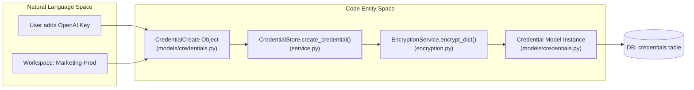

# Credentials Management

Relevant source files

The following files were used as context for generating this wiki page:

- [.gitignore](.gitignore)
- [docs/PRDS/126-BUSINESS-KNOWLEDGE-GRAPH.md](docs/PRDS/126-BUSINESS-KNOWLEDGE-GRAPH.md)
- [orchestrator/.env.example](orchestrator/.env.example)
- [orchestrator/api/admin_prompts.py](orchestrator/api/admin_prompts.py)
- [orchestrator/api/credentials.py](orchestrator/api/credentials.py)
- [orchestrator/api/database_knowledge.py](orchestrator/api/database_knowledge.py)
- [orchestrator/api/document_generation.py](orchestrator/api/document_generation.py)
- [orchestrator/api/generated_images.py](orchestrator/api/generated_images.py)
- [orchestrator/api/system_settings.py](orchestrator/api/system_settings.py)
- [orchestrator/core/credentials/service.py](orchestrator/core/credentials/service.py)
- [orchestrator/core/database/database.py](orchestrator/core/database/database.py)
- [orchestrator/core/models/credentials.py](orchestrator/core/models/credentials.py)
- [orchestrator/core/models/system_prompts.py](orchestrator/core/models/system_prompts.py)
- [orchestrator/core/seeds/seed_system_prompts.py](orchestrator/core/seeds/seed_system_prompts.py)
- [orchestrator/core/services/audit_service.py](orchestrator/core/services/audit_service.py)
- [orchestrator/core/services/plugin_cache.py](orchestrator/core/services/plugin_cache.py)
- [orchestrator/core/services/prompt_registry.py](orchestrator/core/services/prompt_registry.py)
- [orchestrator/modules/documents/generation_service.py](orchestrator/modules/documents/generation_service.py)
- [orchestrator/modules/nl2sql/service.py](orchestrator/modules/nl2sql/service.py)

## Purpose and Scope

This document describes the credential management system in Automatos AI, which provides secure storage, retrieval, and lifecycle management for sensitive credentials (LLM API keys, database passwords, OAuth tokens, etc.). The system is inspired by n8n's credential architecture and provides encryption, testing, audit logging, and multi-tenant isolation via workspace scoping. It enables both system-wide keys and "Bring Your Own Key" (BYOK) overrides for specific users or agents.

**Sources:** [orchestrator/core/credentials/service.py:1-15](), [orchestrator/core/models/credentials.py:1-20]()

---

## System Architecture

The credentials management system consists of four primary components:

### Credential Entity Relationship Diagram

**Component Responsibilities:**

| Component | Purpose | Key Classes |
|-----------|---------|-------------|
| **CredentialStore** | CRUD operations, lifecycle management, and workspace isolation. | [orchestrator/core/credentials/service.py:42-105]() |
| **CredentialType** | Schema definitions for credential categories (AI, DB, etc.). | [orchestrator/core/models/credentials.py:25-58]() |
| **Credential** | Encrypted credential storage with workspace mapping. | [orchestrator/core/models/credentials.py:60-103]() |
| **EncryptionService** | AES-256 encryption via Fernet. | [orchestrator/core/credentials/encryption.py:1-26]() |
| **CredentialTester** | Async validation via actual provider test calls. | [orchestrator/core/credentials/tester.py:55-126]() |
| **CredentialAuditLog** | Security audit trail for all access and modifications. | [orchestrator/core/models/credentials.py:105-131]() |

**Sources:** [orchestrator/core/credentials/service.py:42-56](), [orchestrator/core/models/credentials.py:25-131]()

---

## Credential Types

Credential types define schemas for different categories of credentials. Each type specifies required fields, UI presentation (icons/logos), and test logic. The system supports over 400 credential type definitions for dynamic form generation [orchestrator/api/credentials.py:82-85]().

### Type Schema Structure

The system seeds several system-defined types including `openai_api`, `anthropic_api`, and `postgres_credentials`. These are defined in a centralized registry and seeded into the database.

**Credential Type Attributes:**

| Attribute | Description | Code Reference |
|-----------|-------------|----------------|
| `name` | Unique string ID (e.g., `openai_api`) | [orchestrator/core/models/credentials.py:34-34]() |
| `schema_definition` | JSON array of field definitions | [orchestrator/core/models/credentials.py:43-43]() |
| `test_endpoint` | Configuration for connection testing | [orchestrator/core/models/credentials.py:47-47]() |
| `category` | Classification (ai, database, infrastructure) | [orchestrator/core/models/credentials.py:36-36]() |

**Sources:** [orchestrator/core/models/credentials.py:25-58](), [orchestrator/api/credentials.py:82-85]()

### Field Type Definitions

Credential schemas support multiple field types defined in the `CredentialFieldType` enum, allowing for dynamic form generation in the frontend:

| Field Type | Description |
|------------|-------------|
| `string` | Standard text input. |
| `password` | Masked in UI and encrypted at rest. |
| `number` | Numeric values (e.g., ports). |
| `boolean` | Toggle switches. |
| `options` | Dropdown selections. |

**Sources:** [orchestrator/core/models/credentials.py:137-145]()

---

## Credential Storage & Multi-Tenancy

Credentials are workspace-scoped. Every `Credential` record must have a `workspace_id` to ensure data isolation. The `CredentialStore` enforces Broken Object Level Authorization (BOLA) protection by verifying workspace ownership during retrieval [orchestrator/api/credentials.py:65-68]().

### Credential Data Flow

**Database Schema Constraints:**
- **Workspace Isolation:** `workspace_id` is a required UUID foreign key to the `workspaces` table, preventing cross-tenant access [orchestrator/core/models/credentials.py:69-69]().
- **Encryption:** Values are stored in the `encrypted_data` text column after encryption [orchestrator/core/models/credentials.py:74-74]().
- **Environment:** Supports `production`, `staging`, or `dev` tags for environment-specific keys [orchestrator/core/models/credentials.py:76-76]().

**Sources:** [orchestrator/core/models/credentials.py:60-103](), [orchestrator/core/credentials/service.py:101-185](), [orchestrator/api/credentials.py:65-68]()

---

## Encryption System

The system uses the `cryptography` library's Fernet implementation for AES-256-CBC encryption to protect sensitive data at rest.

### Key Management
The encryption key is typically loaded from environment variables or a local `.credential_key` file. In production, it is critical that the encryption key is stable; loss of the key renders all stored credentials unrecoverable. Files matching `*.credential_key` are explicitly ignored by version control to prevent leaks [./.gitignore:110-114]().

**Encryption Implementation:**
- `encrypt_dict`: Serializes a dictionary to JSON and then encrypts the string using the `encryption_service` [orchestrator/core/credentials/service.py:147-147]().
- `decrypt_dict`: Decrypts the ciphertext and deserializes the JSON back into a Python dictionary for use in agent execution [orchestrator/core/credentials/service.py:433-433]().

**Sources:** [orchestrator/core/credentials/encryption.py:1-26](), [orchestrator/core/credentials/service.py:145-150](), [./.gitignore:110-114]()

---

## Credential Testing (BYOK Overrides)

The `CredentialTester` class allows users to verify their "Bring Your Own Key" (BYOK) configurations or database connections before saving.

### Supported Providers & Methods
The `test_credential` method routes requests based on the `credential_type` to specific private test methods [orchestrator/core/credentials/tester.py:69-119]().

| Type | Test Logic |
|------|------------|
| `openai_api` | Calls `https://api.openai.com/v1/models` to verify key validity [orchestrator/core/credentials/tester.py:128-160](). |
| `anthropic_api` | Calls `/v1/messages` with a minimal payload to check API access [orchestrator/core/credentials/tester.py:162-180](). |
| `postgres` | Attempts an `asyncpg` connection to the provided host/port [orchestrator/core/credentials/tester.py:75-77](). |
| `redis` | Performs a `ping()` command using the `redis` python client [orchestrator/core/credentials/tester.py:78-79](). |

### Security: SSRF Protection
The tester includes `_validate_url_not_ssrf` to prevent Server-Side Request Forgery (SSRF). This blocks users from using credential tests to probe internal network infrastructure by preventing access to private/reserved IP ranges [orchestrator/core/credentials/tester.py:27-53]().

**Sources:** [orchestrator/core/credentials/tester.py:27-180]()

---

## Audit Logging

Every lifecycle event (creation, update, deletion, access, and testing) generates a `CredentialAuditLog` entry for security monitoring and compliance.

**Audit Data Points:**
- **Action:** Tracks the operation type: `created`, `updated`, `deleted`, `accessed`, `tested` [orchestrator/core/models/credentials.py:115-115]().
- **Actor:** Records the `user_id` and `ip_address` of the requester [orchestrator/core/models/credentials.py:116-117]().
- **Context:** Stores metadata about the operation (e.g., success status, error messages), excluding sensitive plaintext [orchestrator/core/models/credentials.py:121-121]().

**Sources:** [orchestrator/core/models/credentials.py:105-131](), [orchestrator/core/credentials/service.py:172-179]()

---

## Configuration Reference

### Environment Variables
Credential management relies on the following variables in the `.env` file for default settings and system-level access. The database configuration itself can also be resolved via the credential system, attempting to fetch `postgres_connection_params` before falling back to environment variables [orchestrator/core/database/database.py:23-37]().

| Variable | Purpose |
|----------|---------|
| `OPENAI_API_KEY` | Default system-wide key if no BYOK is provided [orchestrator/.env.example:19-19](). |
| `ANTHROPIC_API_KEY` | Default system-wide key for Claude models [orchestrator/.env.example:20-20](). |
| `API_KEY` | Secure key for authenticating requests to the orchestrator API [orchestrator/.env.example:16-16](). |

**Sources:** [orchestrator/.env.example:1-21](), [orchestrator/core/database/database.py:23-37]()

---