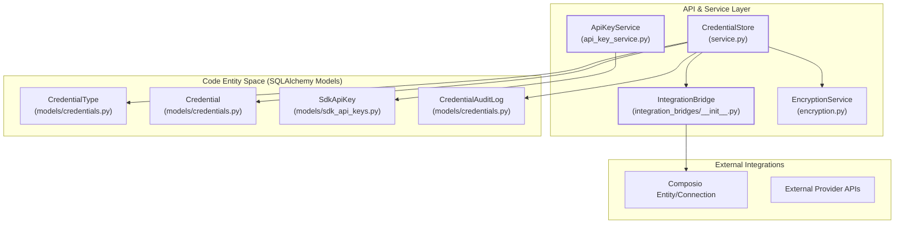
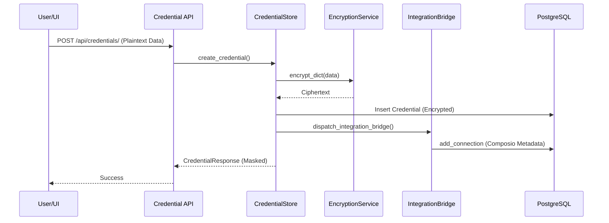

# Credentials Management

Relevant source files

The following files were used as context for generating this wiki page:

- [frontend/components/settings/DynamicCredentialForm.tsx](frontend/components/settings/DynamicCredentialForm.tsx)
- [frontend/lib/api/credentials.ts](frontend/lib/api/credentials.ts)
- [orchestrator/api/api_keys.py](orchestrator/api/api_keys.py)
- [orchestrator/api/credentials.py](orchestrator/api/credentials.py)
- [orchestrator/api/widgets/auth.py](orchestrator/api/widgets/auth.py)
- [orchestrator/api/widgets/config.py](orchestrator/api/widgets/config.py)
- [orchestrator/api/widgets/session.py](orchestrator/api/widgets/session.py)
- [orchestrator/core/credentials/integration_bridges/__init__.py](orchestrator/core/credentials/integration_bridges/__init__.py)
- [orchestrator/core/credentials/integration_bridges/base.py](orchestrator/core/credentials/integration_bridges/base.py)
- [orchestrator/core/credentials/integration_bridges/shopify.py](orchestrator/core/credentials/integration_bridges/shopify.py)
- [orchestrator/core/credentials/service.py](orchestrator/core/credentials/service.py)
- [orchestrator/core/database/migrations/043_team_based_document_scoping.sql](orchestrator/core/database/migrations/043_team_based_document_scoping.sql)
- [orchestrator/core/models/credentials.py](orchestrator/core/models/credentials.py)
- [orchestrator/core/models/sdk_api_keys.py](orchestrator/core/models/sdk_api_keys.py)
- [orchestrator/core/services/api_key_service.py](orchestrator/core/services/api_key_service.py)
- [orchestrator/tests/test_p2w2_credentials_null_workspace.py](orchestrator/tests/test_p2w2_credentials_null_workspace.py)
- [orchestrator/tests/test_p2w2_widget_fail_closed.py](orchestrator/tests/test_p2w2_widget_fail_closed.py)
- [orchestrator/tests/test_prd008a_widget_config_resolver.py](orchestrator/tests/test_prd008a_widget_config_resolver.py)

## Purpose and Scope

The Credentials Management system provides a secure, multi-tenant framework for handling sensitive secrets such as API keys, database credentials, and OAuth tokens. Inspired by n8n's architecture, it facilitates encrypted storage, lifecycle management, and "Bring Your Own Key" (BYOK) overrides. This system is critical for agent execution, tool integrations (via Composio), and secure SDK access.

**Sources:** [orchestrator/core/credentials/service.py:1-7](), [orchestrator/core/models/credentials.py:1-7]()

---

## System Architecture

The system is partitioned into two primary domains: **Platform Credentials** (managed via the `CredentialStore`) for external integrations like Shopify or OpenAI, and **SDK API Keys** (managed via `ApiKeyService`) for authenticating external requests to the Automatos platform.

### Credential Entity Relationship Diagram

**Sources:** [orchestrator/core/credentials/service.py:42-85](), [orchestrator/core/credentials/integration_bridges/shopify.py:70-109](), [orchestrator/core/services/api_key_service.py:42-45](), [orchestrator/core/models/credentials.py:105-131]()

---

## SDK API Keys & Widget Auth

Automatos provides a specialized API key system for SDKs and web widgets. These keys are distinct from external service credentials and are used to authorize browser-based chat widgets.

### Key Types and Security
1.  **Public Keys (`ak_pub_`)**: Intended for browser use. These are strictly origin-locked via `allowed_domains` [orchestrator/core/models/sdk_api_keys.py:61]().
2.  **Server Keys (`ak_srv_`)**: Used for backend-to-backend communication. These can be exchanged for short-lived JWT session tokens [orchestrator/api/widgets/session.py:99-104]().

### Token Exchange Flow
For enhanced security, server-side applications exchange a long-lived API key for a short-lived (default 1 hour) JWT using the `exchange_session_token` endpoint [orchestrator/api/widgets/session.py:78-82](). This JWT is then passed to the frontend widget, preventing the exposure of the raw API key in the browser.

| Feature | Implementation | Source |
| :--- | :--- | :--- |
| **Hashing** | Keys stored as SHA-256 digests; plaintext shown only once. | [orchestrator/core/services/api_key_service.py:23-25]() |
| **Origin Check** | Public keys fail closed if the request origin is missing. | [orchestrator/api/widgets/auth.py:182-187]() |
| **Team Scoping** | Keys can be locked to specific teams for document access. | [orchestrator/core/models/sdk_api_keys.py:57-58]() |
| **Agent Lock** | `default_agent_id` forces the widget to use a specific agent. | [orchestrator/core/models/sdk_api_keys.py:54-55]()

**Sources:** [orchestrator/core/services/api_key_service.py:48-105](), [orchestrator/api/widgets/auth.py:100-166](), [orchestrator/api/widgets/session.py:127-150]()

---

## Integration Bridges

The `IntegrationBridge` system acts as glue between Automatos credentials and execution platforms like Composio. When a user saves a credential, the system dispatches it to a bridge that translates the data into a functional connection.

### Shopify Bridge Case Study
The Shopify bridge ([orchestrator/core/credentials/integration_bridges/shopify.py]()) handles three credential paths:
*   **Custom App (shpat_*)**: Direct Admin API token mapping to Composio `API_KEY` auth [orchestrator/core/credentials/integration_bridges/shopify.py:160-165]().
*   **Partner App**: Uses Client ID and Secret to initiate an OAuth2 "install bounce" [orchestrator/core/credentials/integration_bridges/shopify.py:124-129]().
*   **Legacy Private App**: Deprecated/Unsupported [orchestrator/core/credentials/integration_bridges/shopify.py:11-12]().

**Sources:** [orchestrator/core/credentials/service.py:61-85](), [orchestrator/core/credentials/integration_bridges/__init__.py:41-74]()

---

## Credential Storage & Encryption

All platform credentials (non-SDK keys) are encrypted using the `EncryptionService` before being persisted to the `credentials` table.

### Data Flow for Credential Creation

**Key Security Controls:**
*   **BOLA Protection**: The `_check_credential_workspace` helper ensures that users can only access credentials belonging to their active `workspace_id` [orchestrator/api/credentials.py:66-84]().
*   **Encryption**: Uses AES-256 via the `cryptography` library. Decryption only occurs in memory during execution or bridge dispatch [orchestrator/core/credentials/service.py:175-179]().
*   **Audit Logging**: Every create, update, or access event is logged in `credential_audit_logs` [orchestrator/core/models/credentials.py:105-131]().

**Sources:** [orchestrator/core/credentials/service.py:128-196](), [orchestrator/api/credentials.py:179-192](), [orchestrator/core/models/credentials.py:60-103]()

---

## Frontend Integration

The `DynamicCredentialForm` component ([frontend/components/settings/DynamicCredentialForm.tsx]()) dynamically renders input fields based on the `schema_definition` of a `CredentialType`.

### Field Overrides
To improve UX, the frontend applies overrides to technical schema names (e.g., changing "accessToken" to "Partner App Client ID") for specific integrations like Shopify [frontend/components/settings/DynamicCredentialForm.tsx:47-66]().

**Sources:** [frontend/components/settings/DynamicCredentialForm.tsx:102-158](), [orchestrator/core/models/credentials.py:147-168]()

---