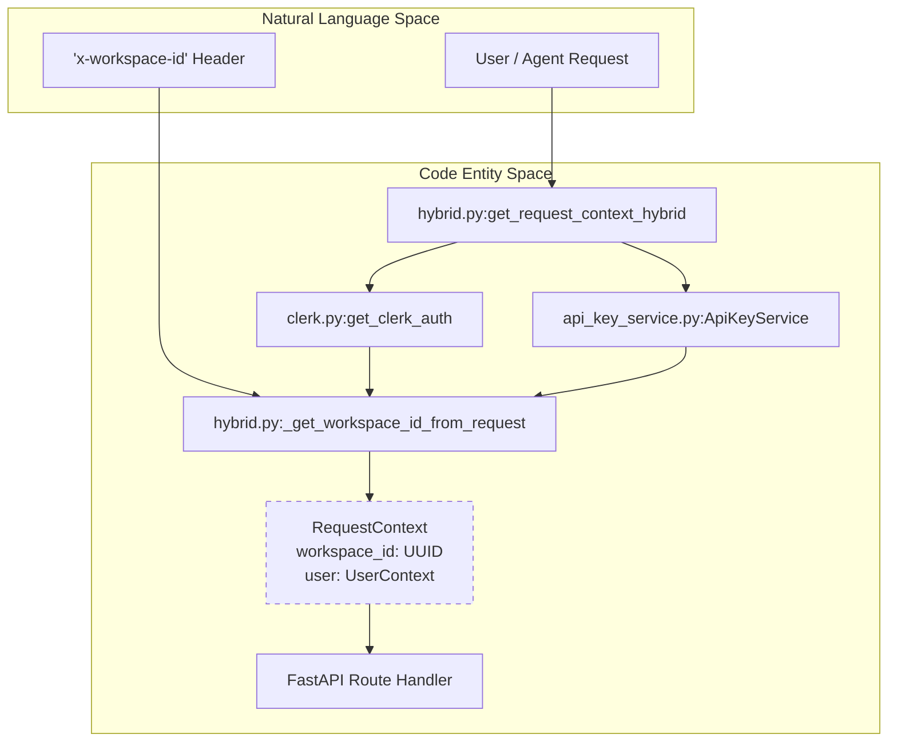
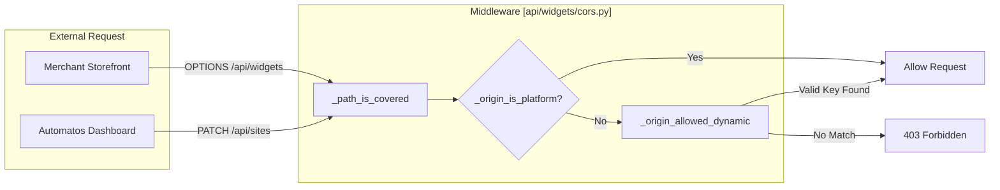

# Data Isolation

<details>
<summary>Relevant source files</summary>

The following files were used as context for generating this wiki page:

- [docs/workspace-execution/security-sandboxing.md](docs/workspace-execution/security-sandboxing.md)
- [orchestrator/alembic/versions/prd158_teams_table.py](orchestrator/alembic/versions/prd158_teams_table.py)
- [orchestrator/api/knowledge_multimodal.py](orchestrator/api/knowledge_multimodal.py)
- [orchestrator/api/teams.py](orchestrator/api/teams.py)
- [orchestrator/api/widgets/__init__.py](orchestrator/api/widgets/__init__.py)
- [orchestrator/api/widgets/cors.py](orchestrator/api/widgets/cors.py)
- [orchestrator/api/widgets/data.py](orchestrator/api/widgets/data.py)
- [orchestrator/api/widgets/documents.py](orchestrator/api/widgets/documents.py)
- [orchestrator/core/team_access.py](orchestrator/core/team_access.py)
- [orchestrator/modules/rag/services/multimodal_knowledge_tools.py](orchestrator/modules/rag/services/multimodal_knowledge_tools.py)
- [orchestrator/modules/tools/execution/exec_multimodal.py](orchestrator/modules/tools/execution/exec_multimodal.py)
- [orchestrator/tests/security/test_prd172_tenant_isolation.py](orchestrator/tests/security/test_prd172_tenant_isolation.py)
- [orchestrator/tests/security/test_tenancy_matrix.py](orchestrator/tests/security/test_tenancy_matrix.py)
- [orchestrator/tests/test_documents_team_filter.py](orchestrator/tests/test_documents_team_filter.py)
- [orchestrator/tests/test_p2w2_cors_boot_guard.py](orchestrator/tests/test_p2w2_cors_boot_guard.py)
- [orchestrator/tests/test_prd008a_cors_coverage.py](orchestrator/tests/test_prd008a_cors_coverage.py)
- [orchestrator/tests/test_prd186_s3_hardening.py](orchestrator/tests/test_prd186_s3_hardening.py)
- [orchestrator/tests/test_teams_api.py](orchestrator/tests/test_teams_api.py)
- [orchestrator/tests/test_widget_docs_schema.py](orchestrator/tests/test_widget_docs_schema.py)

</details>


## Purpose and Scope

Data isolation ensures that resources belonging to one workspace cannot be accessed by users from another workspace. Every database record representing user-created content is scoped to a `workspace_id`, and all API queries automatically filter by the authenticated user's workspace. This prevents workspace spoofing, unauthorized cross-workspace access, and data leaks between tenants.

Automatos AI implements a multi-layered isolation strategy encompassing database foreign keys, request-scoped context injection, standardized memory namespacing, and cache prefixing.

**Sources:** [orchestrator/core/models/workspaces.py:4-8](), [orchestrator/core/auth/hybrid.py:23-37]()

---

## RequestContext as the Isolation Boundary

Every API endpoint receives a `RequestContext` from the `get_request_context_hybrid` authentication dependency. This context contains the resolved `workspace_id` and `UserContext`, which together define the isolation boundary for that request.

### Authentication and Workspace Resolution Flow

The following diagram illustrates how an incoming request is associated with a specific workspace before reaching the business logic.

**Figure 1: Workspace Resolution and Context Injection**

**Sources:** [orchestrator/core/auth/hybrid.py:49-88](), [orchestrator/core/auth/dependencies.py:1-10]()

The `RequestContext` is constructed after resolving the workspace through multiple strategies in priority order:
1. **Header Overrides**: `x-workspace-id` or `x-workspace` [orchestrator/core/auth/hybrid.py:67-74]().
2. **Query Parameters**: `workspace_id` [orchestrator/core/auth/hybrid.py:76-78]().
3. **Environment Defaults**: `config.WORKSPACE_ID` or `config.DEFAULT_WORKSPACE_ID` [orchestrator/core/auth/hybrid.py:80-86]().

---

## Database and Schema Isolation

### Workspace Model and Membership
The `Workspace` model serves as the root for all tenant data [orchestrator/core/models/workspaces.py:21-25](). Access is gated by `_user_has_workspace_access`, which verifies that a user is either the owner or an active member in the `workspace_members` table [orchestrator/core/auth/hybrid.py:146-166]().

### Query Key Scoping
Standardized query filtering prevents cross-tenant leaks. For instance, the `_workspace_exists` helper ensures that only non-deleted workspaces are queryable [orchestrator/core/auth/hybrid.py:91-106](). In the frontend, the `useWorkspace` hook ensures that the current active workspace ID is persisted in `localStorage` as `last_active_workspace` to maintain session continuity [frontend/components/workspace-provider.tsx:161-163]().

| Component | Isolation Technique | Primary Code Reference |
| :--- | :--- | :--- |
| **ORM** | `workspace_id` Foreign Keys | [orchestrator/core/models/workspaces.py:4-8]() |
| **Auth** | `_user_has_workspace_access` | [orchestrator/core/auth/hybrid.py:146-165]() |
| **Frontend** | `wsScope` Query Keys | [frontend/components/workspace-provider.tsx:112-120]() |
| **Security** | `paused_at` Admin Gate | [orchestrator/core/auth/hybrid.py:109-125]() |

**Sources:** [orchestrator/core/models/workspaces.py:21-56](), [orchestrator/core/auth/hybrid.py:91-166]()

---

## Memory and Vector Isolation

Memory and vector data utilize strict namespacing to ensure agents only retrieve context relevant to their own workspace.

### S3 Vector Hardening
For shared vector storage (e.g., S3), isolation is enforced by dropping any hits that lack a `workspace_id` stamp or possess a mismatched ID [orchestrator/tests/test_prd186_s3_hardening.py:83-106](). All document ingestion pipelines automatically stamp vectors with the caller's `workspace_id` during the `add_documents` phase [orchestrator/tests/test_prd186_s3_hardening.py:108-117]().

### Cache Isolation
Redis and in-memory caches are namespaced to prevent cross-contamination. The `WidgetCORSMiddleware` uses an origin-based cache that is strictly validated against the `SdkApiKey.allowed_domains` for the specific merchant [orchestrator/api/widgets/cors.py:74-88]().

**Sources:** [orchestrator/tests/test_prd186_s3_hardening.py:4-8](), [orchestrator/api/widgets/cors.py:104-131]()

---

## Widget and CORS Isolation

The widget subsystem provides a secure boundary for external storefronts. Unlike the internal dashboard, widgets do not use global allowlists.

### Dynamic CORS Authorization
1. **Platform Origins**: First-party domains defined in `config.CORS_ALLOW_ORIGINS` are granted access to all routes [orchestrator/api/widgets/cors.py:62-71]().
2. **Merchant Origins**: Storefronts are authorized dynamically. The system checks if the requesting origin is named on **any** active public SDK key via `ApiKeyService.origin_allowed_by_any_key` [orchestrator/api/widgets/cors.py:91-102]().
3. **Path Scoping**: CORS middleware only applies to `/api/widgets` and `/api/sites`. Internal routes like `/api/agents` are protected by the standard app-wide middleware [orchestrator/api/widgets/cors.py:51-54]().

**Figure 2: CORS and Widget Security Boundary**

**Sources:** [orchestrator/api/widgets/cors.py:38-131](), [orchestrator/tests/test_prd008a_cors_coverage.py:31-47]()

---

## Sandbox and Filesystem Isolation

Automatos AI implements physical isolation for agent execution environments.

1.  **Workspace Directories**: The `WorkspaceWorker` manages isolated directories on persistent volumes for each `workspace_id` [docs/workspace-execution/security-sandboxing.md:32-34]().
2.  **Path Traversal Prevention**: The `WorkspaceManager` uses `resolve_safe_path` to ensure agents cannot escape their root directory using `..` or symlinks [docs/workspace-execution/security-sandboxing.md:37-38]().
3.  **Command Whitelisting**: Agents are restricted to a predefined set of `ALLOWED_COMMANDS` (e.g., `python3`, `git`, `npm`) and blocked from dangerous patterns like `rm -rf /` or `sudo` [docs/workspace-execution/security-sandboxing.md:40-52]().

**Sources:** [docs/workspace-execution/security-sandboxing.md:30-52](), [orchestrator/tests/security/test_prd172_tenant_isolation.py:1-15]()

---

## Team Access Control

Team access provides a granular layer of data isolation within a workspace, allowing documents and other knowledge items to be scoped to specific teams.

### Team Entity and Normalization
The `teams` table stores `Team` entities, each associated with a `workspace_id` and having a `name` and `normalized_name` [alembic/versions/prd158_teams_table.py:25-38](). The `normalize_team` function ensures consistency by stripping whitespace and lowercasing team names, preventing "Support" and "support" from being treated as different teams [orchestrator/core/team_access.py:14-20](). All team write operations, such as `get_or_create_team` and `ensure_teams`, use this normalization to prevent duplication and maintain data integrity [orchestrator/core/team_access.py:92-131]().

### Document and Knowledge Item Scoping
Documents and knowledge items can be assigned to one or more teams using the `team_access` field (for documents) or `metadata->'team_access'` (for multimodal knowledge items).
- **Documents**: The `documents` table has a `team_access` column of type `ARRAY` of strings. Queries for documents can filter by team using the `TEAM_FILTER_CLAUSE` [orchestrator/core/team_access.py:47-47](). Public documents (with an empty `team_access` array) are visible to all users within the workspace [orchestrator/tests/test_documents_team_filter.py:57-64]().
- **Multimodal Knowledge Items**: For `knowledge_items`, team access is stored within a JSONB `metadata` column. The `metadata_team_filter_clause` helper generates the appropriate SQL to filter these items, ensuring that an empty or absent `team_access` list makes the item visible to all, while a specified team list restricts visibility [orchestrator/core/team_access.py:50-71]().

### API Filtering
API endpoints like `/api/documents` and `/api/knowledge/types` incorporate server-side team filtering. For example, `list_documents` can filter by a `team` parameter, returning only documents accessible to that team (including public documents) [orchestrator/tests/test_documents_team_filter.py:57-64](). Similarly, `get_knowledge_types` counts knowledge items per type, scoped to the requesting user's `workspace_id` [orchestrator/api/knowledge_multimodal.py:154-161]().

**Figure 3: Team Access Control Flow**
```mermaid
graph TD
    subgraph "User Request"
        User["User (with RequestContext.workspace_id)"]
        TeamParam["Optional 'team' parameter"]
    end

    subgraph "Backend Services"
        RequestContext["RequestContext<br/>workspace_id"]
        NormalizeTeam["core.team_access:normalize_team"]
        DocumentAPI["api.documents:list_documents"]
        KnowledgeAPI["api.knowledge_multimodal:get_knowledge_types"]
        DBQuery["Database Query"]
    end

    subgraph "Database Tables"
        DocumentsTable["documents<br/>(workspace_id, team_access ARRAY)"]
        KnowledgeItemsTable["knowledge_items<br/>(workspace_id, metadata JSONB)"]
        TeamsTable["teams<br/>(workspace_id, name, normalized_name)"]
    end

    User -- "Request" --> RequestContext
    TeamParam --> NormalizeTeam
    NormalizeTeam --> DocumentAPI
    NormalizeTeam --> KnowledgeAPI

    DocumentAPI -- "Filters by workspace_id AND (team_access = '{}' OR :team = ANY(team_access))" --> DocumentsTable
    KnowledgeAPI -- "Filters by workspace_id AND (metadata->'team_access' = '[]' OR metadata->'team_access' @> to_jsonb(:team::text))" --> KnowledgeItemsTable
    DocumentAPI -- "Retrieves team counts" --> TeamsTable
    KnowledgeAPI -- "Retrieves type counts" --> TeamsTable

    DocumentsTable --> "Filtered Results" --> DocumentAPI
    KnowledgeItemsTable --> "Filtered Results" --> KnowledgeAPI
    TeamsTable --> "Team Counts" --> DocumentAPI
    TeamsTable --> "Type Counts" --> KnowledgeAPI
```
**Sources:**
- [alembic/versions/prd158_teams_table.py:25-38]()
- [orchestrator/core/team_access.py:14-20]()
- [orchestrator/core/team_access.py:47-47]()
- [orchestrator/core/team_access.py:50-71]()
- [orchestrator/core/team_access.py:92-131]()
- [orchestrator/api/knowledge_multimodal.py:154-161]()
- [orchestrator/tests/test_documents_team_filter.py:57-64]()
- [orchestrator/tests/test_teams_api.py:63-70]()

---