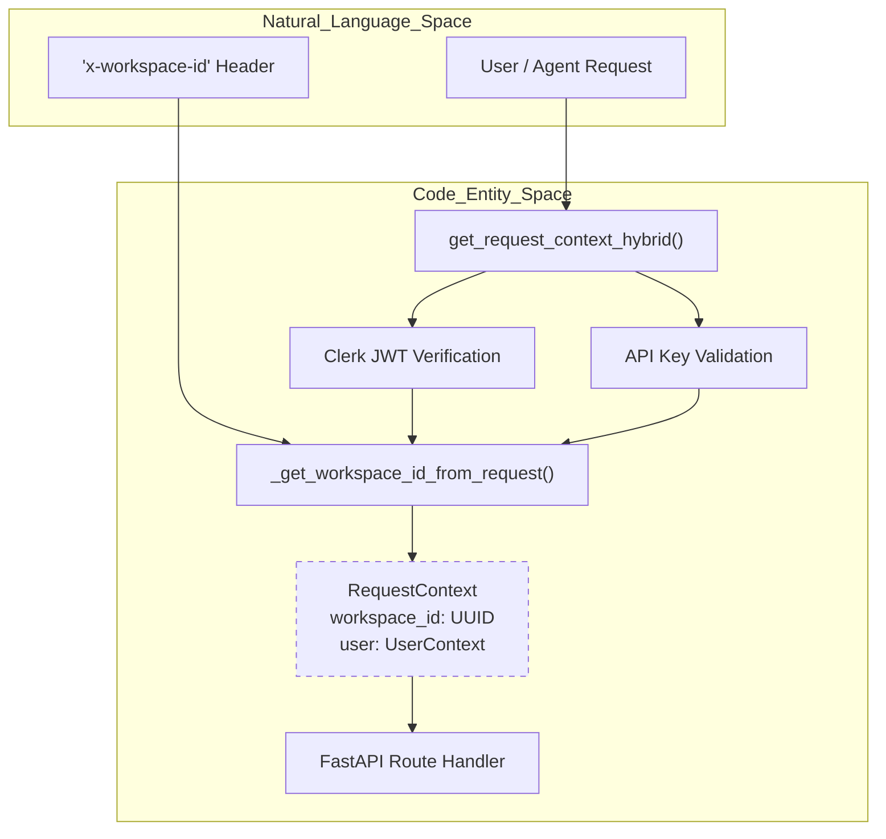
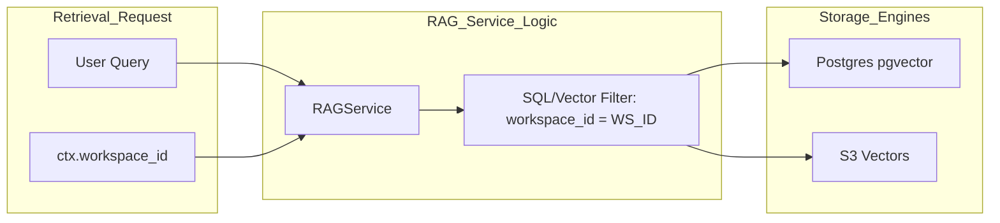

# Data Isolation

<details>
<summary>Relevant source files</summary>

The following files were used as context for generating this wiki page:

- [frontend/app/chat/page.tsx](frontend/app/chat/page.tsx)
- [frontend/components/documents/document-management.tsx](frontend/components/documents/document-management.tsx)
- [frontend/components/documents/local-storage-browser.tsx](frontend/components/documents/local-storage-browser.tsx)
- [frontend/next-env.d.ts](frontend/next-env.d.ts)
- [orchestrator/alembic/versions/20260202_add_workspace_id_to_skills_patterns_models.py](orchestrator/alembic/versions/20260202_add_workspace_id_to_skills_patterns_models.py)
- [orchestrator/api/context.py](orchestrator/api/context.py)
- [orchestrator/api/documents.py](orchestrator/api/documents.py)
- [orchestrator/api/widgets/docs.py](orchestrator/api/widgets/docs.py)
- [orchestrator/api/workflows.py](orchestrator/api/workflows.py)
- [orchestrator/core/llm/clients/openai_embedding.py](orchestrator/core/llm/clients/openai_embedding.py)
- [orchestrator/core/llm/rerank_manager.py](orchestrator/core/llm/rerank_manager.py)
- [orchestrator/core/services/__init__.py](orchestrator/core/services/__init__.py)
- [orchestrator/core/team_access.py](orchestrator/core/team_access.py)
- [orchestrator/modules/agents/services/agent_platform_tools.py](orchestrator/modules/agents/services/agent_platform_tools.py)
- [orchestrator/modules/rag/service.py](orchestrator/modules/rag/service.py)
- [orchestrator/modules/tools/formatting/result_formatter.py](orchestrator/modules/tools/formatting/result_formatter.py)

</details>


## Purpose and Scope

Data isolation ensures that resources belonging to one workspace cannot be accessed by users from another workspace. Every database record representing user-created content is scoped to a `workspace_id`, and all API queries automatically filter by the authenticated user's workspace. This prevents workspace spoofing, unauthorized cross-workspace access, and data leaks between tenants.

Automatos AI implements a multi-layered isolation strategy encompassing database foreign keys, request-scoped context injection, standardized memory namespacing, and cache prefixing.

---

## RequestContext as the Isolation Boundary

Every API endpoint receives a `RequestContext` from the `get_request_context_hybrid` authentication dependency. This context contains the resolved `workspace_id` and `UserContext`, which together define the isolation boundary for that request.

### Authentication and Workspace Resolution Flow

The following diagram illustrates how an incoming request is associated with a specific workspace before reaching the business logic.


**Sources:** [orchestrator/api/documents.py:35-36](), [orchestrator/api/documents.py:107-108](), [orchestrator/api/workflows.py:29-31]()

The `RequestContext` is constructed after resolving the workspace through multiple strategies:
1. **Explicit workspace ID** from `x-workspace-id` header or `workspace_id` query parameter.
2. **User's workspace** from Clerk organization or personal workspace.
3. **API Key association** where the key is linked to a specific `workspace_id`.

---

## Database Query Filtering Patterns

All workspace-scoped resources are filtered by `workspace_id` in their database queries. This is enforced at the service and repository layers.

### Standard Model Isolation

The base models in the system include a `workspace_id` field to maintain a strict 1:N relationship between workspaces and their entities.

| Entity | Model Class | Workspace Field | Source |
| :--- | :--- | :--- | :--- |
| Documents | `Document` | `workspace_id` | [orchestrator/api/documents.py:158]() |
| Workflows | `Workflow` | `workspace_id` | [orchestrator/api/workflows.py:21-23]() |
| RAG Configs | `RAGConfiguration` | `workspace_id` | [orchestrator/api/context.py:19-20]() |
| Agents | `Agent` | `workspace_id` | [orchestrator/api/workflows.py:22]() |

### Implementation Example: Document Management

When a document is uploaded or queried, the system strictly enforces the `workspace_id` filter. For instance, during upload, the system checks for duplicates *only within that workspace*, ensuring that identical files uploaded by different tenants do not conflict or leak metadata.

```python
# Check for duplicate within the workspace boundary
existing = db.query(Document).filter(
    Document.content_hash == content_hash, 
    Document.workspace_id == ctx.workspace_id
).first()
```
**Sources:** [orchestrator/api/documents.py:158-159]()

Similarly, when fetching document statistics or RAG performance, the `workspace_id` is passed into the `DocumentManager` or `RAGService` to scope the SQL queries.

**Sources:** [orchestrator/api/documents.py:77-86](), [orchestrator/api/context.py:151-157]()

---

## Memory and Cache Isolation

Data isolation extends beyond the relational database into the memory tiers (Redis, Vector DBs, and S3).

### Memory Tier Isolation (L1-L4)

| Layer | Technology | Isolation Mechanism | Reference |
| :--- | :--- | :--- | :--- |
| **L1 (Working)** | Redis | Key prefixing using `workspace_id` | [orchestrator/api/workflows.py:173-176]() |
| **L2/L3 (Short/Long)** | Postgres | Row-level filtering by `workspace_id` | [orchestrator/api/documents.py:158]() |
| **L4 (Knowledge)** | Vector DB / S3 | Path prefixing: `s3://{bucket}/{workspace_id}/` | [orchestrator/api/documents.py:79-86]() |

### RAG and Vector Search Isolation

The `RAGService` and `DocumentManager` are instantiated with a mandatory `workspace_id`. This ID is used to filter vector similarity searches so that an agent in Workspace A never retrieves chunks from Workspace B.


**Sources:** [orchestrator/api/documents.py:77-86](), [orchestrator/modules/rag/service.py:151-157]()

---

## Team-Based Access Control (Sub-Isolation)

Within a single workspace, further isolation is provided via `team_access`. This allows large organizations to partition data so that only specific teams (e.g., "Engineering" vs "HR") can see certain documents.

*   **Column Filtering:** The `documents` table contains a `team_access` column (array of strings).
*   **Query Enforcement:** The `TEAM_FILTER_CLAUSE` is appended to SQL queries to ensure users only see documents tagged for their specific team or public workspace documents.
*   **Widget Isolation:** External widgets use a `WidgetAuthContext` to enforce these team boundaries.

**Sources:** [orchestrator/api/widgets/docs.py:72-80](), [orchestrator/api/widgets/docs.py:103-114]()

---

## Summary of Isolation Implementation

| Component | Isolation Technique | Primary Code Reference |
| :--- | :--- | :--- |
| **API Layer** | `RequestContext` Dependency | [orchestrator/api/documents.py:108]() |
| **Database** | Foreign Key (`workspace_id`) | [orchestrator/api/documents.py:158]() |
| **Knowledge Base** | `DocumentManager` Scoping | [orchestrator/api/documents.py:77-86]() |
| **RAG Retrieval** | `RAGService` Initialization | [orchestrator/modules/rag/service.py:151-157]() |
| **External Widgets** | `WidgetAuthContext` & `team_access` | [orchestrator/api/widgets/docs.py:88-95]() |
| **Workflows** | `WorkflowStageTracker` Execution ID | [orchestrator/api/workflows.py:70-73]() |

**Sources:** [orchestrator/api/documents.py](), [orchestrator/api/workflows.py](), [orchestrator/modules/rag/service.py](), [orchestrator/api/widgets/docs.py]()

---