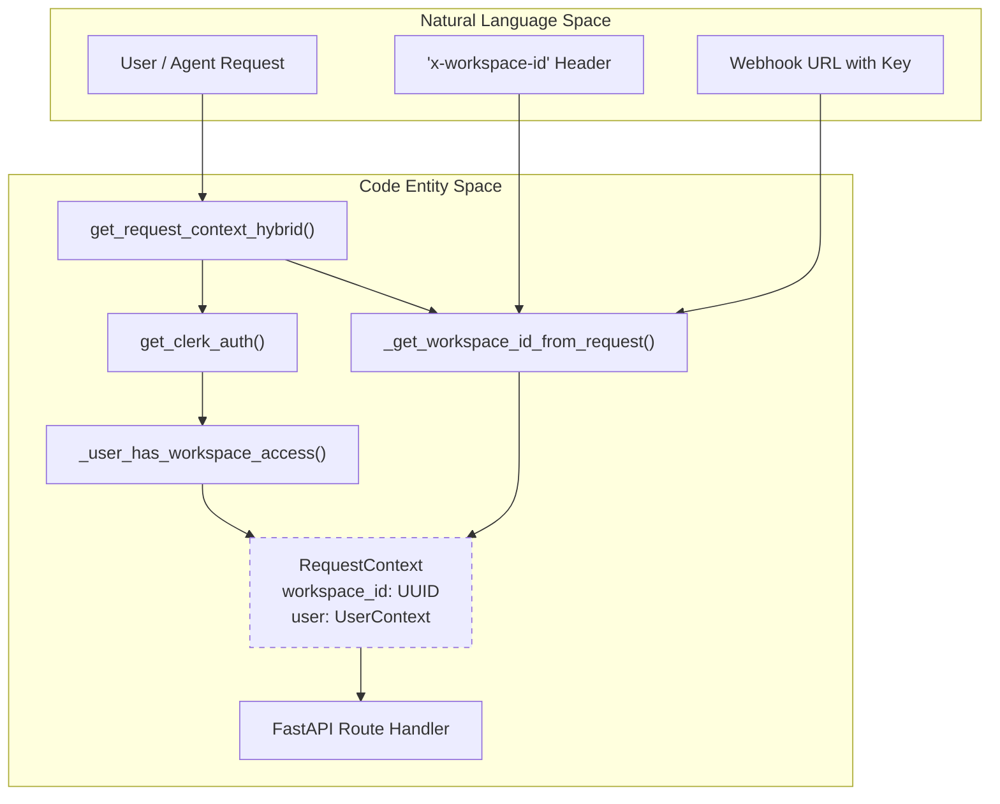
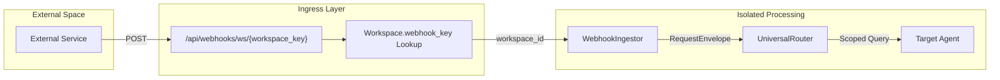

# Data Isolation

<details>
<summary>Relevant source files</summary>

The following files were used as context for generating this wiki page:

- [docs/PRDS/53-WEBHOOK-TRIGGER-SYSTEM-PRD.md](docs/PRDS/53-WEBHOOK-TRIGGER-SYSTEM-PRD.md)
- [frontend/app/globals.css](frontend/app/globals.css)
- [frontend/app/layout.tsx](frontend/app/layout.tsx)
- [frontend/components/providers.tsx](frontend/components/providers.tsx)
- [frontend/components/settings/WebhooksSettingsTab.tsx](frontend/components/settings/WebhooksSettingsTab.tsx)
- [frontend/components/ui/theme-toggle.tsx](frontend/components/ui/theme-toggle.tsx)
- [frontend/components/workspace-provider.tsx](frontend/components/workspace-provider.tsx)
- [orchestrator/alembic/versions/20260213_add_workspace_webhook_key.py](orchestrator/alembic/versions/20260213_add_workspace_webhook_key.py)
- [orchestrator/api/webhooks.py](orchestrator/api/webhooks.py)
- [orchestrator/core/auth/hybrid.py](orchestrator/core/auth/hybrid.py)
- [orchestrator/core/routing/ingestors/webhook.py](orchestrator/core/routing/ingestors/webhook.py)
- [orchestrator/tests/test_invitation_routing.py](orchestrator/tests/test_invitation_routing.py)

</details>


## Purpose and Scope

Data isolation ensures that resources belonging to one workspace cannot be accessed by users from another workspace. Every database record representing user-created content is scoped to a `workspace_id`, and all API queries automatically filter by the authenticated user's workspace. This prevents workspace spoofing, unauthorized cross-workspace access, and data leaks between tenants.

Automatos AI implements a multi-layered isolation strategy encompassing database foreign keys, request-scoped context injection, standardized memory namespacing, and cache prefixing.

**Sources:** [orchestrator/core/auth/hybrid.py:21-36](), [orchestrator/core/auth/dependencies.py:1-10]()

---

## RequestContext as the Isolation Boundary

Every API endpoint receives a `RequestContext` from the `get_request_context_hybrid` authentication dependency. This context contains the resolved `workspace_id` and `UserContext`, which together define the isolation boundary for that request.

### Authentication and Workspace Resolution Flow

The following diagram illustrates how an incoming request is associated with a specific workspace before reaching the business logic.

Title: Authentication and Workspace Resolution Pipeline


**Sources:** [orchestrator/core/auth/hybrid.py:47-86](), [orchestrator/core/auth/hybrid.py:144-163](), [orchestrator/core/auth/dependencies.py:15-18]()

The `RequestContext` is constructed after resolving the workspace through multiple strategies:
1.  **Explicit workspace ID** from `x-workspace-id` or `x-workspace` headers [orchestrator/core/auth/hybrid.py:65-72]().
2.  **Query parameters** using `workspace_id` [orchestrator/core/auth/hybrid.py:74-76]().
3.  **Environment defaults** such as `config.WORKSPACE_ID` or `config.DEFAULT_WORKSPACE_ID` [orchestrator/core/auth/hybrid.py:78-84]().
4.  **Membership verification** via `_user_has_workspace_access` to ensure the Clerk user owns or is a member of the requested workspace [orchestrator/core/auth/hybrid.py:144-163]().

---

## Database Query Filtering Patterns

All workspace-scoped resources are filtered by `workspace_id` in their database queries. This is enforced at the service and repository layers through SQLAlchemy filters.

### Standard Model Isolation

The base models in the system include a `workspace_id` field to maintain a strict 1:N relationship between workspaces and their entities.

| Entity | Model Class | Workspace Field | Source |
| :--- | :--- | :--- | :--- |
| Workspaces | `Workspace` | `id` (Primary Key) | [orchestrator/core/models/workspaces.py:26]() |
| Agents | `Agent` | `workspace_id` | [orchestrator/core/models/workspaces.py:126]() |
| Members | `WorkspaceMember` | `workspace_id` | [orchestrator/core/models/workspaces.py:126]() |
| Webhook Key | `Workspace.webhook_key` | `webhook_key` (Unique) | [orchestrator/alembic/versions/20260213_add_workspace_webhook_key.py:25]() |

### Implementation Example: Access Verification

The system prevents "workspace spoofing" by checking that the authenticated user is an active member of the target workspace.

```python
def _user_is_workspace_member(db, workspace_id: UUID, clerk_user_id: Optional[str]) -> bool:
    # Joins users and workspace_members to verify active membership
    row = db.execute(
        text(
            "SELECT 1 FROM workspace_members wm "
            "JOIN users u ON wm.user_id = u.id "
            "WHERE wm.workspace_id = :workspace_id "
            "AND u.clerk_user_id = :clerk_user_id "
            "AND wm.is_active = true "
            "LIMIT 1"
        ),
        {"workspace_id": str(workspace_id), "clerk_user_id": clerk_user_id},
    ).fetchone()
    return bool(row)
```

**Sources:** [orchestrator/core/auth/hybrid.py:126-141]()

---

## Webhook Isolation (URL-as-Secret)

For external integrations where standard JWT authentication is not feasible (e.g., GitHub webhooks, Jira triggers), Automatos AI uses a **URL-as-secret** pattern. 

### General Workspace Webhook
Every workspace is assigned a unique, 128-bit random `webhook_key` (UUID4 hex) upon creation [orchestrator/alembic/versions/20260213_add_workspace_webhook_key.py:31]().

Title: Webhook Data Flow and Isolation


**Sources:** [orchestrator/api/webhooks.py:6-8](), [orchestrator/core/routing/ingestors/webhook.py:25-30](), [docs/PRDS/53-WEBHOOK-TRIGGER-SYSTEM-PRD.md:33]()

### HMAC Signature Verification
For increased security, webhooks can be further isolated using HMAC-SHA256 signature verification. The system checks headers like `X-Hub-Signature-256` or `X-Composio-Signature` against a configured secret [orchestrator/api/webhooks.py:44-84]().

---

## Frontend Workspace Context

The React frontend maintains isolation by wrapping the application in a `WorkspaceProvider`. This provider fetches the current workspace context from `/api/workspaces/current` and stores it in state [frontend/components/workspace-provider.tsx:73-81]().

1.  **Token Injection:** Every request to the backend includes a Bearer token from Clerk [frontend/components/workspace-provider.tsx:77]().
2.  **State Persistence:** The `last_active_workspace` is stored in `localStorage` to maintain consistency across sessions [frontend/components/workspace-provider.tsx:121-123]().
3.  **Automatic Redirection:** If a user has a pending invitation, the provider intercepts the 409 Conflict response and redirects them to the invitation acceptance flow, preventing them from accidentally creating a new personal workspace [frontend/components/workspace-provider.tsx:83-101]().

**Sources:** [frontend/components/workspace-provider.tsx:52-155](), [orchestrator/tests/test_invitation_routing.py:124-139]()

---

## Summary of Isolation Implementation

| Component | Isolation Technique | Primary Code Reference |
| :--- | :--- | :--- |
| **Auth Layer** | Hybrid JWT/API Key Resolution | [orchestrator/core/auth/hybrid.py:47]() |
| **Database** | `webhook_key` Unique Index | [orchestrator/alembic/versions/20260213_add_workspace_webhook_key.py:38]() |
| **Routing** | `WebhookIngestor` workspace scoping | [orchestrator/core/routing/ingestors/webhook.py:29]() |
| **Frontend** | `WorkspaceProvider` Context | [frontend/components/workspace-provider.tsx:42]() |
| **Invitations** | Pending Invitation Gate | [orchestrator/core/auth/hybrid.py:166-172]() |

**Sources:** [orchestrator/core/auth/hybrid.py](), [orchestrator/api/webhooks.py](), [frontend/components/workspace-provider.tsx]()

---