# Data Isolation

<details>
<summary>Relevant source files</summary>

The following files were used as context for generating this wiki page:

- [docker-compose.yml](docker-compose.yml)
- [frontend/.dockerignore](frontend/.dockerignore)
- [frontend/Dockerfile](frontend/Dockerfile)
- [orchestrator/Dockerfile](orchestrator/Dockerfile)
- [orchestrator/core/redis/client.py](orchestrator/core/redis/client.py)
- [orchestrator/requirements.txt](orchestrator/requirements.txt)

</details>


## Purpose and Scope

Data isolation ensures that resources belonging to one workspace cannot be accessed by users from another workspace. Every database record that represents user-created content is scoped to a `workspace_id`, and all API queries automatically filter by the authenticated user's workspace. This prevents workspace spoofing, unauthorized cross-workspace access, and data leaks between tenants.

For information about how workspaces are resolved and assigned to users, see [Workspace Management](#9.2). For details on the authentication flow that establishes the `RequestContext`, see [Authentication Flow](#9.1).

---

## RequestContext as the Isolation Boundary

Every API endpoint receives a `RequestContext` from the `get_request_context_hybrid` authentication dependency. This context contains the resolved `workspace_id` and `UserContext`, which together define the isolation boundary for that request.

```mermaid
graph TB
    Request["HTTP Request"]
    HybridAuth["get_request_context_hybrid"]
    ClerkJWT["Clerk JWT Verification"]
    APIKey["API Key Validation"]
    ResolveWS["Workspace Resolution"]
    RequestContext["RequestContext<br/>workspace_id: UUID<br/>user: UserContext<br/>auth_type: str"]
    Endpoint["API Endpoint"]
    DBQuery["Database Query<br/>WHERE workspace_id = ?"]
    
    Request --> HybridAuth
    HybridAuth --> ClerkJWT
    HybridAuth --> APIKey
    ClerkJWT --> ResolveWS
    APIKey --> ResolveWS
    ResolveWS --> RequestContext
    RequestContext --> Endpoint
    Endpoint --> DBQuery
    
    style RequestContext fill:#333
    style DBQuery fill:#333
```



**Sources:** [orchestrator/core/auth/hybrid.py:283-399](), [orchestrator/core/auth/dependencies.py]()

The `RequestContext` is constructed by `get_request_context_hybrid` after resolving the workspace through multiple strategies:

1. **Explicit workspace ID** from `x-workspace-id` header or `workspace_id` query parameter
2. **User's workspace** from Clerk organization or personal workspace
3. **Auto-provisioned workspace** for first-time Clerk users
4. **Environment default** from `WORKSPACE_ID` or `DEFAULT_WORKSPACE_ID`

Once resolved, the `workspace_id` is immutable for the duration of the request and serves as the filter for all database operations.

**Sources:** [orchestrator/core/auth/hybrid.py:29-68](), [orchestrator/core/auth/hybrid.py:190-254]()

---

## Database Query Filtering Patterns

All workspace-scoped resources are filtered by `workspace_id` in their database queries. The pattern is consistent across all API routers.

### Standard Query Pattern

```mermaid
graph LR
    Endpoint["API Endpoint<br/>def list_agents(...)"]
    Context["ctx: RequestContext<br/>from Depends"]
    Query["db.query(Agent)<br/>.filter(Agent.workspace_id == ctx.workspace_id)"]
    Results["Filtered Results"]
    
    Endpoint --> Context
    Context --> Query
    Query --> Results
    
    style Context fill:#333
    style Query fill:#333
```



**Sources:** [orchestrator/api/agents.py:437-476](), [orchestrator/api/skills.py:418-501](), [orchestrator/api/patterns.py:15-41]()

### Agent Queries Example

The agents API demonstrates the filtering pattern in all CRUD operations:

| Operation | Query Filter | Line Reference |
|-----------|--------------|----------------|
| `list_agents` | `.filter(Agent.workspace_id == ctx.workspace_id)` | [orchestrator/api/agents.py:451]() |
| `get_agent` | `.filter(Agent.id == agent_id, Agent.workspace_id == ctx.workspace_id)` | [orchestrator/api/agents.py:541]() |
| `create_agent` | `agent = Agent(..., workspace_id=ctx.workspace_id)` | [orchestrator/api/agents.py:374-381]() |
| `update_agent` | `.filter(Agent.id == agent_id, Agent.workspace_id == ctx.workspace_id)` | [orchestrator/api/agents.py:609]() |
| `delete_agent` | `.filter(Agent.id == agent_id, Agent.workspace_id == ctx.workspace_id)` | [orchestrator/api/agents.py:701]() |
| `get_agent_stats` | `.filter(Agent.workspace_id == ctx.workspace_id)` | [orchestrator/api/agents.py:271-272]() |

**Sources:** [orchestrator/api/agents.py:437-741]()

### Create Operations with Workspace Assignment

When creating new resources, the `workspace_id` is explicitly assigned from the `RequestContext`:

```mermaid
graph TB
    Client["Client Request<br/>POST /api/agents"]
    Endpoint["create_agent endpoint"]
    Context["ctx.workspace_id<br/>(from auth)"]
    Model["Agent model<br/>workspace_id=ctx.workspace_id"]
    DB["Database INSERT"]
    
    Client --> Endpoint
    Endpoint --> Context
    Context --> Model
    Model --> DB
    
    style Context fill:#333
    style Model fill:#333
```



**Sources:** [orchestrator/api/agents.py:359-428](), [orchestrator/api/patterns.py:44-86]()

Example from agent creation:

```python
agent = Agent(
    name=agent_data.name,
    description=agent_data.description,
    agent_type=agent_data.agent_type,
    configuration=agent_data.configuration or {},
    workspace_id=ctx.workspace_id,  # Isolation boundary
    created_by="api"
)
```

**Sources:** [orchestrator/api/agents.py:374-383]()

---

## Workspace Access Verification

The hybrid authentication system includes access verification to prevent workspace spoofing. When a client sends an explicit `x-workspace-id` header, the system verifies the authenticated user actually has access to that workspace.

```mermaid
graph TB
    Request["Request with<br/>x-workspace-id header"]
    ParseWS["_get_workspace_id_from_request"]
    ClerkAuth["Clerk JWT verification"]
    CheckExists["_workspace_exists<br/>Verify workspace UUID exists"]
    CheckAccess["_user_has_workspace_access<br/>Verify membership"]
    Granted["Access Granted<br/>Use requested workspace_id"]
    Denied["Access Denied<br/>Resolve user's default workspace"]
    
    Request --> ParseWS
    ParseWS --> ClerkAuth
    ClerkAuth --> CheckExists
    CheckExists -->|exists| CheckAccess
    CheckExists -->|not found| Denied
    CheckAccess -->|has access| Granted
    CheckAccess -->|no access| Denied
    
    style CheckAccess fill:#333
    style Granted fill:#333
```



**Sources:** [orchestrator/core/auth/hybrid.py:71-82](), [orchestrator/core/auth/hybrid.py:84-107](), [orchestrator/core/auth/hybrid.py:283-350]()

### Access Check Implementation

The `_user_has_workspace_access` function queries both workspace ownership and workspace membership:

```sql
SELECT 1 FROM users u 
LEFT JOIN workspaces w ON w.owner_id = u.id AND w.id = :ws_id 
LEFT JOIN workspace_members wm ON wm.user_id = u.id AND wm.workspace_id = :ws_id AND wm.is_active = true 
WHERE u.clerk_user_id = :cid AND (w.id IS NOT NULL OR wm.id IS NOT NULL)
```

A user has access to a workspace if:
- They own the workspace (`workspaces.owner_id = users.id`), OR
- They are an active member (`workspace_members.is_active = true`)

**Sources:** [orchestrator/core/auth/hybrid.py:84-107]()

### Spoofing Prevention

If a user attempts to access a workspace they don't belong to by manipulating the `x-workspace-id` header, the system falls back to resolving their default workspace instead of blocking the request entirely. This prevents breaking the UI while maintaining security:

```python
if workspace_id:
    if not _workspace_exists(workspace_id):
        raise HTTPException(status_code=status.HTTP_400_BAD_REQUEST, detail="Invalid workspace_id")
    if not _user_has_workspace_access(clerk_uid, workspace_id):
        logger.warning("Access denied: user %s tried to access workspace %s", clerk_uid, workspace_id)
        # Fall through to resolver instead of blocking
        workspace_id = None
```

**Sources:** [orchestrator/core/auth/hybrid.py:316-323]()

---

## Workspace-Scoped Database Models

The following database models include a `workspace_id` foreign key and are filtered by workspace in all queries:

| Model | Table | Workspace Field | Primary API Router |
|-------|-------|----------------|-------------------|
| `Agent` | `agents` | `workspace_id` | `/api/agents` |
| `Skill` | `skills` | (not workspace-scoped) | `/api/v1/skills` |
| `Pattern` | `patterns` | `workspace_id` | `/api/patterns` |
| `Workflow` | `workflows` | `workspace_id` | `/api/workflows` |
| `WorkflowRecipe` | `workflow_recipes` | `workspace_id` | `/api/workflow-recipes` |
| `MarketplacePlugin` | `marketplace_plugins` | `owner_type` + `owner_id` | `/api/marketplace` |
| `WorkspaceEnabledPlugin` | `workspace_enabled_plugins` | `workspace_id` | `/api/workspaces/{id}/plugins` |
| `AgentAssignedPlugin` | `agent_assigned_plugins` | (via agent) | `/api/agents/{id}/plugins` |

**Note:** Skills are currently global resources shared across all workspaces, as they are loaded from Git repositories. Workspace-specific skill customization is planned for future releases.

**Sources:** [orchestrator/core/models/agents.py](), [orchestrator/core/models/workflows.py](), [orchestrator/core/models/marketplace_plugins.py]()

---

## Frontend Workspace Context

The frontend maintains workspace context through the `WorkspaceProvider` React context, which fetches the current workspace from `/api/workspaces/current` and provides it to all child components.

```mermaid
graph TB
    Providers["Providers component<br/>app layout"]
    ClerkProvider["ClerkProvider<br/>User authentication"]
    WorkspaceProvider["WorkspaceProvider<br/>Fetches current workspace"]
    WorkspaceAPI["GET /api/workspaces/current"]
    Context["React Context<br/>workspace object"]
    Components["Child Components<br/>useWorkspace() hook"]
    APIClient["apiClient<br/>Adds x-workspace-id header"]
    
    Providers --> ClerkProvider
    ClerkProvider --> WorkspaceProvider
    WorkspaceProvider --> WorkspaceAPI
    WorkspaceAPI --> Context
    Context --> Components
    Components --> APIClient
    
    style WorkspaceProvider fill:#333
    style Context fill:#333
```



**Sources:** [frontend/components/providers.tsx:1-86](), [frontend/components/workspace-provider.tsx](), [orchestrator/api/workspaces.py:24-54]()

### Workspace API Response

The `/api/workspaces/current` endpoint returns the authenticated user's workspace, including a flag for first-time users:

```json
{
  "id": "uuid",
  "name": "User's Workspace",
  "slug": "user-workspace",
  "plan": "starter",
  "role": "owner",
  "plan_limits": {
    "max_agents": 10,
    "max_workflows": 10,
    "max_documents": 100,
    "max_members": 5
  },
  "is_new_workspace": true
}
```

The `is_new_workspace` flag is `true` when the workspace has no agents yet, triggering the onboarding flow via `FirstLoginGuard`.

**Sources:** [orchestrator/api/workspaces.py:24-54](), [frontend/components/onboarding/first-login-guard.tsx:1-35]()

### API Client Workspace Headers

The frontend API client automatically includes the workspace ID in request headers:

```typescript
// Implicit in all API calls via apiClient
headers: {
  'x-workspace-id': workspace.id
}
```

**Sources:** [frontend/lib/api-client.ts]()

---

## Isolation Boundaries and Guarantees

### What Is Isolated

The following resources are strictly isolated by workspace:

- **Agents:** Each workspace has its own set of agents with unique configurations
- **Workflows and Recipes:** Workflow definitions and execution history are workspace-scoped
- **Patterns:** Custom patterns are private to each workspace
- **Plugin Enablement:** Workspaces must explicitly enable marketplace plugins before assignment
- **Tool Connections:** Composio app connections are workspace-specific
- **Execution History:** Workflow execution records are isolated per workspace

### What Is Not Isolated

The following resources are shared across workspaces:

- **Skills:** Loaded from Git repositories, skills are global and read-only
- **Marketplace Plugins:** The marketplace catalog is visible to all users
- **Marketplace Agents:** Shared agent templates are visible to all workspaces
- **LLM Models:** Model configurations are system-wide
- **Composio App Definitions:** The catalog of available apps is global

**Sources:** [orchestrator/api/agents.py](), [orchestrator/api/skills.py](), [orchestrator/api/marketplace.py]()

---

## Testing Data Isolation

To verify data isolation works correctly, follow this testing procedure:

### 1. Create Two Test Workspaces

```bash
# User A creates account via Clerk
# Auto-provisioned workspace A

# User B creates account via Clerk  
# Auto-provisioned workspace B
```

**Sources:** [orchestrator/core/auth/hybrid.py:110-187]()

### 2. Create Resources in Workspace A

```bash
curl -X POST http://localhost:8000/api/agents \
  -H "Authorization: Bearer $USER_A_TOKEN" \
  -H "Content-Type: application/json" \
  -d '{"name": "Agent A", "description": "Test agent"}'
```

**Sources:** [orchestrator/api/agents.py:359-428]()

### 3. Attempt Cross-Workspace Access

```bash
# User B tries to access User A's agent by ID
curl http://localhost:8000/api/agents/1 \
  -H "Authorization: Bearer $USER_B_TOKEN"

# Expected: 404 Not Found (filtered by workspace_id)
```

**Sources:** [orchestrator/api/agents.py:534-552]()

### 4. Attempt Header Spoofing

```bash
# User B tries to spoof workspace ID via header
curl http://localhost:8000/api/agents \
  -H "Authorization: Bearer $USER_B_TOKEN" \
  -H "x-workspace-id: $WORKSPACE_A_ID"

# Expected: Empty list (access denied, falls back to User B's workspace)
```

**Sources:** [orchestrator/core/auth/hybrid.py:316-323]()

### 5. Verify Workspace Member Access

```bash
# Add User B as member of Workspace A
INSERT INTO workspace_members (workspace_id, user_id, role, is_active)
VALUES ($WORKSPACE_A_ID, $USER_B_ID, 'member', true);

# User B can now access Workspace A's agents
curl http://localhost:8000/api/agents \
  -H "Authorization: Bearer $USER_B_TOKEN" \
  -H "x-workspace-id: $WORKSPACE_A_ID"

# Expected: List of Workspace A's agents
```

**Sources:** [orchestrator/core/auth/hybrid.py:84-107]()

---

## Common Isolation Patterns

### Pattern 1: List Resources

```python
@router.get("/")
async def list_resources(
    ctx: RequestContext = Depends(get_request_context_hybrid),
    db: Session = Depends(get_db)
):
    resources = db.query(Resource).filter(
        Resource.workspace_id == ctx.workspace_id
    ).all()
    return {"data": resources}
```

**Sources:** [orchestrator/api/agents.py:437-476](), [orchestrator/api/patterns.py:15-41]()

### Pattern 2: Get Single Resource

```python
@router.get("/{resource_id}")
async def get_resource(
    resource_id: int,
    ctx: RequestContext = Depends(get_request_context_hybrid),
    db: Session = Depends(get_db)
):
    resource = db.query(Resource).filter(
        Resource.id == resource_id,
        Resource.workspace_id == ctx.workspace_id  # Isolation check
    ).first()
    
    if not resource:
        raise HTTPException(status_code=404, detail="Resource not found")
    
    return {"data": resource}
```

**Sources:** [orchestrator/api/agents.py:534-552](), [orchestrator/api/patterns.py:88-117]()

### Pattern 3: Create Resource

```python
@router.post("/")
async def create_resource(
    data: ResourceCreate,
    ctx: RequestContext = Depends(get_request_context_hybrid),
    db: Session = Depends(get_db)
):
    resource = Resource(
        name=data.name,
        workspace_id=ctx.workspace_id  # Assign to user's workspace
    )
    db.add(resource)
    db.commit()
    return {"data": resource}
```

**Sources:** [orchestrator/api/agents.py:359-428](), [orchestrator/api/patterns.py:43-86]()

### Pattern 4: Update Resource

```python
@router.put("/{resource_id}")
async def update_resource(
    resource_id: int,
    data: ResourceUpdate,
    ctx: RequestContext = Depends(get_request_context_hybrid),
    db: Session = Depends(get_db)
):
    resource = db.query(Resource).filter(
        Resource.id == resource_id,
        Resource.workspace_id == ctx.workspace_id  # Verify ownership
    ).first()
    
    if not resource:
        raise HTTPException(status_code=404, detail="Resource not found")
    
    # Update fields
    db.commit()
    return {"data": resource}
```

**Sources:** [orchestrator/api/agents.py:605-695]()

### Pattern 5: Delete Resource

```python
@router.delete("/{resource_id}")
async def delete_resource(
    resource_id: int,
    ctx: RequestContext = Depends(get_request_context_hybrid),
    db: Session = Depends(get_db)
):
    resource = db.query(Resource).filter(
        Resource.id == resource_id,
        Resource.workspace_id == ctx.workspace_id  # Verify ownership
    ).first()
    
    if not resource:
        raise HTTPException(status_code=404, detail="Resource not found")
    
    db.delete(resource)
    db.commit()
    return {"message": "Resource deleted"}
```

**Sources:** [orchestrator/api/agents.py:697-740](), [orchestrator/api/patterns.py:119-141]()

---

## Isolation in Statistics and Aggregations

Statistics endpoints must also filter by workspace to prevent information leakage:

```python
@router.get("/stats")
async def get_agent_stats(
    ctx: RequestContext = Depends(get_request_context_hybrid),
    db: Session = Depends(get_db)
):
    total_agents = db.query(func.count(Agent.id)).filter(
        Agent.workspace_id == ctx.workspace_id
    ).scalar() or 0
    
    active_agents = db.query(func.count(Agent.id)).filter(
        Agent.workspace_id == ctx.workspace_id,
        Agent.status == "active"
    ).scalar() or 0
    
    return {
        "total_agents": total_agents,
        "active_agents": active_agents
    }
```

**Sources:** [orchestrator/api/agents.py:266-294]()

Even aggregate queries that don't return specific records must be scoped to prevent counting resources from other workspaces.

---

## Summary

Data isolation in Automatos AI is enforced through:

1. **Authentication Layer:** `get_request_context_hybrid` resolves and validates workspace access
2. **Request Context:** Every endpoint receives a `RequestContext` with immutable `workspace_id`
3. **Query Filtering:** All database queries include `WHERE workspace_id = ?` filters
4. **Access Verification:** Workspace membership is verified to prevent header spoofing
5. **Model Design:** All user-created resources have a `workspace_id` foreign key
6. **Frontend Integration:** React context and API client automatically include workspace headers

This multi-layered approach ensures complete data isolation between workspaces while maintaining a simple, consistent API pattern across all endpoints.

**Sources:** [orchestrator/core/auth/hybrid.py:283-399](), [orchestrator/api/agents.py](), [orchestrator/api/patterns.py](), [frontend/components/workspace-provider.tsx]()

---