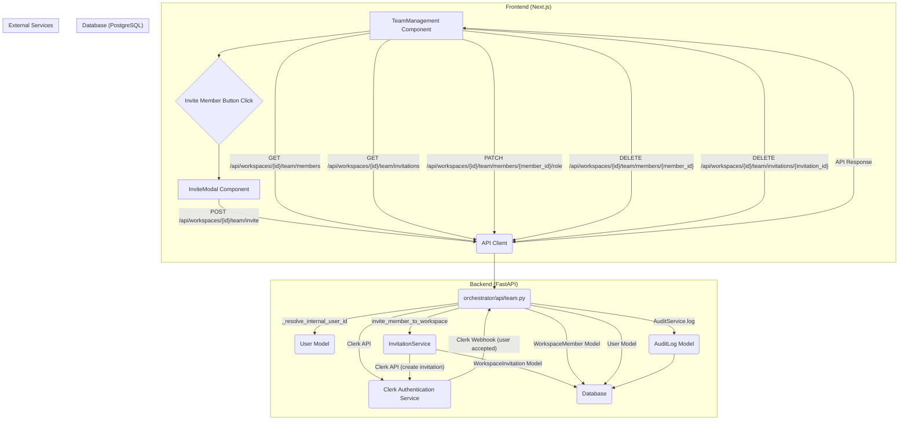

# Teams, Members & Invitations

<details>
<summary>Relevant source files</summary>

The following files were used as context for generating this wiki page:

- [frontend/app/activity/execution/page.tsx](frontend/app/activity/execution/page.tsx)
- [frontend/app/team/page.tsx](frontend/app/team/page.tsx)
- [frontend/components/__tests__/databases-tabs-apiclient.test.ts](frontend/components/__tests__/databases-tabs-apiclient.test.ts)
- [frontend/components/analytics/performance-analytics.tsx](frontend/components/analytics/performance-analytics.tsx)
- [frontend/components/context/DatabaseQueryAnalytics.tsx](frontend/components/context/DatabaseQueryAnalytics.tsx)
- [frontend/components/context/context-engineering.tsx](frontend/components/context/context-engineering.tsx)
- [frontend/components/documents/local-storage-browser.tsx](frontend/components/documents/local-storage-browser.tsx)
- [frontend/components/documents/provider-browser.tsx](frontend/components/documents/provider-browser.tsx)
- [frontend/components/knowledge/QueryTemplatesGrid.tsx](frontend/components/knowledge/QueryTemplatesGrid.tsx)
- [frontend/components/knowledge/SemanticLayerBuilder.tsx](frontend/components/knowledge/SemanticLayerBuilder.tsx)
- [frontend/components/playbooks/PlaybooksPanel.tsx](frontend/components/playbooks/PlaybooksPanel.tsx)
- [frontend/components/team/invite-modal.tsx](frontend/components/team/invite-modal.tsx)
- [frontend/components/team/team-management.tsx](frontend/components/team/team-management.tsx)
- [frontend/hooks/use-workspace.ts](frontend/hooks/use-workspace.ts)
- [orchestrator/alembic/versions/20260127_add_workspace_member_unique_constraint.py](orchestrator/alembic/versions/20260127_add_workspace_member_unique_constraint.py)
- [orchestrator/api/team.py](orchestrator/api/team.py)
- [orchestrator/core/auth/workspace_permission.py](orchestrator/core/auth/workspace_permission.py)
- [orchestrator/core/workspaces/audit.py](orchestrator/core/workspaces/audit.py)
- [orchestrator/core/workspaces/invitations.py](orchestrator/core/workspaces/invitations.py)
- [orchestrator/core/workspaces/models.py](orchestrator/core/workspaces/models.py)
- [orchestrator/modules/tools/discovery/actions_api_keys.py](orchestrator/modules/tools/discovery/actions_api_keys.py)
- [orchestrator/modules/tools/discovery/actions_members.py](orchestrator/modules/tools/discovery/actions_members.py)
- [orchestrator/modules/tools/discovery/handlers_api_keys.py](orchestrator/modules/tools/discovery/handlers_api_keys.py)
- [orchestrator/modules/tools/discovery/handlers_members.py](orchestrator/modules/tools/discovery/handlers_members.py)
- [orchestrator/scripts/fix_alembic_version.py](orchestrator/scripts/fix_alembic_version.py)
- [orchestrator/tests/test_p2w2_workspace_permission_gate.py](orchestrator/tests/test_p2w2_workspace_permission_gate.py)
- [orchestrator/tests/test_prd154_s12.py](orchestrator/tests/test_prd154_s12.py)

</details>


This page details the implementation of team management within Automatos AI, covering how workspace members are managed, the invitation process, and how documents can be scoped to specific teams. It also touches upon the workspace audit log, which records significant actions related to team and member management.

## Team Management Overview

Automatos AI provides robust features for managing teams and members within a workspace. This includes listing existing members, inviting new users, updating member roles, and revoking invitations. The system integrates with Clerk for authentication and user management, while maintaining its own `WorkspaceMember` and `WorkspaceInvitation` models for granular control and auditing.

### Key Components

*   **`WorkspaceMember` Model**: Represents a user's membership within a specific workspace, including their assigned role. [orchestrator/core/workspaces/models.py]()
*   **`WorkspaceInvitation` Model**: Stores details about pending invitations to a workspace. [orchestrator/core/workspaces/invitations.py:22-44]()
*   **`team.py` API Router**: Handles all backend API endpoints related to team and member management, including listing members, inviting, updating roles, and revoking invitations. [orchestrator/api/team.py:22-23]()
*   **`TeamManagement` Frontend Component**: The main UI component for displaying and managing workspace members and invitations. [frontend/components/team/team-management.tsx:33-33]()
*   **`InviteModal` Frontend Component**: A modal dialog for inviting new members to a workspace. [frontend/components/team/invite-modal.tsx:22-22]()
*   **`AuditService`**: Records all significant actions, including team and member changes, in the `audit_logs` table. [orchestrator/core/workspaces/audit.py:57-57]()

### Data Flow for Team Management

The following diagram illustrates the typical data flow for managing team members and invitations.


Sources:
- [orchestrator/api/team.py:22-23]()
- [orchestrator/api/team.py:29-43]()
- [orchestrator/api/team.py:137-151]()
- [orchestrator/api/team.py:170-199]()
- [orchestrator/api/team.py:200-229]()
- [orchestrator/api/team.py:231-259]()
- [orchestrator/api/team.py:261-289]()
- [orchestrator/api/team.py:291-319]()
- [orchestrator/api/team.py:321-349]()
- [orchestrator/api/team.py:351-379]()
- [orchestrator/api/team.py:381-409]()
- [orchestrator/api/team.py:411-439]()
- [orchestrator/api/team.py:441-469]()
- [orchestrator/api/team.py:471-490]()
- [frontend/components/team/team-management.tsx:33-33]()
- [frontend/components/team/team-management.tsx:46-61]()
- [frontend/components/team/team-management.tsx:64-75]()
- [frontend/components/team/team-management.tsx:83-94]()
- [frontend/components/team/team-management.tsx:96-108]()
- [frontend/components/team/invite-modal.tsx:22-22]()
- [orchestrator/core/workspaces/invitations.py:22-44]()
- [orchestrator/core/workspaces/audit.py:57-57]()

## Workspace Members

The `WorkspaceMember` model defines the relationship between a `User` and a `Workspace`. Each member has a specific `role` (e.g., `owner`, `admin`, `editor`, `viewer`) which dictates their permissions within the workspace.

### `WorkspaceMember` Model

```python
# orchestrator/core/workspaces/models.py
class WorkspaceMember(Base):
    __tablename__ = "workspace_members"

    id = Column(Integer, primary_key=True)
    workspace_id = Column(UUID(as_uuid=True), ForeignKey("workspaces.id", ondelete="CASCADE"), nullable=False)
    user_id = Column(Integer, ForeignKey("users.id", ondelete="CASCADE"), nullable=False)
    role = Column(String(50), default="member", nullable=False)
    is_active = Column(Boolean, default=True, nullable=False)
    joined_at = Column(DateTime, server_default=func.now())

    user = relationship("User", backref="workspace_members")
    workspace = relationship("Workspace", backref="members")

    __table_args__ = (
        UniqueConstraint("workspace_id", "user_id", name="uq_workspace_member"),
    )
```
Sources:
- [orchestrator/core/workspaces/models.py]()

### Listing Members

The `list_team_members` endpoint [orchestrator/api/team.py:77-124]() retrieves all active members for a given `workspace_id`. It queries the `WorkspaceMember` table and joins with the `User` table to fetch user details like email and name.

On the frontend, the `TeamManagement` component [frontend/components/team/team-management.tsx:46-61]() calls `apiClient.request<TeamMember[]>(`/api/workspaces/${workspaceId}/team/members`)` to fetch the list of members and `apiClient.request<PendingInvitation[]>(`/api/workspaces/${workspaceId}/team/invitations`)` for pending invitations.

### Updating Member Roles

The `update_member_role` endpoint [orchestrator/api/team.py:166-199]() allows changing a member's role.
It performs checks to prevent changing the `owner` role and validates the new role against `WorkspaceRole` enum values.

```python
# orchestrator/api/team.py
@router.patch(
    "/members/{member_id}/role",
    dependencies=[Depends(require_workspace_permission("members:change_role"))],
)
async def update_member_role(
    workspace_id: str,
    member_id: int,
    request: UpdateMemberRoleRequest,
    ctx: RequestContext = Depends(get_request_context),
    db: Session = Depends(get_db)
):
    """Change a member's role."""
    
    member = db.query(WorkspaceMember).filter(
        WorkspaceMember.id == member_id,
        WorkspaceMember.workspace_id == workspace_id
    ).first()
    
    if not member:
        raise HTTPException(404, "Member not found")
    
    # Can't change owner's role
    if member.role == WorkspaceRole.OWNER.value:
        raise HTTPException(400, "Cannot change owner's role. Transfer ownership instead.")
    
    # Validate role
    valid_roles = [r.value for r in WorkspaceRole]
    if request.role not in valid_roles:
        raise HTTPException(400, f"Invalid role: {request.role}")
    
    old_role = member.role
    member.role = request.role
    db.commit()
    # ... audit logging and Clerk sync ...
```
Sources:
- [orchestrator/api/team.py:166-199]()
- [orchestrator/api/team.py:188-194]()

## Invitations

The invitation system allows workspace administrators to invite new users via email.

### `WorkspaceInvitation` Model

The `WorkspaceInvitation` model [orchestrator/core/workspaces/invitations.py:22-44]() stores details about pending invitations:

*   `workspace_id`: The ID of the workspace the user is invited to.
*   `email`: The email address of the invitee.
*   `role`: The role the invitee will have upon accepting.
*   `token`: A unique token for accepting the invitation.
*   `invited_by`: The `user_id` of the inviter.
*   `expires_at`: The expiration timestamp for the invitation.
*   `clerk_invitation_id`: An optional ID from Clerk if the invitation was sent via Clerk's system.

### Invitation Process

1.  **Frontend Request**: An administrator initiates an invite from the `InviteModal` [frontend/components/team/invite-modal.tsx:22-22]() by providing an email and desired role. This triggers a `POST` request to `/api/workspaces/{workspace_id}/team/invite` [orchestrator/api/team.py:126-164]().
2.  **Backend Validation**: The `invite_member_to_workspace` function [orchestrator/core/workspaces/invitations.py:137-169]() performs several checks:
    *   Ensures the workspace exists.
    *   Checks if the invitee is already a member or has a pending invitation.
    *   Validates the requested role.
    *   Checks against workspace plan limits for members.
3.  **Clerk Integration**: If validation passes, an invitation is created in Clerk using `clerk.invitations.create` [orchestrator/core/workspaces/invitations.py:190-198](). This sends an email to the invitee.
4.  **Database Record**: A `WorkspaceInvitation` record is created in the local database, storing the invitation details and the `clerk_invitation_id`. [orchestrator/core/workspaces/invitations.py:180-188]()
5.  **Acceptance**: When the invitee clicks the link in the email, they are directed to a public endpoint `/api/team/accept-invitation` [orchestrator/api/team.py:321-349](). This endpoint verifies the token, marks the invitation as accepted, and creates a `WorkspaceMember` entry for the user. It also logs the action in the `AuditLog`.

### Invite Modal

The `InviteModal` component [frontend/components/team/invite-modal.tsx:22-22]() provides the user interface for sending invitations. It captures the invitee's email and desired role, then dispatches the invitation request to the backend.

```typescript
// frontend/components/team/invite-modal.tsx
export function InviteModal({ isOpen, onClose, onInvite, workspaceId }: InviteModalProps) {
    const [email, setEmail] = useState('')
    const [role, setRole] = useState('editor')
    const [loading, setLoading] = useState(false)
    const [error, setError] = useState<string | null>(null)

    const handleSubmit = async (e: React.FormEvent) => {
        e.preventDefault()
        setError(null)
        setLoading(true)

        try {
            await apiClient.request(`/api/workspaces/${workspaceId}/team/invite`, {
                method: 'POST',
                body: { email, role }
            })
            onInvite()
            onClose()
            setEmail('')
            setRole('editor')
        } catch (err: any) {
            console.error("Invite failed:", err)
            setError(err.message || "Failed to send invitation")
        } finally {
            setLoading(false)
        }
    }
    // ... JSX for form ...
}
```
Sources:
- [frontend/components/team/invite-modal.tsx:22-22]()
- [frontend/components/team/invite-modal.tsx:28-48]()

## Team-Scoped Documents

Documents within Automatos AI can be scoped to specific teams, controlling their visibility and access. This is managed through the `team_access` field on document models.

### Implementation

The `LocalStorageBrowser` component [frontend/components/documents/local-storage-browser.tsx:42-43]() demonstrates how documents can have a `team_access` array. The `TeamMultiSelect` component [frontend/components/documents/local-storage-browser.tsx:23-24]() is used to assign teams to documents, and the `useBulkUpdateTeamAccess` hook [frontend/components/documents/local-storage-browser.tsx:79-79]() handles updating this access for multiple documents.

```typescript
// frontend/components/documents/local-storage-browser.tsx
interface LocalDocument {
  id: number
  filename: string
  file_type?: string
  file_size?: number
  status?: string
  chunk_count?: number
  upload_date?: string
  team_access?: string[] // Key field for team scoping
}

// ... inside LocalStorageBrowser component ...
  const [selectedIds, setSelectedIds] = useState<Set<number>>(new Set())
  const [bulkTeams, setBulkTeams] = useState<string[]>([])
  const bulkUpdate = useBulkUpdateTeamAccess()

  const applyBulkTeams = async () => {
    if (selectedIds.size === 0) return
    try {
      await bulkUpdate.mutateAsync({ ids: Array.from(selectedIds), teamAccess: bulkTeams })
      setSelectedIds(new Set())
      setBulkTeams([])
    } catch {
      /* toast handled in the hook */
    }
  }
```
Sources:
- [frontend/components/documents/local-storage-browser.tsx:42-43]()
- [frontend/components/documents/local-storage-browser.tsx:77-79]()
- [frontend/components/documents/local-storage-browser.tsx:100-109]()
- [frontend/components/documents/local-storage-browser.tsx:23-24]()

This allows for fine-grained control over which teams can access specific knowledge base documents, ensuring data privacy and relevance.

## Workspace Audit Log

The `AuditLog` table [orchestrator/core/workspaces/audit.py:10-48]() records all significant actions within a workspace, providing a comprehensive history for compliance and debugging.

### `AuditLog` Model

```python
# orchestrator/core/workspaces/audit.py
class AuditLog(Base):
    """Track all important actions within a workspace."""
    __tablename__ = "audit_logs"

    id = Column(Integer, primary_key=True)
    workspace_id = Column(UUID(as_uuid=True), ForeignKey("workspaces.id", ondelete="CASCADE"), nullable=False)
    user_id = Column(Integer, ForeignKey("users.id", ondelete="SET NULL"), nullable=True)
    actor_type = Column(String(20), nullable=False, default="user", server_default="user")
    action = Column(String(100), nullable=False)
    resource_type = Column(String(50), nullable=True)
    resource_id = Column(String(255), nullable=True)
    resource_name = Column(String(255), nullable=True)
    details = Column(JSONB, default={})
    ip_address = Column(String(45), nullable=True)
    user_agent = Column(String(500), nullable=True)
    created_at = Column(DateTime, server_default=func.now())
```
Sources:
- [orchestrator/core/workspaces/audit.py:10-48]()

### Logging Actions

The `AuditService` [orchestrator/core/workspaces/audit.py:57-57]() is responsible for creating audit log entries. It's designed to log actions by both human users and non-human actors (agents, system processes). The `user_id` field is nullable to accommodate actions performed by autonomous agents, with `actor_type` and `details` providing context about the true actor.

For team management, actions like inviting a member, accepting an invitation, changing a member's role, or removing a member are all logged. For example, the `invite_member_to_workspace` function [orchestrator/core/workspaces/invitations.py:216-220]() explicitly logs the invitation event.

```python
# orchestrator/core/workspaces/invitations.py
    AuditService(db).log(
        workspace_id=workspace_id,
        user_id=inviter_internal_id,
        action="member:invited",
        resource_type="user",
        resource_id=str(invitation.id),
        resource_name=email,
        details={"role": role, "inviter_email": inviter_email},
    )
```
Sources:
- [orchestrator/core/workspaces/invitations.py:216-220]()

This ensures that all critical team-related activities are recorded, fulfilling compliance requirements like those outlined in PRD-181 S1 (EU-AI-Act Art.12).

## Frontend UI for Team Management

The `TeamManagement` component [frontend/components/team/team-management.tsx:33-33]() provides a comprehensive interface for managing team members and invitations.

```mermaid
graph TD
    A[TeamManagement Component] --> B[PageHeader: "Team Management"]
    A --> C[SearchInput: "Search members by name or email..."]
    A --> D[Pending Invitations Section]
    A --> E[Members List Section]

    D --> D1[Invitation Card]
    D1 -- "Revoke Invite Button" --> F{handleRevokeInvite}

    E --> E1[Member Card]
    E1 -- "Role Dropdown" --> G{handleRoleChange}
    E1 -- "Remove Member Button" --> H{handleRemoveMember}

    B -- "Invite Member Button" --> I[InviteModal]
    I -- "onInvite (success)" --> J[fetchMembers]
    F --> J
    G --> J
    H --> J
    J -- "Updates State" --> D & E
```
Sources:
- [frontend/components/team/team-management.tsx:33-33]()
- [frontend/components/team/team-management.tsx:127-159]()
- [frontend/components/team/team-management.tsx:162-166]()
- [frontend/components/team/team-management.tsx:168-177]()
- [frontend/components/team/team-management.tsx:200-204]()
- [frontend/components/team/team-management.tsx:206-210]()
- [frontend/components/team/team-management.tsx:212-216]()
- [frontend/components/team/team-management.tsx:218-222]()
- [frontend/components/team/team-management.tsx:224-228]()
- [frontend/components/team/team-management.tsx:230-234]()
- [frontend/components/team/team-management.tsx:236-240]()
- [frontend/components/team/team-management.tsx:242-246]()
- [frontend/components/team/team-management.tsx:248-252]()
- [frontend/components/team/team-management.tsx:254-258]()
- [frontend/components/team/team-management.tsx:260-264]()
- [frontend/components/team/team-management.tsx:266-270]()
- [frontend/components/team/team-management.tsx:272-276]()
- [frontend/components/team/team-management.tsx:278-282]()
- [frontend/components/team/team-management.tsx:284-288]()
- [frontend/components/team/team-management.tsx:290-294]()
- [frontend/components/team/team-management.tsx:296-300]()
- [frontend/components/team/team-management.tsx:302-306]()
- [frontend/components/team/team-management.tsx:307]()
- [frontend/components/team/team-management.tsx:307]()
- [frontend/components/team/team-management.tsx:307]()
- [frontend/components/team/team-management.tsx:307]()
- [frontend/components/team/team-management.tsx:307]()
- [frontend/components/team/team-management.tsx:307]()
- [frontend/components/team/team-management.tsx:307]()
- [frontend/components/team/team-management.tsx:307]()
- [frontend/components/team/team-management.tsx:307]()
- [frontend/components/team/team-management.tsx:307]()
- [frontend/components/team/team-management.tsx:307]()
- [frontend/components/team/team-management.tsx:307]()
- [frontend/components/team/team-management.tsx:307]()
- [frontend/components/team/team-management.tsx:307]()
- [frontend/components/team/team-management.tsx:307]()
- [frontend/components/team/team-management.tsx:46-61]()
- [frontend/components/team/team-management.tsx:64-75]()
- [frontend/components/team/team-management.tsx:83-94]()
- [frontend/components/team/team-management.tsx:96-108]()
- [frontend/components/team/invite-modal.tsx:22-22]()

It displays a list of current members and any pending invitations. Users can search for members, revoke pending invites, update member roles, and remove members. The `PageHeader` [frontend/components/team/team-management.tsx:127-159]() includes actions like refreshing the list and opening the `InviteModal`.

---