# Workspace Management

<details>
<summary>Relevant source files</summary>

The following files were used as context for generating this wiki page:

- [frontend/app/admin/plugins/page.tsx](frontend/app/admin/plugins/page.tsx)
- [frontend/lib/api-client.ts](frontend/lib/api-client.ts)
- [orchestrator/.env.example](orchestrator/.env.example)
- [orchestrator/api/agent_plugins.py](orchestrator/api/agent_plugins.py)
- [orchestrator/config.py](orchestrator/config.py)
- [orchestrator/core/database/load_seed_data.py](orchestrator/core/database/load_seed_data.py)
- [orchestrator/core/seeds/seed_personas.py](orchestrator/core/seeds/seed_personas.py)
- [orchestrator/core/seeds/seed_plugin_categories.py](orchestrator/core/seeds/seed_plugin_categories.py)
- [orchestrator/core/services/plugin_cache.py](orchestrator/core/services/plugin_cache.py)
- [orchestrator/main.py](orchestrator/main.py)
- [scripts/ralph/prd.json](scripts/ralph/prd.json)

</details>


## Purpose and Scope

This document describes how workspaces are resolved, provisioned, and accessed in Automatos AI. A workspace is the primary multi-tenancy boundary that isolates users' agents, workflows, recipes, and data. Every authenticated request must be scoped to a workspace.

For information about authentication mechanisms (Clerk JWT, API keys, anonymous fallback), see [Authentication Flow](#9.1). For details on how workspace-scoped queries enforce data isolation, see [Data Isolation](#9.3).

**Sources:** [orchestrator/core/auth/hybrid.py]()

---

## Workspace Resolution

The backend resolves the workspace for each request using a priority waterfall. The `_get_workspace_id_from_request` function checks multiple sources in order, returning the first valid UUID found.

### Resolution Priority

```mermaid
graph TB
    Request["HTTP Request"]
    
    Check1["1. request.state.workspace_id<br/>(middleware override)"]
    Check2["2. x-workspace-id header"]
    Check3["3. x-workspace header"]
    Check4["4. workspace_id query param"]
    Check5["5. WORKSPACE_ID env var"]
    Check6["6. DEFAULT_WORKSPACE_ID env var"]
    
    Parse["_parse_uuid()"]
    Valid{"Valid UUID?"}
    Return["Return workspace_id"]
    NextCheck["Check next source"]
    
    Request --> Check1
    Check1 --> Parse
    Parse --> Valid
    Valid -->|Yes| Return
    Valid -->|No| Check2
    Check2 --> Parse
    Check2 --> Check3
    Check3 --> Parse
    Check3 --> Check4
    Check4 --> Parse
    Check4 --> Check5
    Check5 --> Parse
    Check5 --> Check6
    Check6 --> Parse
    Check6 -->|No valid UUID| NextCheck
    
    style Return fill:#2d2d2d
    style Request fill:#2d2d2d
```



**Sources:** [orchestrator/core/auth/hybrid.py:29-68]()

### Resolution Functions

| Function | Purpose | Returns |
|----------|---------|---------|
| `_get_workspace_id_from_request()` | Extracts workspace_id from request using priority waterfall | `Optional[UUID]` |
| `_parse_uuid()` | Safely parses string to UUID, returns None on failure | `Optional[UUID]` |
| `_workspace_exists()` | Validates workspace exists and is active in database | `bool` |

The `_parse_uuid` function handles malformed UUIDs gracefully, stripping whitespace and catching exceptions:

**Sources:** [orchestrator/core/auth/hybrid.py:20-27](), [orchestrator/core/auth/hybrid.py:71-81]()

---

## Access Verification

When a client explicitly provides a workspace ID via header or query parameter, the backend verifies the user has access to that workspace. This prevents workspace spoofing attacks where a user attempts to access another workspace's data by manipulating request headers.

```mermaid
graph TB
    ClerkUser["Clerk User (clerk_user_id)"]
    WSRequest["Requested workspace_id"]
    
    Verify["_user_has_workspace_access()"]
    
    QueryDB["Query Database:<br/>users + workspaces + workspace_members"]
    
    CheckOwner{"User owns<br/>workspace?"}
    CheckMember{"User is<br/>active member?"}
    
    GrantAccess["Return true"]
    DenyAccess["Return false"]
    
    ClerkUser --> Verify
    WSRequest --> Verify
    Verify --> QueryDB
    QueryDB --> CheckOwner
    CheckOwner -->|Yes| GrantAccess
    CheckOwner -->|No| CheckMember
    CheckMember -->|Yes| GrantAccess
    CheckMember -->|No| DenyAccess
    
    style GrantAccess fill:#2d2d2d
    style DenyAccess fill:#2d2d2d
```



The SQL query joins three tables to verify access:

```sql
SELECT 1 FROM users u
LEFT JOIN workspaces w ON w.owner_id = u.id AND w.id = :ws_id
LEFT JOIN workspace_members wm 
  ON wm.user_id = u.id 
  AND wm.workspace_id = :ws_id 
  AND wm.is_active = true
WHERE u.clerk_user_id = :cid 
  AND (w.id IS NOT NULL OR wm.id IS NOT NULL)
```

Access is granted if the user either owns the workspace OR is an active member.

**Sources:** [orchestrator/core/auth/hybrid.py:84-107]()

---

## Auto-Provisioning for New Users

When a user authenticates via Clerk for the first time, the system automatically provisions a complete workspace structure. This happens atomically in `_provision_new_user_workspace`.

### Provisioning Flow

```mermaid
graph TB
    NewClerkUser["New Clerk User<br/>(clerk_user_id, email, name)"]
    
    Step1["1. Upsert users row<br/>INSERT ON CONFLICT DO NOTHING"]
    Step2["2. Resolve user.id<br/>SELECT id WHERE clerk_user_id"]
    Step3["3. Create workspaces row<br/>is_personal=true, owner_id=user.id"]
    Step4["4. Create workspace_members row<br/>role='owner', is_active=true"]
    Step5["5. COMMIT transaction"]
    
    Complete["Return workspace.id"]
    
    NewClerkUser --> Step1
    Step1 --> Step2
    Step2 --> Step3
    Step3 --> Step4
    Step4 --> Step5
    Step5 --> Complete
    
    style Complete fill:#2d2d2d
    style NewClerkUser fill:#2d2d2d
```



### Database Records Created

| Table | Fields | Values |
|-------|--------|--------|
| `users` | `clerk_user_id`, `email`, `username`, `name`, `is_active` | From Clerk claims, `is_active=true` |
| `workspaces` | `id`, `name`, `slug`, `owner_id`, `is_personal`, `plan`, `plan_limits` | UUID, "User's Workspace", unique slug, user.id, `true`, `"starter"`, default limits JSON |
| `workspace_members` | `workspace_id`, `user_id`, `role`, `is_active` | workspace.id, user.id, `"owner"`, `true` |

### Slug Collision Handling

The provisioning function generates a workspace slug from the user's email. If a slug collision occurs (rare but possible), it retries up to 5 times with a random suffix:

```
base_slug = email.split('@')[0].lower().replace(' ', '-')[:50]

Attempt 1: "john-smith"
Attempt 2: "john-smith-3a7f2c" (if collision)
Attempt 3: "john-smith-9b4e1d" (if collision)
...
```

**Sources:** [orchestrator/core/auth/hybrid.py:110-187]()

---

## Personal vs Organization Workspaces

The system supports two types of workspaces:

### Personal Workspaces

- Created automatically for each new user
- `is_personal=true`
- `owner_id` points to the user
- User has full control

### Organization Workspaces

- Created when users belong to Clerk organizations
- `clerk_org_id` links to Clerk organization
- `is_personal=false`
- Multiple members via `workspace_members` table
- Resolved via `_resolve_workspace_for_clerk_user`

### Resolution Logic

```mermaid
graph TB
    Resolve["_resolve_workspace_for_clerk_user()"]
    
    CheckOrg{"Has org_id<br/>from Clerk?"}
    QueryOrg["Query workspaces<br/>WHERE clerk_org_id = :org_id"]
    OrgFound{"Org workspace<br/>exists?"}
    
    CheckUser{"Has clerk_user_id?"}
    QueryUser["Query users<br/>WHERE clerk_user_id"]
    UserFound{"User record<br/>exists?"}
    
    QueryPersonal["Query workspaces<br/>WHERE owner_id = user.id<br/>ORDER BY is_personal DESC"]
    PersonalFound{"Personal workspace<br/>exists?"}
    
    AutoProvision["_provision_new_user_workspace()"]
    
    ReturnOrg["Return org workspace.id"]
    ReturnPersonal["Return personal workspace.id"]
    ReturnProvisioned["Return new workspace.id"]
    ReturnNone["Return None"]
    
    Resolve --> CheckOrg
    CheckOrg -->|Yes| QueryOrg
    QueryOrg --> OrgFound
    OrgFound -->|Yes| ReturnOrg
    OrgFound -->|No| CheckUser
    
    CheckOrg -->|No| CheckUser
    CheckUser -->|Yes| QueryUser
    QueryUser --> UserFound
    UserFound -->|Yes| QueryPersonal
    QueryPersonal --> PersonalFound
    PersonalFound -->|Yes| ReturnPersonal
    PersonalFound -->|No| AutoProvision
    AutoProvision --> ReturnProvisioned
    
    UserFound -->|No| AutoProvision
    CheckUser -->|No| ReturnNone
    
    style ReturnOrg fill:#2d2d2d
    style ReturnPersonal fill:#2d2d2d
    style ReturnProvisioned fill:#2d2d2d
    style ReturnNone fill:#2d2d2d
```



The resolution prioritizes organization workspaces over personal workspaces. If a user belongs to multiple workspaces, the frontend sends `x-workspace-id` to specify which one.

**Sources:** [orchestrator/core/auth/hybrid.py:190-254]()

---

## Request Context

The `get_request_context_hybrid` dependency constructs a `RequestContext` object for every API request. This context contains the resolved workspace ID and user information.

### Context Construction

```mermaid
graph TB
    Request["FastAPI Request"]
    
    Hybrid["get_request_context_hybrid()"]
    
    GetWS["_get_workspace_id_from_request()"]
    WSProvided{"workspace_id<br/>in request?"}
    
    AuthClerk["Verify Clerk JWT"]
    ExtractClaims["Extract user info from claims"]
    
    VerifyAccess["_user_has_workspace_access()"]
    AccessValid{"User has<br/>access?"}
    
    ResolveWS["_resolve_workspace_for_clerk_user()"]
    
    VerifyExists["_workspace_exists()"]
    Exists{"Workspace<br/>exists?"}
    
    BuildContext["Build RequestContext:<br/>- workspace_id<br/>- UserContext<br/>- auth_type"]
    
    ReturnContext["Return to API endpoint"]
    
    Request --> Hybrid
    Hybrid --> GetWS
    GetWS --> WSProvided
    
    WSProvided -->|Yes| AuthClerk
    WSProvided -->|No| AuthClerk
    
    AuthClerk --> ExtractClaims
    ExtractClaims --> VerifyAccess
    VerifyAccess --> AccessValid
    
    AccessValid -->|No| ResolveWS
    AccessValid -->|Yes| VerifyExists
    
    ResolveWS --> VerifyExists
    VerifyExists --> Exists
    Exists -->|Yes| BuildContext
    Exists -->|No| Error["HTTPException(400)"]
    
    BuildContext --> ReturnContext
    
    style ReturnContext fill:#2d2d2d
    style Error fill:#2d2d2d
```



### RequestContext Structure

```python
@dataclass
class RequestContext:
    workspace_id: UUID
    user: UserContext
    auth_type: str  # "clerk", "api_key", or "anonymous"
    api_key_id: Optional[str] = None
```

```python
@dataclass
class UserContext:
    id: str
    email: Optional[str]
    role: str
    system_role: str
    clerk_user_id: Optional[str] = None
    org_id: Optional[str] = None
    raw_claims: Optional[dict] = None
```

All API routers inject this context via `Depends(get_request_context_hybrid)`, ensuring every request has a valid workspace scope.

**Sources:** [orchestrator/core/auth/hybrid.py:283-399](), [orchestrator/core/auth/dependencies.py]()

---

## Frontend Integration

The frontend maintains workspace context through the `WorkspaceProvider` component and consumes the `/api/workspaces/current` endpoint.

### Current Workspace Endpoint

The `GET /api/workspaces/current` endpoint returns workspace metadata and detects new workspaces for onboarding:

```mermaid
graph TB
    Frontend["Frontend: useWorkspace()"]
    
    Request["GET /api/workspaces/current"]
    
    GetContext["ctx = get_request_context_hybrid()"]
    QueryDB["db.query(Workspace)<br/>.get(ctx.workspace_id)"]
    
    Found{"Workspace<br/>found?"}
    
    CountAgents["COUNT agents<br/>WHERE workspace_id = workspace.id"]
    
    BuildResponse["Build response:<br/>- id, name, slug, plan<br/>- role, plan_limits<br/>- is_new_workspace"]
    
    IsNew{"agent_count<br/>== 0?"}
    
    ReturnNew["Return:<br/>is_new_workspace = true"]
    ReturnExisting["Return:<br/>is_new_workspace = false"]
    
    Frontend --> Request
    Request --> GetContext
    GetContext --> QueryDB
    QueryDB --> Found
    Found -->|Yes| CountAgents
    Found -->|No| Error["404 Not Found"]
    
    CountAgents --> IsNew
    IsNew -->|Yes| BuildResponse
    IsNew -->|No| BuildResponse
    BuildResponse --> ReturnNew
    BuildResponse --> ReturnExisting
    
    style ReturnNew fill:#2d2d2d
    style ReturnExisting fill:#2d2d2d
    style Error fill:#2d2d2d
```



**Sources:** [orchestrator/api/workspaces.py:24-54]()

### Response Schema

```json
{
  "id": "uuid-string",
  "name": "John's Workspace",
  "slug": "john-workspace",
  "plan": "starter",
  "role": "owner",
  "plan_limits": {
    "max_agents": 10,
    "max_workflows": 10,
    "max_documents": 100,
    "max_members": 5
  },
  "is_new_workspace": true
}
```

---

## New Workspace Detection

The system detects new workspaces by checking if the workspace has any agents. This triggers the onboarding flow in the frontend.

### Onboarding Flow

```mermaid
graph TB
    UserLogin["User logs in via Clerk"]
    
    LoadWS["WorkspaceProvider fetches<br/>/api/workspaces/current"]
    
    WSResponse["Response includes<br/>is_new_workspace: boolean"]
    
    Guard["FirstLoginGuard component"]
    CheckStorage["Check localStorage:<br/>hasCompletedOnboarding(user.id)"]
    
    AlreadyOnboarded{"Already<br/>onboarded?"}
    
    CheckNew{"is_new_workspace<br/>== true?"}
    
    ShowWelcome["Show WelcomeModal<br/>after 1s delay"]
    
    UserChoice{"User action"}
    
    Skip["Mark onboarding skipped<br/>localStorage"]
    StartTour["Start Shepherd.js tour"]
    
    NoModal["No modal shown"]
    
    UserLogin --> LoadWS
    LoadWS --> WSResponse
    WSResponse --> Guard
    Guard --> CheckStorage
    CheckStorage --> AlreadyOnboarded
    
    AlreadyOnboarded -->|Yes| NoModal
    AlreadyOnboarded -->|No| CheckNew
    CheckNew -->|Yes| ShowWelcome
    CheckNew -->|No| NoModal
    
    ShowWelcome --> UserChoice
    UserChoice -->|Skip| Skip
    UserChoice -->|Start Tour| StartTour
    
    style ShowWelcome fill:#2d2d2d
    style NoModal fill:#2d2d2d
```



The `FirstLoginGuard` component coordinates this detection:

```typescript
// Check workspace state from backend
const { workspace, isLoading } = useWorkspace()

// Check user's onboarding status from localStorage
const onboardingComplete = hasCompletedOnboarding(user.id)

// Show welcome modal only if:
// 1. User hasn't completed/skipped onboarding
// 2. Backend reports workspace is new (no agents)
if (!onboardingComplete && workspace.isNewWorkspace) {
  setShowWelcome(true)
}
```

**Sources:** [frontend/components/onboarding/first-login-guard.tsx:1-35](), [frontend/lib/shepherd/tour-storage.ts:10-16]()

---

## Summary Tables

### Key Functions Reference

| Function | Location | Purpose |
|----------|----------|---------|
| `_get_workspace_id_from_request` | [hybrid.py:29-68]() | Extracts workspace_id from request headers/query/env |
| `_parse_uuid` | [hybrid.py:20-27]() | Safely parses string to UUID |
| `_workspace_exists` | [hybrid.py:71-81]() | Validates workspace exists and is active |
| `_user_has_workspace_access` | [hybrid.py:84-107]() | Verifies user has access to workspace |
| `_provision_new_user_workspace` | [hybrid.py:110-187]() | Auto-provisions workspace for new Clerk users |
| `_resolve_workspace_for_clerk_user` | [hybrid.py:190-254]() | Resolves workspace from Clerk user/org info |
| `get_request_context_hybrid` | [hybrid.py:283-399]() | Main auth dependency, constructs RequestContext |

### Workspace Resolution Sources

| Priority | Source | Example |
|----------|--------|---------|
| 1 | `request.state.workspace_id` | Set by middleware |
| 2 | `x-workspace-id` header | Frontend sets this explicitly |
| 3 | `x-workspace` header | Alternative header name |
| 4 | `workspace_id` query param | `?workspace_id=uuid` |
| 5 | `WORKSPACE_ID` env var | Docker/Railway config |
| 6 | `DEFAULT_WORKSPACE_ID` env var | System default fallback |

### Workspace Types

| Type | `is_personal` | `clerk_org_id` | Owner | Members |
|------|---------------|----------------|-------|---------|
| Personal | `true` | `null` | User who created account | Only owner initially |
| Organization | `false` | Set | Org owner | Multiple via `workspace_members` |

**Sources:** [orchestrator/core/auth/hybrid.py](), [orchestrator/api/workspaces.py](), [frontend/components/onboarding/first-login-guard.tsx]()

---