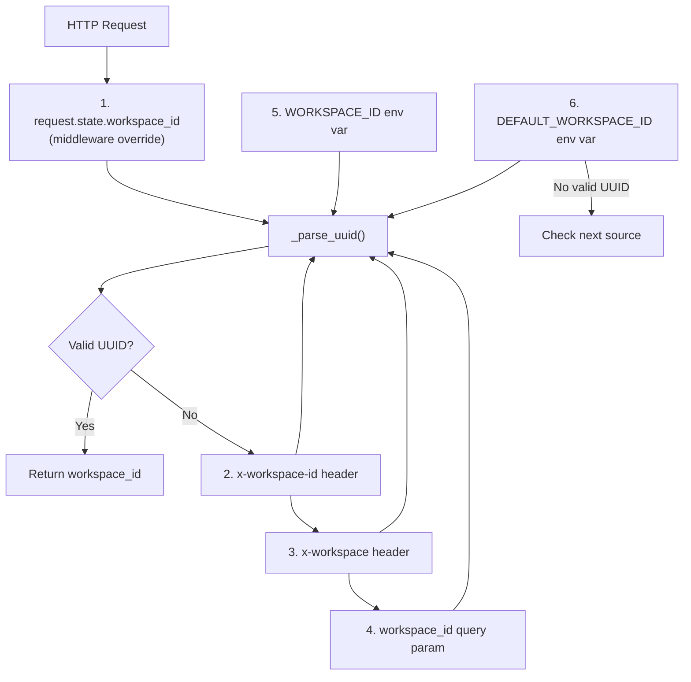
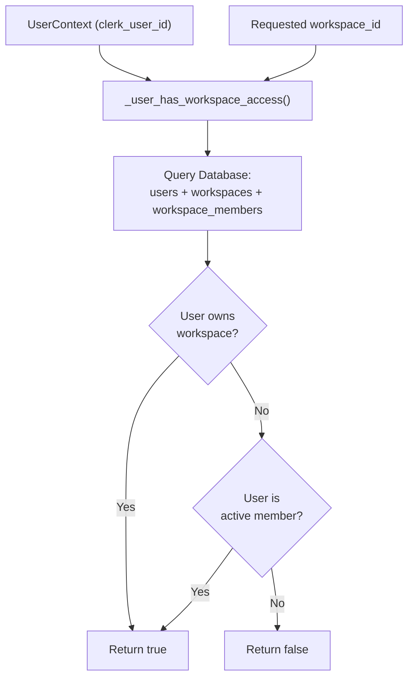
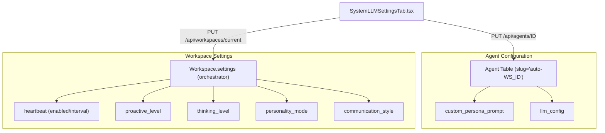
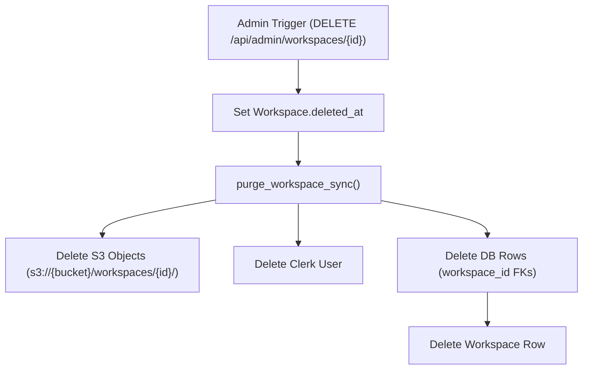

# Workspace Management

Relevant source files

The following files were used as context for generating this wiki page:

- [docs/notes/andy-fuck-it-mode.md](docs/notes/andy-fuck-it-mode.md)
- [frontend/app/admin/workspaces/page.tsx](frontend/app/admin/workspaces/page.tsx)
- [frontend/components/settings/SystemLLMSettingsTab.tsx](frontend/components/settings/SystemLLMSettingsTab.tsx)
- [frontend/contexts/role-context.tsx](frontend/contexts/role-context.tsx)
- [orchestrator/api/admin_workspaces.py](orchestrator/api/admin_workspaces.py)
- [orchestrator/api/workspaces.py](orchestrator/api/workspaces.py)
- [orchestrator/core/auth/clerk.py](orchestrator/core/auth/clerk.py)
- [orchestrator/core/auth/dependencies.py](orchestrator/core/auth/dependencies.py)
- [orchestrator/core/seeds/platform-management-skill.md](orchestrator/core/seeds/platform-management-skill.md)
- [orchestrator/core/seeds/seed_auto_agent.py](orchestrator/core/seeds/seed_auto_agent.py)
- [orchestrator/core/workspaces/__init__.py](orchestrator/core/workspaces/__init__.py)
- [orchestrator/services/workspace_purge.py](orchestrator/services/workspace_purge.py)
- [orchestrator/tests/test_p2w2_family_gates.py](orchestrator/tests/test_p2w2_family_gates.py)
- [orchestrator/tests/test_playbook_launch_parity.py](orchestrator/tests/test_playbook_launch_parity.py)
- [orchestrator/tests/test_prd226_doctrine.py](orchestrator/tests/test_prd226_doctrine.py)
- [scripts/sync-auto-skill.py](scripts/sync-auto-skill.py)

## Purpose and Scope

This document describes how workspaces are resolved, provisioned, and accessed in Automatos AI. A workspace is the primary multi-tenancy boundary that isolates agents, workflows, recipes, documents, and memory. Every authenticated request is scoped to a `workspace_id` to ensure strict data isolation [orchestrator/core/auth/hybrid.py:23-37]().

---

## Workspace Resolution

The backend resolves the workspace for each request using a priority waterfall. The `get_request_context_hybrid` dependency utilizes `_get_workspace_id_from_request` to check multiple sources in order, returning the first valid UUID found [orchestrator/core/auth/hybrid.py:49-88]().

### Resolution Priority

Title: Workspace ID Resolution Waterfall

**Sources:** [orchestrator/core/auth/hybrid.py:49-88]()

### Resolution Functions

| Function | Purpose | Returns |
|----------|---------|---------|
| `_get_workspace_id_from_request()` | Extracts `workspace_id` from request using priority waterfall | `Optional[UUID]` [orchestrator/core/auth/hybrid.py:49-88]() |
| `_parse_uuid()` | Safely parses string to UUID, returns `None` on failure | `Optional[UUID]` [orchestrator/core/auth/hybrid.py:40-47]() |
| `_workspace_exists()` | Validates workspace exists and is active in database | `bool` [orchestrator/core/auth/hybrid.py:91-107]() |

---

## Access Verification and Permissions

When a client provides a workspace ID, the backend verifies the user has access via `_user_has_workspace_access` [orchestrator/core/auth/hybrid.py:146-166]().

Title: Workspace Access Verification Logic

**Sources:** [orchestrator/core/auth/hybrid.py:146-166]()

---

## Auto-Provisioning and Seeding

When a user authenticates for the first time, the system auto-provisions a personal workspace. During this process, default notification preferences are seeded to ensure immediate system awareness [orchestrator/core/auth/hybrid.py:200-207]().

### The "Auto" System Agent
Every workspace contains exactly one "Auto" agent (slug `auto-{workspace_id}`). This agent serves as the workspace's central orchestrator and the target for the "Orchestrator Soul" settings [orchestrator/core/seeds/seed_auto_agent.py:1-16]().

*   **System Agent:** Marked with `is_system_agent=True` and hidden from the Roster UI [orchestrator/core/seeds/seed_auto_agent.py:12-16]().
*   **Platform Skills:** Automatically assigned the `platform-management` skill, enabling it to manage workspace resources [orchestrator/core/seeds/platform-management-skill.md:1-132](). The content of this skill is synced from the `automatos-skills` repository using `scripts/sync-auto-skill.py` [scripts/sync-auto-skill.py:1-29]().
*   **Context:** Uses a custom persona (the "Soul") which is composed of a base voice and the "Manager's Doctrine" [orchestrator/core/seeds/seed_auto_agent.py:81-106](). The doctrine is a set of nine management principles embedded in the agent's identity [orchestrator/core/seeds/seed_auto_agent.py:63-80]().

**Sources:** [orchestrator/core/seeds/seed_auto_agent.py:1-175](), [orchestrator/api/workspaces.py:62-67](), [orchestrator/core/seeds/platform-management-skill.md:1-132](), [scripts/sync-auto-skill.py:1-29]()

---

## Workspace Settings and Integrations

Workspaces manage platform integrations and webhook configurations through the `workspace.settings` JSONB field [orchestrator/api/workspaces.py:143-181]().

### Integration Management
Supported integrations include Telegram, Slack, and WhatsApp. Sensitive tokens are masked in `GET` responses [orchestrator/api/workspaces.py:32-40](), [orchestrator/api/workspaces.py:78-87]().

| Key | Usage |
|-----|-------|
| `telegram_bot_token` | Auth for Telegram adapter [orchestrator/api/workspaces.py:34]() |
| `slack_bot_token` | Auth for Slack adapter [orchestrator/api/workspaces.py:36]() |
| `whatsapp_phone_number_id` | WhatsApp integration [orchestrator/api/workspaces.py:40]() |
| `telegram_trigger_mode` | Ingress trust mode for Telegram [orchestrator/api/workspaces.py:49]() |
| `slack_trigger_mode` | Ingress trust mode for Slack [orchestrator/api/workspaces.py:50]() |

### Webhook Configuration
Each workspace generates a unique `webhook_key` for external event ingestion, surfaced via the `webhook_url` [orchestrator/api/workspaces.py:69-76]().

**Sources:** [orchestrator/api/workspaces.py:30-181]()

---

## Orchestrator Soul and Heartbeat

The `SystemLLMSettingsTab` provides the UI for configuring the workspace-wide orchestrator behavior, which is stored in the "Auto" agent's `configuration` field and the `workspace.settings.orchestrator` object [frontend/components/settings/SystemLLMSettingsTab.tsx:5-11]().

Title: Orchestrator Configuration Mapping

**Sources:** [frontend/components/settings/SystemLLMSettingsTab.tsx:58-81](), [orchestrator/core/seeds/seed_auto_agent.py:7-9]()

---

## Workspace Switching

The frontend allows users to switch between workspaces. The `WorkspaceProvider` manages the `last_active_workspace` and `canEdit` state [frontend/components/workspace-provider.tsx](). The `get_current_workspace` endpoint returns the currently active workspace, including its role, plan limits, and onboarding status [orchestrator/api/workspaces.py:57-139]().

**Sources:** [orchestrator/api/workspaces.py:57-139]()

---

## Workspace Purge

Workspaces can be soft-deleted by setting `deleted_at` [orchestrator/api/admin_workspaces.py:114-115](). A hard-delete (purge) operation is available for administrators, which permanently removes all associated data.

### Purge Process
The `purge_workspace_sync` service handles the hard-deletion [orchestrator/services/workspace_purge.py:35]().

1.  **Validation:** Ensures the workspace is already soft-deleted [orchestrator/services/workspace_purge.py:6-7]().
2.  **S3 Object Deletion:** Wipes all S3 objects under the workspace's prefix [orchestrator/services/workspace_purge.py:8-9](), using `_purge_s3_prefix` [orchestrator/services/workspace_purge.py:113-136]().
3.  **Clerk User Deletion:** Deletes the owning Clerk user via `_delete_clerk_user` [orchestrator/services/workspace_purge.py:149-157]().
4.  **Database Row Deletion:** Deletes all rows referencing `workspace_id` across various tables. This process dynamically discovers tables with a `workspace_id` column using `_discover_scoped_tables` [orchestrator/services/workspace_purge.py:50-74](). It also handles pre-cascading external references that might block deletion [orchestrator/services/workspace_purge.py:159-175]().
5.  **Workspace Row Deletion:** Finally deletes the `Workspace` row itself [orchestrator/services/workspace_purge.py:15]().

Title: Workspace Purge Data Flow

**Sources:** [orchestrator/services/workspace_purge.py:1-19](), [orchestrator/api/admin_workspaces.py:210-225]()

---

## Admin Workspace Management

The `/api/admin/workspaces` endpoint provides administrative capabilities for managing workspaces [orchestrator/api/admin_workspaces.py:1-15](). Access is restricted to users with `admin` or `super_admin` system roles [orchestrator/api/admin_workspaces.py:44-50]().

### Admin Operations

*   **List Workspaces:** Retrieve a paginated list of workspaces with filtering and sorting options, including counts of agents, documents, chats, and storage usage [orchestrator/api/admin_workspaces.py:95-189]().
*   **Pause/Resume:** Temporarily disable or re-enable a workspace [orchestrator/api/admin_workspaces.py:17-18]().
*   **Soft-Delete/Restore:** Mark a workspace as deleted or restore it [orchestrator/api/admin_workspaces.py:19-20]().
*   **Hard-Delete:** Trigger the permanent purge process [orchestrator/api/admin_workspaces.py:12-13]().

The frontend provides a dedicated console for these operations at `/admin/workspaces` [frontend/app/admin/workspaces/page.tsx:113-115]().

**Sources:** [orchestrator/api/admin_workspaces.py:1-15](), [frontend/app/admin/workspaces/page.tsx:1-234]()

---

## Onboarding and Tours

New workspaces trigger a specialized onboarding flow, detected by the `onboarding` snapshot returned by `get_current_workspace` [orchestrator/api/workspaces.py:135-136]().

*   **Onboarding Snapshot:** The `public_snapshot` function from `services.onboarding_state` provides the current onboarding stage and trial status [orchestrator/api/workspaces.py:135]().
*   **Business Intake:** A wizard that builds a Knowledge Graph and Mission Zero plan [frontend/components/onboarding/welcome-modal.tsx:117-141]().

**Sources:** [orchestrator/api/workspaces.py:135-136]()

---

## Summary of Key Entities

| Code Entity | File Path | Role |
|-------------|-----------|------|
| `Workspace` | [orchestrator/core/models/workspaces.py]() | SQLAlchemy model for workspace data, including `onboarding` and `plan_limits` |
| `RequestContext` | [orchestrator/core/auth/dependencies.py]() | Dataclass holding resolved `workspace_id` and `user` |
| `get_request_context_hybrid` | [orchestrator/core/auth/hybrid.py]() | Dependency for resolving auth + workspace context |
| `seed_auto_agent` | [orchestrator/core/seeds/seed_auto_agent.py]() | Provisions the central system agent per workspace |
| `SystemLLMSettingsTab` | [frontend/components/settings/SystemLLMSettingsTab.tsx]() | UI for workspace orchestrator/soul configuration |
| `purge_workspace_sync` | [orchestrator/services/workspace_purge.py]() | Service for hard-deleting workspace data |
| `list_workspaces` | [orchestrator/api/admin_workspaces.py:95-189]() | Admin endpoint to list and manage workspaces |

**Sources:** [orchestrator/core/auth/hybrid.py](), [orchestrator/api/workspaces.py](), [orchestrator/core/seeds/seed_auto_agent.py](), [frontend/components/settings/SystemLLMSettingsTab.tsx](), [orchestrator/services/workspace_purge.py](), [orchestrator/api/admin_workspaces.py]()

---