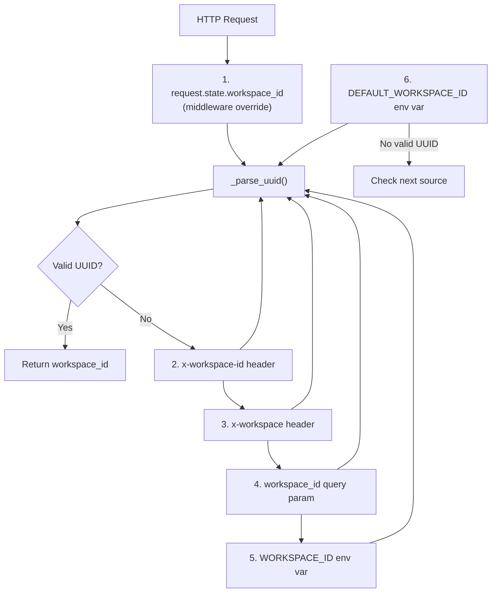
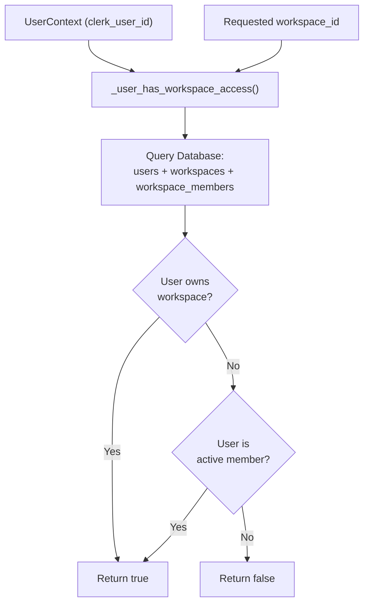
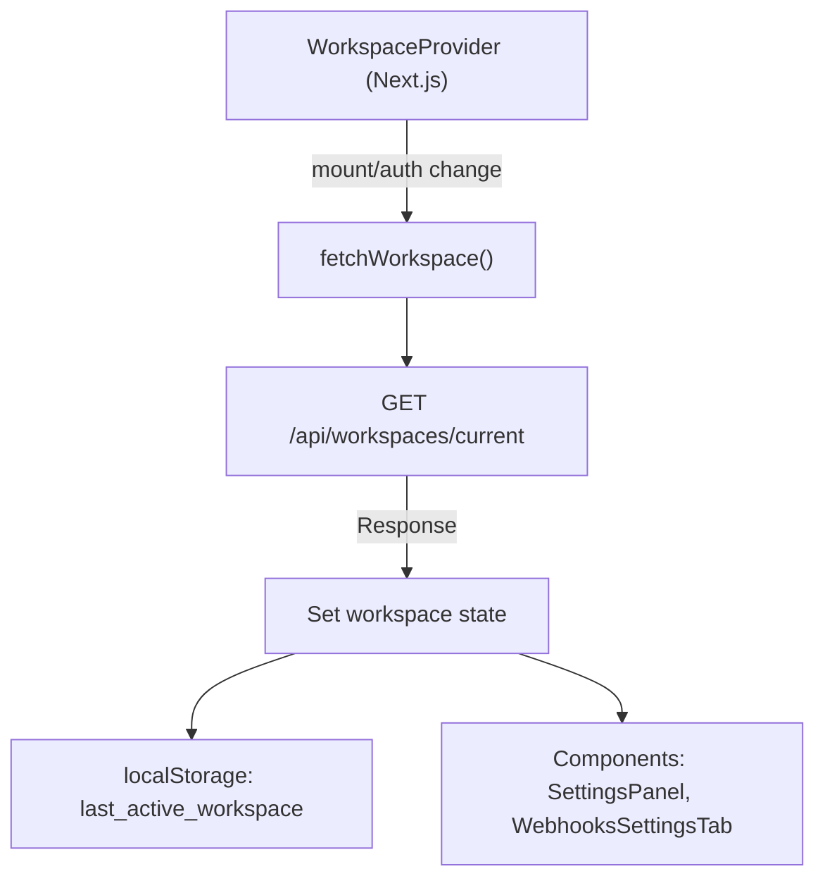

# Workspace Management

Relevant source files

The following files were used as context for generating this wiki page:

- [docs/PRDS/53-WEBHOOK-TRIGGER-SYSTEM-PRD.md](docs/PRDS/53-WEBHOOK-TRIGGER-SYSTEM-PRD.md)
- [frontend/app/chat/page.tsx](frontend/app/chat/page.tsx)
- [frontend/components/settings/SettingsPanel.tsx](frontend/components/settings/SettingsPanel.tsx)
- [frontend/components/settings/SystemLLMSettingsTab.tsx](frontend/components/settings/SystemLLMSettingsTab.tsx)
- [frontend/components/settings/SystemSettingsTab.tsx](frontend/components/settings/SystemSettingsTab.tsx)
- [frontend/components/settings/WebhooksSettingsTab.tsx](frontend/components/settings/WebhooksSettingsTab.tsx)
- [frontend/components/workspace-provider.tsx](frontend/components/workspace-provider.tsx)
- [frontend/next-env.d.ts](frontend/next-env.d.ts)
- [orchestrator/alembic/versions/20260202_add_workspace_id_to_skills_patterns_models.py](orchestrator/alembic/versions/20260202_add_workspace_id_to_skills_patterns_models.py)
- [orchestrator/alembic/versions/20260213_add_workspace_webhook_key.py](orchestrator/alembic/versions/20260213_add_workspace_webhook_key.py)
- [orchestrator/api/context.py](orchestrator/api/context.py)
- [orchestrator/api/webhooks.py](orchestrator/api/webhooks.py)
- [orchestrator/api/workflows.py](orchestrator/api/workflows.py)
- [orchestrator/api/workspaces.py](orchestrator/api/workspaces.py)
- [orchestrator/core/llm/clients/openai_embedding.py](orchestrator/core/llm/clients/openai_embedding.py)
- [orchestrator/core/llm/rerank_manager.py](orchestrator/core/llm/rerank_manager.py)
- [orchestrator/core/models/routing.py](orchestrator/core/models/routing.py)
- [orchestrator/core/routing/ingestors/webhook.py](orchestrator/core/routing/ingestors/webhook.py)
- [orchestrator/core/services/__init__.py](orchestrator/core/services/__init__.py)
- [orchestrator/modules/tools/discovery/actions_harness.py](orchestrator/modules/tools/discovery/actions_harness.py)
- [orchestrator/modules/tools/discovery/handlers_harness.py](orchestrator/modules/tools/discovery/handlers_harness.py)
- [orchestrator/modules/tools/discovery/handlers_missions.py](orchestrator/modules/tools/discovery/handlers_missions.py)
- [orchestrator/scripts/seed_blog_playbook.py](orchestrator/scripts/seed_blog_playbook.py)
- [orchestrator/services/harness_service.py](orchestrator/services/harness_service.py)

## Purpose and Scope

This document describes how workspaces are resolved, provisioned, and accessed in Automatos AI. A workspace is the primary multi-tenancy boundary that isolates agents, workflows, recipes, documents, and memory. Every authenticated request must be scoped to a `workspace_id` to ensure strict data isolation. In addition to data isolation, workspaces serve as the execution context for autonomous loops like the `HarnessService` and `HeartbeatService`.

**Sources:** [orchestrator/core/auth/hybrid.py:1-15](), [orchestrator/core/models/workspaces.py:1-20](), [orchestrator/services/harness_service.py:5-12]()

---

## Workspace Resolution

The backend resolves the workspace for each request using a priority waterfall. The `get_request_context_hybrid` dependency orchestrates this resolution, ensuring that every operation is bound to a valid `workspace_id`.

### Resolution Priority

Title: Workspace ID Resolution Waterfall

**Sources:** [orchestrator/core/auth/hybrid.py:29-68]()

### Resolution Functions

| Function | Purpose | Returns |
|----------|---------|---------|
| `_get_workspace_id_from_request()` | Extracts `workspace_id` from request using priority waterfall | `Optional[UUID]` |
| `_parse_uuid()` | Safely parses string to UUID, returns `None` on failure | `Optional[UUID]` |
| `_workspace_exists()` | Validates workspace exists and is active in database | `bool` |

The `_parse_uuid` function handles malformed UUIDs gracefully, stripping whitespace and catching exceptions.

**Sources:** [orchestrator/core/auth/hybrid.py:20-27](), [orchestrator/core/auth/hybrid.py:71-81]()

---

## Access Verification and Permissions

When a client explicitly provides a workspace ID via header or query parameter, the backend verifies the user has access. This prevents workspace spoofing.

Title: Workspace Access Verification Logic

The system uses a dedicated `require_permission` decorator for granular access control within a workspace (e.g., `members:read`, `members:invite`). Roles are defined in the `WorkspaceRole` enum (OWNER, ADMIN, MEMBER).

**Sources:** [orchestrator/core/auth/hybrid.py:84-107](), [orchestrator/api/workspaces.py:87-87]()

---

## Auto-Provisioning for New Users

When a user authenticates via Clerk for the first time, the system automatically provisions a complete workspace structure. This happens atomically in `_provision_new_user_workspace`.

### Database Records Created

| Table | Fields | Values |
|-------|--------|--------|
| `users` | `clerk_user_id`, `email`, `name` | From Clerk claims |
| `workspaces` | `id`, `name`, `slug`, `owner_id`, `is_personal`, `webhook_key` | UUID, "User's Workspace", unique slug, user.id, `true`, random hex |
| `workspace_members` | `workspace_id`, `user_id`, `role`, `is_active` | workspace.id, user.id, `"owner"`, `true` |

**Sources:** [orchestrator/core/auth/hybrid.py:110-187](), [orchestrator/api/workspaces.py:63-65]()

---

## Integration and Webhook Management

Workspaces act as the container for platform integrations (Telegram, Slack, WhatsApp) and provide a unique `webhook_url` for incoming events.

### Webhook URL Generation
Each workspace is assigned a `webhook_key` (automatically generated if missing during migration). The full URL is constructed as:
`{BACKEND_URL}/api/webhooks/ws/{workspace_key}`

**Sources:** [orchestrator/api/workspaces.py:62-70](), [orchestrator/api/webhooks.py:6-8]()

### Integration Settings
Sensitive integration tokens (e.g., `telegram_bot_token`, `slack_bot_token`) are stored in the `workspace.settings["integrations"]` JSONB field. The `GET /api/workspaces/current` endpoint masks these tokens (showing only the first and last 4 characters) before returning them to the frontend.

**Sources:** [orchestrator/api/workspaces.py:30-37](), [orchestrator/api/workspaces.py:71-80](), [orchestrator/api/workspaces.py:118-156]()

---

## Workspace-Level Autonomous Loops

Workspaces support autonomous services that run periodically to maintain and optimize the environment.

### Harness Service (PRD-121)
The `HarnessService` is a weekly self-optimizing loop that runs on Sunday at 02:00 UTC. It collects workspace-wide metrics, diagnoses regressions, and applies configuration changes to agents and orchestrators. It iterates through all active workspaces and checks for an opt-in flag in `workspace.settings`.

**Sources:** [orchestrator/services/harness_service.py:33-53](), [orchestrator/services/harness_service.py:87-94](), [orchestrator/services/harness_service.py:104-114]()

### Orchestrator Configuration
The workspace-scoped orchestrator can be configured via the `SystemLLMSettingsTab`. This includes:
*   **Soul & Personality:** Setting the communication style and personality mode (e.g., friendly, professional).
*   **Proactive Level:** Controlling how the heartbeat service behaves (silent, notify, act_notify, autonomous).
*   **Heartbeat Settings:** Interval, active hours, and notification channels.

**Sources:** [frontend/components/settings/SystemLLMSettingsTab.tsx:46-67](), [frontend/components/settings/SystemLLMSettingsTab.tsx:82-87]()

---

## Frontend Integration: WorkspaceProvider

The frontend maintains workspace context through the `WorkspaceProvider` and `useWorkspace` hook.

Title: Frontend Workspace Context Lifecycle

The `last_active_workspace` key in `localStorage` is used to persist the user's selection across sessions.

**Sources:** [frontend/components/workspace-provider.tsx:49-122](), [frontend/components/settings/WebhooksSettingsTab.tsx:8-11]()

---

## Workspace Settings Dashboard

Users manage their workspace via the `SettingsPanel`. This includes:
1.  **System Settings:** General configuration that replaces `.env` files with database-backed management.
2.  **Orchestrator:** Configuration for the workspace's central orchestrator soul, heartbeat, and HARNESS loop.
3.  **Webhooks:** Viewing and copying the workspace-specific webhook URL.
4.  **API Keys:** Managing workspace-level BYOK (Bring Your Own Key) overrides.
5.  **Channels:** Configuring platform integrations like Telegram and Slack.

**Sources:** [frontend/components/settings/SettingsPanel.tsx:25-59](), [frontend/components/settings/SystemLLMSettingsTab.tsx:115-125](), [orchestrator/api/workspaces.py:164-203]()

---

## Summary of Key Entities

| Code Entity | File Path | Role |
|-------------|-----------|------|
| `Workspace` | [orchestrator/core/models/workspaces.py]() | SQLAlchemy model for workspace data |
| `RequestContext` | [orchestrator/core/auth/dependencies.py]() | Dataclass holding resolved `workspace_id` |
| `get_request_context_hybrid` | [orchestrator/core/auth/hybrid.py]() | Dependency for resolving auth + workspace |
| `WorkspaceProvider` | [frontend/components/workspace-provider.tsx]() | React context provider for frontend state |
| `WebhookIngestor` | [orchestrator/core/routing/ingestors/webhook.py]() | Normalizes webhook payloads into workspace-scoped envelopes |
| `HarnessService` | [orchestrator/services/harness_service.py]() | Weekly self-optimizing loop for workspace configuration |
| `SystemLLMSettingsTab` | [frontend/components/settings/SystemLLMSettingsTab.tsx]() | UI for workspace orchestrator and heartbeat config |

**Sources:** [orchestrator/core/auth/hybrid.py](), [orchestrator/api/workspaces.py](), [orchestrator/services/harness_service.py:55-58](), [frontend/components/settings/SystemLLMSettingsTab.tsx:1-11]()

---