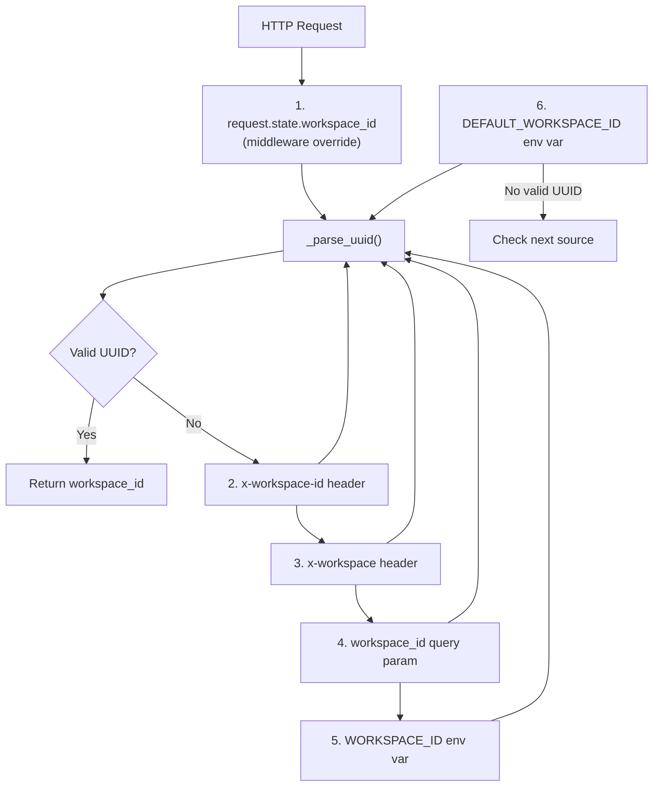
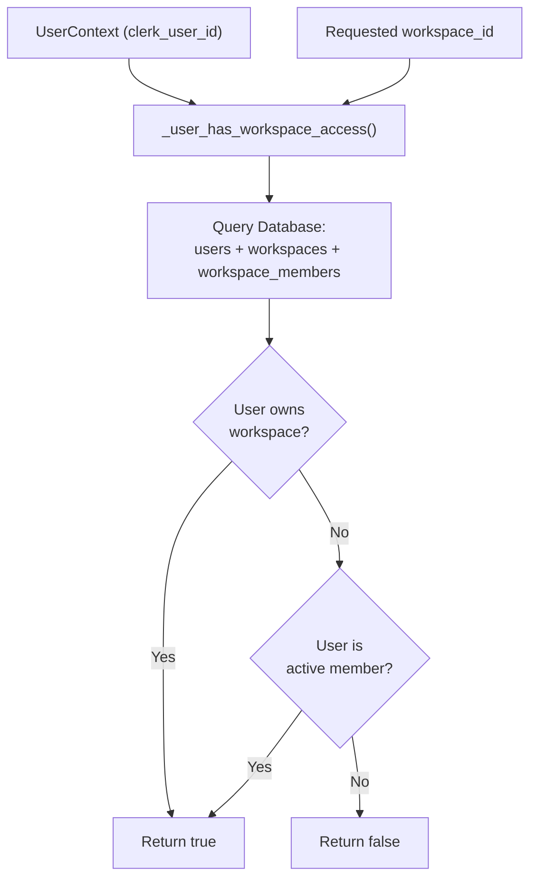
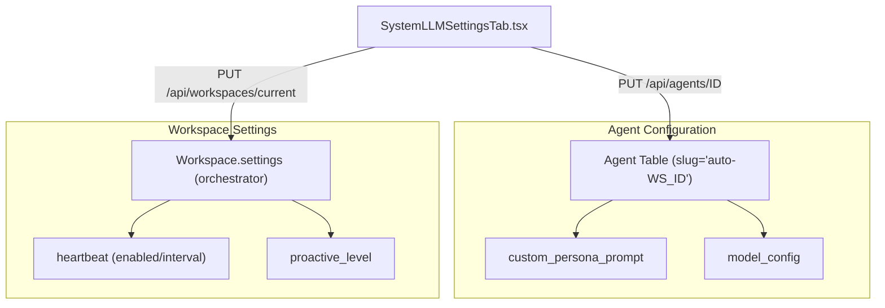

# Workspace Management

Relevant source files

The following files were used as context for generating this wiki page:

- [docs/PRDS/47-SHEPHERD_IMPLEMENTATION_PLAN.md](docs/PRDS/47-SHEPHERD_IMPLEMENTATION_PLAN.md)
- [frontend/app/team/page.tsx](frontend/app/team/page.tsx)
- [frontend/components/onboarding/first-login-guard.tsx](frontend/components/onboarding/first-login-guard.tsx)
- [frontend/components/onboarding/welcome-modal.tsx](frontend/components/onboarding/welcome-modal.tsx)
- [frontend/components/settings/SystemLLMSettingsTab.tsx](frontend/components/settings/SystemLLMSettingsTab.tsx)
- [frontend/components/team/invite-modal.tsx](frontend/components/team/invite-modal.tsx)
- [frontend/components/team/team-management.tsx](frontend/components/team/team-management.tsx)
- [frontend/hooks/use-auto-tour.ts](frontend/hooks/use-auto-tour.ts)
- [frontend/hooks/use-workspace.ts](frontend/hooks/use-workspace.ts)
- [frontend/lib/shepherd/shepherd-theme.ts](frontend/lib/shepherd/shepherd-theme.ts)
- [frontend/lib/shepherd/tour-storage.ts](frontend/lib/shepherd/tour-storage.ts)
- [frontend/styles/shepherd-custom.css](frontend/styles/shepherd-custom.css)
- [orchestrator/alembic/versions/20260127_add_workspace_member_unique_constraint.py](orchestrator/alembic/versions/20260127_add_workspace_member_unique_constraint.py)
- [orchestrator/api/team.py](orchestrator/api/team.py)
- [orchestrator/api/workspaces.py](orchestrator/api/workspaces.py)
- [orchestrator/core/seeds/seed_auto_agent.py](orchestrator/core/seeds/seed_auto_agent.py)
- [orchestrator/core/workspaces/audit.py](orchestrator/core/workspaces/audit.py)
- [orchestrator/core/workspaces/invitations.py](orchestrator/core/workspaces/invitations.py)
- [orchestrator/core/workspaces/models.py](orchestrator/core/workspaces/models.py)
- [orchestrator/core/workspaces/permissions.py](orchestrator/core/workspaces/permissions.py)
- [orchestrator/scripts/fix_alembic_version.py](orchestrator/scripts/fix_alembic_version.py)

## Purpose and Scope

This document describes how workspaces are resolved, provisioned, and accessed in Automatos AI. A workspace is the primary multi-tenancy boundary that isolates agents, workflows, recipes, documents, and memory. Every authenticated request is scoped to a `workspace_id` to ensure strict data isolation [orchestrator/core/auth/hybrid.py:1-15]().

---

## Workspace Resolution

The backend resolves the workspace for each request using a priority waterfall. The `get_request_context_hybrid` dependency utilizes `_get_workspace_id_from_request` to check multiple sources in order, returning the first valid UUID found [orchestrator/core/auth/hybrid.py:29-68]().

### Resolution Priority

Title: Workspace ID Resolution Waterfall

**Sources:** [orchestrator/core/auth/hybrid.py:29-68]()

---

## Access Verification and Permissions

When a client provides a workspace ID, the backend verifies the user has access via `_user_has_workspace_access` [orchestrator/core/auth/hybrid.py:84-107]().

Title: Workspace Access Verification Logic

**Sources:** [orchestrator/core/auth/hybrid.py:84-107]()

### Permission System
Automatos uses a granular permission system defined in `WorkspaceRole`. Roles include `OWNER`, `ADMIN`, `EDITOR`, and `VIEWER` [orchestrator/core/workspaces/permissions.py:5-9](). Permissions are enforced via the `require_permission` decorator, which resolves the role from the `workspace_members` table [orchestrator/core/workspaces/permissions.py:60-135]().

---

## Team Management & Invitations

Workspaces support multi-user collaboration through an invitation system integrated with Clerk [orchestrator/api/team.py:131-190]().

*   **Invitation Flow:** Admins invite users by email. An `Invitation` is created locally, and a corresponding Clerk invitation is sent with a redirect URL containing a unique token [orchestrator/api/team.py:177-182]().
*   **Member Lifecycle:** Users join via `AcceptInvitationRequest`. Upon acceptance, they are added to the `workspace_members` table with the designated role [orchestrator/api/team.py:68-76](), [orchestrator/core/workspaces/models.py:1-20]().
*   **Frontend UI:** The `TeamManagement` component handles member listing, role updates, and invitation revocation [frontend/components/team/team-management.tsx:33-108]().

**Sources:** [orchestrator/api/team.py:22-190](), [frontend/components/team/team-management.tsx:1-125](), [orchestrator/core/workspaces/permissions.py:11-36]()

---

## Auto-Provisioning and Seeding

When a user authenticates for the first time, `_provision_new_user_workspace` creates a personal workspace and seeds it with the "Auto" system agent [orchestrator/core/auth/hybrid.py:110-187]().

### The "Auto" System Agent
Every workspace contains exactly one "Auto" agent (slug `auto-{workspace_id}`). This agent serves as the workspace's central orchestrator [orchestrator/core/seeds/seed_auto_agent.py:1-16]().

*   **System Agent:** Marked with `is_system_agent=True` and hidden from the Roster UI [orchestrator/core/seeds/seed_auto_agent.py:165-172]().
*   **Platform Skills:** Assigned the `platform-management` skill, enabling it to manage workspace resources like agents and workflows [orchestrator/core/seeds/seed_auto_agent.py:81-131]().
*   **Onboarding Trigger:** The `GET /api/workspaces/current` endpoint returns `is_new_workspace: true` if no user-created agents exist, triggering the frontend onboarding flow [orchestrator/api/workspaces.py:52-65]().

**Sources:** [orchestrator/core/seeds/seed_auto_agent.py:1-187](), [orchestrator/api/workspaces.py:41-98]()

---

## Workspace Settings and Integrations

Workspaces manage platform integrations and webhook configurations through the `workspace.settings` JSONB field [orchestrator/api/workspaces.py:141-157]().

### Integration Management
Supported integrations include Telegram and Slack. Sensitive tokens are masked in `GET` responses [orchestrator/api/workspaces.py:30-38](), [orchestrator/api/workspaces.py:76-85]().

| Key | Usage |
|-----|-------|
| `telegram_bot_token` | Auth for Telegram adapter [orchestrator/api/workspaces.py:32]() |
| `slack_bot_token` | Auth for Slack adapter [orchestrator/api/workspaces.py:34]() |
| `byok_overrides` | Workspace-level LLM API key preferences [orchestrator/api/workspaces.py:179]() |

**Sources:** [orchestrator/api/workspaces.py:30-161]()

---

## Orchestrator Soul and Heartbeat

The `SystemLLMSettingsTab` provides the UI for configuring the workspace-wide orchestrator behavior, which is stored in the "Auto" agent's `configuration` field [frontend/components/settings/SystemLLMSettingsTab.tsx:5-11]().

Title: Orchestrator Configuration Mapping

**Sources:** [frontend/components/settings/SystemLLMSettingsTab.tsx:58-80](), [orchestrator/core/seeds/seed_auto_agent.py:177-185]()

---

## Onboarding and Tours

New workspaces are guided by the `FirstLoginGuard` and `WelcomeModal` [frontend/components/onboarding/first-login-guard.tsx:9-28]().

*   **Shepherd Tours:** Automated tours are launched for new workspaces using `useAutoTour` [frontend/hooks/use-auto-tour.ts:20-33]().
*   **State Persistence:** Tour completion is tracked per user in `localStorage` via `tour-storage.ts` [frontend/lib/shepherd/tour-storage.ts:1-10]().
*   **Theming:** A custom "Automatos Glass" theme is applied to Shepherd tooltips [frontend/styles/shepherd-custom.css:4-25]().

**Sources:** [frontend/components/onboarding/welcome-modal.tsx:1-50](), [frontend/hooks/use-auto-tour.ts:1-68](), [frontend/lib/shepherd/shepherd-theme.ts:16-40]()

---

## Summary of Key Entities

| Code Entity | File Path | Role |
|-------------|-----------|------|
| `Workspace` | [orchestrator/core/models/workspaces.py]() | SQLAlchemy model for workspace data |
| `WorkspaceMember` | [orchestrator/core/workspaces/models.py]() | Links users to workspaces with roles |
| `RequestContext` | [orchestrator/core/auth/dependencies.py]() | Dataclass holding resolved `workspace_id` |
| `get_request_context_hybrid` | [orchestrator/core/auth/hybrid.py]() | Dependency for resolving auth + workspace |
| `seed_auto_agent` | [orchestrator/core/seeds/seed_auto_agent.py]() | Provisions the central system agent per workspace |
| `InvitationService` | [orchestrator/core/workspaces/invitations.py]() | Logic for creating and revoking workspace invites |
| `SystemLLMSettingsTab` | [frontend/components/settings/SystemLLMSettingsTab.tsx]() | UI for workspace orchestrator/soul configuration |

**Sources:** [orchestrator/core/auth/hybrid.py](), [orchestrator/api/workspaces.py](), [orchestrator/core/seeds/seed_auto_agent.py](), [orchestrator/core/workspaces/permissions.py]()

---