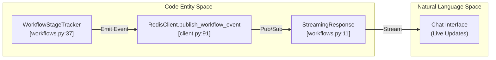

# Backend Architecture

Relevant source files

The following files were used as context for generating this wiki page:

- [README.md](README.md)
- [docker-compose.yml](docker-compose.yml)
- [docs/README.md](docs/README.md)
- [frontend/.dockerignore](frontend/.dockerignore)
- [frontend/Dockerfile](frontend/Dockerfile)
- [frontend/app/chat/page.tsx](frontend/app/chat/page.tsx)
- [frontend/next-env.d.ts](frontend/next-env.d.ts)
- [orchestrator/Dockerfile](orchestrator/Dockerfile)
- [orchestrator/alembic/versions/20260202_add_workspace_id_to_skills_patterns_models.py](orchestrator/alembic/versions/20260202_add_workspace_id_to_skills_patterns_models.py)
- [orchestrator/api/cloud_documents.py](orchestrator/api/cloud_documents.py)
- [orchestrator/api/context.py](orchestrator/api/context.py)
- [orchestrator/api/workflows.py](orchestrator/api/workflows.py)
- [orchestrator/core/llm/clients/openai_embedding.py](orchestrator/core/llm/clients/openai_embedding.py)
- [orchestrator/core/llm/rerank_manager.py](orchestrator/core/llm/rerank_manager.py)
- [orchestrator/core/redis/client.py](orchestrator/core/redis/client.py)
- [orchestrator/core/services/__init__.py](orchestrator/core/services/__init__.py)
- [orchestrator/modules/tools/services/__init__.py](orchestrator/modules/tools/services/__init__.py)
- [orchestrator/requirements.txt](orchestrator/requirements.txt)

This document describes the FastAPI backend architecture of Automatos AI, including application structure, API router organization, execution layer components, database models, and integration patterns. The backend orchestrates multi-agent workflows, manages plugin lifecycles, and provides real-time execution streaming.

For detailed information on specific components, see the following child pages:
- [FastAPI Application](#18.1) — `main.py`, lifespan manager, and middleware stack.
- [API Router Organization](#18.2) — Router modules and route prefixes.
- [Database Models](#18.3) — SQLAlchemy models and workspace isolation.
- [Service Layer Patterns](#18.4) — Singleton services and dependency injection.
- [Background Services](#18.5) — UnifiedScheduler and background task patterns.
- [Real-Time Updates](#18.6) — Redis Pub/Sub and SSE streaming.
- [Testing Infrastructure](#18.7) — Nightly test runner and health regression suite.

---

## FastAPI Application

The backend is a FastAPI application [orchestrator/requirements.txt:2]() that serves as the orchestration layer for the entire platform. The main application is configured in `main.py`, handling high-level orchestration, security middleware, and service initialization.

### Application Initialization

The application uses an async context manager for startup/shutdown (lifespan). It ensures that critical database tables for system prompts and document templates are seeded upon startup.

**Application Lifecycle (Lifespan Events)**

```mermaid
graph TB
    subgraph "Startup Sequence [main.py]"
        Start["lifespan() startup"]
        
        EnsureSysPrompts["PRD-58: Ensure system_prompts tables"]
        SeedPrompts["seed_system_prompts(db)"]
        
        EnsureDocTemplates["PRD-63: Ensure document_templates"]
        SeedTemplates["seed_starter_templates(db, ws_id)"]
        
        EnsureRoutingCols["PRD-64: Add semantic routing columns"]
        
        EmbedAgents["Background: embed_workspace_agents()"]
        
        CheckScheduler{"HEARTBEAT_ENABLED or<br/>RECIPE_SCHEDULER_ENABLED?"}
        AcquireLock["fcntl.flock(LOCK_EX|LOCK_NB)<br/>/tmp/automatos_scheduler.lock"]
        
        StartUnified["get_unified_scheduler().start()"]
        StartHeartbeat["get_heartbeat_service().start()"]
        StartRecipeSched["get_recipe_scheduler().start()"]
        
        Start --> EnsureSysPrompts
        EnsureSysPrompts --> SeedPrompts
        SeedPrompts --> EnsureDocTemplates
        EnsureDocTemplates --> SeedTemplates
        SeedTemplates --> EnsureRoutingCols
        EnsureRoutingCols --> EmbedAgents
        EmbedAgents --> CheckScheduler
        
        CheckScheduler -->|"true"| AcquireLock
        AcquireLock -->|"Lock acquired"| StartUnified
        StartUnified --> StartHeartbeat
        StartHeartbeat --> StartRecipeSched
        
        CheckScheduler -->|"false"| Complete["Startup complete"]
        StartRecipeSched --> Complete
    end
```

**Unified Scheduler with File Lock**
The application uses a single `UnifiedScheduler` to manage background jobs (heartbeat, recipe scheduler, task reconciler, memory jobs). To prevent duplicate executions in multi-worker environments (e.g., 4 workers configured in [orchestrator/Dockerfile:129]()), only one worker acquires an `fcntl` file lock.

**Sources:** [orchestrator/requirements.txt:2](), [orchestrator/Dockerfile:129]()

---

## API Router Organization

The backend is organized into domain-specific routers registered in `main.py`. These routers handle everything from agent management to complex workflow execution.

### Router Categories

| Category | Router Modules | Prefix | Purpose |
| :--- | :--- | :--- | :--- |
| **Workflows** | `workflows.py` | `/api/workflows` | Enhanced workflow management and progress tracking [orchestrator/api/workflows.py:34](). |
| **Context** | `context.py` | `/api/context` | RAG monitoring and context engineering endpoints [orchestrator/api/context.py:53](). |
| **Documents** | `cloud_documents.py` | `/api/cloud-documents` | Integration with S3 and cloud storage providers. |

For details on specific route handlers and prefixes, see [API Router Organization](#18.2).

**Sources:** [orchestrator/api/workflows.py:34](), [orchestrator/api/context.py:53]()

---

## Database Models

The database layer uses SQLAlchemy ORM [orchestrator/requirements.txt:7]() with PostgreSQL and `pgvector` [orchestrator/requirements.txt:11]() for semantic search capabilities.

### Multi-Tenancy and Isolation
The system implements strict workspace isolation. Recent migrations added `workspace_id` to core tables including `skills`, `patterns`, and `llm_models` [orchestrator/alembic/versions/20260202_add_workspace_id_to_skills_patterns_models.py:23-35](). Foreign key constraints ensure that data cannot leak between different workspaces [orchestrator/alembic/versions/20260202_add_workspace_id_to_skills_patterns_models.py:24]().

For the full schema and relationship documentation, see [Database Models](#18.3).

**Sources:** [orchestrator/requirements.txt:7-11](), [orchestrator/alembic/versions/20260202_add_workspace_id_to_skills_patterns_models.py:23-35]()

---

## Service Layer Patterns

The backend logic is encapsulated in a service layer that follows a singleton pattern, typically accessed via `get_instance()` or `get_service()` methods.

### Key Service Categories
- **Monitoring & Audit**: `MonitoringService` and `AuditService` track platform-level events and system health [orchestrator/core/services/__init__.py:8-10]().
- **RAG Service**: `RAGService` manages document retrieval, chunking, and performance tracking [orchestrator/api/context.py:20]().
- **Redis Pub/Sub**: `RedisClient` facilitates real-time communication for workflow updates [orchestrator/core/redis/client.py:14]().

For details on dependency injection and service composition, see [Service Layer Patterns](#18.4).

**Sources:** [orchestrator/core/services/__init__.py:8-10](), [orchestrator/api/context.py:20](), [orchestrator/core/redis/client.py:14]()

---

## Execution & Real-Time Updates

The backend supports sophisticated multi-stage workflow execution with live progress tracking.

### Workflow Stage Tracking
The `WorkflowStageTracker` supports both legacy 9-stage workflows and PRD-59 dynamic phases: `PLAN`, `PREPARE`, `EXECUTE`, `EVALUATE`, and `LEARN` [orchestrator/api/workflows.py:37-68]().

### Real-Time Pipeline
Events are emitted during execution to both the `stream_manager` and Redis [orchestrator/api/workflows.py:161-174](). This allows the frontend to provide live feedback through the `Chat` and `Workflow` interfaces.

**Sources:** [orchestrator/api/workflows.py:11-68](), [orchestrator/core/redis/client.py:91]()

---