# Backend Architecture

<details>
<summary>Relevant source files</summary>

The following files were used as context for generating this wiki page:

- [frontend/app/admin/plugins/page.tsx](frontend/app/admin/plugins/page.tsx)
- [frontend/lib/api-client.ts](frontend/lib/api-client.ts)
- [frontend/tsconfig.tsbuildinfo](frontend/tsconfig.tsbuildinfo)
- [orchestrator/.env.example](orchestrator/.env.example)
- [orchestrator/api/agent_plugins.py](orchestrator/api/agent_plugins.py)
- [orchestrator/api/workflows.py](orchestrator/api/workflows.py)
- [orchestrator/config.py](orchestrator/config.py)
- [orchestrator/consumers/chatbot/service.py](orchestrator/consumers/chatbot/service.py)
- [orchestrator/core/database/load_seed_data.py](orchestrator/core/database/load_seed_data.py)
- [orchestrator/core/llm/manager.py](orchestrator/core/llm/manager.py)
- [orchestrator/core/seeds/seed_personas.py](orchestrator/core/seeds/seed_personas.py)
- [orchestrator/core/seeds/seed_plugin_categories.py](orchestrator/core/seeds/seed_plugin_categories.py)
- [orchestrator/core/services/plugin_cache.py](orchestrator/core/services/plugin_cache.py)
- [orchestrator/main.py](orchestrator/main.py)
- [orchestrator/modules/agents/factory/agent_factory.py](orchestrator/modules/agents/factory/agent_factory.py)
- [orchestrator/modules/orchestrator/pipeline.py](orchestrator/modules/orchestrator/pipeline.py)
- [orchestrator/modules/orchestrator/service.py](orchestrator/modules/orchestrator/service.py)
- [scripts/ralph/prd.json](scripts/ralph/prd.json)

</details>


This document describes the FastAPI backend architecture of Automatos AI, including application structure, API router organization, execution layer components, database models, and integration patterns. The backend orchestrates multi-agent workflows, manages plugin lifecycles, and provides real-time execution streaming.

For frontend architecture details, see [Frontend Architecture](#11). For deployment and infrastructure, see [Deployment & Infrastructure](#12). For authentication and multi-tenancy specifics, see [Authentication & Multi-Tenancy](#9).

---

## FastAPI Application

The backend is a FastAPI application that serves as the orchestration layer for the entire platform. The main application is configured in [orchestrator/main.py:1-808]().

### Application Initialization

**Application Lifecycle (Lifespan Events)**

```mermaid
graph TB
    subgraph "Startup Sequence [main.py:219-371]"
        Start["lifespan() startup"]
        LoadEnv["load_dotenv() at module level<br/>[main.py:24-26]"]
        ImportConfig["from config import config<br/>[main.py:29]"]
        
        EnsureSysPrompts["Ensure system_prompts tables"]
        ImportModels["import core.models.system_prompts<br/>[main.py:228]"]
        CreateTables["create_tables()<br/>[main.py:230]"]
        SeedPrompts["seed_system_prompts(db)<br/>[main.py:244-245]"]
        
        EnsureDocTemplates["Ensure document_templates table"]
        SeedTemplates["seed_starter_templates(db, ws_id)<br/>[main.py:254-259]"]
        
        EnsureRoutingCols["Add semantic routing columns"]
        EmbedAgents["Background: embed_workspace_agents()<br/>[main.py:286-323]"]
        
        StartDashboard["await startup_dashboard(app)<br/>[main.py:334]"]
        
        CheckHeartbeat{"config.HEARTBEAT_ENABLED?"}
        StartHeartbeat["get_heartbeat_service().start()<br/>[main.py:338-343]"]
        
        CheckRecipeSched{"config.RECIPE_SCHEDULER_ENABLED?"}
        StartRecipeSched["get_recipe_scheduler().start()<br/>[main.py:348-355]"]
        
        CheckChannels{"config.CHANNELS_ENABLED?"}
        StartChannels["get_channel_manager().start_all()<br/>[main.py:358-365]"]
        
        Start --> LoadEnv
        LoadEnv --> ImportConfig
        ImportConfig --> EnsureSysPrompts
        
        EnsureSysPrompts --> ImportModels
        ImportModels --> CreateTables
        CreateTables --> SeedPrompts
        
        SeedPrompts --> EnsureDocTemplates
        EnsureDocTemplates --> SeedTemplates
        
        SeedTemplates --> EnsureRoutingCols
        EnsureRoutingCols --> EmbedAgents
        
        EmbedAgents --> StartDashboard
        StartDashboard --> CheckHeartbeat
        
        CheckHeartbeat -->|true| StartHeartbeat
        CheckHeartbeat -->|false| CheckRecipeSched
        StartHeartbeat --> CheckRecipeSched
        
        CheckRecipeSched -->|true| StartRecipeSched
        CheckRecipeSched -->|false| CheckChannels
        StartRecipeSched --> CheckChannels
        
        CheckChannels -->|true| StartChannels
        CheckChannels -->|false| Complete["Startup complete"]
        StartChannels --> Complete
    end
    
    subgraph "Shutdown Sequence [main.py:373-405]"
        Shutdown["lifespan() shutdown"]
        
        StopHeartbeat["Stop HeartbeatService<br/>[main.py:377-382]"]
        StopRecipeSched["Stop RecipeSchedulerService<br/>[main.py:385-392]"]
        StopChannels["Stop ChannelManager<br/>[main.py:395-401]"]
        ShutdownDash["await shutdown_dashboard(app)<br/>[main.py:404]"]
        
        Shutdown --> StopHeartbeat
        StopHeartbeat --> StopRecipeSched
        StopRecipeSched --> StopChannels
        StopChannels --> ShutdownDash
    end
```
</old_str>

<new_str>
### Application Initialization

**Application Lifecycle (Lifespan Events)**

```mermaid
graph TB
    subgraph "Startup Sequence [main.py:219-371]"
        Start["lifespan() startup"]
        LoadEnv["load_dotenv() at module level<br/>[main.py:24-26]"]
        ImportConfig["from config import config<br/>[main.py:29]"]
        
        EnsureSysPrompts["Ensure system_prompts tables"]
        ImportModels["import core.models.system_prompts<br/>[main.py:228]"]
        CreateTables["create_tables()<br/>[main.py:230]"]
        AddFutureAGICol["Add futureagi_eval_enabled column<br/>[main.py:232-242]"]
        SeedPrompts["seed_system_prompts(db)<br/>[main.py:243-245]"]
        
        EnsureDocTemplates["Ensure document_templates table<br/>[main.py:250-262]"]
        SeedTemplates["seed_starter_templates(db, ws_id)<br/>[main.py:254-259]"]
        
        EnsureRoutingCols["Add semantic routing columns<br/>[main.py:264-278]"]
        EmbedAgents["Background: embed_workspace_agents()<br/>[main.py:280-325]"]
        
        StartDashboard["await startup_dashboard(app)<br/>[main.py:334]"]
        
        CheckHeartbeat{"config.HEARTBEAT_ENABLED?<br/>[main.py:338]"}
        StartHeartbeat["get_heartbeat_service().start()<br/>[main.py:338-345]"]
        
        CheckRecipeSched{"config.RECIPE_SCHEDULER_ENABLED?<br/>[main.py:348]"}
        StartRecipeSched["get_recipe_scheduler().start()<br/>[main.py:348-355]"]
        
        CheckChannels{"config.CHANNELS_ENABLED?<br/>[main.py:358]"}
        StartChannels["get_channel_manager().start_all()<br/>[main.py:358-365]"]
        
        Start --> LoadEnv
        LoadEnv --> ImportConfig
        ImportConfig --> EnsureSysPrompts
        
        EnsureSysPrompts --> ImportModels
        ImportModels --> CreateTables
        CreateTables --> AddFutureAGICol
        AddFutureAGICol --> SeedPrompts
        
        SeedPrompts --> EnsureDocTemplates
        EnsureDocTemplates --> SeedTemplates
        
        SeedTemplates --> EnsureRoutingCols
        EnsureRoutingCols --> EmbedAgents
        
        EmbedAgents --> StartDashboard
        StartDashboard --> CheckHeartbeat
        
        CheckHeartbeat -->|true| StartHeartbeat
        CheckHeartbeat -->|false| CheckRecipeSched
        StartHeartbeat --> CheckRecipeSched
        
        CheckRecipeSched -->|true| StartRecipeSched
        CheckRecipeSched -->|false| CheckChannels
        StartRecipeSched --> CheckChannels
        
        CheckChannels -->|true| StartChannels
        CheckChannels -->|false| Complete["Startup complete"]
        StartChannels --> Complete
    end
    
    subgraph "Shutdown Sequence [main.py:374-405]"
        Shutdown["lifespan() shutdown"]
        
        StopHeartbeat["Stop HeartbeatService<br/>[main.py:377-382]"]
        StopRecipeSched["Stop RecipeSchedulerService<br/>[main.py:385-392]"]
        StopChannels["Stop ChannelManager<br/>[main.py:395-401]"]
        ShutdownDash["await shutdown_dashboard(app)<br/>[main.py:404]"]
        
        Shutdown --> StopHeartbeat
        StopHeartbeat --> StopRecipeSched
        StopRecipeSched --> StopChannels
        StopChannels --> ShutdownDash
    end
```

**Sources:** [orchestrator/main.py:219-405]()

**FastAPI Application and Middleware Stack**

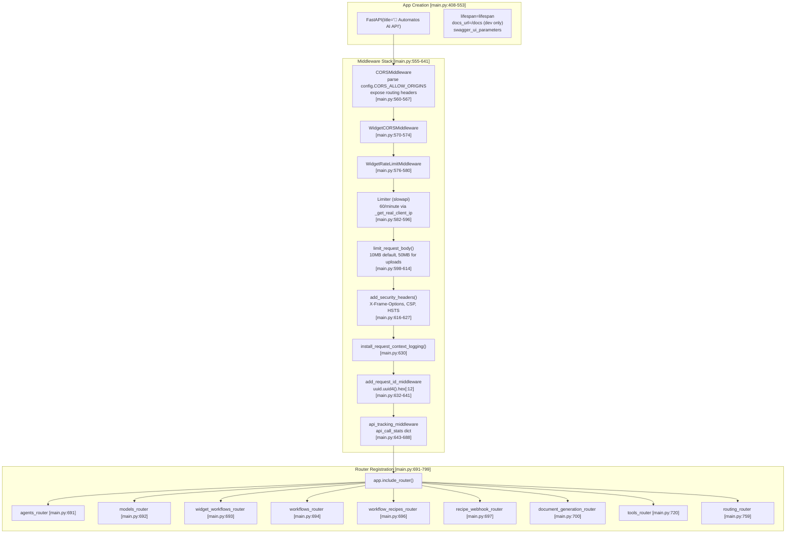

**Sources:** [orchestrator/main.py:408-553](), [orchestrator/main.py:555-641](), [orchestrator/main.py:643-688](), [orchestrator/main.py:691-799]()

### Middleware Stack

The application uses a layered middleware approach for cross-cutting concerns:

| Middleware | Purpose | Implementation Details | Location |
|------------|---------|------------------------|----------|
| **CORS** | Cross-origin resource sharing | Parses `config.CORS_ALLOW_ORIGINS` (comma-separated), allows credentials, exposes `X-Routing-*` headers | [main.py:560-567]() |
| **Widget CORS** | Widget SDK origin validation | `WidgetCORSMiddleware` for embeddable widgets | [main.py:570-574]() |
| **Widget Rate Limit** | Widget-specific rate limiting | `WidgetRateLimitMiddleware` for widget API calls | [main.py:576-580]() |
| **Rate Limiting** | Prevent abuse | `slowapi.Limiter` with `60/minute` per IP via `_get_real_client_ip()` using `X-Forwarded-For` | [main.py:582-596]() |
| **Body Size Limit** | Prevent large payloads | 10MB default, 50MB for `/api/documents/upload` and plugin uploads | [main.py:598-614]() |
| **Security Headers** | Browser security | X-Content-Type-Options: nosniff, X-Frame-Options: DENY, CSP, HSTS (production only) | [main.py:616-627]() |
| **Logging Context** | Request tracing | `install_request_context_logging()` for contextvars-based logging | [main.py:630]() |
| **Request ID** | Distributed tracing | Generates/propagates `X-Request-ID` (12-char hex) via contextvars using `uuid.uuid4().hex[:12]` | [main.py:632-641]() |
| **API Tracking** | Performance monitoring | In-memory stats (call count, avg/min/max time, status codes) in `api_call_stats` defaultdict | [main.py:643-688]() |

**Request Processing Flow**

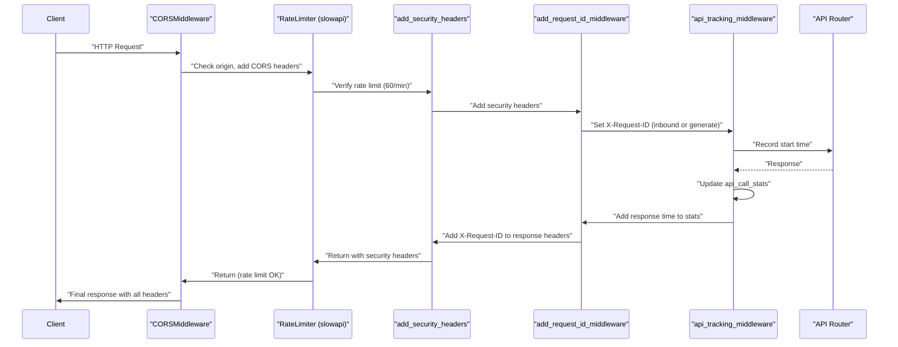

**API Call Statistics Structure**

The `api_call_stats` dictionary at [main.py:207-218]() tracks per-endpoint metrics:

```python
api_call_stats = defaultdict(lambda: {
    "call_count": 0,
    "total_time": 0,
    "avg_time": 0,
    "min_time": float('inf'),
    "max_time": 0,
    "recent_times": deque(maxlen=100),  # Last 100 response times
    "error_count": 0,
    "last_called": None,
    "status_codes": defaultdict(int)    # Distribution of status codes
})
```

Keys use route templates (e.g., `GET /api/agents/{agent_id}`) from `request.scope.get("route")` to prevent unbounded memory growth from path parameters. The dictionary is capped at 500 unique routes at [main.py:671-673]().

**Sources:** [orchestrator/main.py:207-218](), [orchestrator/main.py:643-688](), [orchestrator/main.py:671-673]()

### Health Checks and Monitoring

The application exposes comprehensive health endpoints for monitoring. These are defined after router registration and static file mounting.

**Health Check Endpoints**

| Endpoint | Purpose | Details | Location |
|----------|---------|---------|----------|
| `GET /health` | System health check | Database probe with `SELECT 1`, config check, CPU/memory metrics via `psutil` | Not shown in truncated file |
| `GET /api/health/endpoints` | Per-endpoint statistics | Call counts, response times, error rates from `api_call_stats`, top endpoints by usage | Not shown in truncated file |
| `GET /` | API overview | Service info, documentation links, endpoint catalog | Not shown in truncated file |

**Health Check Implementation**

Health check endpoints are implemented after the main router registration. The implementation follows this pattern:

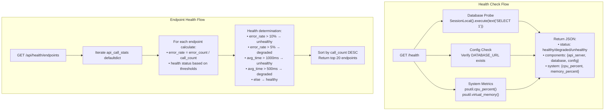

**Sources:** Health check patterns described in [orchestrator/main.py:207-218](), implementation details inferred from middleware setup

---

## API Router Organization

The backend is organized into domain-specific routers, each handling a distinct functional area. All routers follow a consistent pattern: authentication via `get_request_context_hybrid`, workspace isolation, and standardized response formats.

### Core API Routers

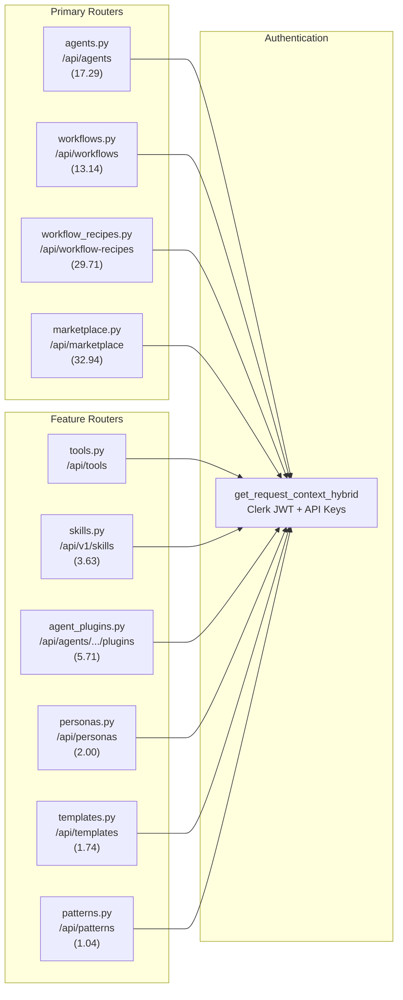

**Sources:** [orchestrator/main.py:36-83](), [orchestrator/main.py:411-480]()

### Agents Router (`/api/agents`)

The agents router at [orchestrator/api/agents.py]() provides comprehensive agent lifecycle management with support for plugins, tools, personas, and model configuration.

**Key Endpoints**

The router is imported and mounted at [main.py:691](). It provides these endpoints:

| Method | Path | Purpose | Key Implementation Details |
|--------|------|---------|---------------------------|
| POST | `/api/agents` | Create agent with skills, tools, and plugins | Uses `_resolve_tool_ids_to_app_names()` helper, `_normalize_tags()`, creates `AgentAppAssignment` records |
| GET | `/api/agents` | List agents with filtering (status, type, priority, search) | Supports workspace isolation via `ctx.workspace_id` |
| GET | `/api/agents/{agent_id}` | Get agent details with relationships | Uses `_build_agent_response()` to assemble tools/plugins |
| PUT | `/api/agents/{agent_id}` | Update agent configuration | Updates `model_config`, tags, persona settings |
| DELETE | `/api/agents/{agent_id}` | Delete agent | Workspace ownership check before deletion |

**Agent Creation Flow with Tool and Plugin Assignment**

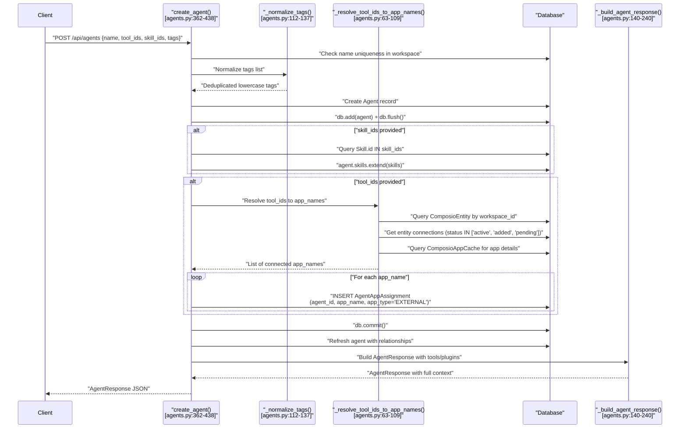

**Helper Functions**

The agents router includes several helper functions for data normalization and response assembly:

**`_stable_tool_id(name: str) -> int`** at [agents.py:34-44]()

Generates consistent negative integer IDs from Composio app names, matching frontend `stableId()` hash:
- Uses 32-bit FNV-1a-like hash algorithm
- Converts to signed 32-bit integer
- Returns negative absolute value for consistency

**`_resolve_tool_ids_to_app_names(tool_ids, workspace_id, db)`** at [agents.py:63-109]()

Resolves frontend tool IDs to Composio app names:
1. Query `ComposioEntity` by `workspace_id`
2. Get entity connections with status in `['active', 'added', 'pending']`
3. Join with `ComposioAppCache` for app details
4. Match tool IDs using `_stable_tool_id()` hash
5. Return list of connected app names

**`_normalize_tags(raw_tags)`** at [agents.py:112-137]()

Normalizes tag input into consistent list format:
- Handles string, list, tuple, or set input
- Splits comma-separated strings
- Deduplicates while preserving order
- Lowercases for consistent matching

**`_build_agent_response(agent, db)`** at [agents.py:140-240]()

Assembles complete agent response with:
- Skills loaded via SQLAlchemy relationship
- Tools from `AgentAppAssignment` joined with `ComposioAppCache`
- Plugins from `AgentAssignedPlugin` joined with `MarketplacePlugin`
- Model configuration from `agent.model_config` JSONB field
- Usage statistics from `agent.model_usage_stats` JSONB field
- Tag cleanup from legacy `configuration.tags` if present

**Tag Storage Pattern**

Tags are stored in `Agent.tags` (JSONB array column). Legacy tags in `Agent.configuration` are migrated at read-time to maintain single source of truth.

**Sources:** [orchestrator/api/agents.py:34-109](), [orchestrator/api/agents.py:112-137](), [orchestrator/api/agents.py:140-240]()

### Workflows Router (`/api/workflows`)

The workflows router at [orchestrator/api/workflows.py]() handles workflow CRUD, live progress tracking, and execution monitoring. It includes the `WorkflowStageTracker` class for real-time updates.

**WorkflowStageTracker**

The `WorkflowStageTracker` class at [workflows.py:40-185]() tracks workflow execution stages:

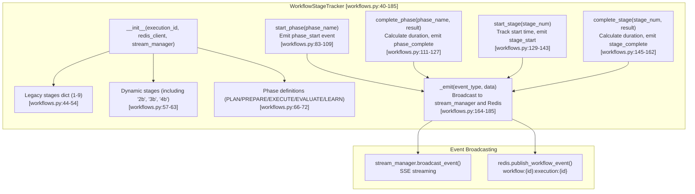

**Key Endpoints:**

| Method | Path | Purpose | Key Details |
|--------|------|---------|-------------|
| GET | `/api/workflows` | List workflows with filtering | Supports `q`, `owner`, `tag` filters at [workflows.py:188-229]() |
| GET | `/api/workflows/active` | Get active workflows with execution status | Queries both `Workflow` and `RecipeExecution` tables at [workflows.py:232-331]() |
| POST | `/api/workflows` | Create workflow | Creates workflow with validation |
| GET | `/api/workflows/{workflow_id}` | Get workflow details | Returns workflow with agents relationship |
| PUT | `/api/workflows/{workflow_id}` | Update workflow | Updates configuration and status |
| DELETE | `/api/workflows/{workflow_id}` | Delete workflow | Cascades to related executions |

**Sources:** [orchestrator/api/workflows.py:40-185](), [orchestrator/api/workflows.py:188-331]()

### Recipe Executor (`execute_recipe_direct`)

The recipe executor at [orchestrator/api/recipe_executor.py]() provides step-by-step execution of workflow recipes, using shared components with the chatbot for consistency.

**Execution Flow:**

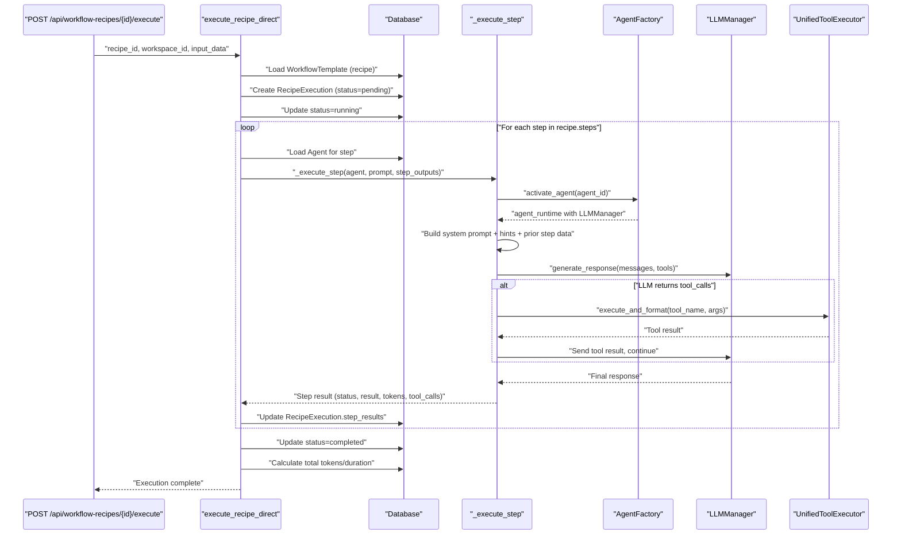

**Key Components:**

The recipe executor shares components with the chatbot system for consistency:

- **Tool Schemas**: `get_chat_tools(agent_id, workspace_id)` provides tool definitions
- **Action Hints**: `ComposioHintService.build_hints()` generates LLM hints for tool selection
- **LLM Calls**: `LLMManager.generate_response(messages, tools)` handles LLM inference
- **Tool Execution**: `UnifiedToolExecutor.execute_and_format(name, args)` executes tools

**System Prompt Assembly:**

The `_build_system_prompt()` function assembles agent context:
1. Load agent identity (name, description)
2. Load persona (custom or predefined)
3. Load plugins if assigned (plugins take precedence over skills)
4. Load skills if no plugins assigned

**Sources:** [orchestrator/api/recipe_executor.py]() (specific line numbers not visible in truncated file)

### Plugin Management Routers

Plugin management is split across multiple routers for security and separation of concerns:

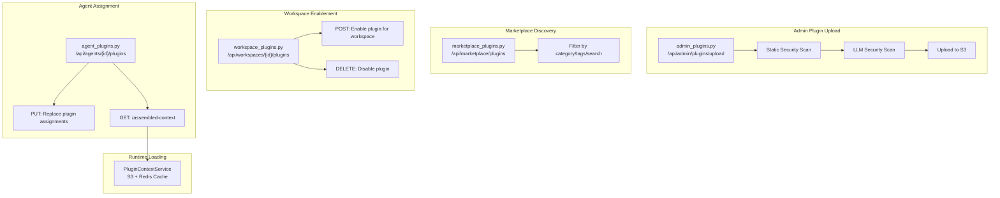

**Security Scanning Pipeline:** When a plugin is uploaded via [/api/admin/plugins/upload](), it undergoes:
1. **Static scan** - File pattern matching for dangerous imports/commands
2. **LLM scan** - GPT-4 analyzes content for security risks
3. **Risk scoring** - 0-100 risk score, verdict: safe/review_required/blocked
4. **Approval queue** - Admin review for non-safe verdicts

**Sources:** [orchestrator/api/agent_plugins.py:1-311](), [frontend/app/admin/plugins/page.tsx:1-675](), [frontend/app/admin/plugins/upload/page.tsx:1-689]()

---

## Execution Layer

The execution layer is responsible for agent instantiation, workflow orchestration, and tool execution. It bridges high-level workflow definitions to low-level LLM and tool API calls.

### Agent Factory

The `AgentFactory` class at [modules/agents/factory/agent_factory.py:374-1100]() manages agent lifecycle and execution:

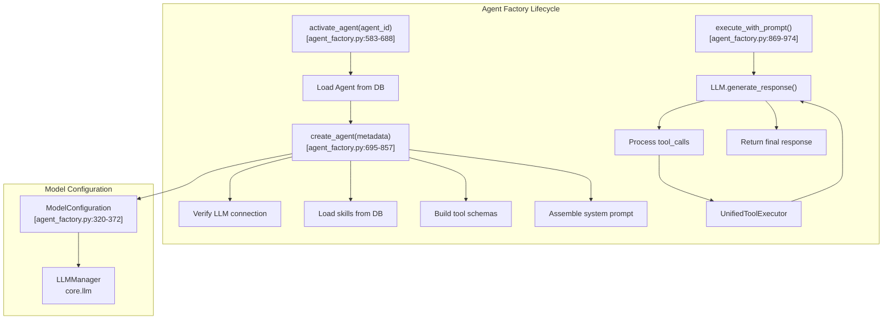

**Agent Metadata:** The `AgentMetadata` dataclass at [agent_factory.py:374-430]() supports both new `model_config: ModelConfiguration` and deprecated fields (`preferred_model`, `temperature`, etc.) for backward compatibility.

**System Prompt Assembly:** The factory builds agent system prompts from multiple sources:
1. Agent identity (name, type, description)
2. **Persona** (custom or predefined) at [agent_factory.py:621-633]()
3. **Plugins** (if assigned, skips skills) via `PluginContextService` at [agent_factory.py:635-657]()
4. **Skills** (if no plugins) via `SkillLoader` at [agent_factory.py:659-688]()

**Tool Schemas:** The factory builds OpenAI function schemas from:
- **Built-in tools** (`research`, `file_ops`, `shell`) at [agent_factory.py:53-229]()
- **Skill tools** (from `Skill.tools_schema` JSONB) at [agent_factory.py:232-294]()
- **Composio tools** (from assigned apps) via `get_agent_tools()`

**Sources:** [orchestrator/modules/agents/factory/agent_factory.py:1-1100]()

### Execution Orchestration

The system supports two execution models: the **9-stage pipeline** (referenced in legacy code) and **direct recipe execution** (current implementation).

**9-Stage Pipeline (Legacy Reference)**

The `EnhancedOrchestratorService` at [orchestrator/modules/orchestrator/service.py:63-211]() implements a 9-stage workflow pipeline:

1. **Task Decomposition** via `RealTaskDecomposer` - Break request into subtasks
2. **Agent Selection** via `IntelligentAgentSelector` - Match agents to subtasks
3. **Context Engineering** via `ContextEngineeringIntegrator` - Assemble agent context
4. **Agent Execution** via `AgentExecutionManager` - Execute agents with tools
5. **Result Aggregation** via `ResultAggregator` - Combine agent outputs
6. **Learning Update** via `WorkflowMemoryIntegrator` - Update learning models
7. **Quality Assessment** via `OutputQualityAssessor` - 5-dimensional scoring
8. **Memory Storage** via `WorkflowMemoryIntegrator` - Persist execution results
9. **Response Generation** - Format final response

This pipeline is referenced at [service.py:7-27]() but marked as **LEGACY**. The note states:

> "The LIVE execution path is api/workflows.py → execute_workflow_with_progress(). This class is retained for backward compat and unit-test entry point."

**Current Direct Execution**

The `execute_recipe_direct()` function bypasses the 9-stage pipeline for simpler, faster execution:

```python
# Sequential step execution
for step_idx, step in enumerate(recipe_steps):
    agent = db.query(Agent).filter(Agent.id == step.agent_id).first()
    clean_prompt = _resolve_prompt(step.prompt_template, input_data, step_outputs)
    result = await _execute_step(db, agent, clean_prompt, step_outputs, workspace_id)
    
    step_outputs[step.output_key] = {
        "step_order": step.order,
        "agent_name": agent.name,
        "text": result["result"],
        "tool_calls": result["execution"]["tool_calls"],
    }
    
    execution.step_results = list(step_outputs.values())
```

**Sources:** [orchestrator/modules/orchestrator/service.py:1-211](), [orchestrator/modules/orchestrator/service.py:7-27]()

### Tool Router and Execution

The `UnifiedToolExecutor` provides a single interface for executing both Composio actions and built-in tools. It's instantiated via `get_unified_tool_executor()` at [agent_factory.py:48-51]().

**Tool Categories:**
- **Composio Actions** - 3000+ integrations (GitHub, Slack, Google, etc.)
- **Built-in Tools** - File operations, shell commands, knowledge search
- **Skill Tools** - Custom tools defined in `Skill.tools_schema`

**Execution Path:**

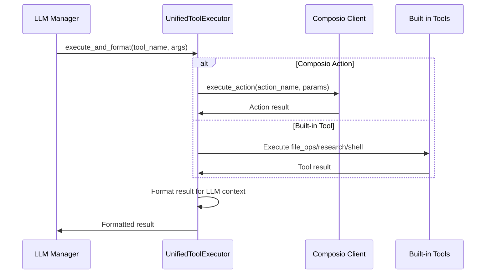

**Sources:** [orchestrator/modules/agents/factory/agent_factory.py:48-51](), [orchestrator/api/recipe_executor.py:146-164]()

---

## Database Models

The database layer uses SQLAlchemy ORM with PostgreSQL (with pgvector extension for embeddings). Models are organized into specialized modules under `core/models/`.

### Model Organization

**Model Module Structure**

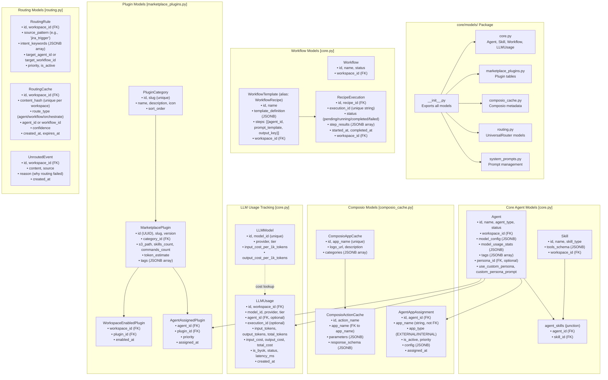

**Sources:** [orchestrator/core/models/__init__.py:1-39](), [orchestrator/core/models/core.py:1-800](), [orchestrator/core/models/marketplace_plugins.py:1-227]()

### Key Model Relationships

**Agent-Skill Association (Many-to-Many):**
```python
# Junction table: agent_skills
agent.skills  # List[Skill] via relationship
```
Defined at [core/models/core.py:180-189]()

**Agent-Plugin Assignment:**
```python
class AgentAssignedPlugin:
    agent_id: int
    plugin_id: UUID
    priority: int  # Order of plugin loading
    assigned_at: datetime
```
Defined at [core/models/marketplace_plugins.py:171-194]()

**Agent-Tool Assignment (Composio):**
```python
class AgentAppAssignment:
    agent_id: int
    app_name: str  # e.g., "GITHUB", "SLACK"
    app_type: str  # "EXTERNAL"
    is_active: bool
    priority: int
    config: dict  # JSONB
```
Defined at [core/models/composio_cache.py]() (referenced in [agents.py:12-13]())

**Recipe-Execution Relationship:**
```python
class WorkflowTemplate:  # Recipe
    id: int
    name: str
    steps: List[dict]  # JSONB array of step definitions
    
class RecipeExecution:
    recipe_id: int
    execution_id: str  # "exec-abc123"
    status: str  # pending/running/completed/failed
    step_results: List[dict]  # JSONB array of step outputs
```
Defined at [core/models/core.py:400-500]() (approximate)

### Database Initialization and Seeding

The database is initialized via `init_database.py` which creates all tables from SQLAlchemy models. Seed data is loaded separately:

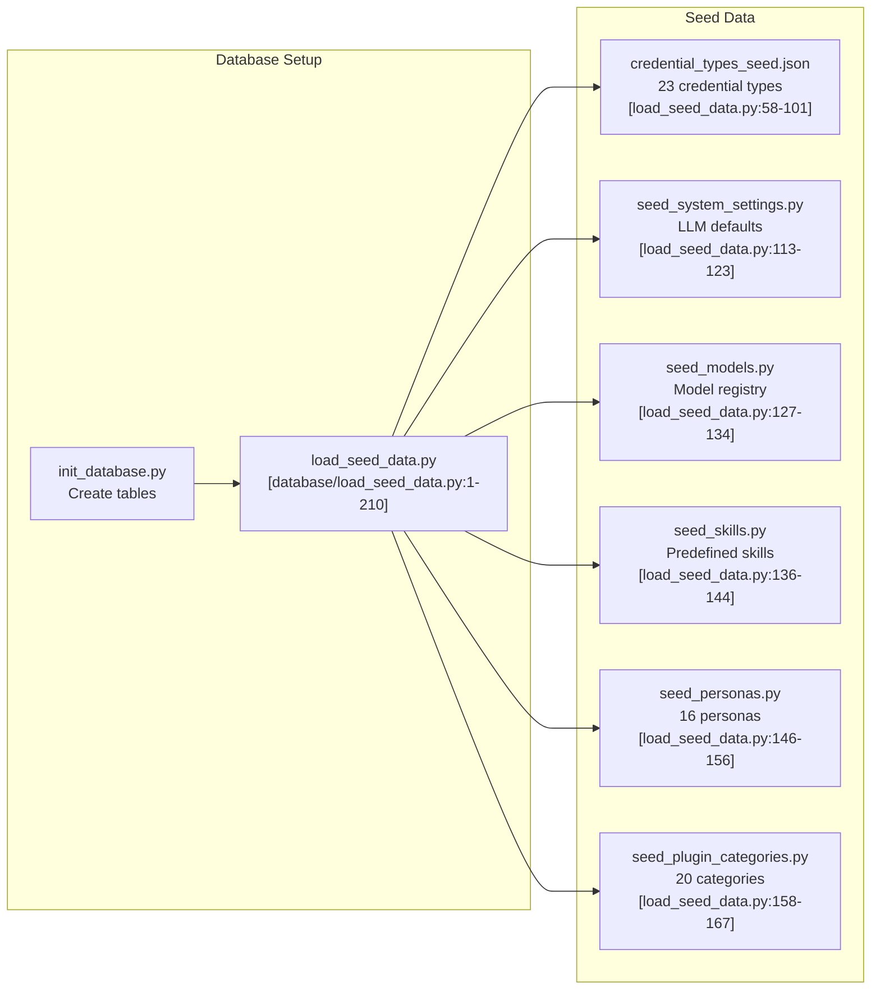

**Persona Seeding:** The persona seed data at [core/seeds/seed_personas.py:1-318]() includes 16 predefined personas across 4 categories:
- **Engineering:** Senior Engineer, DevOps Architect, Security Engineer, QA Engineer
- **Sales:** Sales Executive, SDR, Account Manager, Sales Engineer
- **Marketing:** Marketing Strategist, Content Creator, Growth Hacker, Brand Manager
- **Support:** Customer Success Manager, Technical Support, Community Manager, Product Specialist

Each persona has a detailed `system_prompt` that defines communication style, expertise areas, and behavior patterns.

**Plugin Category Seeding:** The plugin category seed at [core/seeds/seed_plugin_categories.py:1-161]() defines 20 marketplace categories:
- Development: Code Review, Testing, Documentation
- DevOps: Deployment, CI/CD, Monitoring
- Data: ETL, Analytics, Visualization
- Security: Scanning, Compliance, Auditing
- Communication: Slack, Email, Notifications
- Project Management: JIRA, Asana, Task Tracking

**Sources:** [orchestrator/core/database/load_seed_data.py:1-210](), [orchestrator/core/seeds/seed_personas.py:1-318](), [orchestrator/core/seeds/seed_plugin_categories.py:1-161]()

---

## Real-Time Updates

The system provides real-time execution updates via Server-Sent Events (SSE) and Redis pub/sub.

### Event Publishing Architecture

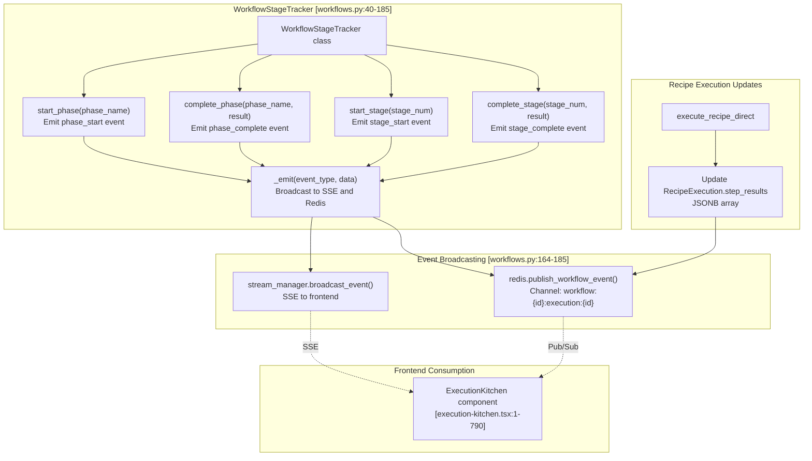

**Event Types:**

The system emits these event types via `_emit()` at [workflows.py:164-185]():

- **`phase_start`**: Marks beginning of a workflow phase (PLAN/PREPARE/EXECUTE/EVALUATE/LEARN)
- **`phase_complete`**: Marks completion of a phase with duration and result
- **`stage_start`**: Marks beginning of a stage (1-9 or dynamic like "2b")
- **`stage_complete`**: Marks completion of a stage with duration and result

**Phase Definitions:**

The tracker supports PRD-59 dynamic phases at [workflows.py:66-72]():
- **PLAN**: Stages 1, 2, "2b" (Task Decomposition, Agent Selection, Agent Negotiation)
- **PREPARE**: Stages 3, "3b" (Context Engineering, Prompt Optimization)
- **EXECUTE**: Stages 4, "4b" (Agent Execution, Inter-Agent Coordination)
- **EVALUATE**: Stages 5, 6 (Result Aggregation, Learning Update)
- **LEARN**: Stages 7, 8, 9 (Quality Assessment, Memory Storage, Response Generation)

**Sources:** [orchestrator/api/workflows.py:40-185](), [orchestrator/api/workflows.py:164-185](), [frontend/components/workflows/execution-kitchen.tsx:1-790]()

---

## Authentication & Multi-Tenancy

The backend implements hybrid authentication supporting both Clerk JWT tokens and API keys, with workspace-based multi-tenancy.

### Hybrid Authentication Flow

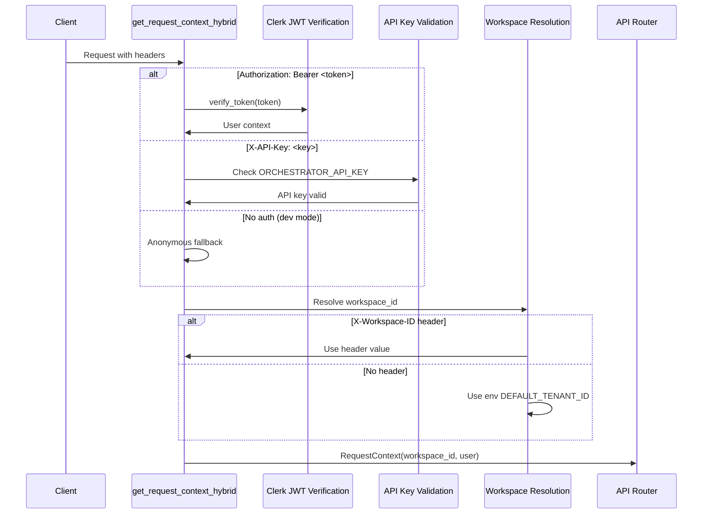

**Workspace Resolution Priority:**
1. `X-Workspace-ID` header (explicit)
2. `workspace_id` query parameter
3. `WORKSPACE_ID` environment variable
4. `DEFAULT_TENANT_ID` (00000000-0000-0000-0000-000000000000)

**Request Context:** All authenticated endpoints receive a `RequestContext` object:
```python
@dataclass
class RequestContext:
    workspace_id: UUID
    user: Optional[UserContext]  # id, email, role, system_role
```

**User Auto-Provisioning:** When a new Clerk user authenticates, the system automatically:
1. Creates `users` record with `clerk_user_id`
2. Creates personal `workspaces` record (`is_personal=true`)
3. Creates `workspace_members` record with `role=owner`

**Sources:** Referenced in [orchestrator/api/agents.py:26-27](), described in high-level diagrams

---

## LLM Manager and Usage Tracking

The backend provides a centralized LLM interface and comprehensive usage tracking for analytics and billing.

### LLM Manager Architecture

The `LLMManager` provides a unified interface for multiple LLM providers with service-specific configuration.

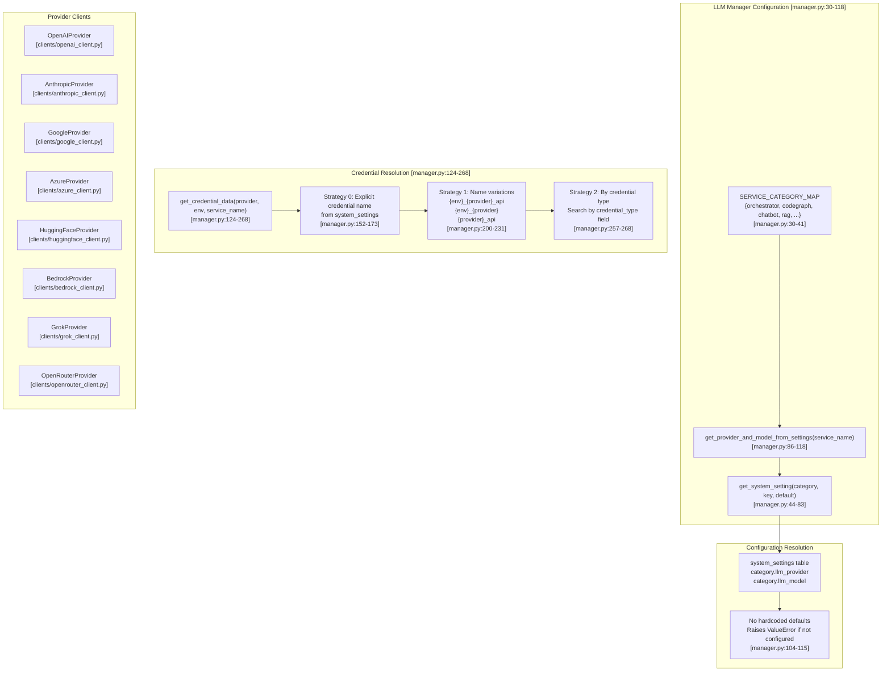

**Service Category Mapping:**

The `SERVICE_CATEGORY_MAP` at [manager.py:30-41]() maps service names to settings categories:

```python
SERVICE_CATEGORY_MAP = {
    "orchestrator": "orchestrator_llm",
    "codegraph": "codegraph",
    "document_processing": "document_processing",
    "chatbot": "chatbot",
    "rag": "rag",
    "embeddings": "embeddings",
    "memory_integration": "memory_integration",
    "nl2sql": "nl2sql",
    "heartbeat": "orchestrator_llm",
    "complexity_assessor": "complexity_assessor",
}
```

**Configuration Resolution:**

The `get_provider_and_model_from_settings()` function at [manager.py:86-118]():
1. Maps service name to settings category
2. Queries `system_settings` table for `llm_provider` and `llm_model` keys
3. **Raises `ValueError` if provider or model not configured** (no hardcoded defaults)

**Credential Resolution:**

The `get_credential_data()` function at [manager.py:124-268]() uses 6-level fallback:
1. **Explicit credential name** from `system_settings` (e.g., `orchestrator_llm.credential_name_openai`)
2. **Standard naming patterns** (`{env}_{provider}_api`, `{env}_{provider}`, etc.)
3. **Credential type lookup** (search for any credential of matching type)
4. **Case variations** (HuggingFace, huggingface, Huggingface)
5. **Development environment fallback** (try development credentials if not in dev)
6. **Environment variables** (final fallback)

**Sources:** [orchestrator/core/llm/manager.py:30-268]()

**Usage Tracking Implementation**

Usage tracking is not directly visible in the provided file excerpts, but it follows a dual aggregation pattern:

1. **Real-time tracking**: Each LLM call inserts a record into the `llm_usage` table
2. **Cached aggregation**: Cumulative stats stored in `Agent.model_usage_stats` JSONB field

The `UsageTracker.track()` static method handles:
- Cost calculation by querying `LLMModel` table for per-1k-token rates
- Inserting `LLMUsage` record with separate DB session (non-blocking)
- Updating `Agent.model_usage_stats` for cumulative metrics (total_tokens, total_cost, total_requests, avg_tokens_per_request, last_used_at)
- Error resilience (failures logged but never break main flow)

This dual approach allows the agents API to return token/cost data without expensive JOIN queries on every request.

**Sources:** Usage tracking implementation referenced in LLM manager context

### LLM Provider Integration

The system supports multiple LLM providers through a unified `LLMManager` interface:

| Provider | Models | Configuration |
|----------|--------|---------------|
| **OpenAI** | GPT-4, GPT-4-Turbo, GPT-3.5-Turbo | `OPENAI_API_KEY` |
| **Anthropic** | Claude 3 (Opus, Sonnet, Haiku) | `ANTHROPIC_API_KEY` |
| **HuggingFace** | Llama, Mistral, Qwen | `HUGGINGFACE_API_KEY` |

**Model Configuration:** Agents can specify their preferred model via `Agent.model_config` (JSONB):
```python
{
    "provider": "openai",
    "model_id": "gpt-4",
    "temperature": 0.7,
    "max_tokens": 2000,
    "top_p": 1.0,
    "frequency_penalty": 0.0,
    "presence_penalty": 0.0,
    "fallback_model_id": "gpt-3.5-turbo"
}
```

The `ModelConfiguration` dataclass at [agent_factory.py:320-372]() provides type-safe access to these settings.

**Default Model Resolution:** If no agent-specific config exists, the system falls back to:
1. System settings (stored in `system_settings` table)
2. Environment variables (`LLM_PROVIDER`, `LLM_MODEL`)
3. Hardcoded defaults (OpenAI GPT-4)

**Sources:** [orchestrator/modules/agents/factory/agent_factory.py:311-372]()

### Clerk Authentication

Clerk provides user authentication and organization management. The backend verifies JWT tokens on every request:

**JWT Verification Flow:**
1. Extract `Authorization: Bearer <token>` header
2. Fetch Clerk's JWKS (JSON Web Key Set)
3. Verify token signature and claims
4. Extract user metadata (id, email, role)
5. Auto-provision user/workspace on first login

**Frontend Integration:** The frontend uses `@clerk/nextjs` and passes the JWT token via `apiClient.setClerkTokenGetter()` at [frontend/lib/api-client.ts:144-147]().

**Sources:** [frontend/lib/api-client.ts:1-1500](), authentication logic described in high-level diagrams

---

## Universal Router Architecture

The Universal Router provides intelligent request routing through a 4-tier system, progressively falling through from explicit overrides to LLM-based classification.

### Tiered Routing Engine

**UniversalRouter Class [core/routing/engine.py:57-145]**

```mermaid
graph TB
    subgraph "Route Request Envelope"
        Envelope["RequestEnvelope<br/>• workspace_id<br/>• content (user message)<br/>• source (ChannelSource enum)<br/>• override_agent_id (optional)<br/>• override_workflow_id (optional)<br/>• metadata (dict)"]
    end
    
    subgraph "Tier 0: User Overrides [engine.py:150-165]"
        T0["_tier0_override()"]
        CheckOverride{"override_agent_id or<br/>override_workflow_id set?"}
        
        T0 --> CheckOverride
        CheckOverride -->|Yes| ReturnDecision0["Return RoutingDecision<br/>confidence=1.0<br/>reasoning='User override'"]
        CheckOverride -->|No| T1
    end
    
    subgraph "Tier 1: Cache Lookup [engine.py:171-176]"
        T1["_tier1_cache()"]
        CheckCache{"RoutingCache hit?<br/>(workspace_id + content_hash)"}
        
        T1 --> CheckCache
        CheckCache -->|Hit| ReturnDecision1["Return cached RoutingDecision"]
        CheckCache -->|Miss| T2a
    end
    
    subgraph "Tier 2a: Routing Rules [engine.py:182-214]"
        T2a["_tier2a_rules()"]
        QueryRules["Query RoutingRule table<br/>WHERE workspace_id = X<br/>AND is_active = true<br/>ORDER BY priority DESC"]
        MatchSource{"Rule.source_pattern<br/>matches envelope.source?"}
        
        T2a --> QueryRules
        QueryRules --> MatchSource
        MatchSource -->|Match| ReturnDecision2a["Return RoutingDecision<br/>confidence=0.9<br/>target from rule"]
        MatchSource -->|No Match| T2b
    end
    
    subgraph "Tier 2b: Trigger Subscription [engine.py:220-278]"
        T2b["_tier2b_trigger_subscription()"]
        CheckSource{"envelope.source ==<br/>JIRA_TRIGGER?"}
        ResolveEntity["Query ComposioEntity<br/>by workspace_id"]
        QueryTrigger["Query TriggerSubscription<br/>WHERE entity_id = X<br/>AND is_active = true"]
        
        T2b --> CheckSource
        CheckSource -->|No| T2c
        CheckSource -->|Yes| ResolveEntity
        ResolveEntity --> QueryTrigger
        QueryTrigger --> ReturnDecision2b["Return RoutingDecision<br/>confidence=0.95<br/>agent_id or workflow_id"]
        QueryTrigger -->|Not Found| T2c
    end
    
    subgraph "Tier 2c: Intent Classification [engine.py:284-326]"
        T2c["_tier2c_intent_classifier()"]
        IntentClassify["IntentClassifier.classify(content)<br/>Returns category + confidence"]
        MatchKeywords{"Any routing rule<br/>has matching intent_keywords?"}
        
        T2c --> IntentClassify
        IntentClassify -->|confidence < 0.4| T3
        IntentClassify -->|confidence >= 0.4| MatchKeywords
        MatchKeywords -->|Match| ReturnDecision2c["Return RoutingDecision<br/>confidence from classifier"]
        MatchKeywords -->|No Match| T3
    end
    
    subgraph "Tier 3: LLM Classification [engine.py:332-467]"
        T3["_classify_with_llm()"]
        QueryAgents["Query active agents in workspace"]
        BuildDescriptions["_build_agent_descriptions()<br/>Include assigned app names"]
        BuildPrompt["_build_classification_prompt()"]
        CallLLM["LLMManager.generate_response()"]
        ParseResponse["_parse_llm_routing_response()"]
        
        T3 --> QueryAgents
        QueryAgents -->|No agents| ReturnNone["Return None<br/>(store as UnroutedEvent)"]
        QueryAgents -->|Has agents| BuildDescriptions
        BuildDescriptions --> BuildPrompt
        BuildPrompt --> CallLLM
        CallLLM --> ParseResponse
        
        ParseResponse --> CheckConfidence{"confidence >=<br/>ROUTING_LLM_CONFIDENCE_THRESHOLD<br/>(default 0.5)?"}
        CheckConfidence -->|High| ReturnDecision3High["Return RoutingDecision<br/>route_type='agent'"]
        CheckConfidence -->|Low| ReturnDecision3Low["Return RoutingDecision<br/>route_type='orchestrate'<br/>(needs decomposition)"]
        
        CallLLM -->|Parse failed| StoreUnrouted["Store UnroutedEvent<br/>reason='LLM parse failed'"]
        StoreUnrouted --> ReturnNone
    end
    
    Envelope --> T0
    T2c --> T3
    T3 --> ReturnDecision3High
    T3 --> ReturnDecision3Low
```

**Routing Decision Structure**

```python
@dataclass
class RoutingDecision:
    route_type: str  # "agent" | "workflow" | "orchestrate"
    agent_id: Optional[int]
    workflow_id: Optional[int]
    confidence: float  # 0.0 - 1.0
    reasoning: str
    intent_category: Optional[str]  # From Tier 2c
```

**Configuration**

- **Cache TTL**: `ROUTING_CACHE_TTL_HOURS` (default 24 hours) at [config.py:143]()
- **LLM Confidence Threshold**: `ROUTING_LLM_CONFIDENCE_THRESHOLD` (default 0.5) at [config.py:144]()

**Unrouted Event Logging**

When all tiers fail, the router stores an `UnroutedEvent` record at [engine.py:142-143]() with:
- `workspace_id`, `content`, `source`
- `reason` (e.g., "All routing tiers exhausted (including LLM)")
- `created_at` timestamp

This allows admins to review routing failures and create targeted routing rules.

**Sources:** [orchestrator/core/routing/engine.py:1-467](), [orchestrator/core/routing/engine.py:57-145](), [orchestrator/core/routing/engine.py:150-165](), [orchestrator/core/routing/engine.py:171-176](), [orchestrator/core/routing/engine.py:182-214](), [orchestrator/core/routing/engine.py:220-278](), [orchestrator/core/routing/engine.py:284-326](), [orchestrator/core/routing/engine.py:332-467](), [orchestrator/config.py:143-144]()

---

## Configuration Management

The backend uses a centralized configuration system that loads settings from environment variables, system settings table, and defaults.

### Configuration Sources

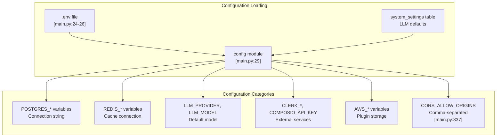

**CORS Configuration:** The CORS middleware at [main.py:337-338]() parses comma-separated origins and strips whitespace for flexibility.

**API Key Authentication:** The `require_api_key()` dependency at [main.py:400-408]() checks `config.REQUIRE_API_KEY` flag and validates against `config.API_KEY`.

**Sources:** [orchestrator/main.py:24-29](), [orchestrator/main.py:337-346](), [orchestrator/main.py:400-408]()

---