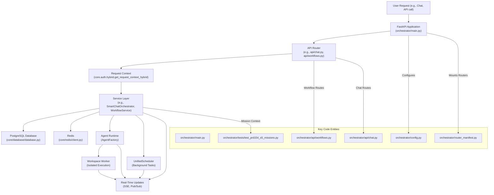

# Backend Architecture

Relevant source files

The following files were used as context for generating this wiki page:

- [frontend/components/__tests__/prd197-substrate-tile.test.tsx](frontend/components/__tests__/prd197-substrate-tile.test.tsx)
- [frontend/components/command-center/is-it-working-strip.tsx](frontend/components/command-center/is-it-working-strip.tsx)
- [frontend/hooks/use-analytics-api.ts](frontend/hooks/use-analytics-api.ts)
- [frontend/lib/api-client.ts](frontend/lib/api-client.ts)
- [orchestrator/api/workflows.py](orchestrator/api/workflows.py)
- [orchestrator/config.py](orchestrator/config.py)
- [orchestrator/core/models/substrate_metrics.py](orchestrator/core/models/substrate_metrics.py)
- [orchestrator/core/observability/substrate_metrics.py](orchestrator/core/observability/substrate_metrics.py)
- [orchestrator/main.py](orchestrator/main.py)
- [orchestrator/reports/route-manifest.json](orchestrator/reports/route-manifest.json)
- [orchestrator/router_manifest.py](orchestrator/router_manifest.py)
- [orchestrator/tests/authz_sweep_probe.py](orchestrator/tests/authz_sweep_probe.py)
- [orchestrator/tests/test_p2w2_authz_boundary_sweep.py](orchestrator/tests/test_p2w2_authz_boundary_sweep.py)
- [orchestrator/tests/test_prd154_s5_missions.py](orchestrator/tests/test_prd154_s5_missions.py)
- [orchestrator/tests/test_prd222_w2s1_plan_tiers.py](orchestrator/tests/test_prd222_w2s1_plan_tiers.py)

This document describes the FastAPI backend architecture of Automatos AI, including application structure, API router organization, execution layer components, database models, and integration patterns. The backend orchestrates multi-agent workflows, manages memory tiers, and provides real-time execution streaming.

For detailed information on specific components, see the following child pages:
- [FastAPI Application & Boot Sequence](#18.1) — `main.py` two-phase boot, trust gate, lifespan manager, middleware stack (CORS, auth, logging, rate limiting), degraded boot flag
- [API Router Organization](#18.2) — `router_manifest` RouterSpec registry, route-manifest.json, router modules and prefixes, import-linter contracts
- [Database Models & Migrations](#18.3) — SQLAlchemy models under core/models, workspace_id foreign keys, JSONB fields, Alembic single-head invariant, schema drift and from-zero checks
- [Service Layer Patterns](#18.4) — Singleton services, dependency injection, get_db lifecycle, orchestration_state, chat_messenger, service composition across orchestrator/services
- [Background Services & Schedulers](#18.5) — UnifiedScheduler with file lock, APScheduler job store, playbook/scheduled task schedulers, audit retention, orphan run reaping
- [Real-Time Updates](#18.6) — Redis Pub/Sub client, Postgres LISTEN/NOTIFY board events, SSE streaming, workflow events, AI SDK Data Stream protocol
- [Testing Infrastructure](#18.7) — pytest.ini and conftest layout, orchestrator/tests suites, tests/run_nightly.py live-API runner, contract/regression tests, security suites, e2e/playwright, CI test workflow
- [Evals & Benchmarks](#18.8) — orchestrator/evals (retrieval recall, graphiti vs baseline), nl2sql_eval, tool-routing eval harness, tools/ benchmark scripts and results, CI eval gates
- [Developer Tooling & Ralph Automation](#18.9) — scripts/ (ci, dr, ralph PRD build/review prompts and acceptance scripts), .claude agents/hooks/skills, Makefile, docs/PRDS workflow, reports/dossiers

---

## FastAPI Application

The backend is a FastAPI application that serves as the orchestration layer for the entire platform. The main application is configured in [orchestrator/main.py:1-1465](). It utilizes a multi-stage Docker build for development and production.

### Application Initialization

The application uses an async context manager for startup/shutdown (lifespan) at [orchestrator/main.py:242-462](). Environment variables are loaded at the module level via `load_dotenv()` before any internal imports at [orchestrator/main.py:24-26](). Centralized configuration management is handled by the `Config` class, which is the single source of truth for `os.getenv()` calls [orchestrator/config.py:30-34]().

**Application Lifecycle (Lifespan Events)**

```mermaid
graph TB
    subgraph "Startup_Sequence"
        Start["lifespan() startup<br/>[main.py:242]"]
        
        EnsureSysPrompts["PRD-58: Ensure system_prompts tables<br/>[main.py:249-270]"]
        ImportModels["import core.models.system_prompts"]
        CreateTables["create_tables()"]
        AddFutureAGICol["ALTER TABLE ADD COLUMN<br/>futureagi_eval_enabled"]
        SeedPrompts["seed_system_prompts(db)"]
        
        EnsureDocTemplates["PRD-63: Ensure document_templates<br/>[main.py:273-285]"]
        SeedTemplates["seed_starter_templates(db, ws_id)"]
        
        EnsureRoutingCols["PRD-64: Add semantic routing columns<br/>[main.py:287-301]"]
        AddSemanticEmb["ALTER TABLE agents ADD<br/>semantic_embedding JSONB<br/>semantic_text_hash VARCHAR(64)"]
        
        EmbedAgents["Background: embed_workspace_agents()<br/>[main.py:304-348]"]
        EmbedAllWorkspaces["_embed_all_agents_on_startup()<br/>asyncio.create_task()"]
        
        StartDashboard["await startup_dashboard(app)<br/>[main.py:357]"]
        
        CheckScheduler{"HEARTBEAT_ENABLED or<br/>RECIPE_SCHEDULER_ENABLED?<br/>[main.py:362]"}
        AcquireLock["fcntl.flock(LOCK_EX|LOCK_NB)<br/>/tmp/automatos_scheduler.lock<br/>[main.py:368]"]
        
        StartUnified["get_unified_scheduler().start()<br/>[main.py:372]"]
        StartHeartbeat["get_heartbeat_service().start()<br/>[main.py:378]"]
        StartRecipeSched["get_recipe_scheduler().start()<br/>[main.py:383]"]
        StartTaskRecon["get_task_reconciler().start()<br/>[main.py:388]"]
        StartMemoryJobs["get_memory_job_scheduler().start()<br/>[main.py:396]"]
        LoadScheduledTasks["ScheduledTaskService.load_active_tasks<br/>[main.py:404-414]"]
        
        CheckChannels{"CHANNELS_ENABLED?<br/>[main.py:424]"}
        StartChannels["get_channel_manager().start_all()<br/>[main.py:428]"]
        
        Start --> EnsureSysPrompts
        EnsureSysPrompts --> ImportModels
        ImportModels --> CreateTables
        CreateTables --> AddFutureAGICol
        AddFutureAGICol --> SeedPrompts
        
        SeedPrompts --> EnsureDocTemplates
        EnsureDocTemplates --> SeedTemplates
        
        SeedTemplates --> EnsureRoutingCols
        EnsureRoutingCols --> AddSemanticEmb
        AddSemanticEmb --> EmbedAgents
        
        EmbedAgents --> EmbedAllWorkspaces
        EmbedAllWorkspaces --> StartDashboard
        StartDashboard --> CheckScheduler
        
        CheckScheduler -->|"true"| AcquireLock
        CheckScheduler -->|"false"| CheckChannels
        
        AcquireLock -->|"Lock acquired"| StartUnified
        AcquireLock -->|"BlockingIOError"| SkipScheduler["Skip scheduler<br/>(another worker owns it)"]
        
        StartUnified --> StartHeartbeat
        StartHeartbeat --> StartRecipeSched
        StartRecipeSched --> StartTaskRecon
        StartTaskRecon --> StartMemoryJobs
        StartMemoryJobs --> LoadScheduledTasks
        LoadScheduledTasks --> CheckChannels
        
        SkipScheduler --> CheckChannels
        
        CheckChannels -->|"true"| StartChannels
        CheckChannels -->|"false"| Complete["Startup complete"]
        StartChannels --> Complete
    end
    
    subgraph "Shutdown_Sequence"
        Shutdown["lifespan() shutdown<br/>[main.py:440]"]
        
        StopUnified["get_unified_scheduler().stop()<br/>[main.py:444-447]"]
        StopChannels["get_channel_manager().stop_all()<br/>[main.py:452-455]"]
        ShutdownDash["await shutdown_dashboard(app)<br/>[main.py:461]"]
        
        Shutdown --> StopUnified
        StopUnified --> StopChannels
        StopChannels --> ShutdownDash
    end
```

For details, see [FastAPI Application & Boot Sequence](#18.1).

Sources: [orchestrator/main.py:24-26](), [orchestrator/main.py:242-462](), [orchestrator/main.py:362-421](), [orchestrator/config.py:30-34]()

---

## API Router Organization

The backend is organized into domain-specific routers. Core routers are imported directly in [orchestrator/main.py:36-120](), while conditionally mounted routers are managed by the `router_manifest` system [orchestrator/router_manifest.py:51-91](). This system ensures explicit declaration of optional routers and provides fail-loud behavior for required ones, or a degraded boot if `ALLOW_DEGRADED_BOOT=true` is set [orchestrator/router_manifest.py:100-134](). The `route-manifest.json` file provides a comprehensive list of all registered routes [orchestrator/reports/route-manifest.json:1-3161]().

### Router Categories

| Category | Router Modules (Examples) | Prefix (Examples) |
| :--- | :--- | :--- |
| **Core** | `api.agents`, `api.workflows`, `api.documents` | `/api/agents`, `/api/workflows` |
| **Orchestration** | `api.missions`, `api.scheduled_tasks` | `/api/missions`, `/api/scheduled-tasks` |
| **Memory** | `api.widget_memory`, `api.memory_stats` | `/api/widget-memory`, `/api/memory-stats` |
| **Tools & Integrations** | `api.tools`, `api.composio`, `api.cloud_documents`, `api.shopify` | `/api/tools`, `/api/composio`, `/api/shopify` |
| **Admin & System** | `api.admin_prompts`, `api.system_settings`, `api.admin_workspaces`, `api.governance` | `/api/admin`, `/api/system-settings` |
| **Analytics** | `api.analytics`, `api.llm_analytics`, `api.analytics_real` | `/api/analytics`, `/api/llm-analytics` |
| **Real-Time** | `api.chat`, `api.notifications` | `/api/chat`, `/api/notifications` |

For details on specific route handlers and prefixes, see [API Router Organization](#18.2).

Sources: [orchestrator/main.py:36-120](), [orchestrator/router_manifest.py:51-91](), [orchestrator/router_manifest.py:100-134](), [orchestrator/reports/route-manifest.json:1-3161]()

---

## Database Models

The database layer uses SQLAlchemy ORM with PostgreSQL and `pgvector` for semantic search. Models are organized under `core/models/` and utilize a shared `Base`. Multi-tenancy is enforced through `workspace_id` foreign keys on most models.

### Core Model Entities
- **Agents & Skills**: `Agent`, `Skill`, and the `agent_skills` association table.
- **LLM Registry**: `LLMModel` stores metadata, costs, and capabilities.
- **Workspaces**: `Workspace` manages multi-tenancy, plan limits, and integration settings. Plan tiers are defined in `config.PLAN_TIERS` and can be overridden via environment variables [orchestrator/config.py:199-200](), [orchestrator/tests/test_prd222_w2s1_plan_tiers.py:101-112]().
- **Analytics**: `LLMUsage` tracks token consumption and costs per request.

For the full schema and relationship documentation, see [Database Models & Migrations](#18.3).

Sources: [orchestrator/config.py:199-200](), [orchestrator/tests/test_prd222_w2s1_plan_tiers.py:101-112]()

---

## Service Layer Patterns

The backend logic is encapsulated in a service layer that follows a singleton pattern, typically accessed via a `get_instance()` method. Dependency injection is used to provide database sessions and other resources to services.

### Key Service Categories
- **Agent Resolver**: `resolve_agent_id` maps public UUIDs or legacy IDs to internal records while validating workspace ownership.
- **Workspace Provisioning**: The `seed_auto_agent` function ensures every workspace has exactly one "Auto" system agent that acts as the orchestrator LLM config source.
- **Real-Time Messaging**: `RedisClient` provides Pub/Sub capabilities for workflow execution updates.

For details on dependency injection and service composition, see [Service Layer Patterns](#18.4).

---

## Execution Subsystems

The backend supports several execution paths ranging from simple chat to complex multi-agent missions.

### 1. Agent Runtime
The `AgentFactory` handles the activation and execution of agents. The default workspace agent "Auto" is seeded with the `platform-management` skill to allow it to manage workspace resources.

### 2. Workspace Execution
Agent tasks are executed in isolated workspace environments. The frontend interacts with these via the `api/workspace_files` endpoints for file operations [orchestrator/main.py:90-92]() and other workspace-related actions.

### 3. Workflow Execution
Workflows are managed through the `api/workflows` router [orchestrator/api/workflows.py:35](). The `WorkflowStageTracker` handles dynamic phase and stage tracking for real-time updates, supporting both legacy 9-stage and PRD-59 dynamic phases [orchestrator/api/workflows.py:38-69]().

### 4. Mission Execution
Missions are orchestrated through the `api/missions` router. The `create_mission` handler ensures that auto-created missions carry recent chat context as `context_messages` for the planner [orchestrator/tests/test_prd154_s5_missions.py:150-163]().

#### Backend Execution Flow

Sources: [orchestrator/main.py:90-92](), [orchestrator/api/workflows.py:35](), [orchestrator/api/workflows.py:38-69](), [orchestrator/tests/test_prd154_s5_missions.py:150-163]()

---

## Real-Time Updates

Automatos AI utilizes Redis and SSE to provide live feedback to the frontend.

### Update Protocol
- **Redis Pub/Sub**: The `RedisClient` manages async pubsub channels for real-time streaming.
- **Workflow Events**: `publish_workflow_event` broadcasts subtask updates to specific execution channels.
- **Next.js Integration**: The frontend `apiClient` ([frontend/lib/api-client.ts:1-2430]()) connects to these streams to render live agent logs and progress bars.

For details on the event pipeline and streaming protocols, see [Real-Time Updates](#18.6).

Sources: [frontend/lib/api-client.ts:1-2430]()

---