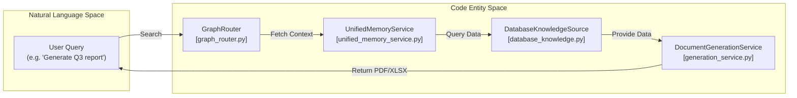

# Backend Architecture

Relevant source files

The following files were used as context for generating this wiki page:

- [frontend/hooks/use-database-knowledge.ts](frontend/hooks/use-database-knowledge.ts)
- [frontend/tsconfig.tsbuildinfo](frontend/tsconfig.tsbuildinfo)
- [orchestrator/api/admin_prompts.py](orchestrator/api/admin_prompts.py)
- [orchestrator/api/credentials.py](orchestrator/api/credentials.py)
- [orchestrator/api/database_knowledge.py](orchestrator/api/database_knowledge.py)
- [orchestrator/api/document_generation.py](orchestrator/api/document_generation.py)
- [orchestrator/api/generated_images.py](orchestrator/api/generated_images.py)
- [orchestrator/api/system_settings.py](orchestrator/api/system_settings.py)
- [orchestrator/config.py](orchestrator/config.py)
- [orchestrator/core/database/database.py](orchestrator/core/database/database.py)
- [orchestrator/core/models/system_prompts.py](orchestrator/core/models/system_prompts.py)
- [orchestrator/core/seeds/seed_system_prompts.py](orchestrator/core/seeds/seed_system_prompts.py)
- [orchestrator/core/services/audit_service.py](orchestrator/core/services/audit_service.py)
- [orchestrator/core/services/prompt_registry.py](orchestrator/core/services/prompt_registry.py)
- [orchestrator/main.py](orchestrator/main.py)
- [orchestrator/modules/documents/generation_service.py](orchestrator/modules/documents/generation_service.py)
- [orchestrator/modules/memory/context_router.py](orchestrator/modules/memory/context_router.py)
- [orchestrator/modules/memory/unified_memory_service.py](orchestrator/modules/memory/unified_memory_service.py)
- [orchestrator/modules/nl2sql/service.py](orchestrator/modules/nl2sql/service.py)
- [orchestrator/tests/test_unified_memory.py](orchestrator/tests/test_unified_memory.py)
- [scripts/ralph/IMPLEMENTATION_PLAN.md](scripts/ralph/IMPLEMENTATION_PLAN.md)
- [scripts/ralph/prd.json](scripts/ralph/prd.json)
- [scripts/ralph/progress.txt](scripts/ralph/progress.txt)

This document describes the FastAPI backend architecture of Automatos AI, including application structure, API router organization, execution layer components, database models, and integration patterns. The backend orchestrates multi-agent workflows, manages memory tiers, and provides real-time execution streaming.

For detailed information on specific components, see the following child pages:
- [FastAPI Application](#18.1) — `main.py`, lifespan manager, and middleware stack (CORS, auth, logging, rate limiting).
- [API Router Organization](#18.2) — Router modules (agents, workflows, chat, tools, memory, admin, etc.) and route prefixes.
- [Database Models](#18.3) — SQLAlchemy models, relationships, workspace_id foreign keys, and JSONB fields.
- [Service Layer Patterns](#18.4) — Singleton services (`get_instance`), dependency injection, and service composition.
- [Background Services](#18.5) — `UnifiedScheduler` with `fcntl` file lock, APScheduler job store, and background task patterns.
- [Real-Time Updates](#18.6) — Redis Pub/Sub, SSE streaming, workflow events, and AI SDK Data Stream protocol.
- [Testing Infrastructure](#18.7) — Nightly test runner (376 tests), health regression suite, contract tests, and regression pins.

---

## FastAPI Application

The backend is a FastAPI application that serves as the orchestration layer for the entire platform. The main application is configured in [orchestrator/main.py:1-180](). It utilizes a multi-stage Docker build for development and production.

### Application Initialization

The application uses an async context manager for startup/shutdown (lifespan) at [orchestrator/main.py:9-462](). Environment variables are loaded at the module level via `load_dotenv()` before any internal imports at [orchestrator/main.py:24-26]().

**Application Lifecycle (Lifespan Events)**

**Sources:** [orchestrator/main.py:9-462](), [orchestrator/main.py:24-26](), [orchestrator/main.py:362-421]()

---

## API Router Organization

The backend is organized into domain-specific routers registered in [orchestrator/main.py:36-160](). These routers handle core resources, orchestration, and tool integrations.

### Router Categories

| Category | Router Modules | Prefix |
| :--- | :--- | :--- |
| **Core** | `agents`, `workflows`, `workflow_recipes`, `documents` | `/api/agents`, `/api/workflows` |
| **Knowledge** | `knowledge`, `knowledge_graph`, `codegraph`, `database_knowledge` | `/api/knowledge`, `/api/code-graph` |
| **Memory** | `memory`, `widget_memory`, `memory_stats` | `/api/memory` |
| **Tools** | `tools`, `composio`, `cloud_documents` | `/api/tools`, `/api/cloud-documents` |
| **Admin** | `admin_prompts`, `system_settings`, `credentials` | `/api/admin`, `/api/system-settings` |

For details on specific route handlers and prefixes, see [API Router Organization](#18.2).

**Sources:** [orchestrator/main.py:36-160](), [orchestrator/api/database_knowledge.py:37](), [orchestrator/api/admin_prompts.py:42]()

---

## Database Models

The database layer uses SQLAlchemy ORM with PostgreSQL. Models are organized under `core/models/` and utilize a shared `Base` [orchestrator/main.py:32-33]().

### Core Model Entities
- **System Prompts**: `SystemPrompt` and `SystemPromptVersion` manage the lifecycle and versioning of platform-wide prompts [orchestrator/api/admin_prompts.py:29-38]().
- **Database Knowledge**: `DatabaseKnowledgeSource` enables text-to-SQL capabilities via stored schema metadata [orchestrator/api/database_knowledge.py:29-31]().
- **Generated Documents**: `GeneratedDocument` tracks files created via templates [orchestrator/modules/documents/generation_service.py:34-35]().

For the full schema and relationship documentation, see [Database Models](#18.3).

**Sources:** [orchestrator/main.py:32-33](), [orchestrator/api/admin_prompts.py:29-38](), [orchestrator/api/database_knowledge.py:29-31]()

---

## Service Layer Patterns

The backend logic is encapsulated in a service layer that follows a singleton pattern, typically accessed via a `get_instance()` method.

### Key Service Categories
- **Unified Memory**: `UnifiedMemoryService` replaces scattered Mem0 instances with a 5-layer stack (L0-L4) [orchestrator/modules/memory/unified_memory_service.py:154-170]().
- **Document Generation**: `DocumentGenerationService` handles PDF, DOCX, and XLSX creation from templates [orchestrator/modules/documents/generation_service.py:84-90]().
- **Database Knowledge**: `DatabaseKnowledgeService` manages schema introspection and SQL generation [orchestrator/modules/nl2sql/service.py:75-96]().

For details on dependency injection and service composition, see [Service Layer Patterns](#18.4).

**Sources:** [orchestrator/modules/memory/unified_memory_service.py:154-170](), [orchestrator/modules/documents/generation_service.py:84-90](), [orchestrator/modules/nl2sql/service.py:75-96]()

---

## Execution Subsystems

The backend supports several execution paths ranging from simple chat to complex multi-agent missions.

### 1. Natural Language to SQL
The `NaturalLanguageToSQLService` (referenced in [orchestrator/api/database_knowledge.py:21]()) translates user queries into validated SQL against connected knowledge sources.

### 2. Memory Retrieval
The `GraphRouter` service expansions entry nodes through tool routing edges to provide contextually relevant tool hints [scripts/ralph/progress.txt:98-112]().

**Sources:** [orchestrator/api/database_knowledge.py:21](), [orchestrator/modules/memory/unified_memory_service.py:154-170](), [orchestrator/modules/documents/generation_service.py:84-90](), [scripts/ralph/progress.txt:98-112]()

---

## Real-Time Updates

Automatos AI utilizes Redis and SSE to provide live feedback to the frontend.

### Update Protocol
- **Redis Pub/Sub**: The `UnifiedMemoryService` uses a shared Redis client for session caching and Pub/Sub operations [orchestrator/modules/memory/unified_memory_service.py:183-187]().
- **Standardized Namespacing**: `MemoryNamespace` ensures consistent Redis keys across different memory layers (L1-L3) [orchestrator/modules/memory/unified_memory_service.py:39-117]().

For details on the event pipeline and streaming protocols, see [Real-Time Updates](#18.6).

**Sources:** [orchestrator/modules/memory/unified_memory_service.py:39-117](), [orchestrator/modules/memory/unified_memory_service.py:183-187]()

---