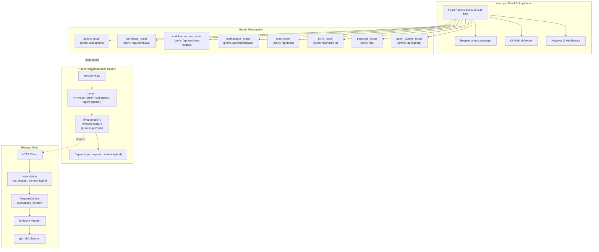
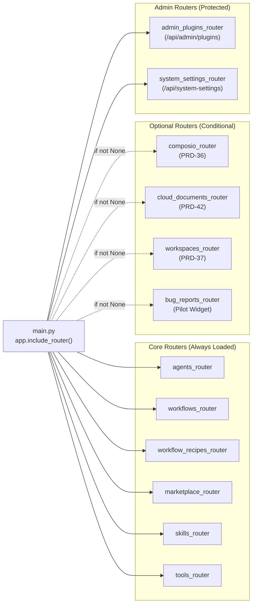
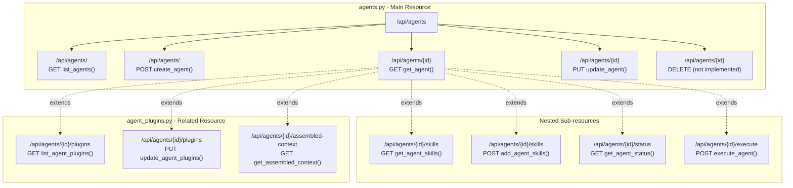
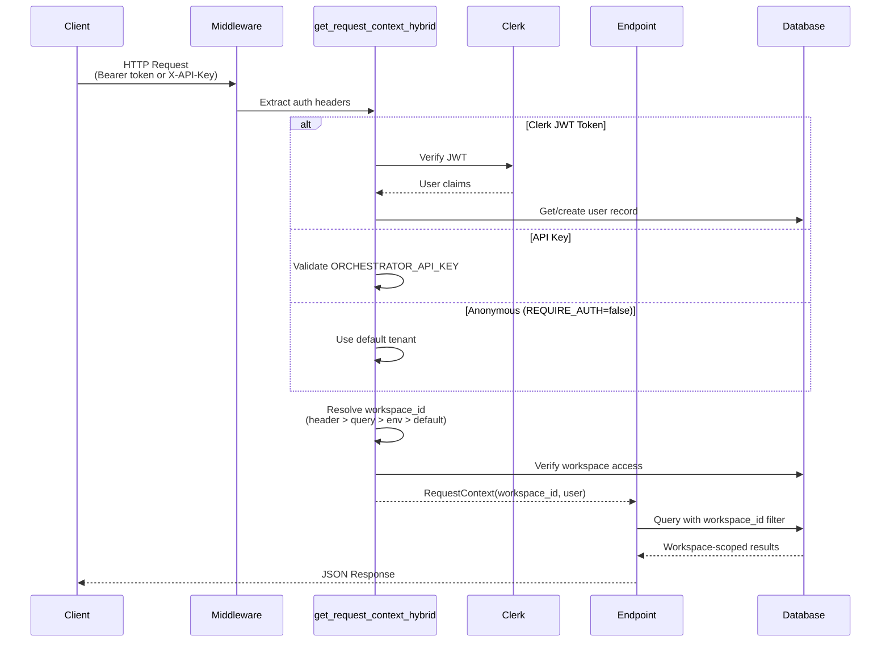
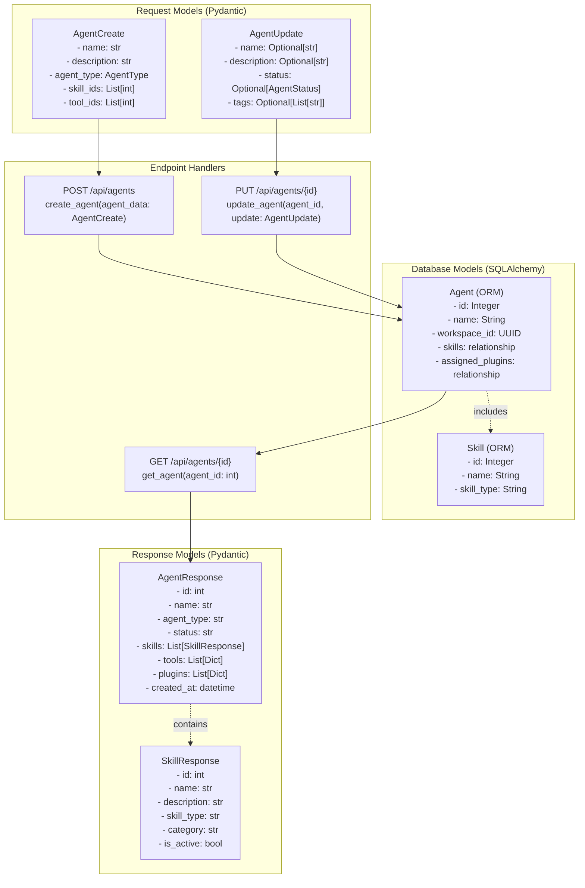
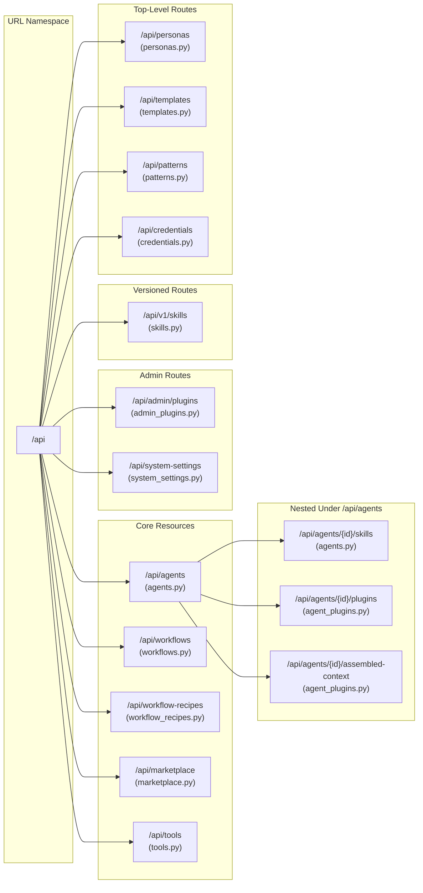
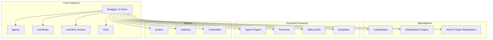

# API Router Organization

<details>
<summary>Relevant source files</summary>

The following files were used as context for generating this wiki page:

- [frontend/app/admin/plugins/page.tsx](frontend/app/admin/plugins/page.tsx)
- [frontend/lib/api-client.ts](frontend/lib/api-client.ts)
- [orchestrator/.env.example](orchestrator/.env.example)
- [orchestrator/api/agent_plugins.py](orchestrator/api/agent_plugins.py)
- [orchestrator/config.py](orchestrator/config.py)
- [orchestrator/core/database/load_seed_data.py](orchestrator/core/database/load_seed_data.py)
- [orchestrator/core/seeds/seed_personas.py](orchestrator/core/seeds/seed_personas.py)
- [orchestrator/core/seeds/seed_plugin_categories.py](orchestrator/core/seeds/seed_plugin_categories.py)
- [orchestrator/core/services/plugin_cache.py](orchestrator/core/services/plugin_cache.py)
- [orchestrator/main.py](orchestrator/main.py)
- [scripts/ralph/prd.json](scripts/ralph/prd.json)

</details>


## Purpose and Scope

This document describes the organization and structure of FastAPI routers in the backend orchestrator application. It covers router registration, URL prefix patterns, authentication dependencies, endpoint conventions, and response models.

For authentication and workspace isolation mechanisms, see [Authentication Flow](#9.1). For database models referenced by routers, see [Database Models](#10.4). For the main FastAPI application setup, see [FastAPI Application](#10.1).

---

## Router Organization Overview

The Automatos AI backend organizes API endpoints into **domain-based routers**, each responsible for a specific feature area. Routers are modular Python files in the `orchestrator/api/` directory that define related endpoints using FastAPI's `APIRouter`.

### Router Categories

| Category | Routers | Primary Purpose |
|----------|---------|-----------------|
| **Core Agents** | `agents.py`, `agent_plugins.py`, `templates.py`, `personas.py` | Agent lifecycle, configuration, plugins, and personalities |
| **Workflows** | `workflows.py`, `workflow_recipes.py`, `workflow_templates.py` | Workflow orchestration and recipe management |
| **Tools & Skills** | `tools.py`, `skills.py`, `composio.py` | External integrations, skill sources, Composio apps |
| **Marketplace** | `marketplace.py`, `marketplace_plugins.py`, `admin_plugins.py`, `workspace_plugins.py` | Plugin discovery, approval, and enablement |
| **Context & Memory** | `context.py`, `memory.py`, `context_engineering.py`, `documents.py` | Context assembly, memory management, RAG systems |
| **System Admin** | `system.py`, `statistics.py`, `credentials.py`, `permissions.py` | System configuration, metrics, credential management |
| **Workspaces** | `workspaces.py`, `team.py` | Multi-tenancy, workspace management, team collaboration |
| **Routing** | `routing.py`, `chatbot_llm.py`, `chat.py` | Universal routing, chat interfaces, streaming responses |

Sources: [orchestrator/main.py:36-119]()

---

## Router Architecture



Sources: [orchestrator/main.py:188-492](), [orchestrator/api/agents.py:31](), [orchestrator/api/agent_plugins.py:27]()

---

## Router Registration in main.py

Routers are imported and registered in `orchestrator/main.py` following a specific order and pattern:

### Import Pattern

```python
# Core routers (always loaded)
from api.agents import router as agents_router
from api.workflows import router as workflows_router
from api.workflow_recipes import router as workflow_recipes_router
from api.marketplace import router as marketplace_router

# Optional routers (conditional import)
try:
    from api.composio import router as composio_router
except ImportError:
    composio_router = None
```

### Registration Pattern

```python
# Include all routers
app.include_router(agents_router)          # /api/agents
app.include_router(workflows_router)       # /api/workflows
app.include_router(workflow_recipes_router) # /api/workflow-recipes
app.include_router(marketplace_router)     # /api/marketplace

# Conditional registration
if composio_router is not None:
    app.include_router(composio_router)    # /api/composio
```

### Router Groups



Sources: [orchestrator/main.py:36-89](), [orchestrator/main.py:411-479]()

---

## Endpoint Pattern Conventions

### Standard CRUD Pattern

Most routers follow a consistent RESTful CRUD pattern:

| Operation | Method | Path | Function Name | Purpose |
|-----------|--------|------|---------------|---------|
| List | GET | `/` | `list_agents()` | Retrieve collection with filters |
| Create | POST | `/` | `create_agent()` | Create new resource |
| Get | GET | `/{id}` | `get_agent()` | Retrieve single resource |
| Update | PUT | `/{id}` | `update_agent()` | Update existing resource |
| Delete | DELETE | `/{id}` | `delete_agent()` | Delete resource |

### Nested Resource Pattern

For related resources, routers use nested paths:

| Pattern | Example | Router File |
|---------|---------|-------------|
| Resource → Sub-resource | `/api/agents/{agent_id}/skills` | `agents.py` |
| Resource → Action | `/api/agents/{agent_id}/execute` | `agents.py` |
| Resource → Relationship | `/api/agents/{agent_id}/plugins` | `agent_plugins.py` |
| Resource → Computed | `/api/agents/{agent_id}/assembled-context` | `agent_plugins.py` |



Sources: [orchestrator/api/agents.py:437-553](), [orchestrator/api/agent_plugins.py:69-337]()

---

## Authentication Dependencies

All routers use the **hybrid authentication dependency** `get_request_context_hybrid` to obtain authenticated request context.

### Dependency Injection Pattern

```python
from core.auth.hybrid import get_request_context_hybrid
from core.auth.dependencies import RequestContext

@router.get("/")
async def list_agents(
    ctx: RequestContext = Depends(get_request_context_hybrid),
    db: Session = Depends(get_db)
):
    # ctx.workspace_id - authenticated workspace UUID
    # ctx.user.id - authenticated user ID
    # ctx.user.email - user email
    query = db.query(Agent).filter(Agent.workspace_id == ctx.workspace_id)
    ...
```

### Authentication Flow



### RequestContext Structure

```python
@dataclass
class RequestContext:
    workspace_id: UUID          # Current workspace (tenant isolation)
    user: UserContext           # Authenticated user info
    
@dataclass  
class UserContext:
    id: str                     # User ID (Clerk user_id or API key identifier)
    email: Optional[str]        # User email
    role: Optional[str]         # Workspace role (owner, member, viewer)
    system_role: Optional[str]  # System-wide role (admin, user)
```

Sources: [orchestrator/api/agents.py:26-27](), [orchestrator/api/agent_plugins.py:21-22]()

---

## Response Model Patterns

### Response Wrapping

Most endpoints wrap responses in a consistent structure:

| Pattern | When Used | Example |
|---------|-----------|---------|
| `{"data": [...]}` | List endpoints | `{"data": [agent1, agent2, ...]}` |
| `{"data": {...}}` | Single resource | `{"data": {"id": 1, "name": "..."}}` |
| Direct model | Explicit response_model | `AgentResponse(id=1, name=...)` |
| `{"items": [...], "total": N}` | Paginated lists | Used by marketplace routers |

### Pydantic Response Models



### Builder Functions

Routers use builder functions to convert ORM models to Pydantic responses:

```python
def _build_agent_response(agent: Agent, db: Session) -> AgentResponse:
    """Build agent response with skills, tools, and plugins"""
    # Build tools list from agent_app_assignments
    tools: List[Dict[str, Any]] = []
    assignments = db.query(AgentAppAssignment).filter(
        AgentAppAssignment.agent_id == agent.id,
        AgentAppAssignment.is_active == True
    ).all()
    # ... build tools list
    
    # Build plugins list from assigned_plugins
    plugins: List[Dict[str, Any]] = []
    for ap in agent.assigned_plugins:
        plugins.append({
            "plugin_id": str(ap.plugin.id),
            "slug": ap.plugin.slug,
            "name": ap.plugin.name,
            # ...
        })
    
    return AgentResponse(
        id=agent.id,
        name=agent.name,
        skills=[...],
        tools=tools,
        plugins=plugins,
        # ...
    )
```

Sources: [orchestrator/api/agents.py:138-237](), [orchestrator/core/models/__init__.py:19-23]()

---

## Common Query Patterns

### Filtering and Pagination

```python
@router.get("/", response_model=List[AgentResponse])
async def list_agents(
    skip: int = Query(0, ge=0),                        # Offset
    limit: int = Query(100, ge=1, le=1000),           # Page size
    status: Optional[AgentStatus] = None,              # Enum filter
    agent_type: Optional[AgentType] = None,            # Enum filter
    search: Optional[str] = None,                      # Text search
    ctx: RequestContext = Depends(get_request_context_hybrid),
    db: Session = Depends(get_db)
):
    # Base query with workspace filter (CRITICAL for multi-tenancy)
    query = db.query(Agent).filter(Agent.workspace_id == ctx.workspace_id)
    
    # Apply filters
    if status:
        query = query.filter(Agent.status == status.value)
    if agent_type:
        query = query.filter(Agent.agent_type == agent_type.value)
    if search:
        query = query.filter(or_(
            Agent.name.ilike(f"%{search}%"),
            Agent.description.ilike(f"%{search}%")
        ))
    
    # Pagination
    agents = query.offset(skip).limit(limit).all()
    return [_build_agent_response(agent, db) for agent in agents]
```

### Eager Loading

To avoid N+1 queries, routers use SQLAlchemy's eager loading:

```python
from sqlalchemy.orm import joinedload, subqueryload

# Load agent with related skills and plugins in single query
agent = (
    db.query(Agent)
    .options(
        joinedload(Agent.skills),              # One-to-many
        subqueryload(Agent.assigned_plugins)   # Many-to-many
    )
    .filter(Agent.id == agent_id, Agent.workspace_id == ctx.workspace_id)
    .first()
)
```

Sources: [orchestrator/api/agents.py:437-476](), [orchestrator/api/agents.py:534-552]()

---

## Router Prefix Map

Complete mapping of router prefixes to their implementation files:



### Complete Router List

| Prefix | Router File | Tags | Auth Required |
|--------|-------------|------|---------------|
| `/api/agents` | `agents.py` | `agents` | Yes |
| `/api/agents` | `agent_plugins.py` | `Agent Plugins` | Yes |
| `/api/workflows` | `workflows.py` | `workflows` | Yes |
| `/api/workflow-recipes` | `workflow_recipes.py` | `workflow-recipes` | Yes |
| `/api/marketplace` | `marketplace.py` | `marketplace` | Yes |
| `/api/marketplace` | `marketplace_plugins.py` | `Marketplace Plugins` | Yes |
| `/api/tools` | `tools.py` | `tools` | Yes |
| `/api/v1/skills` | `skills.py` | `skills-prd22` | Yes |
| `/api/personas` | `personas.py` | `Personas` | Yes |
| `/api/templates` | `templates.py` | `templates` | Yes |
| `/api/patterns` | `patterns.py` | `patterns` | Yes |
| `/api/credentials` | `credentials.py` | `credentials` | Yes |
| `/api/admin/plugins` | `admin_plugins.py` | `Admin Plugin Marketplace` | Yes (Admin) |
| `/api/workspaces` | `workspaces.py` | `workspaces` | Yes |
| `/api/system` | `system.py` | `system`, `statistics` | Yes |

Sources: [orchestrator/main.py:411-479](), [orchestrator/api/agents.py:31](), [orchestrator/api/agent_plugins.py:27](), [orchestrator/api/skills.py:117](), [orchestrator/api/personas.py:30]()

---

## Special Endpoint Patterns

### Bulk Operations

Some routers provide bulk endpoints for batch operations:

```python
@router.post("/bulk", response_model=List[AgentResponse])
async def create_agents_bulk(
    agents: List[AgentCreate],
    ctx: RequestContext = Depends(get_request_context_hybrid),
    db: Session = Depends(get_db)
):
    created_agents = []
    for agent_data in agents:
        # Validate and create each agent
        agent = Agent(
            name=agent_data.name,
            workspace_id=ctx.workspace_id,
            # ...
        )
        db.add(agent)
        created_agents.append(agent)
    
    db.commit()
    return [_build_agent_response(a, db) for a in created_agents]
```

### Background Tasks

Long-running operations use FastAPI's `BackgroundTasks`:

```python
from fastapi import BackgroundTasks

@router.post("/sources/git", response_model=Dict[str, Any])
async def import_git_repository(
    source_data: GitSkillSourceCreate,
    background_tasks: BackgroundTasks,
    db: Session = Depends(get_db)
):
    # Clone and index repository in background
    skill_loader = get_skill_loader(db)
    result = skill_loader.add_git_repository(
        git_url=source_data.git_url,
        # ...
    )
    return result
```

### File Upload Endpoints

File upload endpoints use `UploadFile`:

```python
from fastapi import UploadFile, File

@router.post("/upload")
async def upload_plugin(
    file: UploadFile = File(...),
    source_type: str = Form("upload"),
    ctx: RequestContext = Depends(get_request_context_hybrid)
):
    # Process uploaded zip file
    # Run security scans
    # Store in S3
    # ...
```

Sources: [orchestrator/api/agents.py:296-357](), [orchestrator/api/skills.py:181-232]()

---

## Error Handling

Routers use consistent error handling patterns:

```python
from fastapi import HTTPException

@router.get("/{agent_id}")
async def get_agent(agent_id: int, ctx: RequestContext = ...):
    try:
        agent = db.query(Agent).filter(
            Agent.id == agent_id,
            Agent.workspace_id == ctx.workspace_id  # Critical: workspace check
        ).first()
        
        if not agent:
            raise HTTPException(status_code=404, detail="Agent not found")
        
        return _build_agent_response(agent, db)
        
    except HTTPException:
        raise  # Re-raise HTTP exceptions
    except Exception as e:
        logger.error(f"Error getting agent: {e}")
        raise HTTPException(status_code=500, detail=str(e))
```

### Common HTTP Status Codes

| Code | When Used | Example |
|------|-----------|---------|
| 200 | Successful GET/PUT | Resource retrieved or updated |
| 201 | Successful POST | Resource created |
| 400 | Validation error | Invalid input data |
| 401 | Authentication failed | Missing or invalid token |
| 403 | Authorization failed | User lacks workspace access |
| 404 | Resource not found | Agent/workflow doesn't exist |
| 500 | Server error | Database connection failed |

Sources: [orchestrator/api/agents.py:534-552](), [orchestrator/api/agent_plugins.py:69-124]()

---

## Tags and OpenAPI Documentation

Each router declares tags for OpenAPI documentation grouping:

```python
router = APIRouter(
    prefix="/api/agents",
    tags=["agents"]  # Appears in Swagger UI sidebar
)
```

The main application configures enhanced Swagger UI parameters:

```python
app = FastAPI(
    title="🤖 Automatos AI API",
    docs_url="/docs",
    swagger_ui_parameters={
        "operationsSorter": "alpha",       # Sort endpoints alphabetically
        "tagsSorter": "alpha",             # Sort tags alphabetically
        "filter": True,                     # Enable search filter
        "displayRequestDuration": True,    # Show response times
        "syntaxHighlight.theme": "arta",   # Code highlighting theme
    }
)
```

### Tag Hierarchy in Swagger UI



Sources: [orchestrator/main.py:188-333](), [orchestrator/api/agents.py:31](), [orchestrator/api/agent_plugins.py:27]()

---