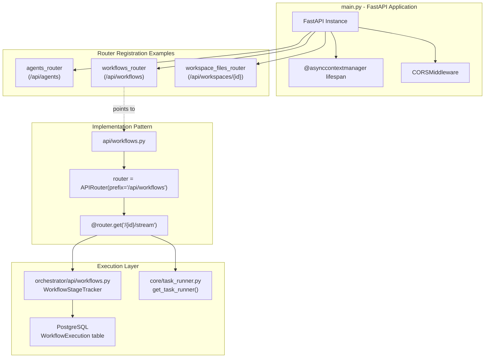
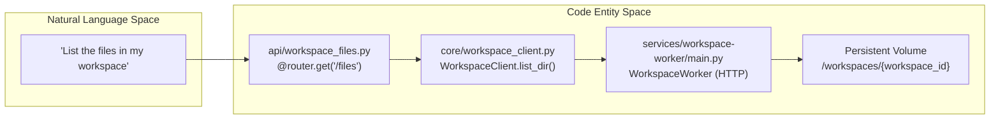

# API Router Organization

Relevant source files

The following files were used as context for generating this wiki page:

- [frontend/app/chat/page.tsx](frontend/app/chat/page.tsx)
- [frontend/components/widgets/CodingCanvasWidget/RepoSelector.tsx](frontend/components/widgets/CodingCanvasWidget/RepoSelector.tsx)
- [frontend/next-env.d.ts](frontend/next-env.d.ts)
- [orchestrator/alembic/versions/20260202_add_workspace_id_to_skills_patterns_models.py](orchestrator/alembic/versions/20260202_add_workspace_id_to_skills_patterns_models.py)
- [orchestrator/api/context.py](orchestrator/api/context.py)
- [orchestrator/api/main.py](orchestrator/api/main.py)
- [orchestrator/api/tasks.py](orchestrator/api/tasks.py)
- [orchestrator/api/widgets/cors.py](orchestrator/api/widgets/cors.py)
- [orchestrator/api/widgets/rate_limit.py](orchestrator/api/widgets/rate_limit.py)
- [orchestrator/api/workflows.py](orchestrator/api/workflows.py)
- [orchestrator/api/workspace_files.py](orchestrator/api/workspace_files.py)
- [orchestrator/api/workspace_github.py](orchestrator/api/workspace_github.py)
- [orchestrator/core/llm/clients/openai_embedding.py](orchestrator/core/llm/clients/openai_embedding.py)
- [orchestrator/core/llm/rerank_manager.py](orchestrator/core/llm/rerank_manager.py)
- [orchestrator/core/services/__init__.py](orchestrator/core/services/__init__.py)
- [orchestrator/core/workspace_client.py](orchestrator/core/workspace_client.py)
- [orchestrator/modules/tools/discovery/workspace_actions.py](orchestrator/modules/tools/discovery/workspace_actions.py)
- [services/workspace-worker/executor.py](services/workspace-worker/executor.py)
- [services/workspace-worker/main.py](services/workspace-worker/main.py)
- [services/workspace-worker/workspace_manager.py](services/workspace-worker/workspace_manager.py)

## Purpose and Scope

This document describes the organization and structure of FastAPI routers in the backend orchestrator application. It covers router registration, URL prefix patterns, authentication dependencies, endpoint conventions, and the coordination between the API layer and the core service execution paths.

For authentication and workspace isolation mechanisms, see [Authentication Flow](17.1). For database models referenced by routers, see [Database Models](18.3). For the main FastAPI application setup, see [FastAPI Application](18.1).

---

## Router Organization Overview

The Automatos AI backend organizes API endpoints into **domain-based routers**, each responsible for a specific feature area. Routers are modular Python files in the `orchestrator/api/` directory that define related endpoints using FastAPI's `APIRouter`.

### Router Categories

| Category | Routers | Primary Purpose |
|----------|---------|-----------------|
| **Core Agents** | `agents.py`, `agent_endpoints.py` | Agent lifecycle, configuration, and execution [orchestrator/api/main.py:33-77]() |
| **Workflows & Recipes** | `workflows.py`, `workflow_templates.py` | Multi-agent orchestration, sequential recipes, and live stage tracking [orchestrator/api/main.py:34-35]() |
| **Tools & Skills** | `tools.py`, `skills.py` | External integrations (500+ apps), skill sources, and tool discovery [orchestrator/api/main.py:54-57]() |
| **Marketplace** | `marketplace.py` | Plugin discovery and community item installation [orchestrator/api/main.py:59]() |
| **Context & Memory** | `context.py`, `memory.py`, `documents.py` | Context assembly, memory layers (L0-L4), and document management [orchestrator/api/main.py:36-51]() |
| **Knowledge** | `knowledge.py`, `knowledge_graph.py`, `codegraph.py` | Knowledge base, graph retrieval, and code analysis [orchestrator/api/main.py:47-68]() |
| **Analytics** | `analytics.py`, `statistics.py` | Usage tracking, cost analysis, and system metrics [orchestrator/api/main.py:40-55]() |
| **System Admin** | `system.py`, `system_settings.py`, `credentials.py` | System configuration, BYOK keys, and global settings [orchestrator/api/main.py:37-53]() |
| **Workspaces** | `workspaces.py`, `workspace_files.py`, `workspace_github.py`, `tasks.py` | Multi-tenancy, file browser, GitHub integration, and task queues [orchestrator/api/main.py:85-95]() |
| **Routing & Chat** | `chatbot_llm.py`, `chat_voice.py` | Universal routing, streaming chat (AI SDK), and voice profiles [orchestrator/api/main.py:76-107]() |

Sources: [orchestrator/api/main.py:33-109]()

---

## Router Architecture

The system follows a tiered request flow: the `main.py` entry point mounts routers, which then use `RequestContext` to enforce workspace isolation before calling specialized services or proxying to workers.

### API Registration and Request Flow
"Code Entity Space"

Sources: [orchestrator/api/main.py:147-168](), [orchestrator/api/workflows.py:34-73](), [orchestrator/api/workflows.py:183-186]()

---

## Workflow and Stage Tracking

The `workflows.py` router implements a sophisticated tracking system for multi-agent executions, supporting both legacy and dynamic phase models.

### WorkflowStageTracker
The `WorkflowStageTracker` class manages real-time telemetry for executions [orchestrator/api/workflows.py:37-70]().
- **Legacy Stages**: 9 fixed stages including Task Decomposition, Agent Selection, and Memory Storage [orchestrator/api/workflows.py:41-51]().
- **Dynamic Phases (PRD-59)**: Maps execution into high-level phases: `PLAN`, `PREPARE`, `EXECUTE`, `EVALUATE`, and `LEARN` [orchestrator/api/workflows.py:62-68]().
- **Event Emission**: Uses `_emit` to broadcast events to both Redis Pub/Sub and SSE stream managers [orchestrator/api/workflows.py:161-179]().

Sources: [orchestrator/api/workflows.py:37-179]()

---

## Workspace Subsystem Routing

The workspace subsystem utilizes a proxy pattern where the API router forwards requests to a specialized `workspace-worker` service or manages GitHub integration via Composio.

### Workspace Interaction
"Natural Language Space" to "Code Entity Space"

Sources: [orchestrator/api/workspace_files.py:34-51](), [orchestrator/core/workspace_client.py:96-108](), [services/workspace-worker/main.py:58-86]()

### Key Workspace Endpoints

| Method | Path | Implementation | Purpose |
|--------|------|----------------|---------|
| GET | `/api/workspaces/{id}/files` | `workspace_files.py` | Directory listing via `WorkspaceClient` [orchestrator/api/workspace_files.py:34]() |
| POST | `/api/workspaces/{id}/exec` | `workspace_files.py` | Shell command execution in sandbox [orchestrator/api/workspace_files.py:86]() |
| GET | `/api/workspaces/{id}/github/repos` | `workspace_github.py` | Lists repos via `Composio` entity [orchestrator/api/workspace_github.py:97]() |
| POST | `/api/workspaces/{id}/github/clone` | `workspace_github.py` | Clones repo into workspace volume [orchestrator/api/workspace_github.py:167]() |

### Security & Sandboxing
Command execution through the `/exec` endpoint is heavily restricted by the `WorkspaceToolExecutor` [services/workspace-worker/executor.py:108-114]():
- **Binary Whitelist**: Only approved tools like `git`, `python`, `ls`, and `npm` are allowed [services/workspace-worker/executor.py:35-73]().
- **Pattern Blocking**: Prevents dangerous patterns like `rm -rf /` or `sudo` via regex filters [services/workspace-worker/executor.py:76-98]().
- **Path Containment**: All operations are resolved against a safe root using `resolve_safe_path` [services/workspace-worker/executor.py:147]().

Sources: [orchestrator/api/workspace_files.py:1-108](), [orchestrator/api/workspace_github.py:1-182](), [services/workspace-worker/executor.py:31-158]()

---

## Response Model Patterns

### Request Validation
Routers use Pydantic models to validate incoming payloads. For example, `CloneRequest` validates that Git URLs use HTTPS and point to allowed hosts like GitHub or GitLab [orchestrator/api/workspace_github.py:65-79]().

### Common Response Structures
- **Context Stats**: Returns real-time RAG metrics including `retrievalSuccess`, `vectorEmbeddings`, and `avgResponseTime` [orchestrator/api/context.py:84-101]().
- **SSE Streams**: Used by `workflows.py` to broadcast `phase_start`, `stage_start`, and `stage_complete` events with millisecond durations [orchestrator/api/workflows.py:108-159]().
- **Worker Proxy**: Responses from `WorkspaceClient` include a `success` flag and standardized error parsing [orchestrator/core/workspace_client.py:47-53]().

Sources: [orchestrator/api/workspace_github.py:65-79](), [orchestrator/api/context.py:84-101](), [orchestrator/api/workflows.py:108-159](), [orchestrator/core/workspace_client.py:47-53]()

---