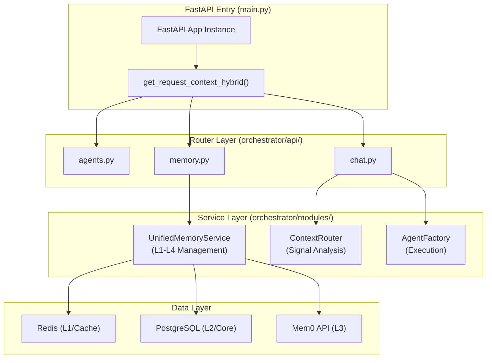
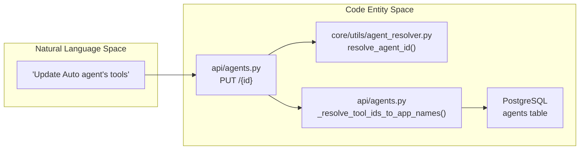

# API Router Organization

Relevant source files

The following files were used as context for generating this wiki page:

- [frontend/tsconfig.tsbuildinfo](frontend/tsconfig.tsbuildinfo)
- [orchestrator/config.py](orchestrator/config.py)
- [orchestrator/main.py](orchestrator/main.py)
- [orchestrator/modules/memory/context_router.py](orchestrator/modules/memory/context_router.py)
- [orchestrator/modules/memory/unified_memory_service.py](orchestrator/modules/memory/unified_memory_service.py)
- [orchestrator/tests/test_unified_memory.py](orchestrator/tests/test_unified_memory.py)
- [scripts/ralph/IMPLEMENTATION_PLAN.md](scripts/ralph/IMPLEMENTATION_PLAN.md)
- [scripts/ralph/prd.json](scripts/ralph/prd.json)
- [scripts/ralph/progress.txt](scripts/ralph/progress.txt)

## Purpose and Scope

This document describes the organization and structure of FastAPI routers in the Automatos AI backend orchestrator. It covers router registration, URL prefix patterns, authentication dependencies, and the coordination between the API layer and core service modules such as the Unified Memory System and Universal Router.

For authentication mechanisms, see [Authentication Flow](17.1). For database models, see [Database Models](18.3). For the main application setup, see [FastAPI Application](18.1).

---

## Router Organization Overview

The Automatos AI backend organizes API endpoints into **domain-based routers**, modularly defined in the `orchestrator/api/` directory. These routers are mounted to the main application in `main.py` [orchestrator/main.py:35-170]().

### Router Categories and Prefixes

| Category | Key Router Modules | Prefix Example | Purpose |
|----------|--------------------|----------------|---------|
| **Agents** | `agents.py`, `personas.py`, `agent_plugins.py` | `/api/agents` | Agent lifecycle, personas, and capability assignment [orchestrator/main.py:36]() |
| **Workflows** | `workflows.py`, `workflow_recipes.py`, `tasks.py` | `/api/workflows` | Multi-agent orchestration and task queue management [orchestrator/main.py:37-39]() |
| **Memory** | `memory.py`, `widget_memory.py`, `memory_stats.py` | `/api/memory` | Unified memory access across L1-L4 layers [orchestrator/main.py:50-51]() |
| **Knowledge** | `knowledge.py`, `knowledge_graph.py`, `codegraph.py` | `/api/knowledge` | RAG, Graphify knowledge graphs, and code indexing [orchestrator/main.py:56,151-153]() |
| **Tools** | `tools.py`, `composio.py`, `skills.py` | `/api/tools` | Composio integrations and custom skill resolution [orchestrator/main.py:63,68,78]() |
| **Analytics** | `analytics.py`, `analytics_api.py`, `statistics.py` | `/api/analytics` | LLM usage, cost tracking, and system performance [orchestrator/main.py:52,147,76]() |
| **System** | `system.py`, `system_settings.py`, `credentials.py` | `/api/system` | Global config, BYOK management, and health checks [orchestrator/main.py:48,61-62]() |
| **Notifications**| `notifications.py` | `/api/notifications` | Unified dispatching for tasks and missions [orchestrator/main.py:95-98]() |

Sources: [orchestrator/main.py:35-170]()

---

## Router Architecture & Data Flow

The API layer follows a standardized tiered flow: request reception via FastAPI, context injection for multi-tenancy, and delegation to singleton services.

### Request Flow to Service Layer
"Code Entity Space"

Sources: [orchestrator/main.py:17,35-60](), [orchestrator/modules/memory/unified_memory_service.py:154-188](), [orchestrator/modules/memory/context_router.py:1-24]()

---

## Memory & Context Routing

The `memory.py` and `context.py` routers interface with the **Unified Memory Service** to provide a consistent view of agent knowledge.

### Memory Tier Resolution
When a request hits the memory API, it uses the `MemoryNamespace` helper to ensure workspace isolation across different storage backends [orchestrator/modules/memory/unified_memory_service.py:39-48]().

| Memory Layer | Backend | Router/Service Logic |
|--------------|---------|----------------------|
| **L1 (Working)** | Redis | `MemoryNamespace.session()` key with 24h TTL [orchestrator/modules/memory/unified_memory_service.py:78-80,85]() |
| **L2 (Short-term)**| Postgres| Time-based Ebbinghaus decay [orchestrator/config.py:98-103]() |
| **L3 (Long-term)** | Mem0 | `MemoryNamespace.workspace()` fact extraction [orchestrator/modules/memory/unified_memory_service.py:52-54]() |
| **L4 (Knowledge)** | RAG/Graph | Graphify and CodeGraph retrieval [orchestrator/main.py:56,153]() |

### Context Signal Analysis
The `ContextRouter` (invoked by chat routers) performs regex-based signal detection to determine which memory layers to fetch before LLM execution [orchestrator/modules/memory/context_router.py:8-12]().

- **Temporal Signals**: Detects "last week", "yesterday" to trigger L2/L3 temporal retrieval [orchestrator/modules/memory/context_router.py:85-105]().
- **Personal Facts**: Detects "my preference", "I like" to trigger L3 Mem0 fact lookup [orchestrator/modules/memory/context_router.py:108-121]().
- **Knowledge Queries**: Detects "find the policy", "search docs" to trigger L4 RAG retrieval [orchestrator/modules/memory/context_router.py:140-153]().

Sources: [orchestrator/modules/memory/unified_memory_service.py:39-117](), [orchestrator/modules/memory/context_router.py:82-172](), [orchestrator/config.py:84-115]()

---

## Agent and Tool Routing

The `agents.py` router manages the mapping between high-level agent definitions and low-level tool capabilities.

### Agent Lifecycle & Resolution
"Natural Language Space" to "Code Entity Space"

Sources: [orchestrator/api/agents.py:97-102](), [orchestrator/core/utils/agent_resolver.py:17-49]()

### Tool Hinting and Graph Routing
Advanced tool routing (PRD-139) is integrated into the context assembly path. The `GraphRouter` ranks tool chains based on execution telemetry [scripts/ralph/progress.txt:92-112]().
- **Entry Node Selection**: Uses `ActionSemanticIndex` to pick the top 5 relevant tools [scripts/ralph/progress.txt:102]().
- **Chain Expansion**: Traverses the graph (depth 2) to suggest sequences like `read_file` -> `write_file` [scripts/ralph/progress.txt:103,69-70]().
- **Telemetry Seeding**: Synthetic telemetry (e.g., from Agents 9001, 9002) is used to bootstrap these routing edges [scripts/ralph/progress.txt:64-67]().

Sources: [scripts/ralph/progress.txt:7-22, 92-112](), [orchestrator/modules/context/sections/platform_actions.py:130-140]()

---

## Response Normalization Patterns

Routers utilize shared utility functions to maintain data integrity:
- **Tag Normalization**: `_normalize_tags` ensures all agent and workflow tags are lower-cased and deduplicated [orchestrator/api/agents.py:146-171]().
- **Agent Response Construction**: `_build_agent_response` joins model metadata from `LLMModel` and tool assignments from `AgentAppAssignment` into a unified schema [orchestrator/api/agents.py:174-205]().

Sources: [orchestrator/api/agents.py:146-205](), [orchestrator/core/models/core.py:43-91]()

---