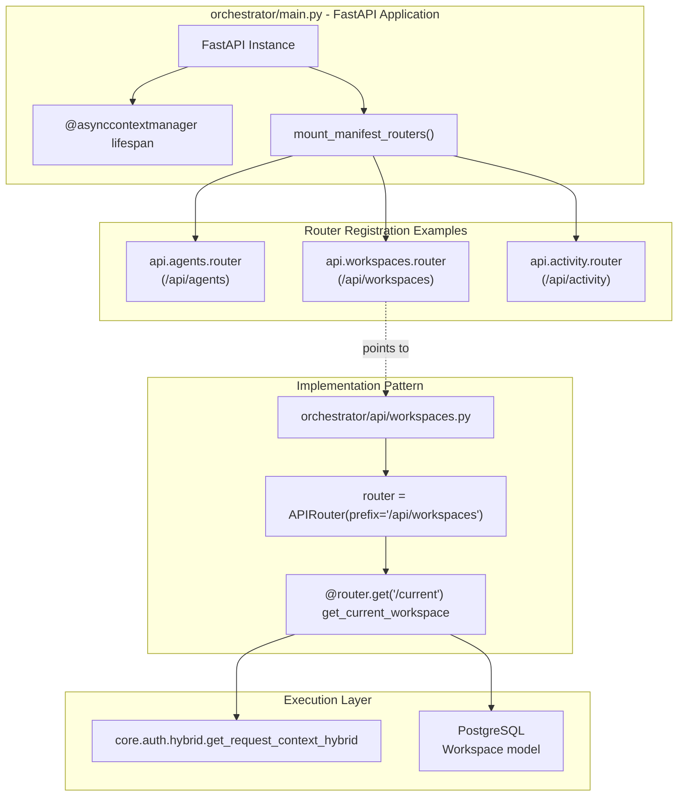
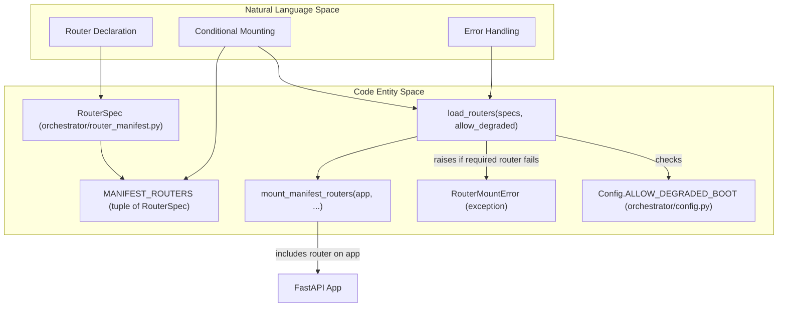
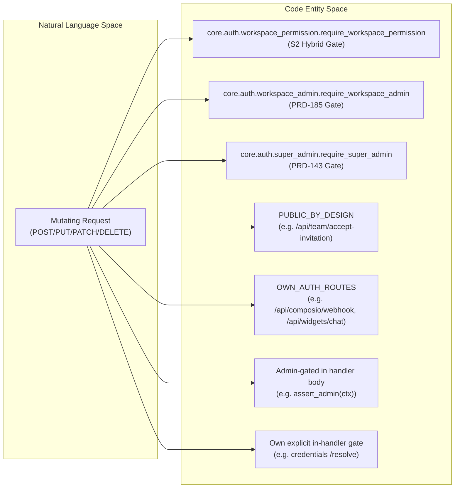

# API Router Organization

Relevant source files

The following files were used as context for generating this wiki page:

- [.github/workflows/import-linter.yml](.github/workflows/import-linter.yml)
- [frontend/components/__tests__/prd197-substrate-tile.test.tsx](frontend/components/__tests__/prd197-substrate-tile.test.tsx)
- [frontend/components/command-center/is-it-working-strip.tsx](frontend/components/command-center/is-it-working-strip.tsx)
- [frontend/hooks/use-analytics-api.ts](frontend/hooks/use-analytics-api.ts)
- [frontend/lib/api-client.ts](frontend/lib/api-client.ts)
- [orchestrator/.importlinter](orchestrator/.importlinter)
- [orchestrator/api/workflows.py](orchestrator/api/workflows.py)
- [orchestrator/config.py](orchestrator/config.py)
- [orchestrator/core/models/substrate_metrics.py](orchestrator/core/models/substrate_metrics.py)
- [orchestrator/core/observability/substrate_metrics.py](orchestrator/core/observability/substrate_metrics.py)
- [orchestrator/main.py](orchestrator/main.py)
- [orchestrator/reports/route-manifest.json](orchestrator/reports/route-manifest.json)
- [orchestrator/router_manifest.py](orchestrator/router_manifest.py)
- [orchestrator/tests/authz_sweep_probe.py](orchestrator/tests/authz_sweep_probe.py)
- [orchestrator/tests/test_import_contract_present.py](orchestrator/tests/test_import_contract_present.py)
- [orchestrator/tests/test_no_mem0_residue.py](orchestrator/tests/test_no_mem0_residue.py)
- [orchestrator/tests/test_p2w2_authz_boundary_sweep.py](orchestrator/tests/test_p2w2_authz_boundary_sweep.py)
- [orchestrator/tests/test_prd154_s5_missions.py](orchestrator/tests/test_prd154_s5_missions.py)
- [orchestrator/tests/test_prd222_w2s1_plan_tiers.py](orchestrator/tests/test_prd222_w2s1_plan_tiers.py)
- [scripts/ralph/PROMPT_build_prd211.md](scripts/ralph/PROMPT_build_prd211.md)
- [scripts/ralph/PROMPT_review_prd211.md](scripts/ralph/PROMPT_review_prd211.md)
- [scripts/ralph/acceptance-prd211.sh](scripts/ralph/acceptance-prd211.sh)
- [scripts/ralph/prd-211.json](scripts/ralph/prd-211.json)

## Purpose and Scope

This document describes the organization and structure of FastAPI routers in the backend orchestrator application. It covers router registration, URL prefix patterns, authentication dependencies, endpoint conventions, and the coordination between the API layer and the core service execution paths.

For authentication and workspace isolation mechanisms, see [Authentication Flow](17.1). For database models referenced by routers, see [Database Models](18.3). For the main FastAPI application setup, see [FastAPI Application](18.1).

---

## Router Organization Overview

The Automatos AI backend organizes API endpoints into **domain-based routers**, each responsible for a specific feature area. Routers are modular Python files in the `orchestrator/api/` directory that define related endpoints using FastAPI's `APIRouter`. The system serves approximately 789 unique routes [orchestrator/reports/route-manifest.json:2]().

### Router Categories

| Category | Routers | Primary Purpose |
|----------|---------|-----------------|
| **Core Agents** | `agents.py`, `agent_endpoints.py`, `personas.py` | Agent lifecycle, configuration, personalities, and execution [orchestrator/main.py:38,109,76]() |
| **Workflows & Recipes** | `workflows.py`, `workflow_recipes.py`, `missions.py` | Multi-agent orchestration, sequential missions, and recipe execution [orchestrator/main.py:39-41,73]() |
| **Tools & Skills** | `tools.py`, `skills.py` | External integrations (Composio), skill sources, and tool discovery [orchestrator/main.py:61,64]() |
| **Marketplace** | `marketplace.py`, `marketplace_plugins.py` | Plugin discovery, installation, and community items [orchestrator/main.py:43,72]() |
| **Context & Memory** | `context.py`, `memory_stats.py`, `documents.py` | Context assembly, memory stats, and document management [orchestrator/main.py:58,50,44]() |
| **Knowledge** | `knowledge.py`, `knowledge_graph.py`, `codegraph.py` | Knowledge base, graph retrieval, and code analysis [orchestrator/main.py:100,102,54]() |
| **Analytics** | `analytics.py`, `llm_analytics.py`, `statistics.py` | Usage tracking, cost analysis, and system metrics [orchestrator/main.py:49,114,63]() |
| **System Admin** | `system.py`, `system_settings.py`, `credentials.py` | System configuration, BYOK keys, and global settings [orchestrator/main.py:47,60,59]() |
| **Workspaces** | `workspaces.py`, `workspace_files.py` | Multi-tenancy, file browser, and workspace context [orchestrator/router_manifest.py:64, orchestrator/main.py:92]() |
| **Routing & Chat** | `routing.py`, `chat.py` | Universal routing, streaming chat (AI SDK), and LLM classification [orchestrator/main.py:70,107]() |

Sources: [orchestrator/main.py:38-120](), [orchestrator/reports/route-manifest.json:2](), [orchestrator/router_manifest.py:52-91]()

---

## Router Architecture

The system follows a tiered request flow: the `main.py` entry point mounts routers via `mount_manifest_routers` [orchestrator/main.py:30](), which then use `RequestContext` to enforce workspace isolation before calling specialized services.

### API Registration and Request Flow
"Code Entity Space"

Sources: [orchestrator/main.py:30-123](), [orchestrator/api/workflows.py:35](), [orchestrator/core/auth/hybrid.py:29]()

### Router Manifest and Conditional Mounting

The `router_manifest.py` module defines `RouterSpec` objects that explicitly declare routers to be mounted [orchestrator/router_manifest.py:32-42](). This mechanism replaces the previous `try/except ImportError` pattern in `main.py` that silently dropped routers if their import failed [orchestrator/router_manifest.py:2-5]().

The `MANIFEST_ROUTERS` tuple lists all conditionally-mounted routers [orchestrator/router_manifest.py:51-91](). Each `RouterSpec` can be marked as `optional=True` if it's gated on an optional integration (e.g., Composio, S3-Vectors) [orchestrator/router_manifest.py:38,55,56]().

The `load_routers` function resolves each `RouterSpec` to its router object. If a required router fails to import and `ALLOW_DEGRADED_BOOT` is not set to `true` in `config.py`, a `RouterMountError` is raised [orchestrator/router_manifest.py:100-134](). Otherwise, the failure is logged, and the application can boot in a degraded state [orchestrator/router_manifest.py:125-134]().

"Natural Language Space" to "Code Entity Space"

Sources: [orchestrator/router_manifest.py:1-149](), [orchestrator/config.py:1992]()

---

## Workspace Context Routing

The `workspaces.py` router is critical for the frontend's initialization. It provides the `GET /api/workspaces/current` endpoint which determines the active workspace and its onboarding status [orchestrator/api/workspaces.py:43-56]().

### Workspace Operations
| Method | Path | Key Logic | Purpose |
|--------|------|-----------|---------|
| GET | `/api/workspaces/current` | `public_snapshot(workspace)` | Returns active workspace, role, and onboarding stage [orchestrator/api/workspaces.py:43-118]() |
| GET | `/api/workspaces/current/integrations` | `_ALLOWED_INTEGRATION_KEYS` | Returns configured integrations (masked tokens) [orchestrator/api/workspaces.py:121-140]() |
| PUT | `/api/workspaces/current/integrations` | `require_workspace_permission("workspace:manage")` | Updates Telegram/Slack bot tokens [orchestrator/api/workspaces.py:143-181]() |
| GET | `/api/activity/feed` | `ActivityService.get_feed()` | Merges chats, routines, and recipes for the dashboard [orchestrator/api/activity.py:32-67]() |

### Onboarding and Tours
The API signals the frontend to trigger tours by checking `agent_count` in the workspace [orchestrator/api/workspaces.py:64-67](). If `is_new_workspace` is true, the frontend `useAutoTour` hook activates Shepherd.js tours [frontend/hooks/use-auto-tour.ts:20-32]().

Sources: [orchestrator/api/workspaces.py:43-181](), [frontend/hooks/use-auto-tour.ts:1-68](), [orchestrator/api/activity.py:32-67]()

---

## Authorization Boundary Sweep

Automatos AI employs a strict **Authorization Boundary Sweep** (PRD-195) to ensure every mutating route is classified into a specific security gate [orchestrator/tests/test_p2w2_authz_boundary_sweep.py:1-13](). This sweep is source-of-truth driven, using `reports/route-manifest.json` as the contract and probing the live application to verify the ground truth [orchestrator/tests/test_p2w2_authz_boundary_sweep.py:4-6]().

### Security Classifications

Sources: [orchestrator/tests/test_p2w2_authz_boundary_sweep.py:7-26](), [orchestrator/tests/authz_sweep_probe.py:45-98]()

### Mutation Gate Validation
The `authz_sweep_probe.py` tool runs as a subprocess to inspect the FastAPI application's routes and their dependencies [orchestrator/tests/authz_sweep_probe.py:1-6](). It extracts information about whether `get_request_context_hybrid`, `require_super_admin`, `require_workspace_admin`, or `require_workspace_permission` are present in the dependency tree [orchestrator/tests/authz_sweep_probe.py:79-82](). It also uses `inspect.getsource` to verify that mutating endpoints contain required internal assertions like `assert_admin(ctx)` or `_require_admin(ctx)` for admin-gated routes, or specific auth-type gates for `OWN_GATE_IN_HANDLER` routes [orchestrator/tests/authz_sweep_probe.py:68-97]().

The `test_p2w2_authz_boundary_sweep.py` test then uses this probed data to ensure every mutating route is classified exactly once into one of the defined security categories [orchestrator/tests/test_p2w2_authz_boundary_sweep.py:7-26]().

Sources: [orchestrator/tests/test_p2w2_authz_boundary_sweep.py:31-144](), [orchestrator/tests/authz_sweep_probe.py:1-104]()

---

## Activity and Digest Routing

The `activity.py` router provides high-level summaries and feedback loops for Auto's autonomous operations.

### Auto's Read (Workspace Digest)
- **Endpoint**: `GET /api/activity/digest` [orchestrator/api/activity.py:69-70]().
- **Logic**: Calls `generate_digest`, which builds a plain-English summary of workspace state, cached by a state hash [orchestrator/api/activity.py:75-82]().
- **Feedback**: `POST /api/activity/digest/feedback` allows users to rate the quality of the digest, keyed by `state_hash` [orchestrator/api/activity.py:94-119](). This feedback is stored in the `digest_feedback` table [orchestrator/tests/test_prd221_digest_feedback.py:21-34]().

### Scheduler Health
The Calendar widget uses `GET /api/activity/scheduler-health` to detect if the background `APScheduler` is firing, providing a non-blocking health indicator [orchestrator/api/activity.py:143-158]().

Sources: [orchestrator/api/activity.py:69-158](), [orchestrator/tests/test_prd221_digest_feedback.py:1-84]()

---